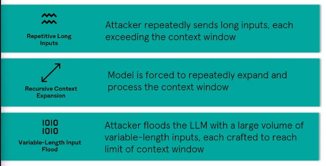

# OWASP ML and LLM

> This documentation is made from my notes of the **FREE** course by the attackiq Academy.  
> If you are interested in AI Pentest and AI Security I really recommend that you take this course.  
> Check it out [here](https://www.academy.attackiq.com/courses/foundations-of-ai-security)
>
> Like MITRE ATT&CK, MITRE ATLAS is a valuable resources for our pentests. We can use it to find techniques for our pentest engagements.  
> 
> This document aims at being use as a cheatsheet for your pentest engagements.

## OWASP Machine Learning Security Top 10 project

- Check it out here

 OWASP Machine Learning Security Top Ten 

### ML01: Input Manipulation Attack

Input Manipulation Attacks refer to a category of attacks where an attacker intentionally modifies the input data to deceive the machine learning model. Adversarial Attacks are a specific type of Input Manipulation Attack, where the alterations are carefully crafted to cause the model to make incorrect predictions or classifications.  
Input manipulation attacks map to several techniques in the ATLAS framework, including Evade ML Model, Craft Adversarial Data, and Insert Backdoor Trigger.  

#### Protection from Input Manipulation Attack

- Adversarial Training
  - Model is exposed to advesarial examples during the training phase
  - Examples are intentionnaly designed to be slightly altered version of original input
  - Examples aim to mislead the model
  - Training this way allows model to recognize and resist similar attacks 
- Regularization
  - Prevents the model from becoming too sensitive to small changes in input data
  - Robus models are designed to maintain their performance even when faced with adversarial inputs 
- Input validation
  - Scrutinize incoming data for signs of manipulation
  - Checks for anomalies that could indicate a malicious attempt to influence model's behavior

 ML01:2023 Input Manipulation Attack   

### ML02: Data Poisoning Attack

Data poisoning attacks involve an attacker deliberately tampering with the training data of a machine learning model. The goal is to introduce errors or biases into the model, leading it to make incorrect predictions or classifications once deployed. This manipulation can be subtle, such as slightly altering the features of input samples, or more overt, like injecting malicious data into the dataset.  
In the ATLAS framework, data poisoning attacks are closely related to the "Poison Training Data" technique under the "Resource Development" tactic. This technique involves adversaries compromising the integrity of the training data to embed vulnerabilities or biases in the machine learning models trained on this data. The poisoned data can be introduced through various means, such as a supply chain compromise or directly after gaining initial access to the system.  

#### Protection from data Poisoning Attack

- Validation and verification of training data
- Secure the storage of training data
- Separate training data from prod data
- Regularly monitor and audit training data
- Model validation
- Employ an ensemble approach
- Anomaly detection

 ML02:2023 Data Poisoning Attack   

### ML03: Model Inversion Attack

Model inversion attacks are a type of security threat in which an attacker attempts to reverse-engineer a machine learning model to extract sensitive information embedded within it. These attacks exploit the relationship between the model's inputs and outputs to infer properties of the training data or the model's internal structure.

In the context of the ATLAS framework, model inversion attacks map to techniques like:

- Discover ML Model Ontology (under the "Discovery" tactic): While this technique primarily focuses on adversaries identifying the output structure of a machine learning model, model inversion attacks can provide insights into the model's ontology by revealing details about the data the model was trained on.
- Infer Training Data Membership (under the "Exfiltration" tactic, specifically within "Exfiltration via ML Inference API"): This technique involves determining if a specific data sample was part of the model's training set. Model inversion attacks could potentially be used to infer membership information by reconstructing aspects of the training data.
- Invert ML Model (under the "Exfiltration" tactic, specifically within "Exfiltration via ML Inference API"): This technique is closely related to model inversion attacks, as it involves adversaries reconstructing training data or extracting information about the model by exploiting its confidence scores or outputs.
- Full ML Model Access (under the "ML Model Access" tactic): While model inversion attacks do not necessarily require full access to the model, having such access could facilitate more effective and precise attacks by providing deeper insights into the model's architecture and parameters.
- Craft Adversarial Data (under the "ML Attack Staging" tactic): Although this technique primarily deals with creating input data to fool the model, understanding the model through inversion attacks can help adversaries craft more effective adversarial examples. To illustrate, consider a machine learning model used for facial recognition in a security system. An attacker could use model inversion techniques to analyze the model's output responses to various inputs, gradually reconstructing the facial features of individuals in the training dataset. This could potentially lead to the exposure of private information about the individuals whose data was used to train the model.

#### Protection from Model Inversion Attack

- Implement robust access control mechanism
- Validate input
- Maintain logs of all inputs and outputs, providing explainations for the model's predictions
- Regularly monitor the model's predictions
- Model retraining

 ML03:2023 Model Inversion Attack   

### ML04: Membership Inference Attack

Membership inference attacks occur when an attacker determines whether a particular data point was used in the training of a machine learning model. By analyzing the model's predictions, attackers can infer the presence of specific data in the training set, potentially exposing sensitive information.

In the context of the ATLAS framework, this type of attack maps to the "Infer Training Data Membership" sub-technique under the "Exfiltration via ML Inference API" technique. This technique focuses on the unauthorized extraction of information from machine learning models or systems, and "Infer Training Data Membership" specifically deals with the extraction of insights about the composition of the model's training data.

#### Protection from Membership Inference Attack

- Train models on randomized or shuffled data
- Model obfuscation
- L1 or L2 regularization (Check out the official course for more details on this or check the resources below)
- Regular testing

 ML04:2023 Membership Inference Attack 

### ML05: Model Theft

Model theft attacks happen when an attacker manages to access the parameters of a machine learning model. These parameters are the learned values that the model uses to make predictions, and gaining access to them allows the attacker to replicate or steal the model.

In the context of the ATLAS framework, this type of attack is related to the technique "Extract ML Model" under the Exfiltration tactic. It involves the adversary using methods to obtain a functional copy of a private machine learning model, often by repeatedly querying the model's inference API to collect its outputs and using them to train a separate model that mimics the behavior of the target model. This can lead to intellectual property theft, as the adversary gains access to a valuable asset without authorization.

#### Protection from Model theft attacks

- Encryption
- Access Control
- Regular backups
- Model obfuscation
- Watermarking
- Legal protection
- Regular monitoring and auditing

 ML05:2023 Model Theft 

### ML06: AI supply chain attacks

AI Supply Chain Attacks are a type of threat that specifically targets the components and processes involved in the development and deployment of machine learning  systems. In these attacks, an adversary seeks to compromise the integrity of ML libraries, models, or associated data used by a system. By modifying or replacing these crucial elements, attackers can manipulate the behavior of ML applications, leading to potentially harmful outcomes.

This type of attack maps to the ATLAS framework, specifically under the tactic of Initial Access and the technique of ML Supply Chain Compromise. The ML Supply Chain Compromise technique encompasses various methods attackers might use to gain initial access to a system by exploiting vulnerabilities in the ML supply chain. This includes compromising GPU hardware, ML software frameworks, training data, or the ML models themselves. By targeting these components, attackers can introduce malicious code or data, leading to compromised ML systems that behave according to the attacker's intentions.

#### Protection from AI supply chain attacks

- Verify digital signatures of packages before installation
- Use secure package repositories
- Regularly update packages
- Create isolated environments
- Regular code reviews
- Utilize package verification tools
- Educate developers

 ML06:2023 AI Supply Chain Attacks 

### ML07: Transfer learning attack

Transfer learning attacks involve an adversary initially training a machine learning model on one task and then subsequently fine-tuning the model on a different task with the intention of causing the model to behave in a malicious or unintended manner. This type of attack exploits the transfer learning process, where knowledge gained in one context is applied to another context, to manipulate the model's behavior.

In the context of the ATLAS framework, transfer learning attacks relate to the tactic of ML Attack Staging. Specifically, these attacks can be considered a form of Craft Adversarial Data, where the adversary crafts data or manipulates the learning process to achieve a malicious outcome. The attacker's goal is to stage an attack that compromises the integrity or functionality of the machine learning model, leading to incorrect or biased predictions, reduced performance, or other undesirable behavior.

#### Protect from Transfer learning attack

- Regular monitoring and updating of datasets
- Employ secure and trusted training datasets from reputable sources
- Implement model isolation
- Incorporate differential privacy techiques during training
- Conduct regular security audits

 ML07:2023 Transfer Learning Attack   

### ML08: Model Skewing

Model skewing attacks, also known as data distribution attacks, occur when an attacker intentionally manipulates the distribution of the training data to cause the machine learning model to behave in an undesirable manner. This manipulation can lead to biased or skewed results, affecting the model's performance and decision-making process.

In the context of the ATLAS framework, model skewing attacks relate to the "Poison Training Data" technique under the "Resource Development" tactic. However, it's important to distinguish between model skewing and data poisoning attacks. While both involve tampering with the training data, their objectives and methods differ:

In Data Poisoning Attacks the primary goal is to introduce incorrect labels or malicious samples into the training data, leading to a compromised model that makes incorrect predictions or classifications. This type of attack directly targets the integrity of the data and the model's output.

In Model Skewing the focus is on altering the distribution of the training data, such as by over-representing or under-representing certain classes or features. This can cause the model to develop biases, making it less effective or fair in its predictions. The attack targets the model's understanding of the data distribution rather than individual data points or labels.

#### Protect from Model Skewing

- Implement robust access controls
- Regularly audit activities
- Verify authenticity of feedback data
- Clean and validate feedback data
- Continuous monitoring of model's performance
- Regularly retrain the model with verified and updated training

 ML08:2023 Model Skewing   

### ML09: Output Integrity Attack

In an Output Integrity Attack, an attacker targets the output of a machine learning model with the intention of altering its behavior or inflicting damage on the system where it's deployed. This type of attack can be mapped to the ATLAS framework under the "Impact" tactic, specifically the technique "Erode ML Model Integrity." By tampering with the model's output, the attacker can cause the model to produce incorrect or harmful results, ultimately undermining the integrity and reliability of the machine learning system. This could lead to various adverse effects, such as incorrect decision-making, system malfunctions, or the exposure of sensitive information.

#### Protect from Output Integrity Attack

- Use cryptographic methods to verify authenticity of model results
- Secure communication channels with encryption
- Validate inputs
- Maintain tamper-evident logs
- Update regularly
- Continuous monitoring and auditing

 ML09:2023 Output Integrity Attack   

### ML10: Model Poisoning attacks

Model poisoning attacks occur when an attacker directly manipulates the parameters of a machine learning model, causing it to behave incorrectly or produce incorrect results. This type of attack can be particularly insidious because the model may appear to function normally under most circumstances, but it will fail or produce biased results when triggered by specific inputs.

In the ATLAS framework, model poisoning attacks are closely related to the "Backdoor ML Model" technique under the "Persistence" tactic. The key difference between model poisoning and data poisoning attacks is the target of the manipulation. In data poisoning attacks, the adversary manipulates the training data to influence the model indirectly, while in model poisoning attacks, the adversary directly manipulates the model's parameters or structure.

#### Protect from Model Poisoning attacks

- Incorporate regularization techniques into the model's loss function
- Loss function measures the difference between the model's predictions and the actual data
- Overfitting occurs when a model performs well on training data, but poorly on new unseen data
- Design models with robust architectures and activation functions
- Activation functions are mathematical equations that determine the output of a neural network layer based on input
- Utilize cryptography to secure the model's parameters and weights

 ML10:2023 Model Poisoning   

## OWASP Top 10 for LLM Applications

- Check it out here

 OWASP Top 10 for Large Language Model Applications   

### LLM01: Prompt Injection

The distinction between direct and indirect prompt injections is crucial for understanding the scope of Prompt Injection Vulnerability. Direct prompt injections involve attackers inputting harmful prompts directly into the LLM, whereas indirect prompt injections occur when the LLM processes malicious prompts from external sources during its regular operation.  

 LLM01: Prompt Injection  

#### Protect from Prompt Injection

- Enforce privilege control
- Human oversight
- Segregate external content
- Etablish trust boundaries
- Manual monitoring

### LLM02: Insecure Output Handling

Insecure Output Handling in the context of LLMs refers to the inadequate validation, sanitization, and management of the outputs generated by LLMs before they are sent to other components and systems. This issue is particularly concerning because the content produced by LLMs can be influenced by the input prompts, effectively giving users indirect access to additional functionalities.

This concept differs from Overreliance, which focuses on the broader issue of depending too much on the accuracy and suitability of LLM outputs. Insecure Output Handling specifically addresses the handling of LLM outputs before they are passed downstream.

If an Insecure Output Handling vulnerability is exploited successfully, it can lead to serious security breaches such as Cross-Site Scripting (XSS) and Cross-Site Request Forgery (CSRF) in web browsers, and Server-Side Request Forgery (SSRF), privilege escalation, or remote code execution on backend systems. The risk of this vulnerability is heightened under certain conditions:

- Elevated Privileges: If the application grants the LLM more privileges than intended for end users, it can lead to escalation of privileges or remote code execution.
- Vulnerability to Indirect Prompt Injection: If the application is susceptible to indirect prompt injection attacks, an attacker could gain privileged access to a target user's environment.
- Insufficient Validation by Third-Party Plugins: If third-party plugins used by the application do not adequately validate inputs, it can exacerbate the vulnerability.

#### Protect from Insecure Output Handling

- Adopt zero-trust approach
- Apply proper input validation on responses before they are passed on
- Follow guidelines set in OWASP Application Security Verification Standard
- Apply proper output encoding techniques

 LLM02: Insecure Output Handling   

### LLM03: Training data poisoning

Training data poisoning involves the manipulation of pre-training data or data used in fine-tuning or embedding processes.  
The goal is to introduce vulnerabilities, backdoors, or biases that could compromise the model's security, effectiveness, or ethical behavior.  
The consequences of poisoned information can be far-reaching, from surfacing incorrect or biased information to users, to causing performance degradation, enabling downstream software exploitation, and inflicting reputational damage.  
Even if users become wary of the problematic AI output, the risks persist, including impaired model capabilities and potential harm to the brand's reputation.

- Pre-training data is used to train a model based on a general task or dataset, providing the foundational knowledge the model needs to understand language.
- Fine-tuning is the process of adapting an already trained model to a more specific subject or goal. This is achieved by training the model further using a curated dataset that includes examples of inputs and their corresponding desired outputs.
- The embedding process converts categorical data, often text, into a numerical representation suitable for training a language model. It involves representing words or phrases as vectors in a continuous vector space, typically generated by feeding the text data into a neural network trained on a large corpus of text.

In the ATLAS framework, training data poisoning maps to the "Poison Training Data" technique under the "Resource Development" tactic. This technique involves adversaries compromising the integrity of the training data to embed vulnerabilities or biases in the machine learning models trained on this data.

Data poisoning is classified as an integrity attack because tampering with the training data affects the model's ability to produce accurate predictions. External data sources present a higher risk since model creators do not have control over the data or a high level of confidence that the content is free from bias, falsified information, or inappropriate content.

#### Protect from Training data poisoning

- Verify training data supply chain
- Legitimacy checks
- Use-case specific models
- Sandboxing and network controls
- Vetting and filtering training data
- Advesarial robustness
- Testing and detection
- Human review and auditing
- Benchmarking and reinforcement learning
- Red teaming and vulnerability scanning#

 LLM03: Training Data Poisoning   

### LLM04: Model Denial of Service

In LLMs, an attacker may engage in interactions that excessively consume resources, leading to degraded service quality for both the attacker and other users. This overconsumption can also result in significant resource costs. A growing security concern is the potential for attackers to disrupt or manipulate the context window of an LLM. This is particularly important as LLMs are increasingly used in various applications, consume a lot of resources, and face unpredictable user inputs. Additionally, developers may not be fully aware of this vulnerability.

The context window in LLMs refers to the maximum length of text that the model can handle, encompassing both input and output. It's a critical feature of LLMs because it determines the complexity of language patterns the model can comprehend and the size of the text it can process at any given time. The size of the context window varies between models and is determined by the model's architecture.

This issue maps to the ATLAS framework under the "Denial of ML Service" technique within the "Impact" tactic.  

  
> Source: [Foundations of AI Security - Attackiq](https://www.academy.attackiq.com/courses/foundations-of-ai-security)

#### Protect from Model Denial of service

- Input Validation and Sanitization
- Resource Usage Caps
- API Rate Limits
- Limiting Queued and Total Actions
- Continuous Monitoring
- Setting Input Limits
- Developer Awareness

 LLM04: Model Denial of Service   

### LLM05: Supply Chain Vulnerabilities

The platforms used to deploy and operate LLMs can also be targeted by attackers. Vulnerabilities in these platforms can lead to unauthorized access, data breaches, or disruption of services.

In the ATLAS framework, these vulnerabilities map to the "Poison Training Data" and "Backdoor ML Model" techniques. Attackers can exploit supply chain vulnerabilities to introduce poisoned data into the training process or embed backdoors in pre-trained models, compromising the security and integrity of the LLM.

#### Protect from Supply Chain Vulnerabilities

- Vet Data Sources and Suppliers
- Use Reputable Plugins
- Apply OWASP Top Ten Mitigations
- Maintain an Up-to-Date Inventory
- Use Model and Code Signing
- Implement Anomaly Detection and Adversarial Robustness Tests
- Monitor for Vulnerabilities
- Enforce a Patching Policy
- Regularly Audit Suppliers

 LLM05: Supply Chain Vulnerabilities   

### LLM06: Sensitive Information Disclosure

Large Language Model (LLM) applications have the potential to inadvertently expose sensitive information, proprietary algorithms, or other confidential details through their outputs. This can lead to unauthorized access to sensitive data, breaches of intellectual property, privacy violations, and other security concerns. Users of LLM applications need to be cautious about how they interact with these models and be aware of the risks associated with unintentionally inputting sensitive data that the LLM might reveal in its outputs.  
In the context of the ATLAS framework, this vulnerability maps to the "Data Exfiltration via ML Inference API" technique, where sensitive information may be unintentionally revealed through the LLM's outputs. It's crucial for organizations to implement robust security measures and educate users on the potential risks associated with LLM applications to safeguard sensitive information.

#### Protect from Sensitive Information Disclosure

- Data Sanitization and Scrubbing
- Input Validation and Sanitization
- Fine-tuning Data Handling
- Limiting Access to External Data Sources

 LLM06: Sensitive Information Disclosure   

### LLM07: Insecure Plugin Design

LLM plugins are extensions that are automatically activated by the model during user interactions. These plugins operate under the model's control, with no oversight from the application, which can be a significant security concern. One of the challenges with plugins is managing the context-size limitations of LLMs. To address this, plugins often accept free-text inputs directly from the model without any validation or type checking. This lack of input validation creates an opportunity for attackers to craft malicious requests that can trigger a variety of harmful behaviors, including remote code execution.

The potential damage from malicious inputs is often exacerbated by inadequate access controls and poor tracking of authorization across plugins. Insufficient access control can lead to a situation where one plugin blindly trusts another, assuming that the inputs are safe because they appear to come from the end user. This flawed assumption can lead to security breaches, such as data exfiltration, remote code execution, and privilege escalation.

In the context of the ATLAS framework, this vulnerability relates to the technique "Exploit Public-Facing Application" under the "Initial Access" tactic. Attackers can exploit the lack of input validation and inadequate access controls in LLM plugins to gain unauthorized access or execute malicious code on the target system.  
It's important to note that this issue specifically pertains to the creation and management of LLM plugins, as opposed to the use of third-party plugins, which falls under the broader category of LLM Supply Chain Vulnerabilities.

#### Protect from Insecure Plugin Design

- Parametized input
- Input validation
- Thorough Inspection and Testing
- Minimizing Impact
- Authentication and Authorization
- User Authorization
- API Security

 LLM07: Insecure Plugin Design   

### LLM08: Excessive Agency

Excessive Agency in LLMs refers to the vulnerability that arises when an LLM system is given too much autonomy or authority to interact with other systems and make decisions based on its inputs and outputs. This excessive delegation of decision-making to an LLM agent can lead to harmful actions being carried out in response to unexpected or ambiguous outputs from the LLM. These outputs could be the result of various issues, such as hallucinations or confabulations within the model, direct or indirect prompt injection attacks, malicious plugins, poorly engineered benign prompts, or simply a poorly performing model.

The primary cause of Excessive Agency is typically a combination of factors, including granting the LLM system excessive functionality, permissions, or autonomy. This is different from Insecure Output Handling, which focuses on the lack of proper scrutiny and validation of the outputs generated by an LLM.

The impacts of Excessive Agency can vary widely depending on the systems an LLM-based application can interact with. For instance, an LLM with excessive permissions might execute unauthorized commands on a server, leading to data breaches or system downtime. Similarly, an LLM with too much autonomy might make incorrect decisions that affect the integrity of processed data or the availability of services.

#### Protect from Excessive Agency

- Limit Plugin functions
- Minimize plugin Functionality
- Avoid Open-Ended Functions
- Restrict Permissions
- Maintain User Authorization
- Implement Human-in-the-loop Control
- Enforcing Authorization in Downstream Systems

Mitigate potential damages:

- Log and monitor Activity
- Implement Rate-Limiting

 LLM08: Excessive Agency   

### LLM09: Overreliance

LLMs, such as GPT-4 or LLaMa, are powerful tools capable of generating creative and insightful content. However, they can also "hallucinate" or "confabulate," meaning they generate content that is factually incorrect, inappropriate, or unsafe. This can happen because LLMs base their outputs on patterns learned from vast datasets, but they do not possess true understanding or the ability to verify the accuracy of their responses.

When users or systems place undue trust in the outputs of LLMs without proper oversight or validation, it can lead to various negative consequences:

- Security Breach: LLM-generated content might inadvertently reveal sensitive information or provide incorrect instructions, leading to unauthorized access or compromised systems.
- Misinformation: Reliance on inaccurate LLM outputs can spread false information, affecting decision-making processes and public perception.
- Miscommunication: Incorrect or unclear information generated by LLMs can lead to misunderstandings and errors in communication.
- Legal Issues: If LLMs produce content that is defamatory, infringing, or otherwise legally problematic, it can result in legal liabilities for the users or organizations relying on the content.
- Reputational Damage: Trusting flawed LLM outputs can harm the reputation of individuals and organizations, especially if the errors are public or have significant consequences.

In the context of software development, LLM-generated source code can be particularly risky. If the code contains unnoticed security vulnerabilities, it can compromise the safety and security of applications. This highlights the need for:

- Oversight: Human oversight is crucial to review and assess the outputs of LLMs, especially in critical applications.
- Continuous Validation Mechanisms: Implementing systems to continuously validate the accuracy and appropriateness of LLM-generated content can help mitigate risks.
- Disclaimers on Risk: Informing users about the potential risks and limitations of LLM-generated content can encourage caution and reduce overreliance.

#### Protect from Overreliance

- Regular Monitoring and Review
- Cross-Check with Trusted Sources
- Model Enhancement (with Prompt Engineering, Parameter-Efficient Tuning (PET), Full Model Tuning, Chain-of-Thought Prompting)
- Automatic Validation Mechanisms
- Task Decomposition
- Risk Communication
- Responsible API and Interface Design
- Secure Coding Practices

 LLM09: Overreliance   

### LLM10: Model Theft

Model theft in the context of Large Language Models (LLMs) refers to the unauthorized access, copying, or extraction of proprietary LLMs by malicious actors or advanced persistent threats (APTs). LLMs are valuable intellectual property because they are trained on vast amounts of data and can perform complex language tasks. When these models are compromised, the consequences can include financial losses, damage to brand reputation, loss of competitive advantage, unauthorized use of the model, or exposure of sensitive information embedded within the model.

In the ATLAS framework, model theft can be mapped to techniques or sub-techniques such as "Extract ML Model" under the Exfiltration tactic. This technique involves adversaries using methods to obtain a functional copy of a private machine learning model, often by repeatedly querying the model's inference API to collect its outputs and using them to train a separate model that mimics the behavior of the target model.

#### Protect from Model Theft

- Strong Access Controls
- Robust Authentication Mechanisms
- Supplier Management
- Centralized ML Model Inventory or Registry
- Network Resource Restrictions
- Regular Monitoring and Auditing
- Automated MLOps Deployment
- Mitigation of Prompt Injection Techniques
- Adversarial Robustness Training
- Watermarking Framework

 LLM10: Model Theft   

## Resources

### L1 or L2 Regularization

- [L1 and L2 Regularization Methods - Anuja Nagpal](https://towardsdatascience.com/l1-and-l2-regularization-methods-ce25e7fc831c)
- [Explaining L1 and L2 regularization in machine learning - Fernando Jean Dijkinga, M.Sc.](https://medium.com/@fernando.dijkinga/explaining-l1-and-l2-regularization-in-machine-learning-2356ee91c8e3)