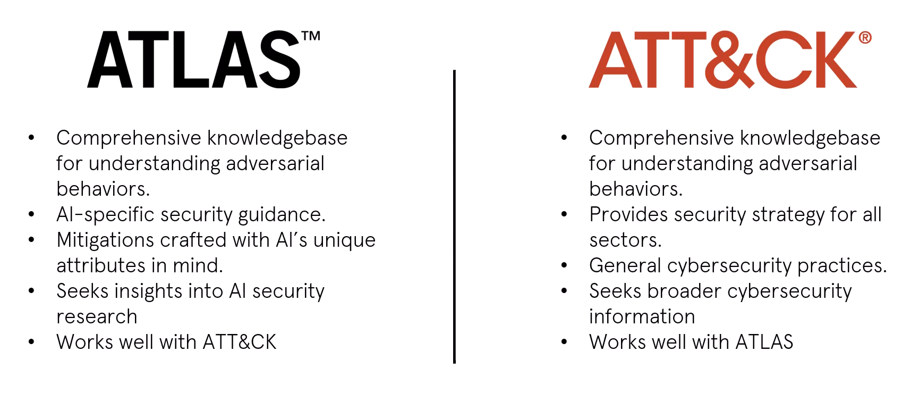

# MITRE ATLAS

> This documentation is made from my notes of the free course by the attackiq Academy.  
> If you are interested in AI Pentest and AI Security I really recommend that you take this course.  
> Check it out [here](https://www.academy.attackiq.com/courses/foundations-of-ai-security)
>
> Like MITRE ATT&CK, MITRE ATLAS is a valuable resources for our pentests. We can use it to find techniques for our pentest engagements.  
> 
> This document aims at being use as a cheatsheet for your pentest engagements.

## What is MITRE ATLAS?

MITRE ATLAS (Adversarial Threat Landscape for Artificial-Intelligence Systems) and the AI Risk Management Framework (AI RMF) are both initiatives aimed at addressing the security and risk management challenges posed by AI systems, but they focus on different aspects and serve complementary roles.

Like MITRE ATT&CK®, ATLAS was developed by MITRE to improve cybersecurity, yet they serve distinct areas within the security domain. ATLAS focuses on protecting Artificial Intelligence (AI) systems from unique threats like data tampering and tricking AI into making wrong decisions. It gives detailed advice on how to spot and stop attacks specifically aimed at AI technologies.

> Source: [Foundations of AI Security - ATTACKIQ Academy](https://www.academy.attackiq.com/courses/foundations-of-ai-security)

## ATLAS VS ATT&CK

> Source: [Foundations of AI Security - ATTACKIQ Academy](https://www.academy.attackiq.com/courses/foundations-of-ai-security)

## ATLAS Tactics Overview

ATLAS consists of 14 tactics, all with a range of techniques that apply to them.  Several of the tactics utilized in ATLAS will be familiar if you have experience with ATT&CK.  

### Reconnaissance

Adversaries engage in reconnaissance to collect information about a target's machine learning (ML) system, which helps them prepare for future attacks.  
This process involves both active and passive methods to gather data on an organization's ML technologies and projects. The insights obtained can guide adversaries in acquiring ML artifacts related to the target, attacking the target's ML applications, customizing assaults for the target's specific models, or informing further reconnaissance activities.

#### Techniques: Search for Victim's Publicly Available Research Materials

- Many organizations deploy open-source model architectures enhanced with their own proprietary data
- Academic journals
- Conference proceedings
- Pre-print repositories
- Technical blogs

#### Techniques: Search for Publicly Available Adversarial Vulnerability Analysis

- Attackers look for existing research on the vulnerabilities of commonly used machine learning models.
- Academic papers
- Pre-existing implementations attacks

#### Techniques: Search Victim-Owned Websites

- Attackers review target websites for information for their attacks.
- May provide insights into technical aspects of ML enabled products
- May contain detail on organization structure

#### Techniques: Search Applications Repositories

- Attackers may explore open application repositories as part of their targeting strategy. These repositories can include popular platforms like Google Play, the iOS App Store, the macOS App Store, and the Microsoft Store.

#### Techniques: Active Scanning

- An adversary may actively probe or scan the victim's system to collect information for targeting.
- Involves direct interactions with the target system

### Resource Development

Adversaries develop resources to support their operations, which includes creating, buying, or stealing assets like machine learning artifacts, infrastructure, accounts, or capabilities. These resources assist in further stages of an attack, such as preparing for a machine learning attack.  

For instance, an attacker could create a fake social media account to gather data on an organization's employees. This account could then be used to launch spear-phishing attacks aimed at obtaining access to the organization's machine learning systems.

- Key resources: ML artifacts, infrastructure, accounts and capabilities

#### Techniques: Acquire public ML Artifacts

- Aversary look at public sources like cloud storage, public-facing servicesm and software data repos for ML artifacts
- Artifacts include software stack used for training and deploying models
- Artifacts also include training and testing, and model configurations

> Acquiring some artifacts might require actions like registration, providing AWS keys, or written requests, which might lead the adversary to establish fake accounts.  
> Example, an attacker targeting a company's ML-based spam filter might search for adversarial attack tools that can generate email content designed to bypass the filter. Upon finding a suitable tool, the attacker customizes it to mimic the writing style and content of legitimate emails typically sent within the company. By doing so, the attacker can craft emails that the spam filter fails to flag as spam, allowing malicious messages to reach the intended targets within the organization.

#### Techniques: Obtain Capabilities

- Adversaries look for software capabilities
- Tools can be customized or modified by adversary

> Example, an attacker targeting a company's ML-based spam filter might search for adversarial attack tools that can generate email content designed to bypass the filter.  
> Upon finding a suitable tool, the attacker customizes it to mimic the writing style and content of legitimate emails typically sent within the company.  
> By doing so, the attacker can craft emails that the spam filter fails to flag as spam, allowing malicious messages to reach the intended targets within the organization.

#### Techniques: Develop Capabilities

- Adversaries will develop their own tools if unable to obtain them
- Tools do not always rely on machine learning themselves

> Example, an attacker targeting a company's ML-based image recognition system might develop a website that hosts images embedded with subtle adversarial patterns.  
> These patterns are designed to trick the company's ML system into misclassifying the images when they are uploaded by unsuspecting users.  
> The attacker's website could appear as a legitimate photo-sharing platform, but its real purpose is to gather and distribute these adversarial images to undermine the effectiveness of the target's ML system.

#### Techniques: Acquire Infrastructure

- Purchasing, leasing or renting various resources
- Infrastructure can range from servers to domains, mobile devices and third party web services
- May choose infrastructure that is difficult to trace and set up/decommissioned quickly

> Example, An attacker might rent cloud servers to host a command-and-control server for a botnet. By using a cloud service provider, the attacker can easily scale the operation, remain anonymous, and shut down the infrastructure if it's at risk of being discovered. This flexibility and anonymity make it a preferred choice for adversaries looking to execute their operations discreetly.

#### Techniques: Publish Poisoned Datasets

- Adversaries contaminate training data and release it publicly
- Could be an entirely new or tainted version of an existing open source dataset
- Compromised data is integrated into a victim's system through a compromise in the supply chain

> Example, an attacker could modify a widely used open-source dataset for facial recognition, adding subtle distortions to the images. If a company unknowingly uses this poisoned dataset to train its facial recognition system, the system's accuracy could be significantly reduced, leading to security vulnerabilities.

#### Techniques: Poison Training data

Adversaries may try to undermine machine learning  models by tampering with the datasets used for training. They can do this by altering the data or its labels, creating hidden weaknesses in the models that are hard to spot. These attacks, known as data poisoning, might involve changing the labels or just the data itself. The planted flaw can later be exploited using specific data samples with a backdoor trigger.

> The key difference between this technique and the Publish Poisoned Datasets technique is that the Publish Poisoned Datasets technique focuses on publicly releasing compromised data for widespread use, while the Poison Training Data technique involves directly tampering with the training data of a specific target's ML models.

#### Techniques: Establish Accounts

- Attackers might set up accounts with different services to help them in their attacks.

> Example, Clearview AI, a company that provides a facial recognition tool, had a misconfigured source code repository that allowed anyone to register an account. This security flaw enabled an external researcher to access Clearview AI's private code repository, which contained production credentials, keys to cloud storage buckets with 70,000 video samples, copies of its applications, and Slack tokens.

### Initial Access

The adversary’s goal is to infiltrate an AI system during initial access.  This can be accomplished through a range of techniques.  
For example, in a carefully orchestrated cyber attack, attackers aimed to circumvent a facial recognition system for initial access.  
Their plan involved acquiring inexpensive mobile phones as the operation's hardware foundation. They customized these devices with special Android ROMs and a virtual camera app, setting the stage for their attack.  
The attackers then procured software capable of transforming static photographs into dynamic videos that simulate real human gestures, such as blinking, to lend authenticity to the images. By purchasing personal data and high-definition facial photographs from the dark web, they created digital profiles mimicking the targeted victim. Leveraging the virtual camera application, these animated videos were presented to the machine learning-based facial recognition service during the verification process.  
This sophisticated approach successfully deceived the facial recognition system, allowing the attackers to impersonate the victim and gain unauthorized access to their tax information.  

### ML Model Access

Adversaries aim to obtain some level of access to a machine learning  model, which can range from full insight into the model's internal workings to merely interacting with the data input mechanisms. Gaining access allows them to gather information, tailor attacks, or feed specific data into the model.
For instance, an attacker could target a publicly available ML model provided through an API or manipulate a service that incorporates ML, influencing the model's outputs to their advantage. A practical example of this could involve a hacker accessing a voice recognition system used in virtual assistants. By understanding how the system processes voice commands, the attacker could input malicious commands or exploit vulnerabilities, affecting the assistant's behavior or accessing restricted information.

### Execution

Adversaries use execution techniques to run harmful code on both local and remote systems by embedding it within machine learning artifacts or software.
For example, an attacker could insert a malicious script into a machine learning model's code, which is then executed when the model processes data, giving the attacker unauthorized access to the system's data or operations.

### Persistence

Adversaries aim to keep their unauthorized access to a system, even through restarts or security updates, by using persistence techniques involving machine learning artifacts or software.
As an example, an attacker might modify a machine learning model or its training data to create a backdoor, ensuring they can regain access anytime without detection.

### Privilege Escalation

Adversaries aim to gain higher-level permissions to achieve their objectives, such as accessing sensitive data or systems. Privilege Escalation involves exploiting system weaknesses, misconfigurations, or vulnerabilities to obtain elevated permissions like SYSTEM/root level, local administrator, or specific user accounts with admin-like access.

For instance, an adversary might exploit a vulnerability to gain local administrator rights, allowing them to install malicious software or access restricted areas. This process often works in tandem with Persistence techniques, where the methods used to maintain access can also provide higher privileges.

### Defense Evasion

Adversaries employ Defense Evasion strategies to avoid detection by machine learning-enabled security systems, like malware detectors. These techniques are designed to slip past AI-driven safeguards, ensuring their malicious activities remain unnoticed.

As an example, an attacker might modify the code of their malware to evade detection algorithms, allowing them to infiltrate a network without triggering any alerts.

### Credential Access

Adversaries engage in Credential Access to acquire usernames and passwords through methods such as keylogging or credential dumping. This enables them to access systems discreetly and create additional accounts for further malicious activities.

For instance, an attacker might use a phishing email to trick a user into entering their login details on a fake webpage, thereby capturing those credentials for unauthorized access.

### Discovery

Adversaries engage in Discovery to learn about a system and its network. This process helps them understand the environment, identify what they control, and find potential advantages for their objectives. Often, they use the system's own tools for this post-compromise reconnaissance.

For example, the attacker might use scripts or automated tools to scan for accessible machine learning APIs or data repositories. Upon discovering an open API used for machine learning model predictions, the adversary assesses it for vulnerabilities, such as weak authentication mechanisms, which could then be exploited to inject malicious data, access sensitive model information, or manipulate model behavior.

### Collection

An adversary aims to collect machine learning (ML) artifacts and relevant data to further their goals. This process involves using various methods to compile information that aids in achieving the adversary's objectives, such as theft of ML artifacts or preparation for future attacks. Key targets for collection include software repositories, model repositories, and data storage systems.

As an example, an attacker might infiltrate a cloud storage service used by a company to store ML models and training data. By accessing this repository, the attacker collects sensitive ML models and datasets, which could be used to understand the company's ML capabilities, replicate the models for malicious purposes, or identify vulnerabilities for further exploitation.

### ML Attack Staging

An adversary uses their understanding and access to a target system to customize their attack specifically for that system. This involves preparing various strategies like creating similar models for practice (proxy models), tampering with the target model's data (poisoning), or designing misleading inputs (adversarial data) to deceive the target model. These preparations, often done before the attack and without online detection, pave the way for the main assault aimed at compromising the ML model.

For instance, an attacker targeting a bank's fraud detection ML system might first develop a proxy model that mimics the bank's system. By understanding how the bank's model works, the attacker can craft financial transactions that appear normal to the bank's ML system but are actually fraudulent, effectively bypassing the fraud detection mechanisms.

### Exfiltration

An adversary aims to steal valuable machine learning artifacts or data from a system. This process, known as Exfiltration, involves methods to secretly remove data from a network. The stolen data, often containing sensitive intellectual property or information critical for planning future attacks, is typically transmitted via a control channel established by the adversary. They may also use alternative methods for data transfer, sometimes imposing size limits to avoid detection.

### Impact

An adversary aims to disrupt or damage your AI systems and data, affecting their availability, integrity, or credibility. This could involve actions like tampering with or destroying data to hinder business operations or sway them in the attacker's favor. While some processes may appear normal, they could have been subtly altered to serve the adversary's objectives, ultimately enabling them to achieve their goals or mask a breach of data confidentiality.

For example, an attacker might target a company's AI-powered supply chain system, subtly altering the algorithm to delay the delivery of critical components. This manipulation not only disrupts the company's operations but could also give the attacker's affiliated businesses a competitive advantage.

> Source: [Foundations of AI Security - ATTACKIQ Academy](https://www.academy.attackiq.com/courses/foundations-of-ai-security)

## Resources

- [Foundations of AI Security - ATTACKIQ Academy](https://www.academy.attackiq.com/courses/foundations-of-ai-security)
- [MITRE ATLAS](https://atlas.mitre.org/)
- [AI Security 101](https://atlas.mitre.org/resources/ai-security-101)
- [MITRE | ATLAS Playlist](https://www.youtube.com/playlist?list=PLkTApXQou_8J6-t2_7QTTVDLBQlKFXPOu)
- [MITRE | ATLAS - Github](https://github.com/mitre-atlas)