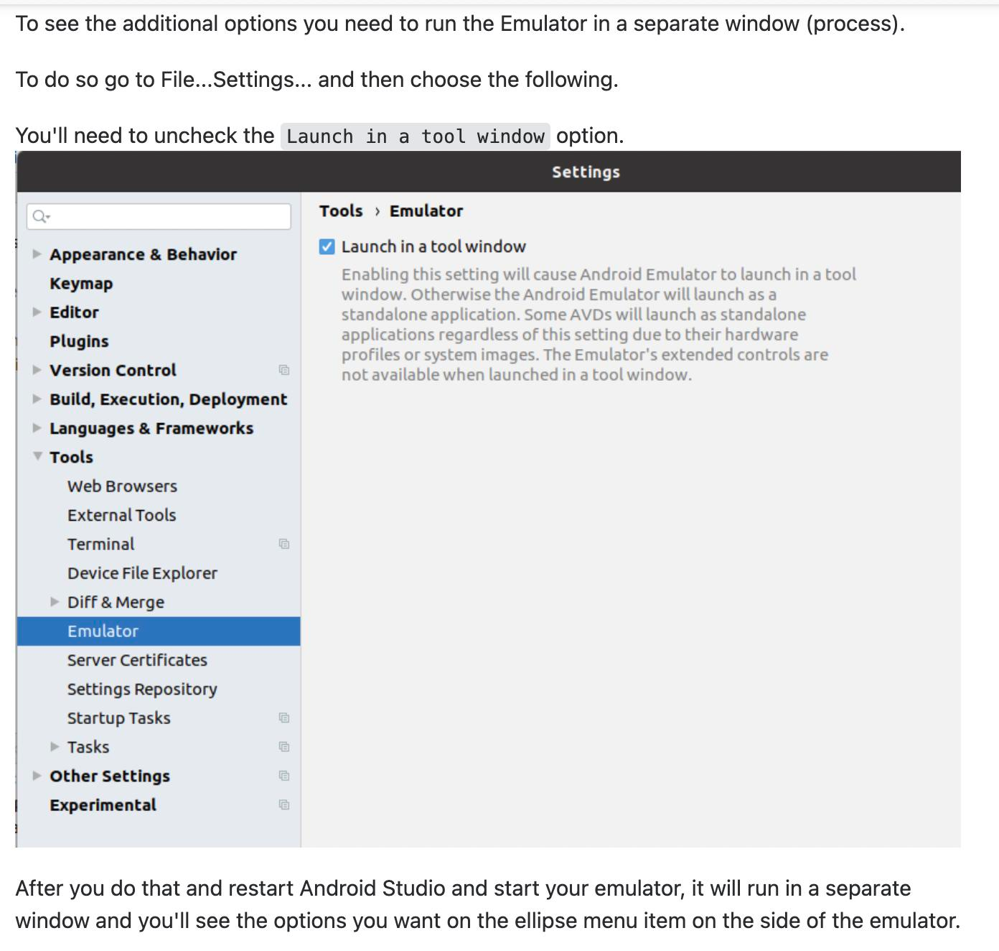

# Android studio

## Get the proxy tab back in Advanced settings in emulator

  

> Source: [stackoverflow](https://stackoverflow.com/questions/71183131/android-studio-proxy-tab-missing-from-extended-controls-settings-bumblebee)