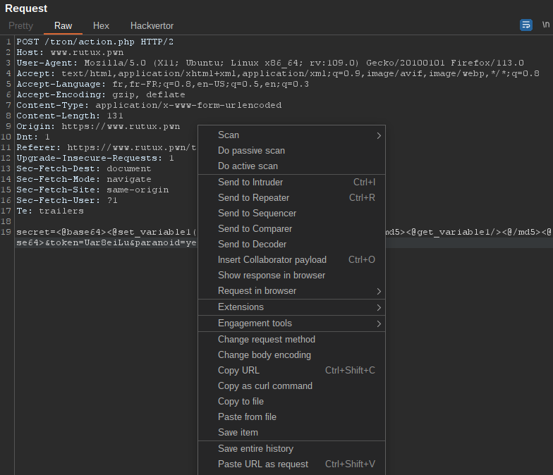
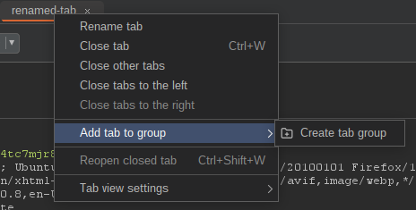
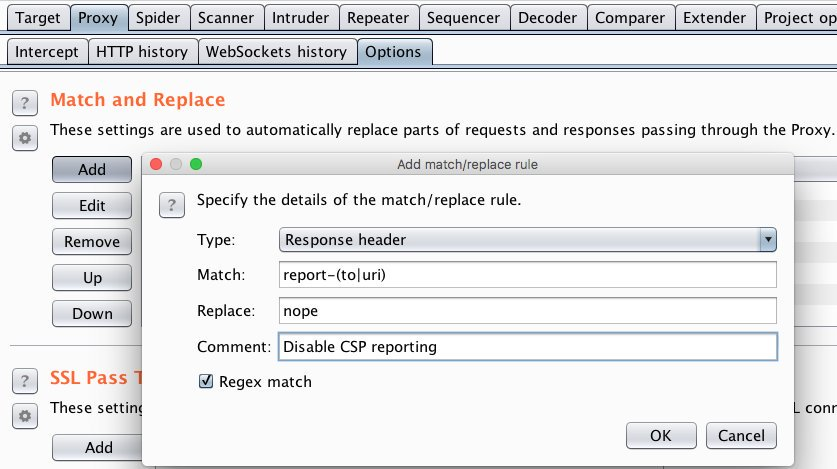
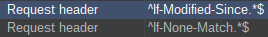
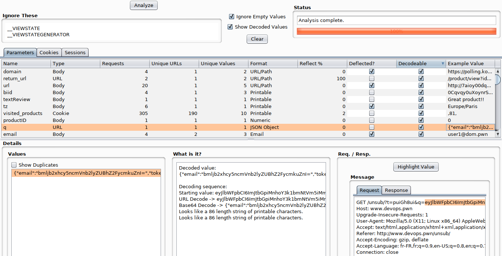
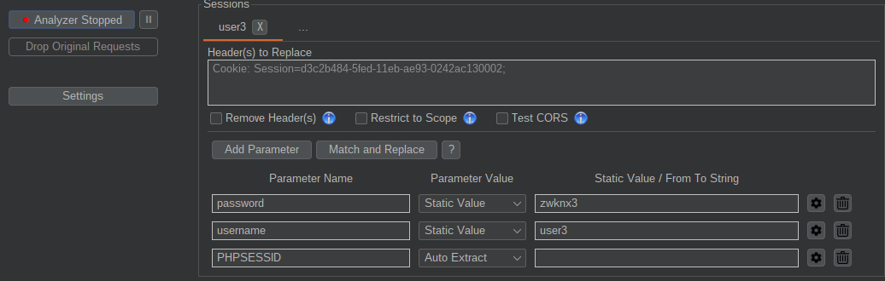
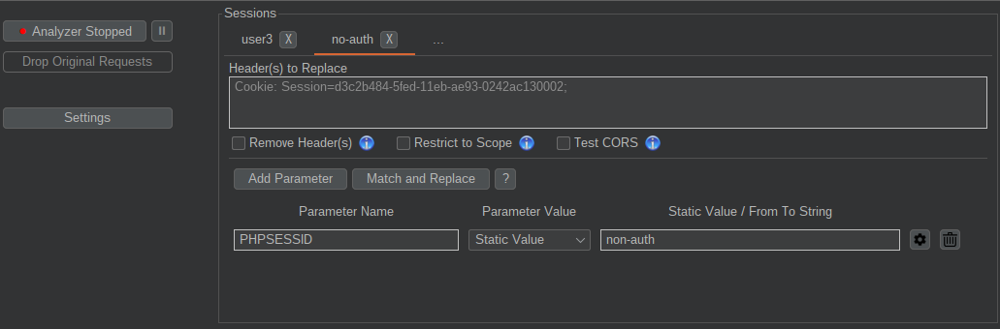
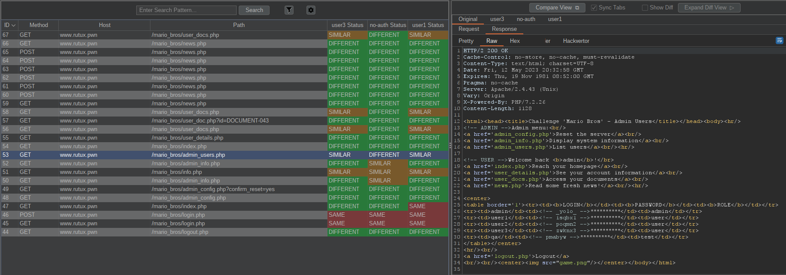

# Burpsuite

Burp Suite is a web proxy tool that can be used to facilitate web Application pentest.  
It comes in a [community free version](https://portswigger.net/burp/communitydownload) or a [paid pro version](https://portswigger.net/burp/pro).  
It has features and extensions that allow you to customize it.  
This course is made from my notes of [Agarri's](https://www.agarri.fr/en/) training (that I highly recommend if you have the opportunity) and notes from my practice.

## Regex

Regular expression are really convenient for burp customizations  
You can use [regex101](https://regex101.com/) to familiarize yourself with regex.  

> Note: Burp uses Java regex.

## Tips and tricks

### Change body encoding

- Possible to change the body encorder if you want to change a form to multipart. You just need to right clicj on the request and select "Change Body Encoding"  



### Choose dedicated RAM amount

- You can do this in `BurpSuitePro.vmoptions`

```bash
# Enter one VM parameter per line
# For example, to adjust the maximum memory usage to 512 MB, uncomment the following line:
# -Xmx512m
# To include another file, uncomment the following line:
# -include-options [path to other .vmoption file]

-XX:MaxRAMPercentage=50
-include-options user.vmoptions
```

### Disable Web interface

To be stealthier, you can disable the web interface (`http://burp`).

### Show help

When you click on `?` you can get the help dedicated to the feature you are currently using. This is also available if you are not connected to internet.  

### Rename tab

- You can reaname your tabs. For example in the repeater, you just have to double click on it and you can rename it like this.  


- You can group tabs together  



### Useful key shortcuts

> Some of these have to be set up, you can then keep a json file with your settings and export it.

- Switch between top-level tabs `Ctrl Shift (D|T|P|I|R|L|E)`
- Send to a tool, then switch to its tab `Ctrl (R|I) then Ctrl Shift (R|I)` (Here R is for repeater and I for intruder)
- Cycle through 2nd-level tabs `Ctrl Equals and Ctrl Right_Parenthesis`
- Close (and re-open) 2nd-level tabs `Ctrl [Shift] W`
- URL encoding `Ctrl [Shift] U`
- HTML encoding `Ctrl [Shift] H`
- Base64 encoding `Ctrl [Shift] B`
- Close pop-up `Alt F4`
- Colorize (with the last color used) `Ctrl K`
- Add a comment `Ctrl Shift K`
- Copy request as URL `Ctrl Shift C`
- Paste URL as request `Ctrl Shift V`
- Cut | Copy | Paste `Ctrl (X|C|V)`
- Undo | Redo `Ctrl (Z|Y)`
- Select all `Ctrl A`
- Search among 2nd-level tabs `Ctrl Shift S` (Repeater, Intruder and Collaborator)
- Jump to the search field `Ctrl Tab`
- Search for the highlighted text `Ctrl S`
- Go to the (previous|next) match `Ctrl (Left|Right)`
- Go to top [and extend selection] `Ctrl [Shift] Home`
- Go to bottom [and extend selection] `Ctrl [Shift] End`

#### Repeater

- Issue request `Ctrl G`
- Paste URL as request `Ctrl Shift V`
- Use the history `Ctrl Shift (Left|Right)`

#### Intruder

- Start attack `Ctrl Space`
- Add payload position marker `Ctrl M`
- Clear all markers `Ctrl Shift M`

#### Scanner

- Open scan launcher `Ctrl Shift Space`
- Open launcher with selected insertion point `Ctrl Shift Enter`

#### Collaborator

- Switch to Collaborator `Ctrl Shift O`
- Insert unique Collaborator payload `Ctrl O`

#### Proxy Interception

- Switch interception status `Ctrl T`
- Drop message `Ctrl D`
- Forward message `Ctrl F`
- Forward request + intercept response `Ctrl Shift F`

### Color lines

You can color line in the history just by clicking on the id and choosing which color

### Match and replace rules

#### Possible use cases

- Make authentication easier
- Write `XSS` instead of the actual payload
- Disable CSP reporting (useful for bug bounties)  



#### 304 NOT MODIFIED

- You can check these in `match replace rules` to avoid `304 NOT MODIFIED`



#### Fallback to XHR

"When initializing a WebSocket connection [...] the server will respond with a HTTP/1.1 101 header. Using Burp, you can use a match and replace rule in the proxy settings to change the response to a HTTP 500.  
This will trick the client into believing that the WebSocket connection is not supported and force it to fall back to XHR."

> Sean de Regge quoted by Agarri_fr

### Export

We can export just the repeater part of a burp project

### Burp wordlist

In Burp's wordlist de burp there are placeholders like this `{base}`  
We have to change in payload processing and choose the value for the placeholder.

### Burp authentication failures

*If the application you are testing uses platform authentication (which normally shows as a popup login dialog within your browser), and you get authentication failure messages when your browser is configured to use Burp, then you need to configure Burp to handle the platform authentication instead of your browser.  
Go to the User options > Connections tab, and the Platform Authentication section.  
Add a new entry for each hostname used by your application, configuring the authentication type and your credentials.  
If you aren't sure of the authentication type, then first try NTLMv2, then NTLMv1, and then the other types.  
You may need to close all browser windows and open a new browser window, to prevent any browser caching from interfering with the authentication process.  
Check that you are not overriding these settings in the Project options > Connections tab.*

[Source](https://portswigger.net/burp/documentation/desktop/troubleshooting)  

Check out this article that explains how to set up [ntlm authentication on burp](https://portswigger.net/support/configuring-ntlm-with-burp-suite)

### Auth failure because of TLS certificate not trusted

- If you get this error  
  
  
- You might need to set up owasp zap as upstream proxy. Check out [this article on nettitude labs](https://labs.nettitude.com/tutorials/how-to-fix-burp-suite-ssltls-connection-problems/) to set it up.

### Burp confidence Level explained

- Certain: The issue is definitely present.
- Firm: The issue is probably present, but this could be a false positive.
- Tentative: The issue is potentially present but there is a high chance that this could be a false positive.

- [Source](https://forum.portswigger.net/thread/issue-type-certain-confirm-and-tentative-what-does-this-mean-b01d4f6d)

### Tool to optimize burp scan

- [Burp suite pro scan profiles](https://github.com/TheGetch/Burp-Suite-Pro-Scan-Profiles) is a tool to optimize your burp scan and make them focus on specific vulnerabilities

## Extensions

### wsdler

If we have find a wsdl file we can parse it: `right click (in the request) > wsdler > parse wsdl`

### Jwteditor

- works like jwt.io

### Logger++

- Very convenient for API search
- Grep Values

### Hackvertor

- Replacement of the built-in Decoder
- You can set variable to gain time
- You can accumulate multiple conversions using xml-like tags

#### Use variables

- Creation

```xml
<@set_varname(false|true)>foobar<@/set_varname>
```

> If the parameter is set to `true` , then the variable is global

- Usage

```xml
<@get_varname/>
```

### Request minimizer

Very useful for a report and CSRF. It is going to remove everything that does not alter the response

### Paramalyzer

Very convenient for big scopes. You will get a lits of parameters  



### Auth Analyzer

- One of my personal favorites :D
- You set up a basic user for the extension
- You connect with an admin user (this way you can access more things)
- You browse
- The extension will parallel browse and check if it can access everything you look at
- It sets variables and you can also use a var for a csrf token this way you can check if it actually prevents csrf  

  

- It can also be useful to add a non authenticated user you just need to add a fake cookie like this

  

- As the browing is done in parallel it is perfect to avoid generating too much traffic.

- In the end we get results as below and we can compare which user can access what.  



> The original tab is the one with the traffic I generated and the others are for the other users

### Other useful burp Extensions

- SAML Raider
- [Retire.js](https://github.com/retirejs/retire.js/)
- Backslash Powered Scanner
- JSON Web Token Attacker
- Autorize

## Resources

### Blogs and references

 Tips and tricks for Burp Suite Pro - Agarri   
 Detecting and annoying Burp users by J. Voisin   

### Practice

 Web Security Academy - Portswiger  

### Wordlists

 Assetnote Wordlists   

