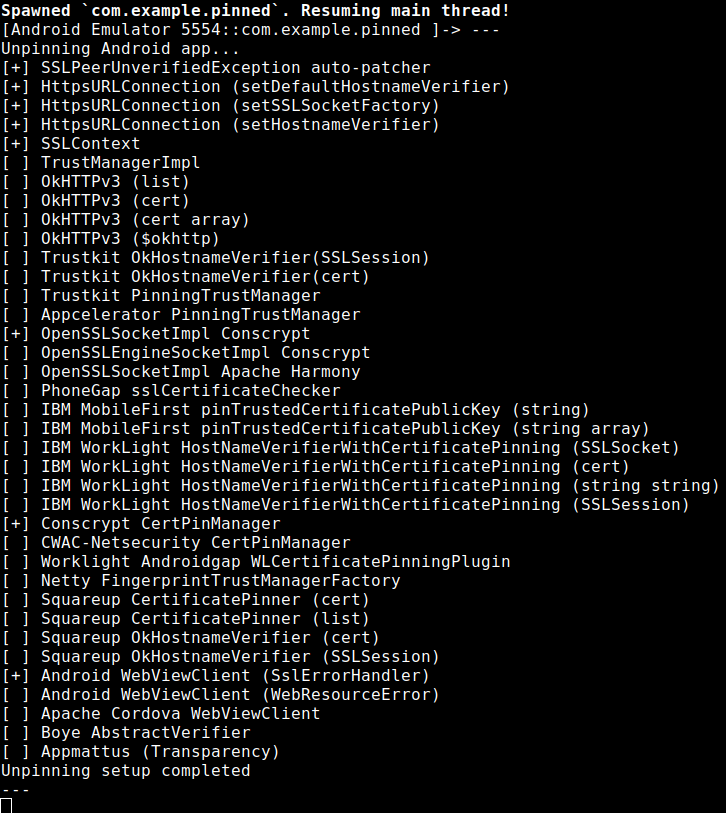
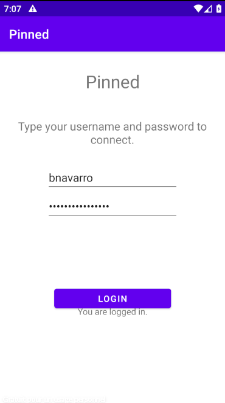

# Frida

## What is frida

Frida is a powerful tool that can be used for Android Apps pentest to help analyze and manipulate apps. It works by allowing testers to inject their own code into running applications, which helps them understand how an app behaves, find security issues, and potentially exploit vulnerabilities.

Here's a simple breakdown of what Frida does in Android pentesting:

- Dynamic Instrumentation: Frida lets you inject custom scripts into a running Android app. This helps you monitor and control the app's behavior in real-time, without modifying the app itself.

- Bypass Security: Many Android apps have security mechanisms like certificate pinning or root detection. Frida can help bypass these protections so that testers can examine how the app communicates or interacts with its backend services.

- Manipulate Code: With Frida, you can change how parts of an app work by altering its functions during runtime. This helps in testing how the app handles certain data or actions, and in finding security vulnerabilities like insecure APIs.

- Hooking: Frida allows testers to "hook" into specific functions of the app to see what data is being processed. For example, you can monitor encryption or decryption functions to capture sensitive data like passwords.

- Flexible Scripting: It provides a scripting environment using JavaScript, so you can write custom scripts to automate tasks like logging data or manipulating responses, making it very versatile for testing different kinds of apps.

## Setup

- Take frida server from [here](https://github.com/frida/frida/releases)
- `unxz frida-server-version-android-x86.xz` to decompress the file
- Follow the instructions form the article previously mentioned above

```bash
# Copy the server to the device
adb push ./frida-server-$version-android-$arch /data/local/tmp/frida-server
#        ^Change this to match the name of the binary you just extracted

# Enable root access to the device
adb root

# Make the server binary executable
adb shell "chmod 755 /data/local/tmp/frida-server"

# Start the server on your device
adb shell "/data/local/tmp/frida-server &"
```

- I am on Ubuntu
- `pip3 install frida-tools` Install Frida
- `frida-ps -U` from your ubuntu
- In case you get an error like this `Failed to enumerate processes: unable to connect to remote frida-server: closed` it means the server is not running on the emulator. In this case try to launch it like this

```bash
user ~/Documents/hackthebox $ adb shell
root@generic_x86_64:/ # su
root@generic_x86_64:/ # /data/local/tmp/frida-server &
[1] 3806
```

- Then `frida-ps -U` should work and will list the running process on the target

## Disable SSL Pinning

- I am going to use Pinned (from the HTB challenge). If you do not have and HTB subscription you can try this on [this app](https://github.com/httptoolkit/android-ssl-pinning-demo) provided by Tim Perry from his article mentioned above.  
- First I launched Pinned and kept it on during the whole process
- When running `frida-ps -U` you should see the app you wish to transform in the list. Running this `frida-ps -D emulator-5554 -ai` will give you more details on the running app `-D <id>` will allow you to specify which plug in device you wish to see the app installed on and `-ai` will show the Identifier column. This works as well `frida-ps -U -ai`


- With the other command the output looks like this


- Take [this script](https://raw.githubusercontent.com/httptoolkit/frida-android-unpinning/main/frida-script.js) kindly provided by our new friend Tim `wget https://raw.githubusercontent.com/httptoolkit/frida-android-unpinning/main/frida-script.js`
- Then you just need to run `frida -D emulator-5554 -l ./frida-script.js -f com.example.pinned` or `frida -U -l ./frida-script.js -f com.example.pinned`
- Turn out the best way to run the app with cert pinning is with this command `frida -U -l ./frida-script.js Appname` It will avoid bugs.

> Note: Apparently the --no-pause is not necessary anymore see [here](https://github.com/frida/frida/issues/2277)



- Now we should be able to intercept the traffic and actually see it in Burp (frida server should still be running for this process)
- For Pinned for example I just had to click login in my screen (that I did not close)  
  
- And I got the flag from Burp  

- If this did not work, check out this [article](https://blog.nviso.eu/2020/11/19/proxying-android-app-traffic-common-issues-checklist/#check10)

#### Useful frida commands

- `frida-ls-devices` list plugged in devices
- `frida-ps -D <id> -ai` list installed apps on a specific device

