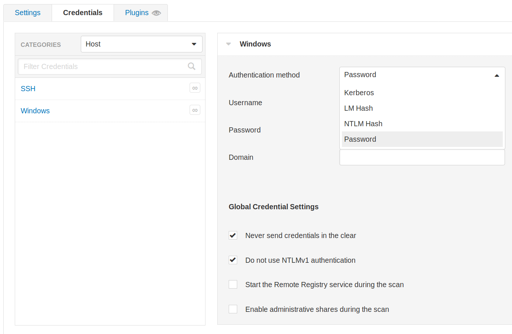
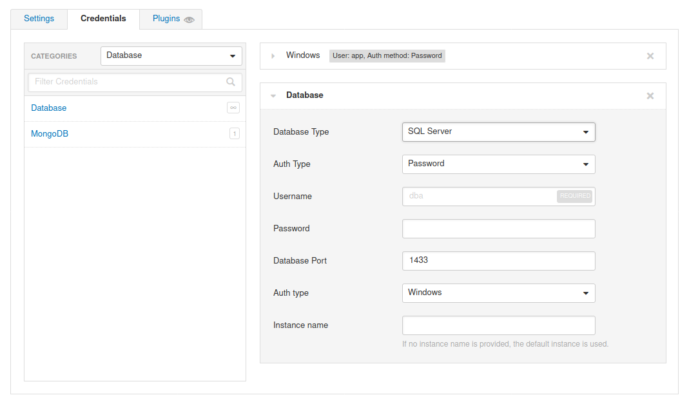
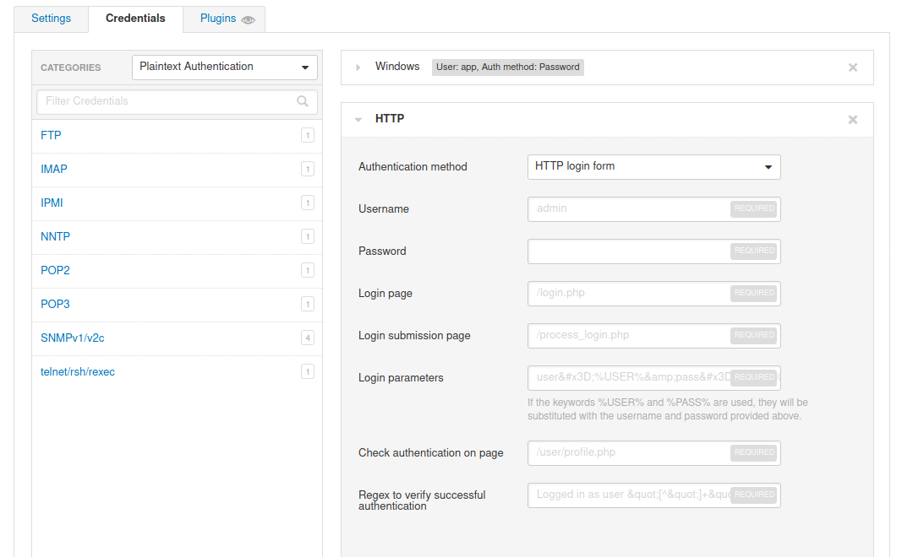
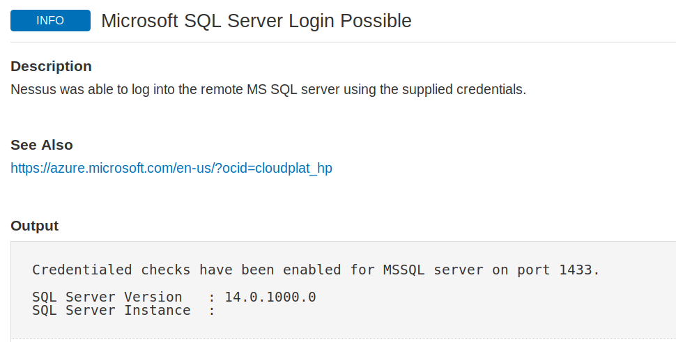
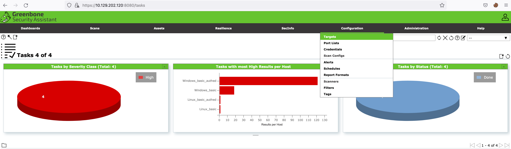
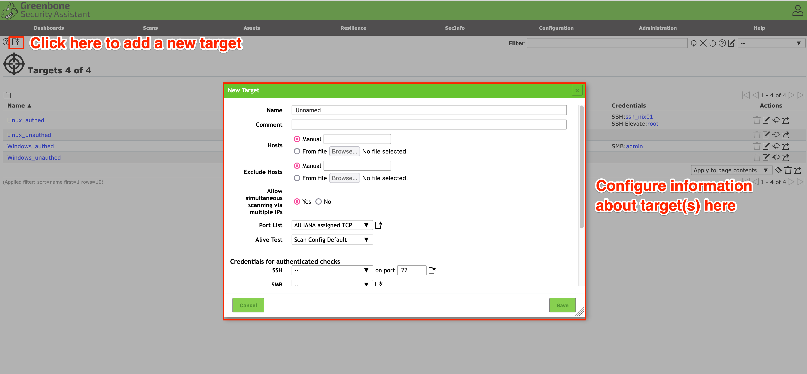

# Vulnerability Scanning tools

> *This documentation has been made using Hackthebox Academy*

## Nessus

### Download and install

- Download it [here](https://www.tenable.com/downloads/nessus?loginAttempted=true)
- Request an activation code [here](https://www.tenable.com/products/nessus/activation-code)
- Install the package `dpkg -i Nessus-X.XX.X-ubuntu910_amd64.deb`
- Start Nessus `sudo systemctl start nessusd.service`
- Access it on `https://localhost:8834`
- Select Nessus Essentials
- Set a password

### Launch a scan

- Click on New Scan and select which scan you want
- Official description of each scan [here](https://docs.tenable.com/nessus/Content/ScanAndPolicyTemplates.htm)
- Enter the ip in Targets
- Scanning devices such as network printers often result in them printing out reams of paper with garbage text, leaving the devices unusable (this is set up in option to enable scanning for fragile devices)
- In the Advanced tab, safe checks are enabled by default. This prevents Nessus from running checks that may negatively impact the target device or network.

### Scanning with creds

Nessus also supports credentialed scanning and provides a lot of flexibility by supporting LM/NTLM hashes, Kerberos authentication, and password authentication.  
  

Nessus also supports authentication for a variety of databases types including Oracle, PostgreSQL, DB2, MySQL, SQL Server, MongoDB, and Sybase.  


In addition to that, Nessus can perform plaintext authentication to services such as FTP, HTTP, IMAP, IPMI, Telnet, and more.  


Finally, we can check the Nessus output to confirm whether the authentication to the target application or service with the supplied credentials was successful.


### Nessus reports

Once a scan is completed we can choose to export a report in .pdf, .html, or .csv formats.  
> Note: These scan reports should only be shared as either an appendix or supplementary data to a custom penetration test/vulnerability assessment report. They should not be given to a client as the final deliverable for any assessment type.

### Exporting Nessus Scans

Nessus also gives the option to export scans into two formats Nessus (scan.nessus) or Nessus DB (scan.db). The .nessus file is an .xml file and includes a copy of the scan settings and plugin outputs. The .db file contains the .nessus file and the scan's KB, plugin Audit Trail, and any scan attachments.  
More information about the KB and Audit Trail can be found [here](https://community.tenable.com/s/article/What-is-included-in-a-nessus-db-file).  

- Download report from CLI with [this script](https://raw.githubusercontent.com/eelsivart/nessus-report-downloader/master/nessus6-report-downloader.rb)

### Nessus resources

- [Database of Nessus plugins](https://www.tenable.com/plugins)

## OpenVAS

### Install OpenVAS

```bash
sudo apt-get update && apt-get -y full-upgrade
sudo apt-get install gvm && openvas
```

- `gvm-setup` begin installation process
- `gvm-start` start OpenVAS
- Access it on  `https://localhost:8080`

### Scan

Before setting up any scans, it is best to configure the targets for the scan. If you navigate to the Configurations tab and select Targets, you will see targets that have been already added to the application.  


To add your own, click the icon highlighted below and add an individual target or a host list. You also can configure other options such as the ports, authentication, and methods of identifying if the host is reachable. For the Alive Test, the Scan Config Default option from OpenVAS leverages the NVT Ping Host in the NVT Family. You can learn about the NVT Family [here](https://docs.greenbone.net/GSM-Manual/gos-6/en/scanning.html#vulnerabilitymanagement-create-target).  
  

OpenVAS has various scan configurations to choose from for scanning a network. We recommend only leveraging the ones below, as other options could cause system disruptions on a network:

- Base: This scan configuration is meant to enumerate information about the host's status and operating system information. This scan configuration does not check for vulnerabilities.

- Discovery: This scan configuration is meant to enumerate information about the system. The configuration identifies the host's services, hardware, accessible ports, and software being used on the system. This scan configuration also does not check for vulnerabilities.

- Host Discovery: This scan configuration solely tests whether the host is alive and determines what devices are active on the network. This scan configuration does not check for vulnerabilities as well. OpenVAS leverages ping to identify if the host is alive.

- System Discovery: This scan enumerates the target host further than the 'Discovery Scan' and attempts to identify the operating system and hardware associated with the host.

- Full and fast: This configuration is recommended by OpenVAS as the safest option and leverages intelligence to use the best NVT checks for the host(s) based on the accessible ports.

### Export results

There are various export formats for reporting purposes, including XML, CSV, PDF, ITG, and TXT.  
We can use [this tool](https://github.com/TheGroundZero/openvasreporting) to generate an Excel doc out of the xml exported file.  
`python3 -m openvasreporting -i report-2bf466b5-627d-4659-bea6-1758b43235b1.xml -f xlsx`
