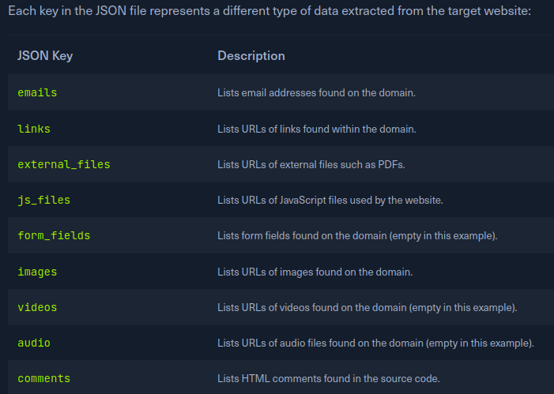

# Web crawlers

> Source: HTB Academy

## Scrapy

Scrapy is a versatile and scalable Python framework for building custom web crawlers. It provides rich features for extracting structured data from websites, handling complex crawling scenarios, and automating data processing. Its flexibility makes it ideal for tailored reconnaissance tasks.

```bash
# Install if you want to use it alone
sudo apt install python3-scrapy
# To use it with ReconSpider
mkdir webcrawlers
cd webcrawlers
python3 -m venv .
source bin/activate
pip3 install scrapy
```

## ReconSpider

> Below is usage of HTB version

- The spider will crawl the target and collect valuable information. After running ReconSpider.py, the data will be saved in a JSON file, results.json. This file can be explored using any text editor.
- Original ReconSpider [here](https://github.com/bhavsec/reconspider)
- Hackthebox version of reconspider [here](https://academy.hackthebox.com/storage/modules/144/ReconSpider.v1.2.zip)

```bash
# Usage
python3 ReconSpider.py http://website.com
```

  
