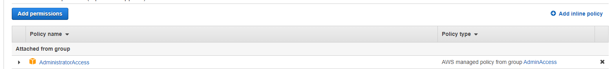
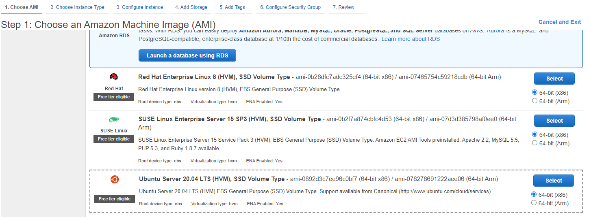
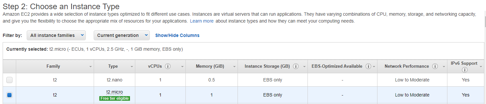
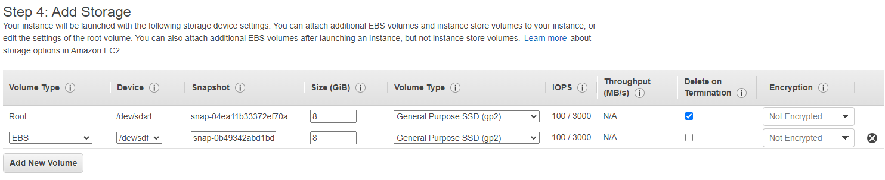
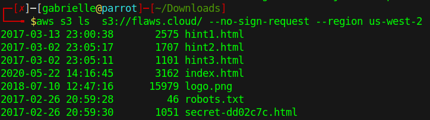

# AWS

## How to create an AWS account

In order to be able to query an s3 bucket that has misconfigured permissions like for example that gives access to its bucket to any authenticated user, we need to create a user in AWS (this is free)  

1. Create a free account on Amazon (check out the resources below for help on this step)

2. Head to the IAM console [https://console.aws.amazon.com/iam/](https://console.aws.amazon.com/iam/)

3. Go to "users" > "Add users" and follow the whole process it should be pretty straight forward refer to [this documentation](https://docs.aws.amazon.com/powershell/latest/userguide/pstools-appendix-sign-up.html) in case you hesitate about something.

4. Make sure you kept all the infos about your user on your password manager you will need for awscli.

5. In order for your user to be able to query other buckets you will need to give it permissions.  
You can do this by adding it to a group. Go to your user

- Click on the tab "Groups"
- Click on "add a user to groups"
- Click on "create a group", create one an give it a name, it is really helpful to use the premaid permissions policies (I chose the one called `AdministratorAccess`)
- Name your group add your user to it and you should be good to go!

## Create and ec2 instance

If you stumble on a snapshot during a pentest, you will need to create an ec2 instance in order to access it.  

> This part is taken from executeatwill's walkthrough of flAWS.cloud. You can read it [here](https://executeatwill.com/2022/01/17/Flaws.Cloud-Walkthrough/)

Ensure under AWS IAM that AdministratorAccess permissions is added to user

Launch EC2 new instance on the region of the snapshot you found  

Select “Free Tier”  

  

> Here under network I recommend that you authorize SSH traffic only from your IP range (if you choose 0.0.0.0/0 it will authorize anyone on the internet).

Add Storage of snapshot created: snapshot storage name: same name as the snapshot you found.  

  

- Now you just need to ssh to your new instance and mount the drive where you put the snapshot you found.

> Once you're done, I recommend that you delete the snapshot

## Connect to a bucket

- If we found a key or buckets during enumeration, we need to check them and see if we can connect to them.

- `sudo apt install awscli` install aws cli
- `aws configure --profile profilename` create a profile with our configs from our created user
- `aws configure list` check your current configuration
- `aws configure list --profile profilename` check the config of a specific profile
- `aws s3 ls s3://target --profile profilename` ls the content of a bucket
- `aws s3 ls  s3://target --no-sign-request --region us-west-2`

> Example with the CTF made available by [flAWS](http://flaws.cloud/)  

  

- `aws s3 --profile profilename cp s3://bucket/file .` copy a file from a bucket to our local directory

- `aws s3 sync ss3://bucket/folder --profile profile .` copy a full folder to our local directory

- If you find private key (Access_key and secret_access_key) you can configure it in a new profile with the command `aws configure --profile profilename`  
- Then, you just need to `aws --profile profilename s3 ls` to list the content of its s3 bucket.

## Resources

### AWS documentation

- [Create a free AWS account](https://aws.amazon.com/free/?nc1=h_ls&all-free-tier.sort-by=item.additionalFields.SortRank&all-free-tier.sort-order=asc&awsf.Free%20Tier%20Types=*all&awsf.Free%20Tier%20Categories=*all)
- [Creating an IAM user in your AWS account](https://docs.aws.amazon.com/IAM/latest/UserGuide/id_users_create.html)
- [AWS Account and Access Keys](https://docs.aws.amazon.com/powershell/latest/userguide/pstools-appendix-sign-up.html)
- [AWScli Documentation](https://aws.amazon.com/fr/cli/)

### Learning resources

#### General AWS resources

- [AWS CLI EC2 Tutorial](https://medium.com/@corymaklin/tutorial-amazon-web-services-part-1-create-virtual-machines-with-aws-cli-b900702bf286)

#### AWS Pentest

- [My AWS Pentest Methodology by Lizzie Moratti](https://medium.com/@MorattiSec/my-aws-pentest-methodology-14c333b7fb58)
- [AWS on Hacktricks](https://cloud.hacktricks.xyz/pentesting-cloud/aws-security)
- [AWS on Pentest Book](https://pentestbook.six2dez.com/enumeration/cloud/aws)
- [Cloud - AWS Pentest - Payload All The Things](https://github.com/swisskyrepo/PayloadsAllTheThings/blob/master/Methodology%20and%20Resources/Cloud%20-%20AWS%20Pentest.md)
- [Securing AWS: Discover Cloud vulnerabilities via Pentesting Techniques](https://youtu.be/fg_hey18tio)
- [Hacking the cloud by frichette_n](https://hackingthe.cloud/)
- [AWS Cloud Penetration Testing Explained with Example - Cloud Security Podcast](https://youtu.be/2YZaWoBAH7M)
- [AWS Goat Cloud Pentesting - Cloud Security Podcast](https://www.youtube.com/watch?v=2fClIjVF-Y4)
- [Getting Started with Hacking AWS ECS! - Cloud Security Podcast](https://youtu.be/UUPtnqRgBAQ)
- [GETTING STARTED WITH HACKING AWS CLOUD - Cloud Security Podcast](https://youtu.be/Btl78aP-VHo)
- [Cloud Security - Attacks by Joas Antonio Santos](https://github.com/CyberSecurityUP/Cloud-Security-Attacks)
- [Offensive cloud, AWS by Lutzenfried](https://github.com/lutzenfried/OffensiveCloud/tree/main/AWS)
- [0xd4y by Segev Eliezer with plenty of posts about AWS Pentest](https://0xd4y.com/)
- [Offensive Security AWS Guide - Joas A Santos](https://www.linkedin.com/posts/joas-antonio-dos-santos_offensive-security-aws-guide-activity-7024715135717912576-5nEZ?utm_source=share&utm_medium=member_desktop)
- [Finding Treasures in Github and Exploiting AWS for Fun and Profit — Part 1 - Bhagavan Bollina](https://blog.appsecco.com/finding-treasures-in-github-and-exploiting-aws-for-fun-and-profit-part-1-be5cfadf942)
- [Finding Treasures in Github and Exploiting AWS for Fun and Profit - Part 2 - Bhagavan Bollina](https://blog.appsecco.com/finding-treasures-in-github-and-exploiting-aws-for-fun-and-profit-part-2-8ffefa995439)
- [Pentesting Cloud part 1 "Open to the public" CTF Walkthrough by Pawel Rzepa](https://infosecwriteups.com/pentesting-cloud-part-1-open-to-the-public-ctf-walkthrough-aa4dae59ec4e)
- [AWS Privesc exploring odd features of the Trust Policy](https://medium.com/inside-the-tech-by-softserve/aws-privilege-escalation-exploring-odd-features-of-the-trust-policy-7a970a32861)
- [Cloud Hacking: Hacking Amazon AWS - NahamSec](https://youtu.be/Gq4QLy1-jcc)

#### Vulnerable labs to practice on

- [flAWS](http://flaws.cloud/)
- [flAWS2](http://flaws2.cloud/)
- [CloudGoat - RhinoSecurityLabs](https://github.com/RhinoSecurityLabs/cloudgoat)
- [IAM Vulnerable - Bishopfox (you need to deploy it yourself)](https://github.com/BishopFox/iam-vulnerable)
- [AWSGoat - ine labs (you need to deplot it yourself in your own AWS instance)](https://github.com/ine-labs/AWSGoat)

#### Writeups

- [My writeups on flAWS](../writeups/various-flaws.md)
- [My writeups on vulnmachines AWS cloud lab](../writeups/vulnmachines-cloud.md)
- [AWS S3 CTF Challenges by Michael McCambridge](https://n0j.github.io/2017/10/02/aws-s3-ctf.html)

#### Create your lab

- [How to build a Cloud Hacking Lab - Beau Bullock](https://youtu.be/4s_3oNwqImo)

### Tools

- [Cloudfox - Bishopfox](https://github.com/BishopFox/cloudfox)
- [My arsenal of AWS Security tools by toniblyx](https://github.com/toniblyx/my-arsenal-of-aws-security-tools)
- [Pacu - RhinoSecurityLabs](https://github.com/RhinoSecurityLabs/pacu)

#### AWS Security

- [AWS Security Study Plan - Jassics](https://github.com/jassics/security-study-plan/blob/main/aws-security-study-plan.md)
- [Awesome AWS Security - Jassics](https://github.com/jassics/awesome-aws-security)
- [Breaking into Cloud Security by Nick Jones](https://www.nojones.net/posts/breaking-into-cloudsec)
- [Awesome Cloud Security by NextSecurity](https://github.com/NextSecurity/Awesome-Cloud-Security)
- [Cloud Security Vulnerabilities - Ashish Rajan](https://github.com/hashishrajan/cloud-security-vulnerabilities)
- [AWS Security Notes by Segev Eliezer (0xd4y)](https://github.com/0xd4y/Notes/tree/main/AWS)
- [AWS Security Checklist](https://awscheck.netlify.app/)