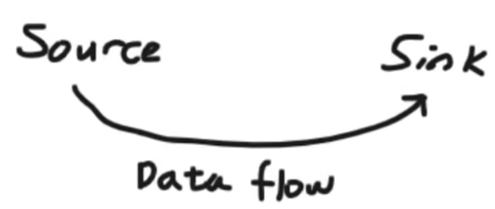
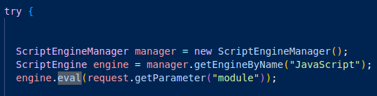
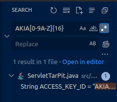
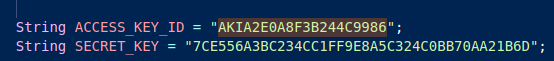

# Code Review

Secure code review is a systematic process that involves examining an application’s source code to identify and address security vulnerabilities.

> Notes from my practice and the video of OWASP devslop with Vickie Lee [here](https://www.youtube.com/live/A8CNysN-lOM?si=eq0SHRxN3dgYPxnJ).  
> I definietely recommend to check it out. It is really well explained.

## Notes from OWASP DevSlop video

> Tips from Vickie Lee. Watch the full video [here](https://www.youtube.com/live/A8CNysN-lOM?si=eq0SHRxN3dgYPxnJ).  
> Examples will be taken from [Tarpit-java](https://github.com/ShiftLeftSecurity/tarpit-java)

### How to prep

#### Tools needed for manual code review

- A good code editor or IDE. It is better if this tools:
  - Allows global searches across the code base
  - Allow regex searches
- Scripting tools and a terminal (to create test and run experiments)

#### Prereqs

- High level overview of how the app works
- Where the important functionalities are
- Who are the users
- Who should be able to do what
- Major frameworks and libraries
- Add-ons and plugins used
- What can go wrong (common vulns)

#### Code

Where to find code:

- Client-side code
- Desktop or mobile app source code
- Leak code through a vulnerability (path traversal, etc)
- OSINT: Github, pastebin, ...
- Reverse the binary

#### Concepts

- Source = Code that allows a vulnerability to happen
- Sink = where the vulnerability actually happen

Example: Code injection. Source is where the user input is taken, sink is functions that execute arbitrary system commands.



> *IMG Source: Video from OWASP Devslop*

### Quick start hunting

#### How to find the most critical vulnerabilities fast

- Search for known dangerous functions used on user-supplied input.
- Search for harcoded credentials such as API keys, encryption keys, and db password.
  - Regex for AWS Access key ID "AKIA[0-9A-Z]{16}"
- Search for weak cryptography or hasing algotrithm (grep on weak algorithm name)
- Search for outdated dependencies (lots of vulnerabilities are introduced by 3rd party code)
- Search for revealing developer comments (might contains sensitive infos)

#### Example Command injection

- Look for a dangerous function such as `eval()`. In your code editor or with grep search for the string "`eval(`"

For example in Tarpit-java:

  

It gets the user input from the request and use eval on it directly.

#### Example regex search on code base for hardcoded creds

In tarpit-java search for the following regex: "AKIA[0-9A-Z]{16}" (it will identify strings that start with AKIA that has 16 chars with the set we mentioned in the `[]` so from 0 to 9 and A to Z). This is actually what an AWS Access key would look like.

> To turn on regex search on Codium (visual studio code or sublime text) click here: 
  

So in my Codium the search looks like this.  

  

And we actually found a result:



### More comprehensive review

- Focus on critical functions first (authentication, Authorization, PII, etc) 
  - anything that deals with sentitive data, payments shipping etc
- Follow any code that deals with user input (see if they reach dangerous functionality)
  - Tracing the data flow

#### Example SQL Injection

In the file OrderStatus.java, we can see that a user input is taken for the variable `orderId`

```java
String orderId = request.getParameter("orderId");
```

Later this string is used as is to request the database. So this is a SQL Injection.  

```java
String sql = "SELECT * FROM ORDER WHERE ORDERID = '" + orderId;
```

### Use automation with manual analysis

- Use tools and then manually verify the results.

## Notes from my practice

### General Methodology

It is possible to do manual grep for some classes. If the codebase is small you can read everything.  
It is wiser to install an ide.  
Usually in code review, you look for the sources first and see if there are sinks that are reachable, but often there is more code than time, so I prefer to cherry pick some sink that would be critical and look if there is a corresponding source.  
You can exclude the tests from a code review after checking if sensitive data like production secrets (password etc) are not stored in it.)  
When you don't have enough time it is interesting to review in 1 or 2 hours the summary of the [ASVS (owasp appsec verification standard)](https://owasp.org/www-project-application-security-verification-standard/) to make corresponding greps.  
In general it is always important to follow the inputs and see where they go. We can also review bug patterns.

### Dangerous functions in java

To avoid vulnerabilities like command injection or code injection `exec()`, `eval()`  

### File upload - check

- Always check for unauthenticated file uploads

### Enumerate entry points

> thanks to my colleague Marc André for this one liner

- `grep -r -A2 -E '@(Get|Post|Put|Delete)Mapping' *`

### Tools

#### Spotbugs

On a Unix, Linux, or macOS system, run the $SPOTBUGS_HOME/bin/spotbugs script, or run the command java -jar $SPOTBUGS_HOME/lib/spotbugs.jar to run the SpotBugs GUI.

- [Documentation](https://spotbugs.readthedocs.io/en/stable/)

#### Other tools

- SemGrep
- FindSecBugd (dynamique analysis)
- EsPReSSO plugin burp for oAuth: will analyze and describe communitcation with oAuth

### List of weaknesses to look for

- Hardcoded credentials or secrets (grep on "password", "key", "secret")
- Information leak
- Missing security flags
- Weak password hashing mechanism
- Cross-Site Scripting
- No CSRF protection
- Directory listing
- Crypto issue
- Signature bypass
- Authentication bypass
- Authorization bypass
- Remote Code Execution
- Grep on comments
- Grep for file upload functionalities "upload"

### Useful linux commands

- `curl "https://target.com/" | grep -oP '(https*://|www\.)[^ ]*'` Extract all URL from Source Code (thanks Savan Patel on Linkedin for this command)
- send curl to proxy `export https_proxy=http://127.0.0.1:8080`
- [Curl for multipart form data](https://stackoverflow.com/questions/46960397/using-curl-for-multipart-form-data-with-a-file-upload)
- Grep is a very convernient linux command to search for string. Learn more about it [here](https://csbygb.gitbook.io/pentips/digital-skills/useful-linux#grep)

## Misc Tips from pentesterlab code review training

> This training is definitely worth it's price.

- Syntax highlighting
- Browse source tree
- Brainsto with a rubber duck or willing person
- use `find`
- use `find` with `grep`
- check comments
- check test cases
- Add your tests in the test cases
- Take notes (project and meta)
  - related to the project: notes on code, modelisation of code with uml etc
  - Meta: about a specific language (everytine a note is taking on a specific language add the version)
- Testing behavior
  - Read-Eval-Print-Loop (REPL)
    - Ruby shell: IRB
    - PHP: - `php -a`
    - Java `jshell`
    - Go:
      - https://go.dev/play/ (online)
      - https://github.com/traefik/yaegi
- Test Process
  1. Make a hypothesis
  2. Conduct experiments to test it
  3. Analyze the data
  4. Conclude whether the results support or refute your initial guess

## Useful tools

### Zeal

> Offline documentation for various languages.

- `sudo apt install zeal` to install
- `zeal` to launch
- Click on Docsets > Available and download the documentationf or the language you need.

### devdocs

> Online documentation for various languages

- [devdocs](https://devdocs.io/)

## Resources

- [How to Analyze code for Vulnerabilities - Vickie Lee - OWASP DevSlop](https://www.youtube.com/live/A8CNysN-lOM?si=eq0SHRxN3dgYPxnJ)
- [Tarpit Java - ShiftLeftSecurity](https://github.com/ShiftLeftSecurity/tarpit-java)
- [Vickie Li's Security Blog](https://vickieli.dev/)
- [Bugs Patterns](https://find-sec-bugs.github.io/bugs.htm)
- [Cheat Sheet de Snyk 10 Java security best practices](https://res.cloudinary.com/snyk/raw/upload/v1568658651/Cheat_Sheet-_10_Java_Security_Best_Practices.pdf)
- [OWASP Top 10: How to Find Vulnerabilities in Your Java Applications](https://www.kiuwan.com/blog/)
- [OWASP Code Review guide](https://owasp.org/www-pdf-archive/OWASP_AlphaRelease_CodeReviewGuide2.0.pdf)
- [Best practice angular](https://snyk.io/wp-content/uploads/Angular-Security-Best-Practices-1.pdf)
- [Code review & Regular Expression commands - trojand](https://trojand.com/cheatsheet/Useful_Commands/Code_Review_Regex.html)
- [Secure Code Review checklist by Dr. Michaela Greiler](https://www.awesomecodereviews.com/checklists/secure-code-review-checklist/)
- [Regex cheatsheet - Trustedsec](https://trustedsec.com/blog/regex-cheat-sheet)
- [Code review - Pentest book](https://pentestbook.six2dez.com/others/code-review)
- [Secure Coding Handbook - vladtoie](https://vladtoie.gitbook.io/secure-coding/)
- [Absolute Appsec](https://github.com/absoluteappsec)