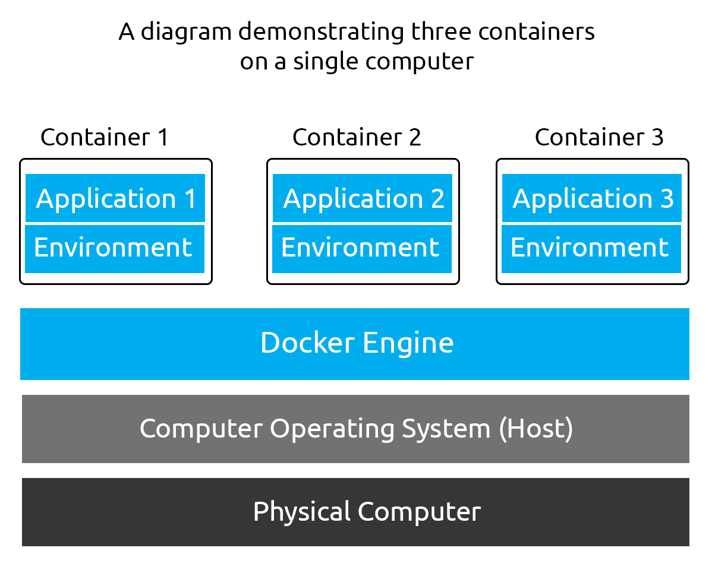
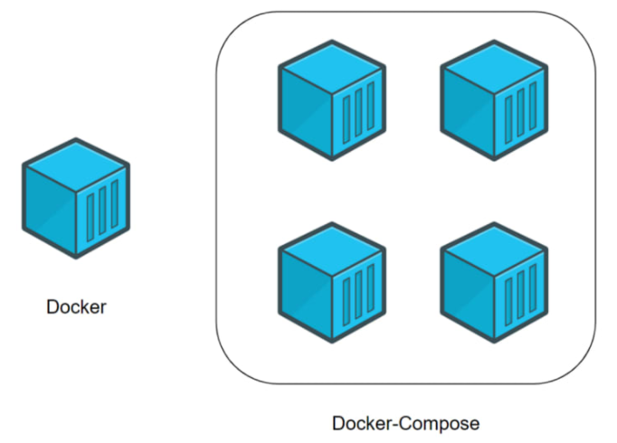

# Docker

> This documentation has been made using the rooms [Intro to Containerisation](https://tryhackme.com/room/introtocontainerisation) and [Intro to Docker on TryHackMe](https://tryhackme.com/room/introtodockerk8pdqk)

## What is Containerisation

In computing terms, containerisation is the process of packaging an application and the necessary resources (such as libraries and packages) required into one package named a container. The process of packaging applications together makes applications considerably portable and hassle-free to run.  

  

> Image Source: TryHackMe

In the screenshot above, we can see how three applications and their environments (such as dependencies) are packaged together and do not directly interact with the physical computer - but rather the containerisation engine (in this case, it is Docker)

## Intro to Docker

Docker employs the same technology used in containerisation to isolate applications into containers called the Docker Engine. The Docker Engine is essentially an API that runs on the host operating system, which communicates between the operating system and containers to access the system’s hardware (such as CPU, RAM, networking and disk)

Because of this, the Docker engine is extensive and allows you to do things like:

1. Connect containers together (for example, a container running a web application and another container running a database)
2. Export and import applications (images)
3. Transfer files between the operating system and container

Docker uses the programming syntax YAML to allow developers to instruct how a container should be built and what is run. This is a significant reason why Docker is so portable and easy to debug; share the instructions, and it will build and run the same on any device that supports the Docker Engine.  
The Docker engine allows containers to be orchestrated, meaning that multiple containers can be built as part of a group, allowing containers to communicate with each other (for example, one container running a web server and another container running a database can communicate).  

The syntax for Docker can be categorised into four main groups:

- Running a container
- Managing & Inspecting containers
- Managing Docker images
- Docker daemon stats and information

## Managing Docker Images

- `docker pull imagename` Command to download the latest version of an image example: `docker pull nginx`

| Docker Image|Tag|Command Example|Explanation|
|-------------|---|---------------|-----------|
|ubuntu|latest|`docker pull ubuntu`- IS THE SAME AS - `docker pull ubuntu:latest`|This command will pull the latest version of the "ubuntu" image. If no tag is specified, Docker will assume you want the "latest" version if no tag is specified. It is worth remembering that you do not always want the "latest". This image is quite literally the "latest" in the sense it will have the most recent changes. This could either fix or break your container.|
|ubuntu|22.04|`docker pull ubuntu:22.04`|This command will pull version "22.04 (Jammy)" of the "ubuntu" image.|
|ubuntu|20.04|`docker pull ubuntu:20.04`|This command will pull version "20.04 (Focal)" of the "ubuntu" image.|
|ubuntu|18.04|docker pull ubuntu:18.04|This command will pull version "18.04 (Bionic)" of the "ubuntu" image.|

- `docker image` list available options
- `docker image ls` list all images stored on the local machines
- `docker image rm imageId:tag` remove a docker image (we need to include the tag in the command example `ubuntu:22.04`)

## Running a container

The Docker run command creates running containers from images. This is where commands from the Dockerfile (as well as our own input at runtime) are run.

- `docker run [OPTIONS] IMAGE_NAME [COMMAND] [ARGUMENTS...]` Command synopsis to tun an image

Example:

- `docker run -it helloworld /bin/bash` We run an image named helloworld.  
"Interactively" by providing the -it switch in the [OPTIONS] command.  
This will allow us to interact with the container directly.  
We spawn a shell within the container by providing /bin/bash as the [COMMAND] part.  
This argument is where you will place what commands you want to run within the container (such as a file, application or shell!)

| [OPTION]|Explanation|Relevant Dockerfile Instruction|Example|
|---------|-----------|-------------------------------|-------|
|-d|This argument tells the container to start in "detached" mode. This means that the container will run in the background.|N/A|`docker run -d helloworld`|
|-it|This argument has two parts. The "i" means run interactively, and "t" tells Docker to run a shell within the container. We would use this option if we wish to interact with the container directly once it runs.|N/A|`docker run -it helloworld`|
|-v|This argument is short for "Volume" and tells Docker to mount a directory or file from the host operating system to a location within the container. The location these files get stored is defined in the Dockerfile|VOLUME|`docker run -v /host/os/directory:/container/directory helloworld`|
|-p|This argument tells Docker to bind a port on the host operating system to a port that is being exposed in the container. You would use this instruction if you are running an application or service (such as a web server) in the container and wish to access the application/service by navigating to the IP address.|EXPOSE|`docker run -p 80:80 webserver`|
|--rm|This argument tells Docker to remove the container once the container finishes running whatever it has been instructed to do.|N/A|`docker run --rm helloworld`|
|`--name`|This argument lets us give a friendly, memorable name to the container. When a container is run without this option, the name is two random words. We can use this open to name a container after the application the container is running.|N/A|`docker run --name helloworld`|

Other arguments include (but are not limited to!):

- Telling Docker what network adapter the container should use
- What capabilities the container should have access to.
- Storing a value into an environment variable

### Listing Running Containers

- `docker ps` list running containers
- `docker ps -a` list all containers (even stopped)

## Dockerfiles

Dockerfiles is a formatted text file which essentially serves as an instruction manual for what containers should do and ultimately assembles a Docker image.  

- `INSTRUCTION argument` Dockerfile formatting

|Instruction|Description|Example|
|-----------|-----------|-------|
|FROM|This instruction sets a build stage for the container as well as setting the base image (operating system). All Dockerfiles must start with this.|FROM ubuntu|
|RUN|This instruction will execute commands in the container within a new layer.|RUN whoami|
|COPY|This instruction copies files from the local system to the working directory in the container (the syntax is similar to the `cp` command).|COPY /home/cmnatic/myfolder/app/|
|WORKDIR|This instruction sets the working directory of the container. (similar to using `cd` on Linux).|WORKDIR / (sets to the root of the filesystem in the container)|
|CMD|This instruction determines what command is run when the container starts (you would use this to start a service or application).|CMD /bin/sh -c script.sh|
|EXPOSE|This instruction is used to tell the person who runs the container what port they should publish when running the container.|EXPOSE 80 (tells the person running the container to publish to port 80 i.e. `docker run -p 80:80)`|

### Building a container

- `docker build` will be used to build an image with a Dockerfile.  

#### Example 1

```yaml
# THIS IS A COMMENT
# Use Ubuntu 22.04 as the base operating system of the container
FROM ubuntu:22.04

# Set the working directory to the root of the container
WORKDIR / 

# Create helloworld.txt
RUN touch helloworld.txt
```

- To build it we would run `docker build -t helloworld .` (the `.` is to mention that the dockerfile is in our current working directory)

#### Example 2

```yaml
# THIS IS A COMMENT
FROM ubuntu:22.04

# Update the APT repository to ensure we get the latest version of apache2
RUN apt-get update -y 

# Install apache2
RUN apt-get install apache2 -y

# Tell the container to expose port 80 to allow us to connect to the web server
EXPOSE 80 

# Tell the container to run the apache2 service
CMD ["apache2ctl", "-D","FOREGROUND"]
```

- `docker build -t webserver .` to build it
- `docker run -d --name webserver -p 80:80  webserver` to run it

## Docker compose

Docker Compose allows multiple containers (or applications) to interact with each other when needed while running in isolation from one another.



> Source: TryHackMe

- Install [Docker Compose](https://docs.docker.com/compose/install/)

### Docker compose essential commands

|Command|Explanation|Example|
|-------|-----------|-------|
|up|This command will (re)create/build and start the containers specified in the compose file.|`docker-compose up`|
|start|This command will start (but requires the containers already being built) the containers specified in the compose file.|`docker-compose start`|
|down|This command will stop and delete the containers specified in the compose file.|`docker-compose down`|
|stop|This command will stop (not delete) the containers specified in the compose file.|`docker-compose stop`|
|build|This command will build (but will not start) the containers specified in the compose file.|`docker-compose build`|

### A Showcase of Docker Compose

#### Requirements

- An E-commerce website running on Apache
- This E-commerce website stores customer information in a MySQL database

#### Without compose

We could manually run the two containers via the following:

1. Creating the network between the two containers: `docker network create ecommerce`
2. Running the Apache2 webserver container: `docker run -p 80:80 --name webserver --net ecommerce webserver`
3. Running the MySQL Database server: `docker run --name database --net ecommerce webserver`

#### Same thing with docker compose

We can use Docker Compose via `docker-compose` up to run these containers together.  

Advantages:

- One simple command to run them both
- These two containers are networked together, so we don’t need to go about configuring the network.
- Extremely portable. We can share our docker-compose.yml file with someone else, and they can get the setup working precisely the same without understanding how the containers work individually.
- Easy to maintain and change. We don’t have to worry about specific containers using (perhaps outdated) images.

##### Necessary instruction of this use case

|Instruction|Explanation|Example|
|-----------|-----------|-------|
|version|This is placed at the top of the file and is used to identify what version of Compose the docker-compose.yml is written for.|'3.3'|
|services|This instruction marks the beginning of the containers to be managed.|services:|
|name (replace value)|This instruction is where you define the container and its configuration. "name" needs to be replaced with the actual name of the container you want to define, i.e. "webserver" or "database".|webserver|
|build|This instruction defines the directory containing the Dockerfile for this container/service. (you will need to use this or an image).|./webserver|
|ports|This instruction publishes ports to the exposed ports (this depends on the image/Dockerfile).|'80:80'|
|volumes|This instruction lists the directories that should be mounted into the container from the host operating system.|'./home/cmnatic/webserver/:/var/www/html'|
|environment|This instruction is used to pass environment variables (not secure), i.e. passwords, usernames, timezone configurations, etc.|MYSQL_ROOT_PASSWORD=helloworld|
|image|This instruction defines what image the container should be built with (you will need to use this or build).|mysql:latest|
|networks|This instruction defines what networks the containers will be a part of. Containers can be part of multiple networks (i.e. a web server can only contact one database, but the database can contact multiple web servers).|ecommerce|

##### Final docker-compose.yml file

```yaml
version: '3.3'
services:
  web:
    build: ./web
    networks:
      - ecommerce
    ports:
      - '80:80'


  database:
    image: mysql:latest
    networks:
      - ecommerce
    environment:
      - MYSQL_DATABASE=ecommerce
      - MYSQL_USERNAME=root
      - MYSQL_ROOT_PASSWORD=helloword
    
networks:
  ecommerce:
```

## Docker Socket

When you install Docker, there are two programs that get installed:

- The Docker Client
- The Docker Server

Docker works in a client/server model. Specifically, these two programs communicate with each other to form the Docker.  
Docker achieves this communication using something called a socket. Sockets are an essential feature of the operating system that allows data to be communicated.  
In the context of Docker, the Docker Server is effectively just an API. The Docker Server uses this API to listen for requests, whereas the Docker Client uses the API to send requests.  
because of this, we can interact with the Docker Server using commands like curl or an API developer tool such as Postman.  

## Docker Registry

Docker Registries, are used to store and provide published Docker images for use. Using repositories, creators of Docker images can switch between multiple versions of their applications and share them with other people with ease.  
Public registries such as DockerHub exist, however, many organisations using Docker will host their own "private" registry.

## Useful Docker commands

|Command | Description|
|--------|------------|
|`network ls`| Used to list the networks of containers, we could use this to discover other applications running and pivot to them from our machine!|
|`images`|List images used by containers, data can also be exfiltrated by reverse-engineering the image.|
|`exec`|Execute a command on a container|
|`run`|Run a container|

### Examples

- [RustScan DockerHub Registry](https://hub.docker.com/repository/docker/rustscan/rustscan)

## Resources

- [Intro to Docker - TryHackMe](https://tryhackme.com/room/introtodockerk8pdqk)
- [Intro to Containerisation - TryHackMe](https://tryhackme.com/room/introtocontainerisation)
- [Docker official Documentation](https://docs.docker.com/)
- [Docker Rodeo - TryHackMe](https://tryhackme.com/room/dockerrodeo)
- [Compose Documentation](https://docs.docker.com/compose/reference/)
- [Official documentatio on Docker Registry](https://docs.docker.com/registry/)
- [Docker Hub](https://registry.hub.docker.com/search?q=)