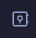

# Obsidian

## What is it

According to the official website "Obsidian is the private and flexible note‑taking app that adapts to the way you think."

## Tips & Useful

### Open a folder as a vault

Sometimes you don't want to edit files from your vault. You might have files outside your vault that you wish to edit with Obsidian.  

- Open Obsidiant
- Click here (bottom left "Open another vault")

- Select "Open Folder as vault" and choose the folder you want

## Resources

- [Obsidian](https://obsidian.md/)
- [Getting Started with Obsidian: A Beginner’s Guide(https://obsidian.rocks/getting-started-with-obsidian-a-beginners-guide/)