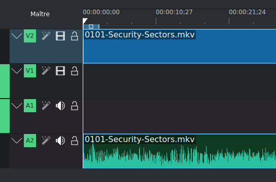

# Useful tools and command in linux for general tasks

## Combine multiple commands

> goes further than just a pipe

You can execute a command on the result of another command using `command $(results of other commands)` You need to put inside the parenthesis the command you wish use the result of.

### Examples

- `kill $(ps -aux | grep 'chromium'| awk '{print $2}')` kill all process with chromium in the name (because killall chromium does not work)

## Change your hostname

### Temporary

```bash
sudo hostname newhostname
```

> Will get back as it was after reboot

### Permanently

- `sudo nano /etc/hostname`
- `sudo nano /etc/hosts`
- `sudo reboot`
- `hostname` should give you your newly chosen hostname

## Debug command not found

> Works only in bash

This annoying message when you need something that is not installed.

- `sudo apt install command-not-found` will install an utility that will provide information when you will get this error.
- Alternatively you can use `apt-cache search command-name` it will tell what to install

> *See [this thread](https://unix.stackexchange.com/questions/355023/showmount-command-not-found-how-do-i-know-what-to-install) for more info*

## Debug apt

- If you get this error `The following signatures were invalid`
- `sudo wget -q -O - https://archive.kali.org/archive-key.asc  | sudo apt-key add`
- More info on [this thread](https://unix.stackexchange.com/questions/421985/invalid-signature-when-trying-to-apt-get-update-on-kali)

## Debug snap

- If you get this error `snap-confine has elevated permissions and is not confined but should be. Refusing to continue to avoid permission escalation attacks`
- `sudo apparmor_parser -r /etc/apparmor.d/*snap-confine*`
- `sudo apparmor_parser -r /var/lib/snapd/apparmor/profiles/snap-confine*`
- More info [here](https://stackoverflow.com/questions/70053614/snap-confine-has-elevated-permissions-and-is-not-confined-but-should-be-refusin)

## Update only 1 package

- `apt-get install --only-upgrade <packagename>` This will upgrade only that single package, and only if it is installed.

## File conversions

### HEIC to JPG

- `sudo apt install libheif-examples` install heif-convert
- For one file `heif-convert -q 85 input.HEIC output.JPG`
- For multiple files `for file in *.HEIC; do heif-convert $file ${file/%.HEIC/.JPG}; done`

### Images to PDF

- You can do this with one image or multiple to put them all in one pdf
- `convert *.png document.pdf` convert all png files of current folder in one pdf
- `convert document.jpg document.pdf` convert the file `document.jpg` in to a pdf named `document.pdf`

> Note: if you get this error, this [article](https://suay.site/?p=2369) is great. You just need to add this line `<policy domain="coder" rights="read | write" pattern="PDF" />` before `</policymap>` in the file `/etc/ImageMagick-6/policy.xml` (the path can be different depending on your version of ImageMagick)

### webp to jpg

- `convert *.webp *.jpg`

### PDF to images

- You can do the other way around `pdfimages file.pdf extracted-images/` you can add the lag `-png` to specify that you want the pictures to be in png format

> Note this will get every image from the PDF file. If you want every slide as images this next command is the one you need

- `pdftoppm -png file.pdf file/name-you-want-to-give-to-the-images`

## Find things

- `find / -name "keyword" 2>/dev/null` look for something named keyword in the whole system and do not show error messages  
- `find / -type f -name ".*" 2>/dev/null` find hidden files in the system and do not show error messages

### Other options with find

- `-iname` if you the letter capitalization does not matter
- `.` to search in the current folder
- `-type d` if you are looking for a directory
- `-type f` if you are looking for a file
- `-perm 777` if you look for files with 777 perm
- `! -perm 777` if you look for files without 777 perm
- `-perm /a=x` to look for executables files
- `-exec` to execute a command on the file found example `find / -type d -perm 777 -print -exec chmod 755 {} \;`
- `-empty` to find empty files
- `-user username` use with find to get files with the user named "username"
- `-group groupname` same as user but for group
- `-mtime 5` modified in the last 5 days
- `-atime 5` accessed in the last 5 days
- `-mtime +5 –mtime -10` modify in between 5 to 10 days ago
- `-cmin -60` changed in the last 60 minutes
- `-mmin -60` modified in the last 60 minutes
- `-amin -60` accessed in the last 60 minutes
- `-size 5M` get files that are 5MB

## dd

dd is a command used to convert and copy a file. It can also be useful to generate dummy files that you could need during a pentest (to test for unrestricted resource consumption for example).  

```bash
# create a file containing 30 random megabytes and assign it the .pdf extension
dd if=/dev/urandom of=mypdf.pdf bs=1M count=30
#  generate a file with the .exe extension, filling it with random bytes
dd if=/dev/urandom of=reverse-shell.exe bs=1M count=10
```

- [dd man page](https://man7.org/linux/man-pages/man1/dd.1.html)

## Grep

- If you are looking for a specific thing in a file you can grep a string on it.
- `cat file.txt | grep "keyword"` looking for keyword in file.txt
- `-B 2` this option will show us the 2 lines before our keyword
- `-A 2` This option will show su the 2 lines after our keyword
- `grep -iar "keyword" .` `i` will ignore-case, `a` will Process a binary file as if it were text and `r` is for recursive and `.` is for the current directory.

## Compare 2 files

## Packets install and mamangement

### List installed packets

- `apt list --installed` (add a grep on it for example `| grep image` if you are looking for the package imagemagick)

### Install a deb package with apt

- `sudo apt install ./packet.deb`

### Search for a package

- `apt-cache search package-name` example `apt-cache search mingw`

## Unzip

- If you accidentally unzipped a file and want to delete all the files you just unzipped `unzip -Z -1 <filename.zip> | xargs -I{} rm -v {}`

### Extract unique occurrence from 2 files

- You have to files and you want to extract unique values and put them in a new file (file1 should be the one with the more lines)
  - `awk 'FNR==NR {a[$0]++; next} !($0 in a)' file1 file2` Command found on [stackoverflow](https://stackoverflow.com/questions/4717250/extracting-unique-values-between-2-sets-files)
  - Explanation of how the code works:
    If we're working on file1, track each line of text we see.  
    If we're working on file2, and have not seen the line text, then print it.  
    Explanation of details:  

    FNR is the current file's record number  
    NR is the current overall record number from all input files  
    FNR==NR is true only when we are reading file1  
    $0 is the current line of text  
    a[$0] is a hash with the key set to the current line of text  
    a[$0]++ tracks that we've seen the current line of text  
    !($0 in a) is true only when we have not seen the line text  
    Print the line of text if the above pattern returns true, this is the default awk behavior when no explicit action is given  

## Change DNS config in kali

- [This article](http://www.infrabytes.com/change-dns-in-kali) explains it very well.

## Speed up update process in Kali

- If like me you are annoyed at the time it takes to update your kali, it is possible to use a mirror.
- [This article](https://trendoceans.com/how-to-fix-kali-linux-slow-apt-update-process/) explains it very well.

> **Note: it is not the official repositories so use with caution ;)**

## Add a set title function in gnome-terminal

- Add this code in your bashrc

```bash
function set-title() {
  if [[ -z "$ORIG" ]]; then
    ORIG=$PS1
  fi
  TITLE="\[\e]2;$*\a\]"
  PS1=${ORIG}${TITLE}
}
```

- `source .bashrc`
- Then to set a title you will just need to do `set-title mytitle`

> [Source](https://code.mendhak.com/set-terminal-title/)

## kdenlive

> Useful gui tool to edit video and convert them

### Convert an mkv to mp4

- Drag and drop the mkv file in kdenlive
- Make sure it is in the sources. Like this  
  

- In Project choose render 
- Choose the format you want
- Then click on render to file

## Record a video from command line with ffmpeg

### Choose an external webcam if you have multiple

- Install `v4l2-ctl`

```bash
sudo apt-get update
sudo apt-get install v4l-utils
```

- List your available cameras

```bash
v4l2-ctl --list-devices
# You should get something similar to this
Webcam intégrée: intégrée (usb-0000:00:14.0-8):
    /dev/video0
    /dev/video1

HD Webcam USB: (usb-0000:00:14.0-4):
    /dev/video2
    /dev/video3
```

### Start recording

- `ffmpeg -f v4l2 -i /dev/video2 output.mkv` start the recording
- `ffmpeg -f v4l2 -framerate 30 -video_size 1280x720 -i /dev/video2 -c:v libx264 -preset fast -pix_fmt yuv420p output.mp4` with more options
  - `-framerate 30` image per second
  - `-video_size 1280x720` resolution of capture
  - `-c:v libx264` specify codec (H.264 in this example).
  - `-preset fast` will compromise between encoding speed and quality
  - `-pix_fmt yuv420p` define pixel format

You can also add `-t 00:00:20` if you want a 20 second video. Also `-an` will make sure that no audio is recorded if you only want video this way the output file will only have video.

And when you are done if you did not set a timer you can just ctrl c.

If you only want to visualize without recording (to do your setup) you can use `ffplay -f v4l2 -i /dev/video2`

Unfortunately I could not find any solution to both visualize and record except by using OBS or another software :)

### Capture your screen

- Capture the whole screen `ffmpeg -f x11grab -r 30 -s $(xdpyinfo | grep 'dimensions:'| awk '{print $2}') -i :0.0 -vcodec libx264 -preset ultrafast -crf 18 output.mp4`
  - `-f x11grab` : Tells ffmpeg to use X11 for screen capture (for Linux systems).
  - `-r 30` : Sets the refresh rate of the recording to 30 frames per second.
  - `-s $(xdpyinfo | grep 'dimensions:'| awk '{print $2}')` : Uses the current screen resolution as the recording dimension. xdpyinfo provides information about the X display, and this command extracts the screen resolution.
  - `-i :0.0` : Specifies the screen source to capture. :0.0 refers to the main display.
  - `-vcodec libx264` : Uses the H.264 video codec for the recording.
  - `-preset ultrafast` : Uses an encoding preset for maximum speed, at the expense of file size (useful for minimizing delay during recording).
  - `-crf 18` : Sets the encoding quality factor, where a lower value means better quality (and therefore a larger file). 18 is a good balance between quality and size.
  - `output.mp4` : The output file

- Recording a Specific Portion of the Screen `ffmpeg -f x11grab -r 30 -s 1280x720 -i :0.0+0,0 -vcodec libx264 -preset ultrafast -crf 18 output.mp4`

## Make your gnome terminal more fancy

- Put this in your .bashrc

```bash
# Automatic coloration with ls and grep
alias ls='ls --color=auto'
alias grep='grep --color=auto'

# colored prompt
PS1='\[\e[0;32m\]\u@\h:\w\[\e[m\]\$ '

# Command to define a title // found on stack overflow
function set-title() {
  if [[ -z "$ORIG" ]]; then
    ORIG=$PS1
  fi
  TITLE="\[\e]2;$*\a\]"
  PS1=${ORIG}${TITLE}
}
```