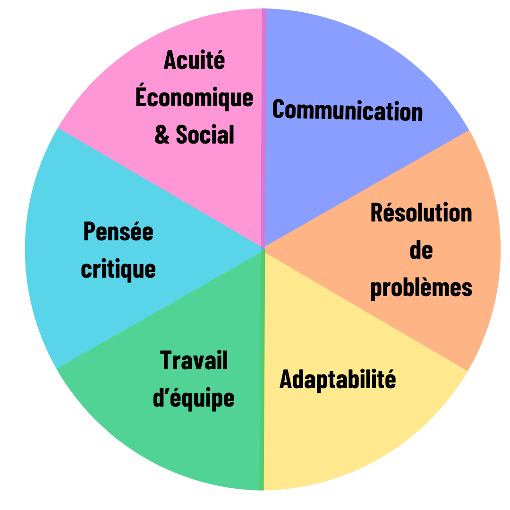
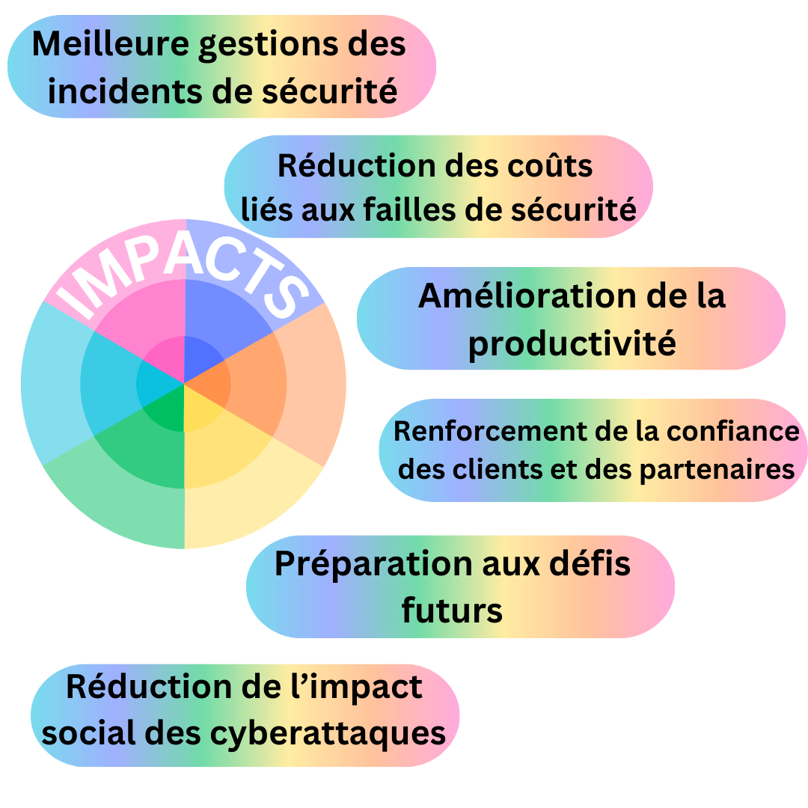
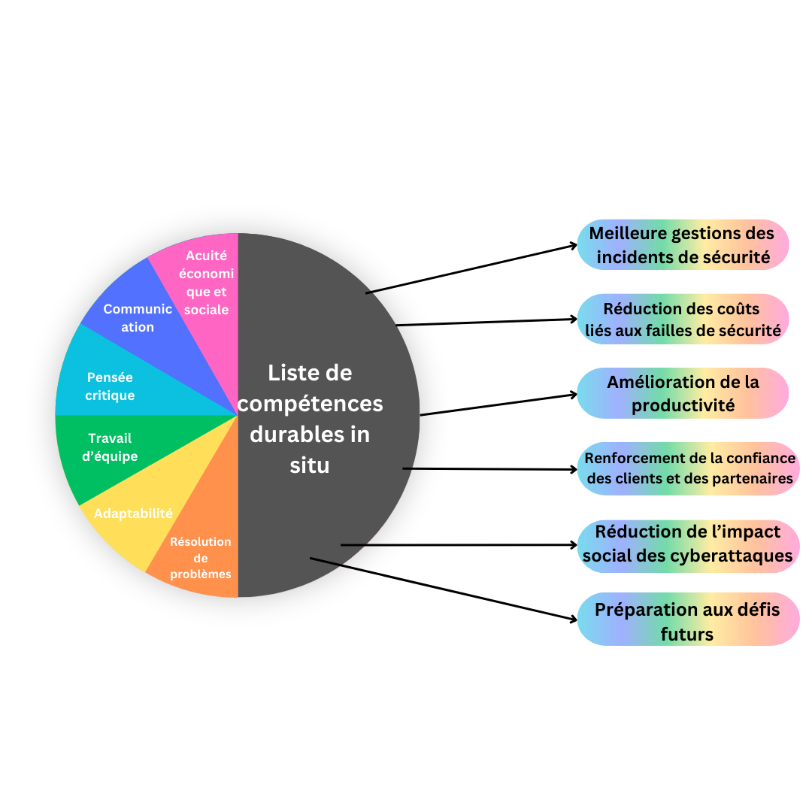

# Roue des compétences durables / Durable skills Wheel

> Ce document est en licence Creative Commons, n'hésitez pas à contribuer.

## Vue globale

- Ellipse centrale: méta compétences durables nécessaires en cybersécurité
- Seconde ellipse: compétences que l’on développe dans notre pratique et qui découlent des meta compétences.
- Dernière ellipse: impacts découlant de ces compétences pour influer vers un fonctionnement optimal des équipes et des pratiques.

## Méta Compétences

  

## Évaluation par méta compétences

  

  

  

  

  

  

## Impacts

## Résumé Global

