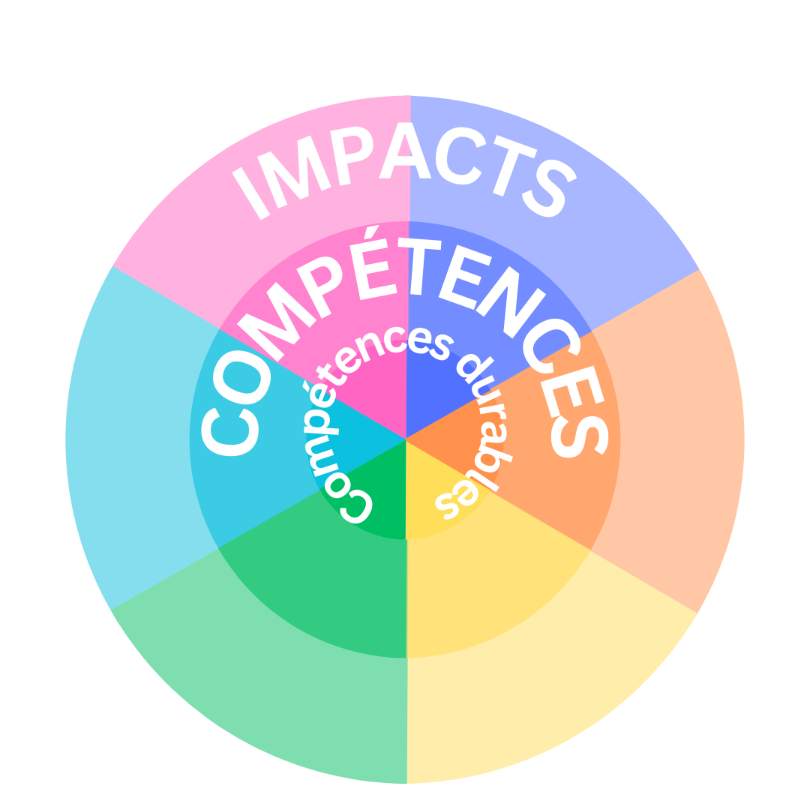
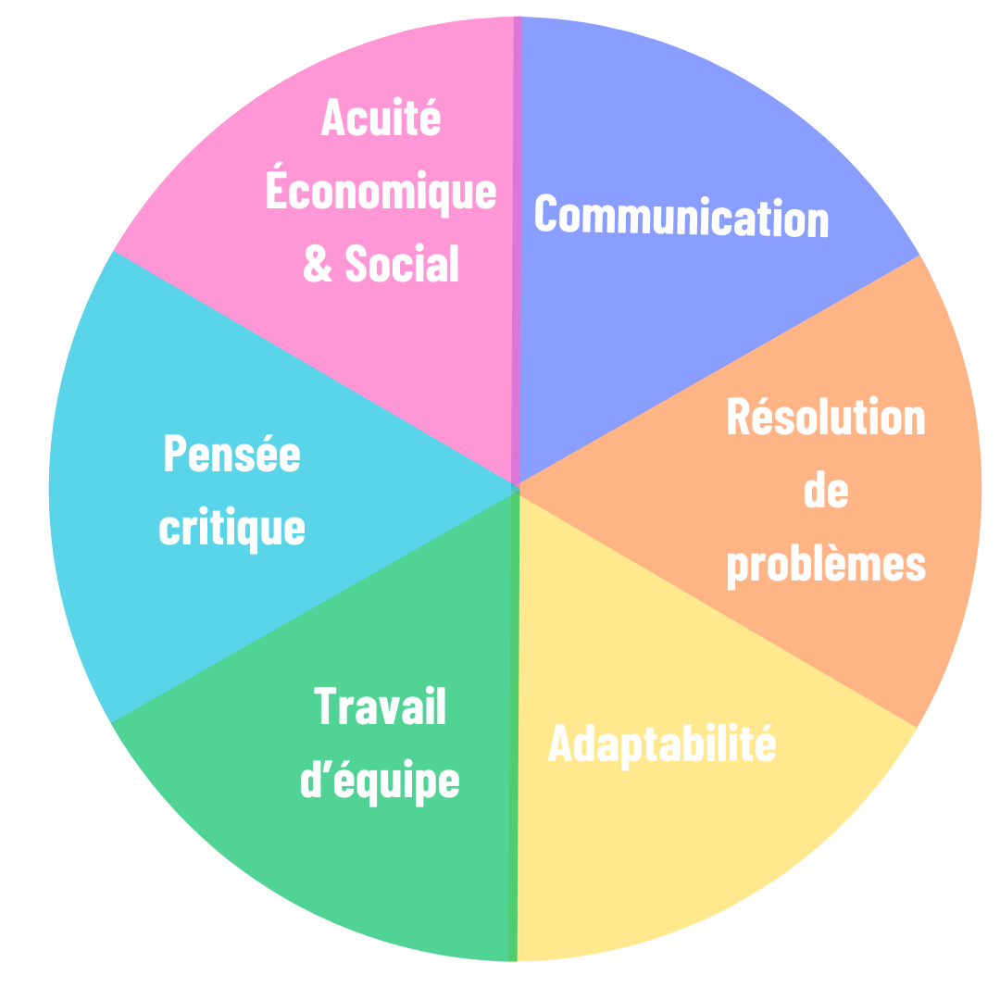
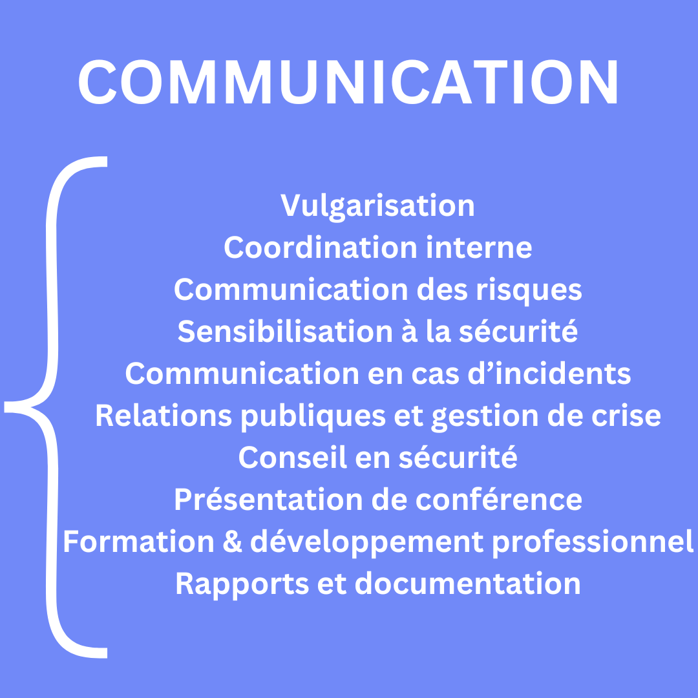
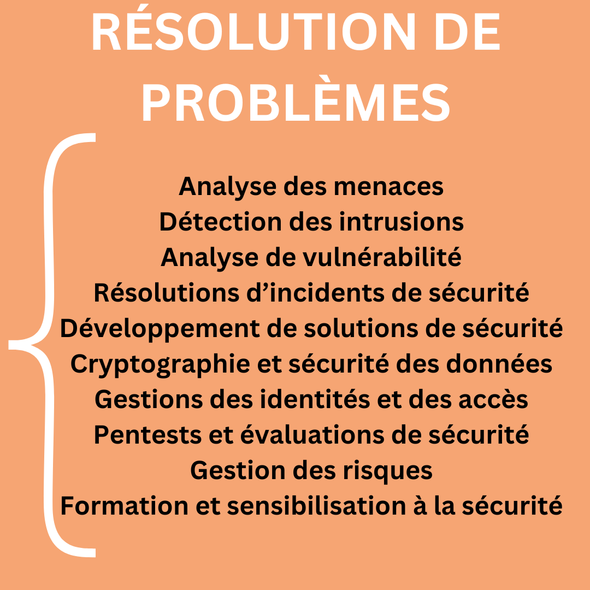
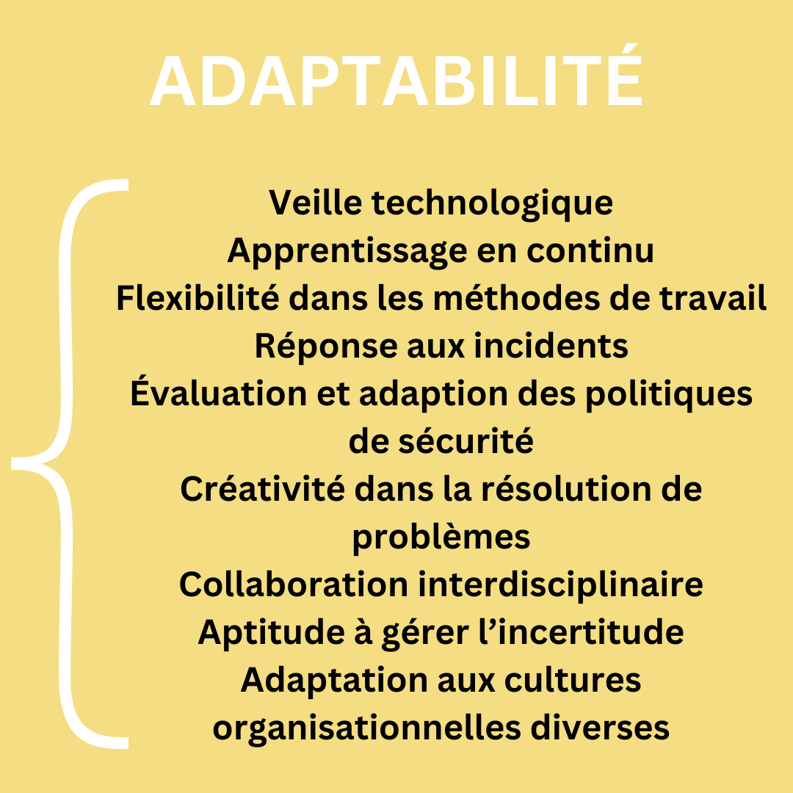
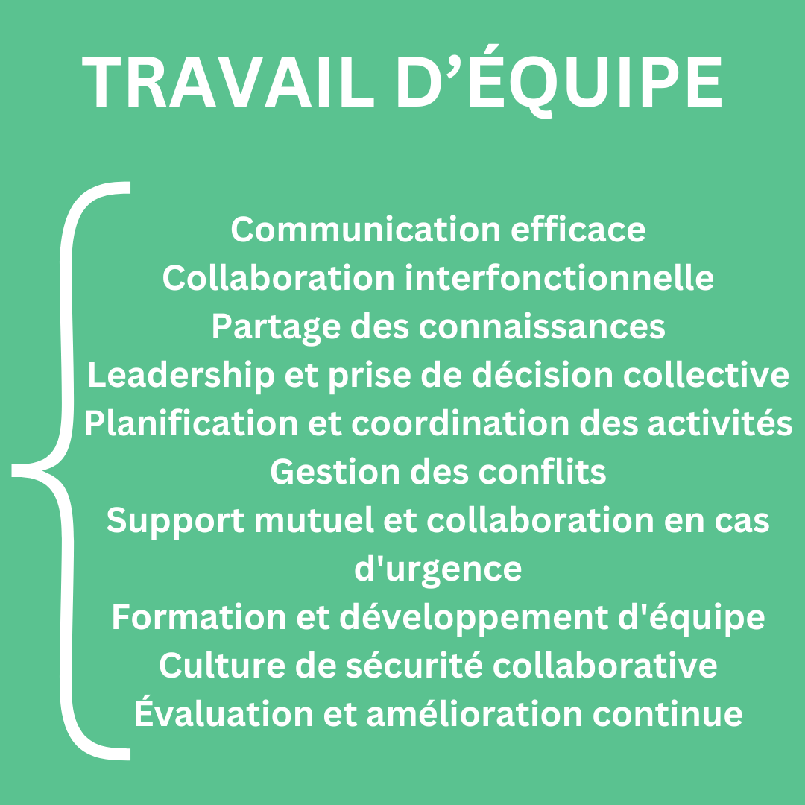
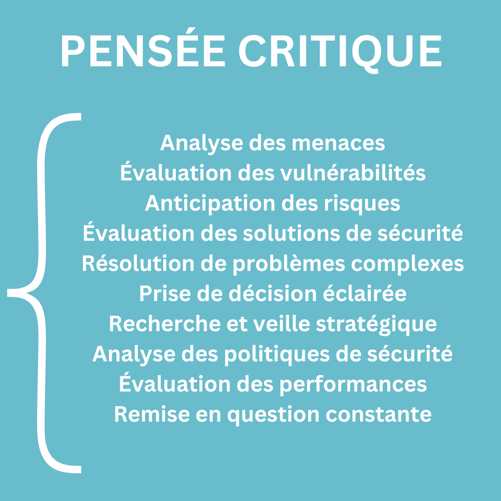
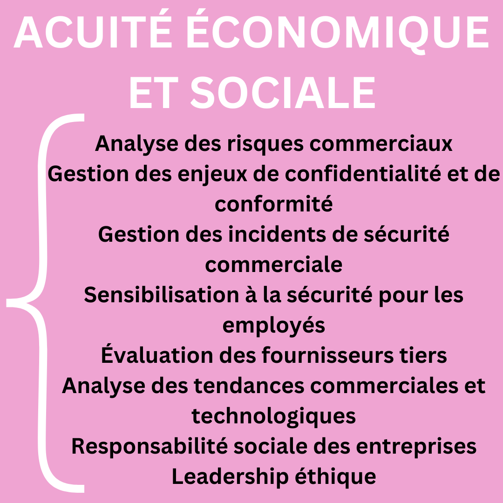
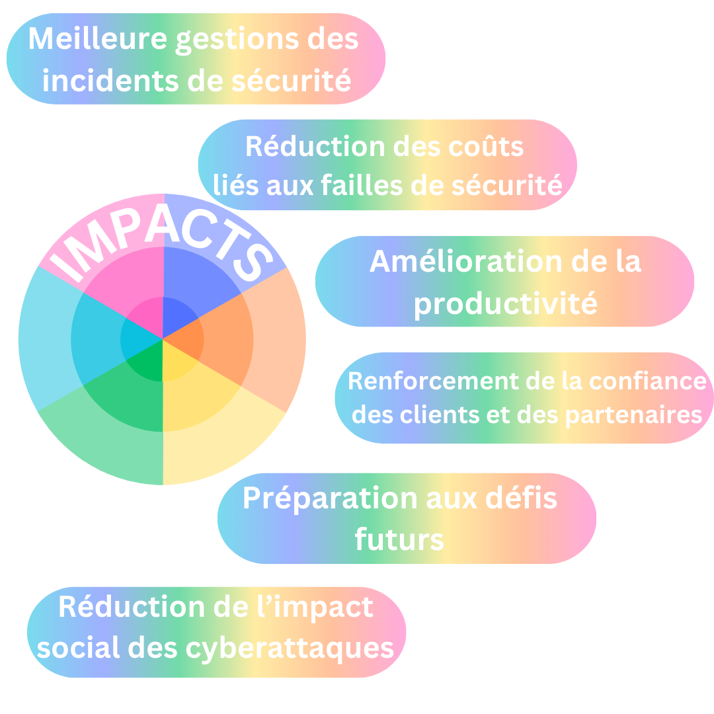

# Roue des compétences durables / Durable skills Wheel

> Ce document est en licence Creative Commons, n'hésitez pas à contribuer.

## Credits

- [Gabrielle Botbol](https://www.linkedin.com/in/gabriellebotbol/) - Co Founder & CEO @ CS by GB / Cybersecurity Consultant
- [Ayate Leshaf](https://www.linkedin.com/in/leshafayate/) - Co Founder & Learning Designer @ CS by GB

## Vue globale

- Ellipse centrale: méta compétences durables nécessaires en cybersécurité
- Seconde ellipse: compétences que l’on développe dans notre pratique et qui découlent des meta compétences.
- Dernière ellipse: impacts découlant de ces compétences pour influer vers un fonctionnement optimal des équipes et des pratiques.

## Méta Compétences

  

## Évaluation par méta compétences

  

  

  

  

  

  

## Impacts

  

## Résumé Global

  

## Ressources

- [ISACA’s State of Cybersecurity 2023 Report Pinpoints Pressing Workforce Gaps](https://www.isaca.org/resources/news-and-trends/newsletters/atisaca/2023/volume-40/isacas-state-of-cybersecurity-2023-report-reveals-pressing-workforce-gaps) 
- [Le secteur de la cybersécurité vu par les professionnels - ANSSI](https://cyber.gouv.fr/actualites/le-secteur-de-la-cybersecurite-vu-par-les-professionnels-lobservatoire-des-metiers) 
- [On competitions and Competence - Purdue University](https://www.cerias.purdue.edu/site/blog/post/on_competitions_and_competence/)
- [Comment s’organiser face à l’obsolescence des compétences ? - La boite à outils des RH](https://laboiteaoutilsdesrh.fr/comment-sorganiser-face-a-lobsolescence-des-competences/)
- [Why Engineers Should Study Philosophy - Marco Argenti](https://hbr.org/2024/04/why-engineers-should-study-philosophy)
- [Designing the Future: How Balanced Design Leadership Can Drive Desirable Futures - Quint, Eric  Corà, Tommaso , Fazio, Lucilla](https://zenodo.org/records/10446637)
- [La roue des émotions - harmonie intervention](https://harmonieintervention.com/familles-en-affaires-gestion-des-emotions/la-roue-des-emotions/)
- [Codex des biais cognitifs - penser critique](https://www.penser-critique.be/wp-content/uploads/2018/02/codex-biais-cognitifs.pdf)
- [LinkedIn Global Talent trend report 2019](https://news.linkedin.com/2019/January/linkedin-releases-2019-global-talent-trends-report)
- [Building workforce skills at scale to thrive during—and after—the COVID-19 crisis - McKinsey](https://www.mckinsey.com/capabilities/people-and-organizational-performance/our-insights/building-workforce-skills-at-scale-to-thrive-during-and-after-the-covid-19-crisis)
