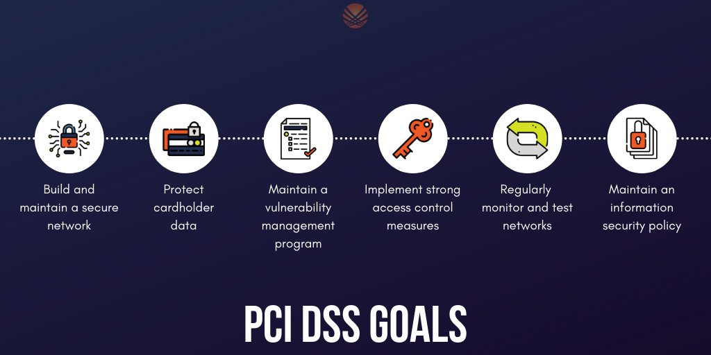

# Introduction

*This chapter (Ethical Hacking General Methodology) aims to present the stages in Ethical hacking. Each step will be presented individually.
This documentation has been made using **The Cyber Mentor PEH course**, **HTB Academy Penetration Testing job skill path** and **XSSrat Pentesting 101 ultimate guide from start to finish**.  
I recommend all these courses as they really cover very important topics of pentest and also offer the possibility to practice these skills.
Also they offer the possibility to get certified with an exam.  
[PNPT for TCM](https://certifications.tcm-sec.com/pnpt/), [HTB CPTS](https://academy.hackthebox.com/preview/certifications/htb-certified-penetration-testing-specialist/)* and [XSSrat for CNWPP](https://thexssrat.podia.com/cnwpp)

## Ethical hacking methodology

When working for any company, make sure that you have a copy of the signed scope of work/contract and a formal document listing the scope of testing (URLs, individual IP addresses, CIDR network ranges, wireless SSIDs, facilities for a physical assessment, or lists of email or phone numbers for social engineering engagements), also signed by the client.  
When in doubt, request additional approvals and documentation before beginning any testing. While performing testing, stay within the scope of testing.  
Do not stray from the scope if you notice other IP addresses or subdomains that look more interesting.  
Again, if in doubt, reach out. Perhaps the client forgot to add certain hosts to the scoping sheet. It does not hurt to reach out and ask if other hosts you notice should be included, but, again, make sure this is in writing and not just given on a phone call.  
We must work with the guiding principle of do no harm and strive to perform all testing activities in a careful and measured way. Just because we can run a certain tool, should we? Could a particular exploit PoC potentially crash one or more servers? If in doubt about anything during an assessment, run it by your manager and the client and gain explicit consent in writing before proceeding.

  

> *Source: [Practical Ethical Hacking - TCM Security](https://academy.tcm-sec.com/p/practical-ethical-hacking-the-complete-course)*

  

> *Source: [Hackethebox Academy](https://academy.hackthebox.com/login)*

## Precautionary Measure during Pentests

- [ ] Obtain written consent from the owner or authorized representative of the computer or network being tested
- [ ] Conduct the testing within the scope of the consent obtained only and respect any limitations specified
- [ ] Take measures to prevent causing damage to the systems or networks being tested
- [ ] Do not access, use or disclose personal data or any other information obtained during the testing without permission
- [ ] Do not intercept electronic communications without the consent of one of the parties to the communication
- [ ] Do not conduct testing on systems or networks that are covered by the Health Insurance Portability and Accountability Act (HIPAA) without proper authorization

In addition, we should also be aware that some countries have additional regulations that apply to specific cases, and we should either inform ourselves or ask our lawyer.

> *Source HackTheBox Academy*

## Common Legal Documents

  

> *Source: [Practical Ethical Hacking - TCM Security](https://academy.tcm-sec.com/p/practical-ethical-hacking-the-complete-course)*

  
> *Source HTB Academy*

- [Example of Master Service Agreement](https://www.rapid7.com/legal/msa/)

> **Note:** Our client may provide a separate scoping document listing in-scope IP addresses/ranges/URLs and any necessary credentials but this information should also be documented as an appendix in the RoE document.  
> **Important Note:**  
> These documents should be reviewed and adapted by a lawyer after they have been prepared.

## Pre-Engagement

The pre-engagement stage is where the main commitments, tasks, scope, limitations, and related agreements are documented in writing. During this stage, contractual documents are drawn up, and essential information is exchanged that is relevant for penetration testers and the client, depending on the type of assessment.
Arrengements are made for:

- Non-Disclosure Agreement
- Goals
- Scope
- Time Estimation
- Rules of Engagement

The entire pre-engagement process consists of three essential components:

1. Scoping questionnaire
2. Pre-engagement meeting
3. Kick-off meeting

Before any of these can be discussed in detail, a Non-Disclosure Agreement (NDA) must be signed by all parties. There are several types of NDAs:

|Type|Description|
|----|-----------|
|Unilateral NDA|This type of NDA obligates only one party to maintain confidentiality and allows the other party to share the information received with third parties.|
|Bilateral NDA|In this type, both parties are obligated to keep the resulting and acquired information confidential. This is the most common type of NDA that protects the work of penetration testers.|
|Multilateral NDA|Multilateral NDA is a commitment to confidentiality by more than two parties. If we conduct a penetration test for a cooperative network, all parties responsible and involved must sign this document.|

It is essential to know who in the company is permitted to contract us for a penetration test. Because we cannot accept such an order from everyone. Imagine, for example, that a company employee hires us with the pretext of checking the corporate network's security. However, after we finished the assessment, it turned out that this employee wanted to harm their own company and had no authorization to have the company tested. This would put us in a critical situation from a legal point of view.  

Non exhaustive list of company members who may be authorized to hire us for penetration testing:  

- Chief Executive Officer (CEO)
- Chief Technical Officer (CTO)
- Chief Information Security Officer (CISO)
- Chief Security Officer (CSO)
- Chief Risk Officer (CRO)
- Chief Information Officer (CIO)
- VP of Internal Audit
- Audit Manager
- VP or Director of IT/Information Security

### Scoping Questionnaire

After initial contact is made with the client, we typically send them a Scoping Questionnaire to better understand the services they are seeking. This scoping questionnaire should clearly explain our services and may typically ask them to choose one or more from the following list:  

- Internal Vulnerability Assessment
- External Vulnerability Assessment
- Internal Penetration Test
- External Penetration Test
- Wireless Security Assessment
- Application Security Assessment
- Physical Security Assessment
- Social Engineering Assessment
- Red Team Assessment
- Web Application Security Assessment

Under each of these, the questionnaire should allow the client to be more specific about the required assessment.
Aside from the assessment type, client name, address, and key personnel contact information, some other critical pieces of information include:

- How many expected live hosts?
- How many IPs/CIDR ranges in scope?
- How many Domains/Subdomains are in scope?
- How many wireless SSIDs in scope?
- How many web/mobile applications? If testing is authenticated, how many roles (standard user, admin, etc.)?
- For a phishing assessment, how many users will be targeted? Will the client provide a list, or we will be required to gather this list via OSINT?
- If the client is requesting a Physical Assessment, how many locations? If multiple sites are in-scope, are they geographically dispersed?
- What is the objective of the Red Team Assessment? Are any activities (such as phishing or physical security attacks) out of scope?
- Is a separate Active Directory Security Assessment desired?
- Will network testing be conducted from an anonymous user on the network or a standard domain user?
- Do we need to bypass Network Access Control (NAC)?

Finally, we will want to ask about information disclosure and evasiveness (if applicable to the assessment type):

- Is the Penetration Test black box (no information provided), grey box (only IP address/CIDR ranges/URLs provided), white box (detailed information provided)
- Would they like us to test from a non-evasive, hybrid-evasive (start quiet and gradually become "louder" to assess at what level the client's security personnel detect our activities), or fully evasive.

Based on the information we received from the scoping questionnaire, we create an overview and summarize all information in the Scoping Document.  

### Pre-Engagement Meeting

Once we have an initial idea of the client's project requirements, we can move on to the pre-engagement meeting. This meeting discusses all relevant and essential components with the customer before the penetration test, explaining them to our customer. The information we gather during this phase, along with the data collected from the scoping questionnaire, will serve as inputs to the Penetration Testing Proposal, also known as the Contract or Scope of Work (SoW).

#### Contract - Checklist

- [ ] NDA  
Non-Disclosure Agreement (NDA) refers to a secrecy contract between the client and the contractor regarding all written or verbal information concerning an order/project. The contractor agrees to treat all confidential information brought to its attention as strictly confidential, even after the order/project is completed. Furthermore, any exceptions to confidentiality, the transferability of rights and obligations, and contractual penalties shall be stipulated in the agreement. The NDA should be signed before the kick-off meeting or at the latest during the meeting before any information is discussed in detail.
- [ ] Goals  
Goals are milestones that must be achieved during the order/project. In this process, goal setting is started with the significant goals and continued with fine-grained and small ones.
- [ ] Scope  
The individual components to be tested are discussed and defined. These may include domains, IP ranges, individual hosts, specific accounts, security systems, etc. Our customers may expect us to find out one or the other point by ourselves. However, the legal basis for testing the individual components has the highest priority here.
- [ ] Penetration Testing Type  
When choosing the type of penetration test, we present the individual options and explain the advantages and disadvantages. Since we already know the goals and scope of our customers, we can and should also make a recommendation on what we advise and justify our recommendation accordingly. Which type is used in the end is the client's decision.
- [ ] Methodologies  
Examples: OSSTMM, OWASP, automated and manual unauthenticated analysis of the internal and external network components, vulnerability assessments of network components and web applications, vulnerability threat vectorization, verification and exploitation, and exploit development to facilitate evasion techniques.
- [ ] Penetration Testing Locations  
External: Remote (via secure VPN) and/or Internal: Internal or Remote (via secure VPN)
- [ ] Time Estimation  
For the time estimation, we need the start and the end date for the penetration test. This gives us a precise time window to perform the test and helps us plan our procedure. It is also vital to explicitly ask how time windows the individual attacks (Exploitation / Post-Exploitation / Lateral Movement) are to be carried out. These can be carried out during or outside regular working hours. When testing outside regular working hours, the focus is more on the security solutions and systems that should withstand our attacks.
- [ ] Third Parties  
For the third parties, it must be determined via which third-party providers our customer obtains services. These can be cloud providers, ISPs, and other hosting providers. Our client must obtain written consent from these providers describing that they agree and are aware that certain parts of their service will be subject to a simulated hacking attack. It is also highly advisable to require the contractor to forward the third-party permission sent to us so that we have actual confirmation that this permission has indeed been obtained.
- [ ] Evasive Testing  
Evasive testing is the test of evading and passing security traffic and security systems in the customer's infrastructure. We look for techniques that allow us to find out information about the internal components and attack them. It depends on whether our contractor wants us to use such techniques or not.
- [ ] Risks  
We must also inform our client about the risks involved in the tests and the possible consequences. Based on the risks and their potential severity, we can then set the limitations together and take certain precautions.
- [ ] Scope Limitations & Restrictions  
It is also essential to determine which servers, workstations, or other network components are essential for the client's proper functioning and its customers. We will have to avoid these and must not influence them any further, as this could lead to critical technical errors that could also affect our client's customers in production.
- [ ] Information Handling  
HIPAA, PCI, HITRUST, FISMA/NIST, etc.
- [ ] Contact Information  
For the contact information, we need to create a list of each person's name, title, job title, e-mail address, phone number, office phone number, and an escalation priority order.
- [ ] Lines of Communication  
It should also be documented which communication channels are used to exchange information between the customer and us. This may involve e-mail correspondence, telephone calls, or personal meetings.
- [ ] Reporting  
Apart from the report's structure, any customer-specific requirements the report should contain are also discussed. In addition, we clarify how the reporting is to take place and whether a presentation of the results is desired.
- [ ] Payment Terms  
Finally, prices and the terms of payment are explained.

Based on the Contract checklist and the input information shared in scoping, the Penetration Testing Proposal (Contract) and the associated Rules of Engagement (RoE) are created.

#### Rules of Engagement - Checklist

- [ ] Introduction  
Description of this document.
- [ ] Contractor  
Company name, contractor full name, job title.
- [ ] Penetration Testers  
Company name, pentesters full name.
- [ ] Contact Information  
Mailing addresses, e-mail addresses, and phone numbers of all client parties and penetration testers.
- [ ] Purpose  
Description of the purpose for the conducted penetration test.
- [ ] Goals  
Description of the goals that should be achieved with the penetration test.
- [ ] Scope  
All IPs, domain names, URLs, or CIDR ranges.
- [ ] Lines of Communication  
Online conferences or phone calls or face-to-face meetings, or via e-mail.
- [ ] Time Estimation  
Start and end dates.
- [ ] Time of the Day to Test  
Times of the day to test.
- [ ] Penetration Testing Type  
External/Internal Penetration Test/Vulnerability Assessments/Social Engineering.
- [ ] Penetration Testing Locations  
Description of how the connection to the client network is established.
- [ ] Methodologies  
OSSTMM, PTES, OWASP, and others.
- [ ] Objectives / Flags  
Users, specific files, specific information, and others.
- [ ] Evidence Handling  
Encryption, secure protocols
- [ ] System Backups  
Configuration files, databases, and others.
- [ ] Information Handling  
Strong data encryption
- [ ] Incident Handling and Reporting  
Cases for contact, pentest interruptions, type of reports
- [ ] Status Meetings  
Frequency of meetings, dates, times, included parties
- [ ] Reporting  
Type, target readers, focus
- [ ] Retesting  
Start and end dates
- [ ] Disclaimers and Limitation of Liability  
System damage, data loss
- [ ] Permission to Test  
Signed contract, contractors agreement

### Contractors Agreement

If the penetration test also includes physical testing, then an additional contractor's agreement is required. Since it is not only a virtual environment but also a physical intrusion, completely different laws apply here.  
It is also possible that many of the employees have not been informed about the test. Suppose we encounter employees with a very high-security awareness during the physical attack and social engineering attempts, and we get caught. In that case, the employees will, in most cases, contact the police. This additional contractor's agreement is our "get out of jail free card" in this case.

#### Contractors Agreement - Checklist for Physical Assessments

- [ ] Introduction
- [ ] Contractor
- [ ] Purpose
- [ ] Goal
- [ ] Penetration Testers
- [ ] Contact Information
- [ ] Physical Addresses
- [ ] Building Name
- [ ] Floors
- [ ] Physical Room Identifications
- [ ] Physical Components
- [ ] Timeline
- [ ] Notarization
- [ ] Permission to Test

> *Source Hackthebox Academy*

## Types of Pentests

|Type|Information Provided|
|----|--------------------|
|Blackbox|Minimal. Only the essential information, such as IP addresses and domains, is provided.|
|Greybox|Extended. In this case, we are provided with additional information, such as specific URLs, hostnames, subnets, and similar.|
|Whitebox|Maximum. Here everything is disclosed to us. This gives us an internal view of the entire structure, which allows us to prepare an attack using internal information. We may be given detailed configurations, admin credentials, web application source code, etc.|
|Red-Teaming|May include physical testing and social engineering, among other things. Can be combined with any of the above types.|
|Purple-Teaming|It can be combined with any of the above types. However, it focuses on working closely with the defenders.|

> *Source HTB Academy*

## Types of Testing Environmments

- Network
- Web App
- Mobile
- API
- Thick Clients
- IoT
- Cloud
- Source Code
- Physical Security
- Employees
- Hosts
- Server
- Security Policies
- Firewalls
- IDS/IPS

> It is important to note that these categories can often be mixed. All listed test components may be included depending on the type of test to be performed  
> *Source HTB Academy*

## Checklists

- You can use multiple checklists during your engagements
- [OWASP Checklist](https://github.com/0xRadi/OWASP-Web-Checklist)
- Along with OWASP checklist you can use [the testing guide](https://owasp.org/www-project-web-security-testing-guide/stable/)
- [NetbiosX Red Teaming & Pentesting checklists for various engagements](https://github.com/netbiosX/Checklists)

## Asset Management

When an organization of any kind, in any industry, and of any size needs to plan their cybersecurity strategy, they should start by creating an inventory of their data assets. If you want to protect something, you must first know what you are protecting! Once assets have been inventoried, then you can start the process of asset management. This is a key concept in defensive security.

### Asset Inventory

Asset inventory is a critical component of vulnerability management. An organization needs to understand what assets are in its network to provide the proper protection and set up appropriate defenses. The asset inventory should include information technology, operational technology, physical, software, mobile, and development assets. Organizations can utilize asset management tools to keep track of assets. The assets should have data classifications to ensure adequate security and access controls.

#### Application and System Inventory

An organization should create a thorough and complete inventory of data assets for proper asset management for defensive security. Data assets include:

- All data stored on-premises. HDDs and SSDs in endpoints (PCs and mobile devices), HDDs & SSDs in servers, external drives in the local network, optical media (DVDs, Blu-ray discs, CDs), flash media (USB sticks, SD cards). Legacy technology may include floppy disks, ZIP drives (a relic from the 1990s), and tape drives.

- All of the data storage that their cloud provider possesses. Amazon Web Services (AWS), Google Cloud Platform (GCP), and Microsoft Azure are some of the most popular cloud providers, but there are many more. Sometimes corporate networks are "multi-cloud," meaning they have more than one cloud provider. A company's cloud provider will provide tools that can be used to inventory all of the data stored by that particular cloud provider.

- All data stored within various Software-as-a-Service (SaaS) applications. This data is also "in the cloud" but might not all be within the scope of a corporate cloud provider account. These are often consumer services or the "business" version of those services. Think of online services such as Google Drive, Dropbox, Microsoft Teams, Apple iCloud, Adobe Creative Suite, Microsoft Office 365, Google Docs, and the list goes on.

- All of the applications a company needs to use to conduct their usual operation and business. Including applications that are deployed locally and applications that are deployed through the cloud or are otherwise Software-as-a-Service.

- All of a company's on-premises computer networking devices. These include but aren't limited to routers, firewalls, hubs, switches, dedicated intrusion detection and prevention systems (IDS/IPS), data loss prevention (DLP) systems, and so on.

All of these assets are very important. A threat actor or any other sort of risk to any of these assets can do significant damage to a company's information security and ability to operate day by day. An organization needs to take its time to assess everything and be careful not to miss a single data asset, or they won't be able to protect it.

Organizations frequently add or remove computers, data storage, cloud server capacity, or other data assets. Whenever data assets are added or removed, this must be thoroughly noted in the data asset inventory.

## Compliance Standards

### PCI DSS

The [Payment Card Industry Data Security Standard (PCI DSS)](https://www.pcisecuritystandards.org/about_us/) is a commonly known standard in information security that implements requirements for organizations that handle credit cards. As per government regulations, organizations that store, process, or transmit cardholder data must implement PCI DSS guidelines. This would include banks or online stores that handle their own payment solutions (e.g., Amazon).

PCI DSS requirements include internal and external scanning of assets. For example, any credit card data that is being processed or transmitted must be done in a Cardholder Data Environment (CDE). The CDE environment must be adequately segmented from normal assets. CDE environments are segmented off from an organization's regular environment to protect any cardholder data from being compromised during an attack and limit internal access to data.

> Image Source: [Adktechs](https://adktechs.com/wp-content/uploads/2019/06/PCI-DSS-Goals.png)

### Health Insurance Portability and Accountability Act (HIPAA)

HIPAA is the [Health Insurance Portability and Accountability Act](https://www.hipaa.com/), which is used to protect patients' data. HIPAA does not necessarily require vulnerability scans or assessments; however, a risk assessment and vulnerability identification are required to maintain HIPAA accreditation.

### Federal Information Security Management Act (FISMA)

[The Federal Information Security Management Act (FISMA)](https://www.cisa.gov/federal-information-security-modernization-act) is a set of standards and guidelines used to safeguard government operations and information. The act requires an organization to provide documentation and proof of a vulnerability management program to maintain information technology systems' proper availability, confidentiality, and integrity.

### ISO 27001

[ISO 27001](https://www.iso.org/isoiec-27001-information-security.html) is a standard used worldwide to manage information security. ISO 27001 requires organizations to perform quarterly external and internal scans.

Although compliance is essential, it should not drive a vulnerability management program. Vulnerability management should consider the uniqueness of an environment and the associated risk appetite to an organization.

The International Organization for Standardization (ISO) maintains technical standards for pretty much anything you can imagine. The ISO 27001 standard deals with information security. ISO 27001 compliance depends upon maintaining an effective Information Security Management System. To ensure compliance, organizations must perform penetration tests in a carefully designed way.

## Penetration Testing Standards

Penetration tests should not be performed without any rules or guidelines. There must always be a specifically defined scope for a pentest, and the owner of a network must have a signed legal contract with pentesters outlining what they're allowed to do and what they're not allowed to do. Pentesting should also be conducted in such a way that minimal harm is done to a company's computers and networks. Penetration testers should avoid making changes wherever possible (such as changing an account password) and limit the amount of data removed from a client's network. For example, instead of removing sensitive documents from a file share, a screenshot of the folder names should suffice to prove the risk.

In addition to scope and legalities, there are also various pentesting standards, depending on what kind of computer system is being assessed. Here are some of the more common standards you may use as a pentester.

### PTES

The [Penetration Testing Execution Standard (PTES)](http://www.pentest-standard.org/index.php/Main_Page) can be applied to all types of penetration tests. It outlines the phases of a penetration test and how they should be conducted. These are the sections in the PTES:

- Pre-engagement Interactions
- Intelligence Gathering
- Threat Modeling
- Vulnerability Analysis
- Exploitation
- Post Exploitation
- Reporting

### OSSTMM

OSSTMM is the Open Source Security Testing Methodology Manual, another set of guidelines pentesters can use to ensure they're doing their jobs properly. It can be used alongside other pentest standards.

[OSSTMM](https://www.isecom.org/OSSTMM.3.pdf) is divided into five different channels for five different areas of pentesting:

1. Human Security (human beings are subject to social engineering exploits)
2. Physical Security
3. Wireless Communications (including but not limited to technologies like WiFi and Bluetooth)
4. Telecommunications
5. Data Networks

### NIST

The NIST (National Institute of Standards and Technology) is well known for their [NIST Cybersecurity Framework](https://www.nist.gov/cyberframework), a system for designing incident response policies and procedures. NIST also has a Penetration Testing Framework. The phases of the NIST framework include:

- Planning
- Discovery
- Attack
- Reporting

### OWASP

OWASP stands for the [Open Web Application Security Project](https://owasp.org/). They're typically the go-to organization for defining testing standards and classifying risks to web applications.

OWASP maintains a few different standards and helpful guides for assessment various technologies:

- [Web Security Testing Guide (WSTG)](https://owasp.org/www-project-web-security-testing-guide/)
- [Mobile Security Testing Guide (MASTG)](https://owasp.org/www-project-mobile-app-security/)
- [Firmware Security Testing Methodology](https://github.com/scriptingxss/owasp-fstm)

## Resources

 Practical Ethical Hacking - TCM Security   

 Hackthebox Academy Penetration Tester Job Path   

- Here is a great methodology with plenty of resources  
 CTF Series : Vulnerable Machines   
 Capture the Flag Cheatsheet - Uppusaikiran   

- HTB Machines search on engine for practice on specific topics

 S4vitar Machine's Resolutions   
 Ippsec Rocks   
 A search engine to find machines by OS and Difficulty   

- This search engine will help you find HTB Academy modules according to specific goals you have for HTB platform. For instance if you want to work on dante prolab you will have suggestions of HTB Academy modules according to the topics of Dante:

 Academy x HTB Labs   
