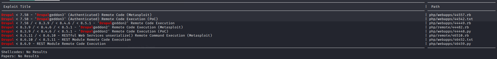
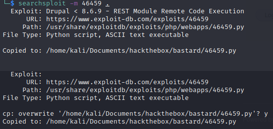

# Scanning and Enumeration

AKA Vulnerability Assessment.  
In this step we use the information found to identify potential weaknesses. We can use vulnerability scanners that will scan the target systems for known vulnerabilities and manual analysis where we try to look behind the scenes to discover where the potential vulnerabilities might lie.  
Time, patience, and personal commitment all play a significant role in information gathering. This is when many penetration testers tend to jump straight into exploiting a potential vulnerability. This often fails and can lead, among other things, to a significant loss of time. Before attempting to exploit anything, we should have completed thorough information gathering, keeping detailed notes along the way, focusing on things to hone in on once we get to the exploitation stage. Most assessments are time-based, so we don't want to waste time bouncing around, which could lead to us missing something critical. Organization and patience are vital while being as thorough as possible.  
In other terms, we analyze the results from our Information Gathering stage, looking for known vulnerabilities in the systems, applications, and various versions of each to discover possible attack vectors. Vulnerability assessment is the evaluation of potential vulnerabilities, both manually and through automated means. This is used to determine the threat level and the susceptibility of a company's network infrastructure to cyber-attacks.  
*Source Hackthebox Academy*

- The machine used in the lab here for the example is Kioptrix from vulnhub
- During this stage it is really important to take good notes. We have to write versions we find any information disclosed during this phase.

## Scanning with nmap

### Identify all the machines in a network

- `netdiscover -r 10.0.2.0/24`  
  
  

### Scan with Nmap

- `nmap -Pn -sV -sC -p- 10.0.2.80` my fav scan options (if I do not need to be stealthy)
- We can use the `-sS` flag it is suppose to be stealthy (it is much more picked up today than it used to be). It is called stealthy because it is going to send SYN and when it will receive the SYNACK it will send a RST instead of an ACK (it means that when the remote machine is going to say "I am open you can connect" it is going to send something like "I do not want to connect anymore")
- `nmap -T4 -p- -A 10.0.2.4`
- `nmap -sU -T4 -p 10.0.2.4` In case we want to scan udp it is better to make a scan similar to this one because udp takes a long time to scan

### Result

- Here is the result from our example
```
┌──(root💀kali)-[~]
└─# nmap -T4 -p- -A 10.0.2.4                                                                                                                                                                                                           130 ⨯
Starting Nmap 7.92 ( https://nmap.org ) at 2022-06-24 21:09 EDT
Nmap scan report for 10.0.2.4
Host is up (0.00081s latency).
Not shown: 65529 closed tcp ports (reset)
PORT      STATE SERVICE     VERSION
22/tcp    open  ssh         OpenSSH 2.9p2 (protocol 1.99)
|_sshv1: Server supports SSHv1
| ssh-hostkey: 
|   1024 b8:74:6c:db:fd:8b:e6:66:e9:2a:2b:df:5e:6f:64:86 (RSA1)
|   1024 8f:8e:5b:81:ed:21:ab:c1:80:e1:57:a3:3c:85:c4:71 (DSA)
|_  1024 ed:4e:a9:4a:06:14:ff:15:14:ce:da:3a:80:db:e2:81 (RSA)
80/tcp    open  http        Apache httpd 1.3.20 ((Unix)  (Red-Hat/Linux) mod_ssl/2.8.4 OpenSSL/0.9.6b)
|_http-server-header: Apache/1.3.20 (Unix)  (Red-Hat/Linux) mod_ssl/2.8.4 OpenSSL/0.9.6b
|_http-title: Test Page for the Apache Web Server on Red Hat Linux
| http-methods: 
|_  Potentially risky methods: TRACE
111/tcp   open  rpcbind     2 (RPC #100000)
| rpcinfo: 
|   program version    port/proto  service
|   100000  2            111/tcp   rpcbind
|   100000  2            111/udp   rpcbind
|   100024  1          32768/tcp   status
|_  100024  1          32768/udp   status
139/tcp   open  netbios-ssn Samba smbd (workgroup: SKMYGROUP)
443/tcp   open  ssl/https   Apache/1.3.20 (Unix)  (Red-Hat/Linux) mod_ssl/2.8.4 OpenSSL/0.9.6b
| ssl-cert: Subject: commonName=localhost.localdomain/organizationName=SomeOrganization/stateOrProvinceName=SomeState/countryName=--
| Not valid before: 2009-09-26T09:32:06
|_Not valid after:  2010-09-26T09:32:06
|_http-server-header: Apache/1.3.20 (Unix)  (Red-Hat/Linux) mod_ssl/2.8.4 OpenSSL/0.9.6b
|_ssl-date: 2022-06-25T05:10:01+00:00; +3h59m59s from scanner time.
| sslv2: 
|   SSLv2 supported
|   ciphers: 
|     SSL2_RC2_128_CBC_WITH_MD5
|     SSL2_RC4_64_WITH_MD5
|     SSL2_DES_64_CBC_WITH_MD5
|     SSL2_DES_192_EDE3_CBC_WITH_MD5
|     SSL2_RC2_128_CBC_EXPORT40_WITH_MD5
|     SSL2_RC4_128_EXPORT40_WITH_MD5
|_    SSL2_RC4_128_WITH_MD5
|_http-title: 400 Bad Request
32768/tcp open  status      1 (RPC #100024)
MAC Address: 08:00:27:4B:3D:CA (Oracle VirtualBox virtual NIC)
Device type: general purpose
Running: Linux 2.4.X
OS CPE: cpe:/o:linux:linux_kernel:2.4
OS details: Linux 2.4.9 - 2.4.18 (likely embedded)
Network Distance: 1 hop

Host script results:
|_clock-skew: 3h59m58s
|_smb2-time: Protocol negotiation failed (SMB2)
|_nbstat: NetBIOS name: KIOPTRIX, NetBIOS user: <unknown>, NetBIOS MAC: <unknown> (unknown)

TRACEROUTE
HOP RTT     ADDRESS
1   0.81 ms 10.0.2.4

OS and Service detection performed. Please report any incorrect results at https://nmap.org/submit/ .
Nmap done: 1 IP address (1 host up) scanned in 22.74 seconds
```

## Enumeration

Next step is to enumerate the services and protocols that showed up in our nmap scan.  
It is really important to take detailed not during this process.  
For more info about this checkout [the networking chapter of my pentips](https://csbygb.gitbook.io/pentips/networking/).  
You will find steps for multiple protocols and services.

## Research 

- After this enumeration we can look up things we wrote down in our notes (vulnerable versions, vulnerable services, misconfigurations,...).

### Search Engines

- Usually we can try to google `technology version exploit` for example `mod_ssl 2.8.4 exploit` If anything shows up we can add it in our notes along with link to exploits to try them out later

### searchsploit

- On kali we can use searchsploit `searchsploit technology partial-version` for example `searchsploit Samba 2` or `searchsploit Samba`
- Example `searchsploit drupal 7.54` You will then get a list of exploits or Metasploit modules  

  

- To download an exploit you then just need to do `searchsploit -m 46459 .` with:
  - `46459` name of the exploit (here we took the last one from the screen above)
  - `.` the path to the folder you want to copy it to  



## Vulnerability Sanning with Nessus

- Get it [here](https://www.tenable.com/downloads/nessus?loginAttempted=true)
- `dpkg -i Nessus-10.2.0-ubuntu1110_amd64.deb` install it
- `/bin/systemctl start nessusd.service` start the service
- Then we go to https://127.0.0.1:8834/ to finish the install and configure it
- If you are in the login page you can find out which username is installed with `/opt/nessus/sbin/nessuscli lsuser`
- You can then change your password with `/opt/nessus/sbin/nessuscli chpasswd username`
- If you are in the setup it is going to ask which version, you need to choose essentials (this version is free and will allow you to scan only private IP address) and then you will be able to register a user.
- Here is and example of scan result (we ordered the vuln by severity by choosing disable groups in the settings wheel) 
 
- We can then check the vulns out and see if we can exploit them.

## Default Credentials

- If you stumble accross a login platform, first thing to try would be default creds.  
Here are some useful links for this
- [Default Creds CheatSheet - Ihebski](https://github.com/ihebski/DefaultCreds-cheat-sheet/blob/main/DefaultCreds-Cheat-Sheet.csv)
- [Passwords - CIRT](https://cirt.net/passwords)
- [Default Creds - Seclists](https://github.com/danielmiessler/SecLists/tree/master/Passwords/Default-Credentials)
- [Data Recovery](https://datarecovery.com/rd/default-passwords/)

## Weak Credentials

- [Passwords - Seclists](https://github.com/danielmiessler/SecLists/tree/master/Passwords)
- [Wikipedia Most Common Password](https://en.wikipedia.org/wiki/List_of_the_most_common_passwords)

## Possible paths after this step

|Path | Description |
|-----|-------------|
|Exploitation |The first we can jump into is the Exploitation stage. This happens when we do not yet have access to a system or application. Of course, this assumes that we have already identified at least one gap and prepared everything necessary to attempt to exploit it.|
|Post-Exploitation| The second way leads to the Post-Exploitation stage, where we escalate privileges on the target system. This assumes that we are already on the target system and can interact with it.|
|Lateral Movement|Our third option is the Lateral Movement stage, where we move from the already exploited system through the network and attack other systems. Again, this assumes that we are already on a target system and can interact with it. However, privilege escalation is not strictly necessary because interacting with the system already allows us to move further in the network under certain circumstances. Other times we will need to escalate privileges before moving laterally. Every assessment is different.|
|Information Gathering| The last option is returning to the Information Gathering stage when we do not have enough information on hand. Here we can dig deeper to find more information that will give us a more accurate view.|

Source: Hackthebox Academy

## Resources

 Hackthebox Academy Penetration Tester Job Path   

### General resources about enumeration

 My pentesting methodology (Enumeration) 
