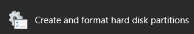
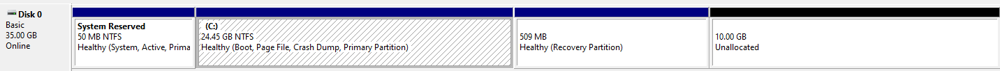

# General tips on labs and vm

## How to enlarge a win VM

I had to enlarge a win VM because I made some bad calculation when I created it...  

### Virtualbox

1. Switch off the VM (do not save the state, properly switch it off)
2. In virtualbox go to file > Virtual Media Manager
3. Select a virtual hard disk in the list and use the “Size” slider at the bottom of the window to change its size. Click “Apply” when you’re done.

### Extend your C:\ partition

1. Start your windows VM
2. Search for disk management in the start menu and click on this  
     
3. If possible extend the C partition

### Recovery partition in the way of the extention

***If you can not extend it probably means that the recovery partition is in the way of the extention, no worries!***
- If your disk management looks like this it means your recovery partition is blocking the extension of the C Drive  
    
- You will need to delete the recovery partition so that you can extend C with the new space you added
- Search for diskpart in the start menu and launch it as admin

### diskpart

1. `list disk`
2. `select disk <number>` (choose the disk number for your C drive)
3. `list partition`
4. `select partition <number>` (choose the recovery partition)
5. `delete partition override`

### Extend your C

- Now if you co back to disk management, you should be able to extend the C:\ partition
- Do it and reboot :)

## Resources

- A helpful colleague :D, thanks Keven!
 How to enlarge VM - Howtogeek 
 How to delete recovery partition - superuser 
 How to delete recovery partition - tenforums 
