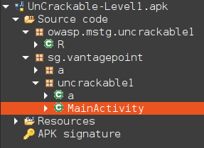
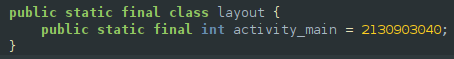
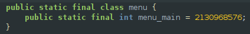
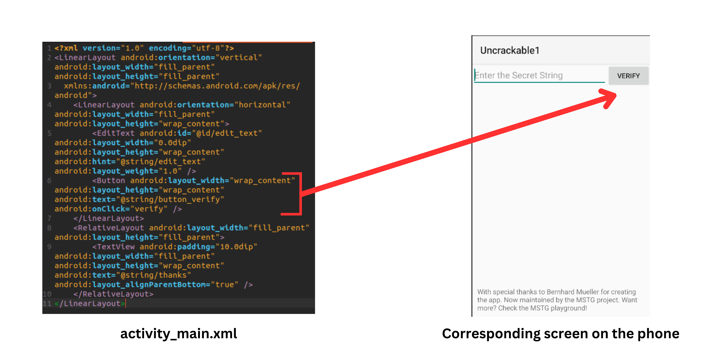
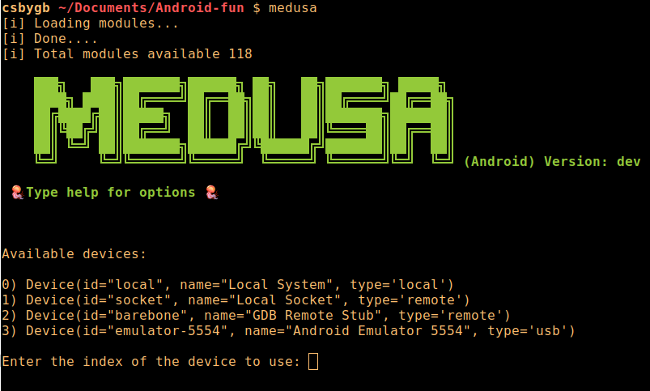
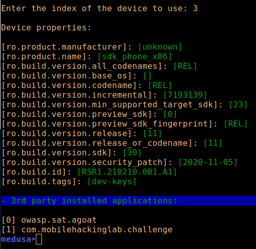

# Android Application Hacking

- **Check out my talk and its resources about Android application hacking [here](../talks/android-app.md)**

## Android OS and specificities

### Android Security Model

Two distinct layes to Android Security model.

#### 1. Implemented in the OS, and isolates installed app from one another

- Each app has a specific UID, dynamically assigned.
- An app can only access its UID files and no other (except if shared by another app or OS)
- Each App runs as a separate process under a sperate UID
- Prior to Android 4.3 = the only thing that was isolating apps = if root compromised entire system was compromised
- Starting from Android 4.3 = SELinux
- SELinux denies all process interaction + create policies to allow only expected applications

#### 2. Security of an App itself (made by the developers)

- The dev can selectevely expose certain app functions to other apps
- Configures App capabilities
- All apps are in the /data/data folder (except if modified in manifest by dev)
- The permissions declared in the manifest will be translated in permissions in the file system.

## Build an app and fundamentals on Android Applications

### Structure

An Android App comprises two main elements:

- The program's core functionality, written in Java code or Kotlin (official language today)
- The XML files that specify various configurations, including string values and the app's identity.

#### The manifest from a developer perspective

- [Official Android Documentation](https://developer.android.com/guide/topics/manifest/manifest-intro)
- When an attribute starts with a "." = relative to package name so if package name is `com.example.myapp` an element attribute with `.something` will be `com.example.myapp.something`
- `minSdkVersion` default value of 1 (app can run on any Android version, not ideal in a security point of view)
- `targetSdkVersion` the version of Android the app has been tested on and is compatible with. (default will be the value of minSdkVersion)
- `maxSdkVersion` usually not set because it will prevent the app from being installed on latest Android device.

### Intents

- [Official Android documentation on Intent](https://developer.android.com/reference/android/content/Intent)

An Intent is a messaging object that is used to communicate between components in an Android app, such as activities, services, and broadcast receivers.

Intents can be used to start new activities, pass data between activities or services, and broadcast events to other components in the system. They can also be used to start external activities or services provided by other apps, and to receive broadcasts from the system or other apps.

An Intent is essentially a way for an app to request an action from the Android system or other apps, or to respond to actions that are requested by other apps or the system. When an Intent is received, the component that handles it can extract any data that is passed with the Intent and use it to perform a specific action or provide a specific service to the user.

#### Implicit Intents

An Implicit Intent is a type of Intent in Android that does not explicitly specify the target component (i.e., the activity, service or broadcast receiver) to which the intent is intended to be delivered.

Instead, it declares an action to be performed, and optionally, data to be passed. The Android system then searches for all components that have registered to handle that specific action and data, and displays a list of appropriate apps that can handle the intent, allowing the user to choose which app to use.

For example, if you want to open a PDF file in your app, you can create an implicit intent that declares the "ACTION_VIEW" action and specifies the "application/pdf" data type. When the user selects a PDF file in a file manager app, the Android system will search for all components that can handle the "ACTION_VIEW" action and "application/pdf" data type. If your app has registered to handle this type of intent, it will be listed as an option for the user to select.

Implicit intents can be used to start activities, services, or broadcast receivers in other apps or the system, as well as to share data between apps. They are a powerful way to provide seamless integration between different apps and services in the Android ecosystem.

It is a string that will look like this `ACTION_ACTION-TO-PERFORM` (for example `VIEW` or `SEND`). To specify an intent's action we use the setAction() method or the Intent Constructor.

To specify an Intent's action in Android, you need to call the `setAction()` method on the Intent object and pass in a string that represents the action you want to perform. The action string specifies what type of action you want to perform, such as viewing a webpage or sending an email.

For example, to create an Intent that will open a webpage in the default web browser, you would create a new Intent object and call the `setAction()` method with the `ACTION_VIEW` constant from the `Intent` class, like this:

```java
Intent intent = new Intent(Intent.ACTION_VIEW);
```

This sets the action of the Intent to `ACTION_VIEW`, which tells the Android system that you want to view something. You can then add additional information to the intent, such as the URL of the webpage you want to open, using methods like `setData()` or `putExtra()`.

Other common actions that you can specify in an Intent include `ACTION_SEND` for sharing data, `ACTION_EDIT` for editing data, and `ACTION_DIAL` for dialing a phone number.

> :warning: Using implicit intents can potentially introduce some security risks in an Android app. When you use an implicit intent, you are not specifying the exact component that should receive the intent. Instead, the Android system searches for all components that can handle the intent's action and data type and presents the user with a list of possible options to choose from.  
> This means that it is possible for a malicious app to register itself as a handler for a specific action and data type, and intercept the intent before it is delivered to the intended recipient. This could potentially allow the malicious app to access sensitive data or perform other unwanted actions.

#### Extra

An "extra" is a key-value pair that can be included in an Intent object to pass additional data between different components in an app. Extras are used to provide more detailed information about the action that the Intent is requesting, or to provide additional data that the receiving component needs in order to complete its task.

For example, if you are creating an Intent to launch a new activity and you want to pass some data to the new activity, you can use the putExtra() method to add an extra to the Intent. The extra can be any type of data that can be serialized, such as a string, integer, or boolean value.

Here's an example of how to add an extra to an Intent:

```java
Intent intent = new Intent(this, MyActivity.class);
intent.putExtra("EXTRA_KEY", "extra value");
```

In this example, the `putExtra()` method is used to add a string extra to the Intent with the key "EXTRA_KEY" and the value "extra value". The receiving component can then extract the extra data from the Intent by calling the appropriate method, such as `getStringExtra()`.

#### Intent Filter

An [Intent Filter](https://developer.android.com/guide/components/intents-filters) is an element that you can define to declare the types of intents that your app can handle.  
It specifies the combination of action, data, and category values that an intent must have in order for the Android system to launch an activity, service, or broadcast receiver in your app.  
When an implicit intent is fired, the Android system searches for all the activities, services or broadcast receivers that have registered their intent filters for the specific action, data, and category in the intent.   It then displays a list of the appropriate apps that can handle the intent, and allows the user to choose which app to use.

- Here is an example

```xml
<intent-filter>
    <action android:name="android.intent.action.VIEW" />
    <category android:name="android.intent.category.DEFAULT" />
    <category android:name="android.intent.category.BROWSABLE" />
    <data android:scheme="http" />
    <data android:scheme="https" />
</intent-filter>
```

Suppose that the user clicks on a link to `https://www.example.com/some-page` in a web browser on their Android device. The web browser will send an ACTION_VIEW intent to the Android system with the URL of the clicked link as data. The Android system will look for any installed apps that can handle the ACTION_VIEW intent and have an intent-filter that matches the data in the intent.

In this case, the MyActivity class has an intent-filter that matches the ACTION_VIEW intent with data that has an https scheme. Therefore, the Android system will launch the MyActivity class and pass the ACTION_VIEW intent to it. The MyActivity class can then extract the URL data from the intent and display the appropriate content to the user.

#### Priority

The priority attribute is an optional attribute that can be used in the `<intent-filter>` element of an Android manifest file to specify the priority of an activity or service component relative to other components that can handle the same type of Intent. The priority is used by the Android system to determine which component should receive the Intent if there are multiple components that are capable of handling it.

The priority attribute is specified as an integer value between -1000 and 1000, with higher values indicating a higher priority. The default priority is set to 0 if the attribute is not specified.

For example, if you have two activities that can handle the same type of Intent, but you want one of the activities to be given priority over the other, you can specify a higher priority value for that activity using the `android:priority` attribute. Here's an example of how to set the priority of an activity:

```xml
<activity
    android:name=".MainActivity"
    android:priority="100">
    <intent-filter>
        <action android:name="android.intent.action.MAIN" />

        <category android:name="android.intent.category.LAUNCHER" />
    </intent-filter>
</activity>
```

In this example, the `android:priority` attribute is set to 100 for the MainActivity component, which indicates that it has a higher priority than other components that can handle the same type of Intent. This means that if there are multiple components that can handle the Intent, the Android system will give preference to the MainActivity component.

##### SYSTEM_HIGH_PRIORITY

`SYSTEM_HIGH_PRIORITY` is a special priority constant that can be used with the `android:priority` attribute in the `<intent-filter>` element of an Android manifest file. This priority is reserved for system-level components that require the highest level of priority for handling certain types of Intents.

Components that have a priority set to `SYSTEM_HIGH_PRIORITY` are given priority over all other components, including those with a priority of `HIGH_PRIORITY` or `DEFAULT_PRIORITY`. This means that if there are multiple components that can handle the same type of Intent, the component with the `SYSTEM_HIGH_PRIORITY` priority will always be chosen.

This priority is typically reserved for system-level components that are critical for the functioning of the Android system, such as device administrators, accessibility services, and other system-level services. Using this priority for non-system-level components is discouraged, as it can negatively impact the performance and stability of the device.  

If there is a conflict the user will have to choose the application through a popup window.

> [Here](https://seclists.org/fulldisclosure/2013/Oct/277) is an interesting vulnerability related to this. Using the SYSTEM_HIGH_PRIORITY it was possible "to impersonate the Google Play billing service and circumvent the signature verification".

#### Explicit Intents

An explicit intent is an Android Intent that specifies the exact component to be invoked by the Android system, such as an Activity, Service or BroadcastReceiver, to perform a specific action. With an explicit intent, you provide the full package name and class name of the component you want to launch.

For example, you can launch an activity with an explicit intent like this:

```java
Intent intent = new Intent(this, MyActivity.class);
startActivity(intent);
```

In this example, the Intent constructor takes two arguments: the current context (in this case, the activity that is launching the new activity), and the class of the activity to be launched.  
The main difference between explicit and implicit intents is that an explicit intent targets a specific component while an implicit intent is broadcast to all components that have registered to handle the specified action.  

#### Broadcast Intent

A broadcast intent is a type of Android Intent that is used to broadcast messages or events to multiple components within the Android system, such as activities, services, and broadcast receivers. Broadcast intents are a mechanism for inter-component communication that allows one component to send a message or event to multiple other components at once, without knowing the specific components that will receive the message.

Broadcast intents can be sent by both system-level components and user-level applications, and can be used for a wide variety of purposes, such as notifying other components of events, triggering system-level actions, and passing data between components.

There are two types of broadcast intents in Android:

- Normal broadcasts: These are asynchronous broadcasts that are delivered to all registered receivers in an unspecified order, regardless of their priority or timing. Normal broadcasts are usually used for events that do not require immediate action, such as notifications or updates.

- Ordered broadcasts: These are synchronous broadcasts that are delivered to all registered receivers in a specific order, based on their priority and the order in which they were registered. Ordered broadcasts are usually used for events that require a specific sequence of actions, such as controlling the volume or brightness of the device.

Overall, broadcast intents are a powerful and flexible mechanism for inter-component communication in Android, and are widely used in both system-level and user-level applications.

- See [here](https://developer.android.com/reference/android/support/v4/content/LocalBroadcastManager) the sendBroadcast method from the LocalBroadCastManager class. We can use it for components of the same app. This method is different from the sendBroadcast method from the Context class.

> To secure broadcast intents we can use `Intent.setPackage`, `uses-permission`

#### Sticky broadcast

A sticky broadcast is a special type of broadcast in Android that stays "sticky" or persistent, even after the broadcast has been completed. When a sticky broadcast is sent, it is held in memory by the Android system, and any new receivers that register for that broadcast will immediately receive the last broadcast that was sent, even if it was sent before the receiver was registered.

Sticky broadcasts are useful in situations where an app wants to notify other components about a change in system state, such as when the battery level changes or the device is connected to a new network. By sending a sticky broadcast, an app can ensure that any newly registered receivers will immediately receive the last known state of the system, without having to wait for the next broadcast to be sent.

However, it is important to note that the use of sticky broadcasts should be avoided whenever possible, as they can be a security risk and can cause performance issues on the device. In fact, starting from Android 8.0 (API level 26), the use of sticky broadcasts is no longer allowed for most apps, except for a few system-level broadcasts. Instead, apps should use other mechanisms, such as foreground services or the JobScheduler API, to receive notifications about changes in system state.  
More info on this [here](https://developer.android.com/reference/android/content/Context)

> :warning: When auditing an app it is worth checking for the keyword "sticky" during the static analysis.

## Lab setup

- You can use a rooted Android device or an AVD (Android Virtual Device)
- [My talk here](../talks/android-app.md) for TDI covers the lab setup with an AVD

## Get the app

- Ask your customer to give it to you with SSL Pinning disabled. This is the best option...
- Google play (we can use apk pull and take it from an AVD or device you will need an account on Google)
- [apk Pure](https://apkpure.com)
- [apk mirror](https://www.apkmirror.com/)
- [apk monk](https://www.apkmonk.com/)

## Emulator

- [Emulator](https://developer.android.com/studio/run/emulator-commandline) is the command line tool that will allow you to manage Android virtual device. It gets installed when you install Android Studio.
- If you are like me and prefer to use command line over GUI you can use it
- If you do not know where the binary is you can run `find / -name emulator 2>/dev/null`  
- `./emulator -list-avds` will list the available VM
- `./emulator -avd vm-name` will launch a specific VM

## Device rooting

- Rooting a device often requires to exploit a vulnerability on a device. This vulnerability needs to be in a process with system level access.
- We could also use one exploit to gain access and another one for privilege escalation.
- One exploit is done, the su binary has to be specified in the user's PATH environment variable like `system/xbin`. It then needs to be configured with the proper permissions
- Finally we can use an app to interface with the su binary and process requests for root access.

> :warning: Attention: We have to be careful when rooting a device, because some apps used to root a device might be malicious, not properly coded or insecure.  
> :warning: This also means that any app on the device could request root access. This obviously exposes the device and the data on it.

## Custom ROMs

It is possible to replace the OS that comes with a device with custom firmware.  
It can be convenient to keep an older device longer, bypass software restrictions (OEM) or get latest Android code without having to wait for an update.
This requires to root the device to modify the bootloader so that it can load the custom ROM firmware.  
Sometimes it is even allowed by some manufacturers (Google Nexus for example). This is safer and easier with these devices so they are a good option for pentesters.

> Note Nexus devices do not come with carrier bloatware pre-installed.

- [OmniROM](https://omnirom.org/)
- [LineageOS](https://lineageos.org/)

## ADB

### Install apk

- Once the emulator is launched we can use adb with `adb shell`
- Install without adb shell:

```bash
adb install ../../../path/to/file/file.apk
```

- The application can then be found in the app list
- We can also drag and drop the apk in the emulator

### ADB commands

- `adb shell` -  Connect to device
- `adb install` - sideload apks
- `adb push` - PC to device
- `adb pull path/name.apk` - Device to PC
- `adb logcat` - commande line took that dumps a log of system messages
- `adb shell pm list packages` will give you a list of all installed package names
- `adb shell pm list packages -f 3` will give you a list of all 3rd party installed package names. Both list packages commands will also give you the path, so it will be convenient to pull it
- `adb uninstall <package-name>` uninstall a package
- Launch activities (they should be exported)

```bash
adb shell am start com.example.package/.className
adb shell am start "[data]" com.example.package/.className
adb shell am start -a "action" -c "category" com.example.package/.className
```

### Find the arch of your android Device or emulator

> This is useful to know which version of frida server you need for example.

- `adb shell getprop`
- To figure out what kind of device you have:

```bash
ro.product.cpu.abilist64 not empty = ARM64
ro.product.cpu.abilist32 contains x86 = x86
If none of these conditions match, you have an ARM device
```

- Check [this thread](https://android.stackexchange.com/questions/188725/determine-device-architecture-arm-arm64-x86-with-adb-getprop) on stack exchange for more details

- or `adb shell getprop ro.product.cpu.abi`

### ADB troubleshoot

- If like me you pulled your hair because of Android Dolphin emulator and could not find proxy settings, you can get back the former look of the emulator by changing this in the settings


- Thanks to Inliner on stakoverflow for this solution. You can find the thread [here](https://stackoverflow.com/questions/70972106/how-to-configure-proxy-in-emulators-in-new-versions-of-android-studio)

## Burp

### Getting burp cert and push it with adb

- Open Burp Suite go to the proxy tab. Then go to the Options tab click on "Import / export CA certificate"
- Select Certificate in DER format
- Push the certificate to your device `adb push path/to/my/cert.der /data/local/tmp/cert-der.crt`
- You can also drag and drop it if you use and emulator

### Configure Burp with Android Studio

 Configure Burp 

## Decompile code

- [Bytecodeviewer](https://github.com/Konloch/bytecode-viewer)
  - launch with `java -jar` and open apk
- `jadx-gui`
- [APKLab](https://marketplace.visualstudio.com/items?itemName=Surendrajat.apklab) (add on visual studio Code)

## MobSF

### Install Mobsf

```bash
git clone https://github.com/MobSF/Mobile-Security-Framework-MobSF.git
cd Mobile-Security-Framework-MobSF
./setup.sh
```

### Launch mobsf

```bash
sudo ./run.sh 127.0.0.1:4444
```

> MobSF will listen to 0.0.0.0:8000 if you run the script without arguments.

### Mobsf with Docker

- If you want you can use docker to get and use MobSF
- `docker pull opensecurity/mobile-security-framework-mobsf`
- `docker run -it -p 8000:8000 opensecurity/mobile-security-framework-mobsf`
- Got to `http://0.0.0.0:8000` to access the gui

> Note: You won't be able to use dynamic analysis.

### Official Documentation

- [Here is the official Documentation](https://mobsf.github.io/docs/#/)

### Mobsf nice features

- Very helpful for static analysis
- Will look into the source code and find secrets
- You can also search in the code for specific strings

## Checklists

On every pentest, it is always worth having a checklist. This will allow you to make sure that you do not forget anything.  
For Android and Mobile Application pentest in general, I can only recommend the MAS checklist made by OWASP.  

- Check it out [here](https://mas.owasp.org/MAS_checklist/)
- You can also use [MindAPI by David Sopas](https://dsopas.github.io/MindAPI/play/)

## Static Analysis

### Android manifest

- It is located in "resources".  
This file is where developers will describe the essential information of the application. As stated in the Android documentation for developers:
"Every application project must have an AndroidManifest.xml file (with this exact name) at the root of the project's source set. The manifest file describes your app's essential information to the Android build tools, the Android operating system and Google Play."  
[See Reference](https://developer.android.com/guide/topics/manifest/manifest-intro)  

It will be used to mention the application package name, the application components, the permissions and the hardware and software that the application needs.
Note that it is also useful to check which API we need to test the application by looking at the `minSDKVersion`.  
Since the purpose of permissions is to protect the privacy of the user, you can see here some permissions that should not be allowed, depending of course on the purpose of the application.  
See [here](https://developer.android.com/reference/android/Manifest.permission ) full list of permissions.  

When analyzing the manifest you can also determine how the application retrieves files.

> It is worth noting that during the development process developer might have multiple manifest files. They will need to merge them. See [here](https://developer.android.com/studio/build/manage-manifests#merge-manifests) how it is done

#### Allow backup

The allowBackup flag could allow an attacker to take the backup of the application data with adb. So it would be safer to set it to false, as mentioned in the owasp documentation if this attribute is not set, it is enabled by default.  
More details: [OWASP-MTG](https://github.com/OWASP/owasp-mstg/blob/8d67a609ecd095d1bb00aa6a3e211791af5642e8/Document/0x05d-Testing-Data-Storage.md#static-analysis-7)

#### Debuggable

This flag indicates if the application can be debugged. It must be set to false otherwise an attacker could use it to access the application data.
Be aware that sometimes your client will give you the developer version of the application, so this flag will be set to true.
What I usually do in this case is I set it as informative to remind the customer to make sure they change this when they commit the application to production.  
Here is what the flag looks like:  
`android:debuggable="true"`  
See [documentation](https://github.com/OWASP/owasp-mstg/blob/53ebd2ccc428623df7eaf2361d44b2e7e31c05b9/Document/0x05i-Testing-Code-Quality-and-Build-Settings.md#testing-whether-the-app-is-debuggable-mstg-code-2 ) OWASP MTG about this.  

#### Exportable activities

Activities are the screens of the applications. Depending on the application and the activity, some of them should not be exportable because it means that they could be accessible from outside the application. It means that you could execute it with abd without going through the main activity.  
Here is an example of code on the pivaa application with exportable activities:  

```xml
  <service android:name="com.htbridge.pivaa.handlers.VulnerableService" android:protectionLevel="dangerous" android:enabled="true" android:exported="true"/>
        <receiver android:name="com.htbridge.pivaa.handlers.VulnerableReceiver" android:protectionLevel="dangerous" android:enabled="true" android:exported="true">
            <intent-filter>
                <action android:name="service.vulnerable.vulnerableservice.LOG"/>
            </intent-filter>
        </receiver>
        <provider android:name="com.htbridge.pivaa.handlers.VulnerableContentProvider" android:protectionLevel="dangerous" android:enabled="true" android:exported="true" android:authorities="com.htbridge.pivaa" android:grantUriPermissions="true"/>
```

#### Activities

Activities are always worth checking.  
Sometimes you might see activities that takes command line arguments.

> For confidentiality reasons the examples here are anonymized

```java
// Example 1: Takes an argument
getIntent().putExtra("something", updateSomethingCommandLineArguments(getIntent().getStringExtra("something")));

// Example 2: If no argument is given the app will not launch
Bundle extras = getIntent().getExtras();
        if (extras == null) {
            finish();
        } else if (!extras.getString("open").equalsIgnoreCase("something")) {
            finish();
```

So it might be a good idea in the Activity files to look for the following strings: "extra", "extras" "intent"

##### Methodology to analyze an activity

- In the android manifest, find the activities.
- This is what it looks like in the [Android UnCrackable L1 Crackme](https://github.com/OWASP/owasp-mastg/raw/master/Crackmes/Android/Level_01/UnCrackable-Level1.apk) from OWASP MAS.

```xml
<activity android:label="@string/app_name" android:name="sg.vantagepoint.uncrackable1.MainActivity">
    <intent-filter>
        <action android:name="android.intent.action.MAIN"/>
        <category android:name="android.intent.category.LAUNCHER"/>
    </intent-filter>
</activity>
```

- Using these information you can check them with jadx-gui or apktool the activities  

  

- Sometimes in some application you will have a reference to the r.class this class contains the public constants used by application. This [thread on stackoverflow](https://stackoverflow.com/questions/6804053/understand-the-r-class-in-android) is really interesting to know more about this class.  

> Note that you do not need specifically to go through the activity to analyze the r.class. It can happen that there will be no reference to the r.class, but you can still check it anyway

- In this other example we have a reference to r.class in the activity:
`setContentView(2130968602);`
- What we can do is copy the number, and look for it in the r.class (we can CTRL+F once in the r.class)  


- It will highlight in the code as follows


- Now in the res/layout folder you decompiled with apktool, you can look for an xml file named `activity_access.xml`.
- It is worth checking if it has any interesing info. It is also going to help you understand how the app works. They are used for the view (layout) of an app.
- It is interesting to check if it has "onClick" actions for the button or any other references to functions.

- If we go back to our crackme example we do not have a reference in our file to the r.class, but if we check it anyway we can find this



- So we can check in `layout>activity_main.xml` in our decompiled files what it looks like.
- We can also find this  

- So we could analyze `menu>menu_main.xml`
- Here is an example of something that would be worth analysing of `layout>activity_main.xml`. We can see the xml code corresponding to the button and that this code is calling a function verify.



### General tips for static analysis

- Check Strings.xml
- Try to enumerate database
  - See [Firebase Enum](https://github.com/Sambal0x/firebaseEnum)
- Enumerate public cloud resources
  - See [Cloud Enum](https://github.com/initstring/cloud_enum)
- Lookup for: Secret keys, passwords, comments, URLs, IP, private keys, any sensitive information that should not be in the code.  
With Jadx-gui it is possible to use the global search to search for specific strings such as: API, API_KEY, password, key, ClientId, ClientSecret, id, AWS, Secret, username, firebase.io, http, https, SQL (or other SQL file extensions)  
See here how to use glbal search with jadx-gui:  
 Jadx - Global search   

- An alternative to jadx-gui which is even better in my opinion is if you used mobsf you will have folder `/uploads` and you can grep in it for interesting strings. Check out Alissa Knight's video below, she mentions it.

When you find a database you can then try to read it with sqlitebrowser to see what is in it.  
See [OWASP](https://github.com/HTBridge/pivaa#cleartext-sqlite-database) about this.  

- Interesting resources for static analysis on [Hacktricks](https://book.hacktricks.xyz/mobile-apps-pentesting/android-app-pentesting#static-analysis)

## Modify an Application

- For pentest, CTF and other purposes (like cert pinning bypass) we might need to modify the code of the application.
- However the only way to do so when we only have the apk provided is to decompile the code with apktool (or any other) modify the smali code to fit our purpose, recompile it and sign it.

### Decompile with apktool

- `apktool d app.apk` decompile the package app.apk (the d is for decode)

> To prevent the classes.dex file from being disassembled you can use `-s` flag

#### apktool.yml

This file will tell us the version of apktool, the name of the apk file, and if it uses a Framwork. We can also get the minimum and target sdk version.

> A framework is a set of pre-written software components, tools, and libraries that provide a structure for developers to build their app upon, allowing for faster and more efficient development.

The SharedLibrary section specifies the shared libraries that the app requires in order to function properly. This information can be useful during the recompiling process to ensure that the required shared libraries are included in the rebuilt APK file.

#### Original directory

This directory contains the original resources and manifest file of the app, before any modifications were made during the packaging process.

#### smali directory

The "smali" directory is a subdirectory of the decompiled APK directory generated by Apktool when decompiling an APK file. It contains the app's bytecode translated into the Smali language, which is a human-readable and editable form of the Dalvik bytecode used by Android.

The Smali language allows developers to inspect and modify the app's code at a low level, such as changing method calls or modifying the flow of the code. This can be useful for debugging or reverse engineering purposes, but it should be noted that modifying an app's code without proper authorization or legal permission may violate intellectual property laws or terms of service.

It contains the individual smali files for all of the decoded dex files organized in directories based on the Java package name.

#### Unknown directory

Apktool may generate an "unknown" directory when decompiling an APK file, which contains any resources or assets that Apktool was unable to identify or parse during the decompilation process.

This may occur if the APK uses custom or proprietary resources or obfuscation techniques, or if the APK was corrupted or modified in a way that Apktool cannot handle. The "unknown" directory may contain binary files or other resources that cannot be easily edited or analyzed without specialized tools or knowledge.

#### What is an .odex file

An ODEX file is a file format used by the Android operating system to store pre-optimized bytecode for an Android application. When an APK file is installed on an Android device, the Dalvik VM converts the app's bytecode into a format that can be executed by the device's processor. By creating an ODEX file during installation, the Dalvik VM can load the optimized bytecode directly, which can improve the app's startup time and performance.

An ODEX file has the same name as the APK file but with an additional .odex extension, and it is typically located in the /data/dalvik-cache directory on the device's internal storage.

If you have and odex file it means you won't have a classes.dex.

An odex will speed up the first boot of a rom.

### Understand smali

#### Registers

  

> *Source: [Wiki smali/baksmali](https://github.com/JesusFreke/smali/wiki/Registers)*

#### Types


> *Source: [Wiki smali/baksmali](https://github.com/JesusFreke/smali/wiki/TypesMethodsAndFields)*

#### Hello world

- Here is an example of an hello world in smali. You can find the original code [here](https://github.com/JesusFreke/smali/blob/master/examples/HelloWorld/HelloWorld.smali)

```smali
.class public LHelloWorld;

#Ye olde hello world application
#To assemble and run this on a phone or emulator:
#
#java -jar smali.jar a -o classes.dex HelloWorld.smali
#zip HelloWorld.zip classes.dex
#adb push HelloWorld.zip /data/local
#adb shell dalvikvm -cp /data/local/HelloWorld.zip HelloWorld
#
#if you get out of memory type errors when running smali.jar, try
#java -Xmx512m -jar smali.jar HelloWorld.smali
#instead

.super Ljava/lang/Object;

.method public static main([Ljava/lang/String;)V
    // This method has 2 registers
    .registers 2

    sget-object v0, Ljava/lang/System;->out:Ljava/io/PrintStream;

    const-string v1, "Hello World!"

    invoke-virtual {v0, v1}, Ljava/io/PrintStream;->println(Ljava/lang/String;)V

    return-void
.end method
```

- If you use arguments they have to be placed in the last parameters.

#### Smali tips to understand

- The `getString()` function might use a controlled user input so it is always worth checking.

#### Smali/Baksmali

- Dowload smali and baksmali [here](https://github.com/JesusFreke/smali/wiki)
- `java -jar baksmali.jar file.dex` disassemble a .dex file
- `java -jar smali.jar folder-with-smali-code/` generate dex file from smali code

#### Dex2jar

[Dex2jar](https://github.com/pxb1988/dex2jar) is an open source project to work with dex and class files.  
We can use dex2jar to convert dex or apk in jar. This way we can use java decompiler tools and we will get a more java looking view of the code.

- `dex2jar file.dex -o file.jar` convert dex to jar
- `dex2jar file.apk -o file.jar` convert apk to jar

### Recompile with apktool

- `apktool b app/ -o newapp.apk` recompile the folder `app/` and generate a new file `newapp.apk`

### Sign the application

In order to be installed we need to sign the application.  
We first need a key  

- `keytool -genkey -v -keystore my-release-key.keystore -alias alias_name -keyalg RSA -keysize 2048 -validity 10000`

Now we can sign it. We can use apksigner.

- `apksigner sign --ks path/to/my-release-key.keystore newapp.apk`

We could also use jarsigner

- `jarsigner -verbose -sigalg SHA1withRSA -digestalg SHA1 -keystore my-release-key.keystore my_application.apk alias_name`

> **Security notes about keys:**  
> If a key from an Android App is compromised, the developers will have to sign new versions with a different key (this is how Google Play Store identify the org who signs the app).  
> This could also allow an attacked to publish malicious apps which would be trusted because they were signed with a previously trusted key.  

### Signing modes

- Debug mode is for testing purposes (you can run apps directly connected via USB or emulators)
- Release mode is for production aka public release.

### APK Alignment

- `zipalign -v 4 unaligned.apk aligned.apk`
- [Zipalign on Android dev](https://developer.android.com/studio/command-line/zipalign)

> Improves RAM use when running the app.

## OEM Apps

OEM apps on Android are pre-installed apps that come with the device and are developed and installed by the original equipment manufacturer (OEM). They can also be shipped with the Android Open Source Project (ASOP) or by a cell phone provider if you purchase the phone from them.  
These apps are often included as part of the device's firmware and cannot be uninstalled by the user without rooting the device.

OEM apps may include core system apps such as the dialer, messaging app, or camera app, as well as branded or customized apps that are specific to the device or manufacturer. In some cases, OEM apps may include bloatware (OEM apps, trial software, or other third-party apps that are included on the device by default) or unwanted apps that take up storage space and cannot be easily removed.

They can usually be found in `/system/app` directory of the device.  
**It is common for many of them to run with systme (root level) permissions**

## Proguard

ProGuard is an open-source tool for code obfuscation, optimization, and shrinking for Java and Android applications. It is often used by developers to reduce the size of their app, remove unused code and resources, and make it more difficult for attackers to reverse engineer and analyze the app's code.

ProGuard can be integrated into the build process of an Android app and can be configured to perform various optimizations, such as removing unused code, renaming classes, methods, and fields to make the code harder to understand, and applying other code obfuscation techniques to protect the app from reverse engineering. ProGuard is typically used in conjunction with other tools, such as Android Studio or Gradle, to build and package the final APK file.

- [Proguard on developer Android documentation](https://developer.android.com/studio/build/shrink-code)

## Dynamic analysis

### General tips for dynamic analysis

- Are screens visible in screenshots or instances with sensitive data? Understand: can I take a picture of a screen with sensitive data and if I switch to another application after being on a screen with sensitive data can I go back via cached instances?
- All the usual OWASP Top 10 web vulns
- Dynamic analysis on [Hacktricks](https://book.hacktricks.xyz/mobile-apps-pentesting/android-app-pentesting#dynamic-analysis)
- Check if third party keyboard extensions are allowed and active keyboard cache on sensitive fields
sensitive. Some malware masquerades as Android keyboard extensions.
- Tapjacking PoC equivalent to Clickjacking can be done with Qark

### How to bypass certificate pinning

- [Here](https://httptoolkit.com/blog/frida-certificate-pinning/) is an article by Tim Perry on httptoolkit on how to bypass cert pinning with frida.
- If none of the universal script work, you might want to consider using apktool to decompile, modify the smali code and recompile it (see how to do so above).

#### Frida setup

- Take frida server from [here](https://github.com/frida/frida/releases)
- `unxz frida-server-version-android-x86.xz` to decompress the file
- Follow the instructions form the article previously mentioned above

```bash
# Copy the server to the device
adb push ./frida-server-$version-android-$arch /data/local/tmp/frida-server
#        ^Change this to match the name of the binary you just extracted

# Enable root access to the device
adb root

# Make the server binary executable
adb shell "chmod 755 /data/local/tmp/frida-server"

# Start the server on your device
adb shell "/data/local/tmp/frida-server &"
```

- I am on Ubuntu
- `pip3 install frida-tools` Install Frida
- `frida-ps -U` from your ubuntu
- In case you get an error like this `Failed to enumerate processes: unable to connect to remote frida-server: closed` it means the server is not running on the emulator. In this case try to launch it like this

```bash
user ~/Documents/hackthebox $ adb shell
root@generic_x86_64:/ # su
root@generic_x86_64:/ # /data/local/tmp/frida-server &
[1] 3806
```

- Then `frida-ps -U` should work and will list the running process on the target

#### Disable SSL pinning with Frida

- I am going to use Pinned (from the HTB challenge). If you do not have and HTB subscription you can try this on [this app](https://github.com/httptoolkit/android-ssl-pinning-demo) provided by Tim Perry from his article mentioned above.  
- First I launched Pinned and kept it on during the whole process
- When running `frida-ps -U` you should see the app you wish to transform in the list. Running this `frida-ps -D emulator-5554 -ai` will give you more details on the running app `-D <id>` will allow you to specify which plug in device you wish to see the app installed on and `-ai` will show the Identifier column. This works as well `frida-ps -U -ai`


- With the other command the output looks like this


- Take [this script](https://raw.githubusercontent.com/httptoolkit/frida-android-unpinning/main/frida-script.js) kindly provided by our new friend Tim `wget https://raw.githubusercontent.com/httptoolkit/frida-android-unpinning/main/frida-script.js`
- Then you just need to run `frida -D emulator-5554 -l ./frida-script.js -f com.example.pinned` or `frida -U -l ./frida-script.js -f com.example.pinned`
- Turn out the best way to run the app with cert pinning is with this command `frida -U -l ./frida-script.js Appname` It will avoid bugs.

> Note: Apparently the --no-pause is not necessary anymore see [here](https://github.com/frida/frida/issues/2277)


- Now we should be able to intercept the traffic and actually see it in Burp (frida server should still be running for this process)
- For Pinned for example I just had to click login in my screen (that I did not close)  
  
- And I got the flag from Burp  

- If this did not work, check out this [article](https://blog.nviso.eu/2020/11/19/proxying-android-app-traffic-common-issues-checklist/#check10)

#### Useful frida commands

- `frida-ls-devices` list plugged in devices
- `frida-ps -D <id> -ai` list installed apps on a specific device

### Intercept HTTPS traffic

- [Intercepting HTTPS Traffic from Apps on Android 7+ using Magisk & Burp](https://blog.nviso.eu/2017/12/22/intercepting-https-traffic-from-apps-on-android-7-using-magisk-burp/) this tutorial is great.
- [Here](https://topjohnwu.github.io/Magisk/install.html) is how to install Magisk

- If you want to modify just the network config using objection (and not injecting frida gadget). You can comment some code in objection. Comment the whole code of these 2 functions in objection in the file `/usr/local/lib/python3.10/dist-packages/objection/utils/patchers/android.py`

```python
def inject_load_library(self, target_class: str = None):
def add_gadget_to_apk(self, architecture: str, gadget_source: str, gadget_config: str):
```

- To do so you can add this `'''` on line 765 and line 840 (this will comment the whole block of the 2 functions. Be careful with indentation to avoid errors)

- You will also need to comment 203 and 204 in `/usr/local/lib/python3.10/dist-packages/objection/commands/mobile_packages.py` because the previous 2 functions are called in this file.

- Finally run `objection patchapk -N -s application.apk` and patch the apk

> Thanks to my colleague [Ash](https://twitter.com/ashiahanim_ay) for mentioning this to me.

- If you want to patch the apk, and inject frida gadget this command should work `objection patchapk -s application.apk`.  
If you want a practical example of this check out the writeup for the challenged Anchored [here](https://csbygb.gitbook.io/pentips/htb-tracks-writeups/htb-intro-to-android-exploitation-track#challenge-anchored).

#### Disable SSL pinning with objection

[This article](https://corsecure.blog/2023/09/07/patching-an-apk-with-objection/) from Corsecure explains it really. You can also use the related video [here](https://youtu.be/qaJBWcueCIA?si=UWSMLoYj3QXPBNxL)  
To get further with Objection, you can check out hacktricks [here](https://book.hacktricks.xyz/mobile-pentesting/android-app-pentesting/frida-tutorial/objection-tutorial).

Notes:

- With an emulator you need to use the architecture flag. Example: `objection patchapk --source app.apk --architecture x86`

### Debug frida or objection

- If you get the error `Unable to connect to the frida server: need Gadget to attach on jailed Android; its default location is: /home/user/.cache/frida/gadget-android-arm64.so`
- Get the gadget related to your to device and put it in the default location  

- If you get `Unable to connect to the frida server: command failed: 99`
- Instead of launching your app with `frida -U -l ./frida-script.js -f com.vendor.myapp` use `frida -U -l ./frida-script.js Appname`

- If frida freezes your vm. It seems to be [this issue](https://github.com/frida/frida/issues/2362)
- What worked for me was to take the latest frida-server version (16.3.3)

## Wireshark

- Turn your laptop as hotspot capture traffic
- Pull capture from a pfSense machine or something similar
- `adb shell tcpdump -s -s 0`
- HTTP traffic: `adb shell tcpdump -C -s -s 0 port 80`

## Medusa

- Launch it with `medusa`

  

Select your device (mine is 3)  

  

After the selection you get the properties of the device and thr 3rd party installed app.  

For more details check the wiki [here](https://github.com/Ch0pin/medusa/wiki)

## Objection

- [Here](https://github.com/sensepost/objection) is the repo
- Install: `pip3 install objection`

### Memory dump

- Find the app you want to dump the memory from with `frida-ps -Uai`
- Hook on it with explore `objection --gadget com.mobilehackinglab.challenge explore`
- Dump the memory `memory dump all memory.txt` (memory.txt is the dump file you will get)

## Fridump

If you encounter issues with objection for the memory dump, you can also use [fridump](https://github.com/Nightbringer21/fridump).

```bash
git clone https://github.com/Nightbringer21/fridump.git
cd fridump/
python3 fridump.py -U -s Strings
```

## Resources

### My writeups for Android related boxes and challenges

> *More coming soon*

- [Hackthebox Introduction to Android Exploitation track](https://csbygb.gitbook.io/pentips/htb-tracks-writeups/htb-intro-to-android-exploitation-track)
- [Hackthebox Box RouterSpace (Foothold with apk)](https://csbygb.gitbook.io/pentips/writeups/htb-routerspace)

### Resources Android App

- [Meet Android Studio](https://developer.android.com/studio/intro)
- [Build your first Android app](https://developer.android.com/training/basics/firstapp/index.html)

### Courses on Android pentest

- [eLearnSecurity Mobile App Pentesting notes by Joas Antonio Dos Santos](https://drive.google.com/file/d/1K_xnDKMhlV1aJqXsq4lXiCcliiGvs877/view)
- [My writeup of the HTB Introduction to Android Exploitation track](../writeups/HTB-Intro-to-android-Exploitation-Track.md)
- [Android Pentesting 101 - Pentestmag - Part 1](https://pentestmag.com/android-pentesting-101-part-1/)
- [Android Pentesting 101 - Pentestmag - Part 2](https://pentestmag.com/android-pentesting-101-part-2/)
- [Android Pentesting 101 - Pentestmag - Part 3](https://pentestmag.com/android-pentesting-101-part-3/)
- [Android Pentesting 101 — Part 1 by 302 found](https://infosecwriteups.com/android-pentesting-101-part-1-8e31b8cd8b2b)
- [Android Pentesting 101 — Part 2 by 302 found](https://infosecwriteups.com/android-pentesting-101-part-2-419facdf11c1)
- [Android Pentesting 101 — Part 3 by 302 found](https://infosecwriteups.com/android-pentesting-101-part-3-2bf846b05594)
- [Android Application Penetration Testing | Mobile Pentesting - Sabyasachi Paul - h0tPlug1n](https://youtu.be/Tujbk4ToVMI)
- [Android Application Pentesting - Mystikcon 2020](https://youtu.be/NrxTBcjAL8A)
- [Android Security Crash Course by CorSecure](https://youtube.com/playlist?list=PLH5GW4W70qp_B2eptq1Qo7KM2S66M77hi)
- [Mobile Hacking crash Course on Hackerone](https://www.hacker101.com/sessions/mobile_crash_course)
- [Nahamsec Beginner Bounty hunters Mobile Hacking](https://github.com/nahamsec/Resources-for-Beginner-Bug-Bounty-Hunters/blob/master/assets/mobile.md)
- [A notion site about mobile](https://start.me/p/OmxRqE/mobile)
- [Android Penetration Testing Courses - Galilei](https://medium.com/mobile-penetration-testing/android-penetration-testing-courses-4effa36ac5ed)
- [MOBISEC by Yanick Fratantonio](https://mobisec.reyammer.io/slides)

### Lab Setup

- [Android Pentesting Lab Step by step guide by Neha Taris](https://infosecwriteups.com/android-pentesting-lab-4a6fe1a1d2e0)
- [Set up an Android hacking lab for 0$ by Kurt Muhl](https://www.trustedsec.com/blog/set-up-an-android-hacking-lab-for-0/)

### References and reads

- [OWASP MSTG](https://github.com/OWASP/owasp-mstg/)
- [Android Hackerone disclosed reports and other resources](https://github.com/B3nac/Android-Reports-and-Resources)
- [HTB Intro to Mobile Peneration testing](https://www.hackthebox.com/blog/intro-to-mobile-pentesting)
- [HackTricks Android](https://book.hacktricks.xyz/mobile-apps-pentesting/android-checklist)
- [Zero to Hero - Mobile Application Testing - Android - Nilesh Sapariya](https://nileshsapariya.blogspot.com/2016/11/zero-to-hero-mobile-application-testing.html)
- [Mobile App Penetration Testing Cheat Sheet - sh4hin](https://github.com/sh4hin/MobileApp-Pentest-Cheatsheet)
- [Android Application Reversing 101 - evilsocket](https://www.evilsocket.net/2017/04/27/Android-Applications-Reversing-101/#.WQND0G3TTOM.reddit)
- [Corsecure blog](https://corsecure.blog/)

### Practice

#### Vulnerable Apps to practice on

- [Vulnerable Android App - thedarksource](https://thedarksource.com/vulnerable-android-apps/)
- [List of Intentionally vulnerable app - pentester.land](https://pentester.land/cheatsheets/2018/10/12/list-of-Intentionally-vulnerable-android-apps.html)
- [ExploitMe Mobile Android Labs](https://securitycompass.github.io/AndroidLabs/setup.html)
- [Android Insecure Bank](https://github.com/dineshshetty/Android-InsecureBankv2)
- [OWASP MAS Crackmes](https://mas.owasp.org/crackmes/)
- [Oversecured Vulnerable Android App](https://github.com/oversecured/ovaa)
- [Damn Insecure Vulnerable App](https://github.com/0xArab/diva-apk-file)
- [OWASP Security Shepher - Mobile App pentest training](https://owasp.org/www-project-security-shepherd/)
- [MASTG Hacking Playground](https://github.com/OWASP/MASTG-Hacking-Playground)
- [Damn Vulnerable Hybrid Mobile App](https://github.com/logicalhacking/DVHMA)
- [Vulnerable Android App Oracle](https://github.com/dan7800/VulnerableAndroidAppOracle)

#### Hackthebox

- [Track: Introduction to Android Exploitation](https://app.hackthebox.com/tracks/Introduction-to-Android-Exploitation)
  - [My writeup](https://csbygb.gitbook.io/pentips/writeups/htbtracks/htb-intro-to-android-exploitation-track )

### Resources for SSL pinning bypass, Frida, traffic interception and rooting

- [Understand certificate pinning](https://littlemaninmyhead.wordpress.com/2020/06/08/understanding-certificate-pinning/)
- [How to Bypass SSL Pinning](https://youtu.be/SEySgg3vQjg)
- [Frida gadget injection on android no root 2 methods - Alexandr Fadeev](https://fadeevab.com/frida-gadget-injection-on-android-no-root-2-methods/)
- [Android SSL Pinning Bypass for Bug Bounties & Penetration Testing - Hacktify Cyber Security](https://youtu.be/ENyEcwLaz-A)  
- [Android Application Pinning Bypass | Pinned @ HackTheBox by 0xbro](https://youtu.be/CJR_BSIStmE)  
- [Intercept HTTPS on non-rooted Android devices | HackTheBox - Anchored by 0xbro](https://youtu.be/KGdCvJs9w7w)
- [Configuring Burp Suite With Android Nougat](https://blog.ropnop.com/configuring-burp-suite-with-android-nougat/)
- [ Bypass SSL Pinning without root | Android Security Crash Course  - CorSecure](https://youtu.be/qaJBWcueCIA?si=m5tPmhcaFBJ0OxiB)

### Resources for Smali, Dalvik and RE an android App

- [GUIDE Smali coding guide for beginners on XDA developers forum by havocgb](https://forum.xda-developers.com/t/guide-smali-coding-guide-for-beginners.2193735/)
- [Smali the Parseltongue Language by Benoit Forgette](https://blog.quarkslab.com/smali-the-parseltongue-language.html)
- [Smali: Assembler for Android’s VM by The Mobile Security Guys](https://mobsecguys.medium.com/smali-assembler-for-dalvik-e37c8eed22f9)
- [Smali - Decompiling/[Modifying]/Compiling on Hacktricks](https://book.hacktricks.xyz/mobile-pentesting/android-app-pentesting/smali-changes)
- [android cracking](http://androidcracking.blogspot.com/search/label/smali)
- [Dalvik opcodes](http://pallergabor.uw.hu/androidblog/dalvik_opcodes.html)
- [Basic smali](https://themasterofmagik.wordpress.com/2014/03/27/basic-smali/)
- [Understanding the Dalvik bytecode with the Dedexer tool](https://www.slideshare.net/paller/understanding-the-dalvik-bytecode-with-the-dedexer-tool)
- [Dalvik notes - Haynes Mathew](https://sites.google.com/site/haynesmathew/home/projects/dalvik-notes)
- [APKtool Google groupe](https://groups.google.com/g/apktool?pli=1)
- [Dalvik Bytecode](https://source.android.com/docs/core/runtime/dalvik-bytecode)
- [Reverse engineering and modifying an Android game (.apk) — CTF by CurlS](https://medium.com/swlh/reverse-engineering-and-modifying-an-android-game-apk-ctf-c617151b874c)

### Tools

#### List of tools

- [Nahamsec tools for mobile hacking](https://github.com/nahamsec/Resources-for-Beginner-Bug-Bounty-Hunters/blob/master/assets/tools.md#Mobile-Hacking)

#### Android Emulator

- [Genymotion](https://www.genymotion.com) (free 30 days trial and free for personal use)
- [Android Studio](https://developer.android.com/) (free)

#### Software

- [Burp](https://portswigger.net/burp)
- [Android SDK Tool](https://developer.android.com/studio/releases/platforms.hml)

#### Automated tools

- [MobSF](https://github.com/MobSF/Mobile-Security-Framework-MobSF) can help to speed up static analysis
- [Qark](https://github.com/linkedin/qark) dynamic analysis can be use for tapjacking PoC
  - [Good tutorial for Qark](https://resources.infosecinstitute.com/topic/android-penetration-tools-walkthrough-series-qark/)
- [Inspeckage - Android Package Inspector](https://github.com/ac-pm/Inspeckage)
- [Medusa is an extensible and modularized framework that automates processes and techniques practiced during the dynamic analysis of Android and iOS Applications](https://github.com/Ch0pin/medusa)

#### Certificate pinning and bypass - Tools

- [Bypass SSL Pinning without root by CorSecure](https://youtu.be/qaJBWcueCIA)
- [Circumventing SSL Pinning in obfuscated apps with OkHttp - Jeroen Beckers](https://blog.nviso.eu/2019/04/02/circumventing-ssl-pinning-in-obfuscated-apps-with-okhttp/)
- [Proxying Android app traffic – Common issues / checklist - Jeroen Beckers](https://blog.nviso.eu/2020/11/19/proxying-android-app-traffic-common-issues-checklist/)
- [The Ultimate Decision Tree for Mobile App Network Testing aka “The Squirrel in the middle”! - Sven Schleier](https://bsddaemonorg.wordpress.com/2021/02/11/the-ultimate-decision-tree-for-mobile-app-network-testing-aka-the-squirrel-in-the-middle/)
- [Sign an Android App](https://developer.android.com/studio/publish/app-signing)
- [rootAVD by newb1t to root an AVD](https://github.com/newbit1/rootAVD/blob/master/README.md) (**I DID NOT TRY IT**)  
  - [Magisk Trust User Certs](https://github.com/NVISOsecurity/MagiskTrustUserCerts/releases/tag/v0.4.1) (I did not try either it but it is suppose to be added in addition of use of rootAVD to make a system trusted certificate)  

#### Decompiling & RE

- [jadx](https://github.com/skylot/jadx)
- [Java Decompile](http://java-decompiler.github.io/)
- [Procyon](https://github.com/mstrobel/procyon)
- [Intellij java decompiler](https://github.com/JetBrains/intellij-community/tree/master/plugins/java-decompiler/engine)
- [cfr java decompiler](https://www.benf.org/other/cfr)
- [Ghidra](https://www.nsa.gov/resources/everyone/ghidra/)
- [Android apktool](https://ibotpeaches.github.io/Apktool/)
- [Frida](https://www.frida.re)
- [Fridump](https://github.com/Nightbringer21/fridump)
- [APKlab an extension for VSCodium](https://marketplace.visualstudio.com/items?itemName=Surendrajat.apklab)

### Android OS and Security

- [Security-Enhanced Linux in Android](https://source.android.com/docs/security/features/selinux)
- [SELinux](http://selinuxproject.org/page/FAQ)
- [Android NDK](https://developer.android.com/ndk)
- [Android runtime (ART) and dalvik](https://source.android.com/docs/core/runtime)
- [Dalvik Bytecode](https://source.android.com/docs/core/runtime/dalvik-bytecode)
- [Linux Kernel](https://en.wikipedia.org/wiki/Linux_kernel)
- [ORACLE - JAVA - Tutorials](https://docs.oracle.com/javase/tutorial/)
- [Android Open Source Project](https://source.android.com/)
- [Linux Tutorial](https://tldp.org/LDP/gs/node5.html)
- [Hands on Mobile API Security: Get rid of client Secrets by skiph - Hackernoon](https://hackernoon.com/hands-on-mobile-api-security-get-rid-of-client-secrets-a79f111b6844)
- [Android Security Awesome by Ashishb](https://github.com/ashishb/android-security-awesome)

### Inspiring talks

#### APISecure conf workshop by Alissa Knight

 Alissa Knight: Workshop for Women/Non-Binary in API Security: Bypassing Certificate Pinning in Android Using FRIDA - APISecure Conference 2022  

##### Steps from the video

- Step 1: Download the app in an android device and use [apkextractor](https://play.google.com/store/apps/details?id=com.ext.ui&hl=en&gl=US) to extract it of of the android device
- Step 2: Install MobSF
  - Inspect the results from the apk analysis here
  - Go to the Mobsf folder where everything as been extracted and make some manual checks.
  - You can use [RegEXAPI](https://github.com/odomojuli/RegExAPI) with `grep -R _token`

##### Resources mentioned in the video

- [All that we let in - Part 1 - Alissa Knight](https://www.alissaknight.com/post/all-that-we-let-in-hacking-mobile-health-apis-part-1)
- [All that we let in - Part 2 - Alissa Knight](https://www.alissaknight.com/post/all-that-we-let-in-hacking-mhealth-apps-and-apis-part-2)

#### Another video with Alissa Knight that is a great complement to the first one

- How I hacked 30 mobile banking apps & the future of API Security, Alissa Knight, Aite Group - Apidays 2019

 How I hacked 30 mobile banking apps & the future of API Security, Alissa Knight, Aite Group - Apidays 2019   
