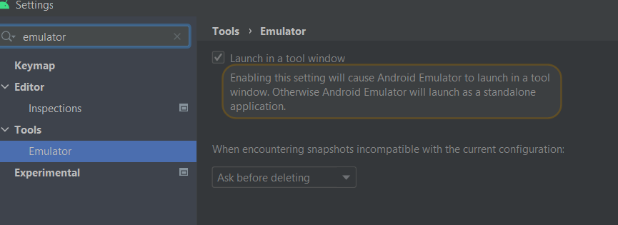
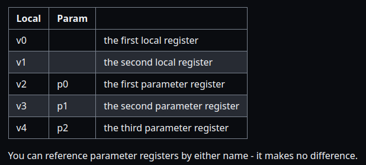
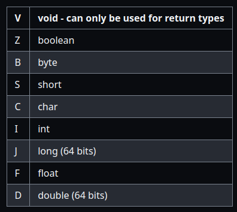
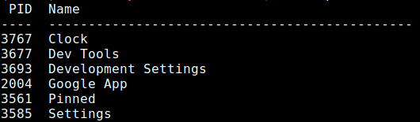
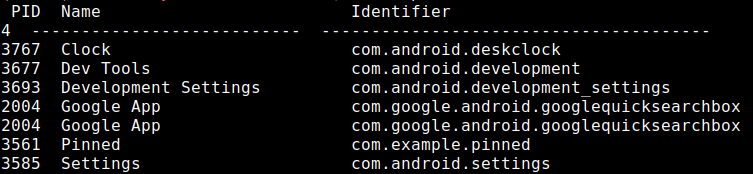
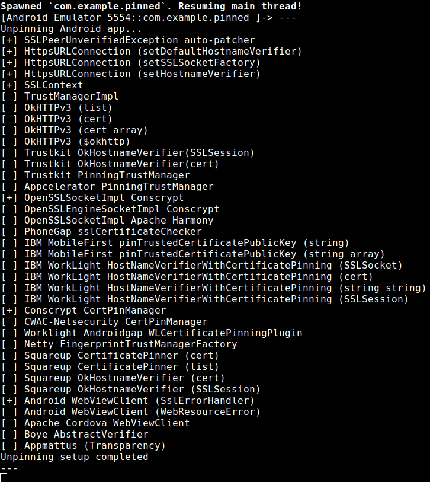
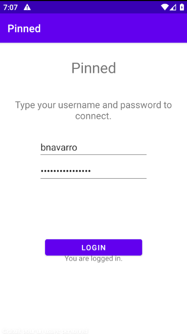
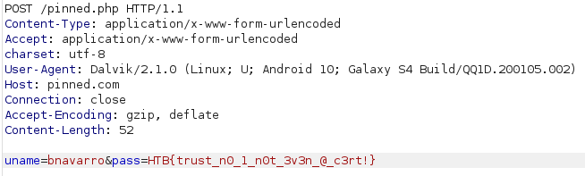

# Android Application Hacking

- **Check out my talk and its resources about Android application hacking [here](../talks/android-app.md)**

## Lab setup

- You can use a rooted Android device or an AVD (Android Virtual Device)
- [My talk here](../talks/android-app.md) for TDI covers the lab setup with an AVD

## Get the app

- Ask your customer to give it to you with SSL Pinning disabled. This is the best option...
- Google play (we can use apk pull and take it from an AVD or device you will need an account on Google)
- [apk Pure](https://apkpure.com)
- [apk mirror](https://www.apkmirror.com/)
- [apk monk](https://www.apkmonk.com/)

## Emulator

- [Emulator](https://developer.android.com/studio/run/emulator-commandline) is the command line tool that will allow you to manage Android virtual device. It gets installed when you install Android Studio.
- If you are like me and prefer to use command line over GUI you can use it
- If you do not know where the binary is you can run `find / -name emulator 2>/dev/null`  
- `./emulator -list-avds` will list the available VM
- `./emulator -avd vm-name` will launch a specific VM

## ADB

### Install apk

- Once the emulator is launched we can use adb with `adb shell`
- Install without adb shell:

```bash
adb install ../../../path/to/file/file.apk
```

- The application can then be found in the app list
- We can also drag and drop the apk in the emulator

### ADB commands

- `adb shell` -  Connect to device
- `adb install` - sideload apks
- `adb push` - PC to device
- `adb pull` - Device to PC
- `adb logcat` - commande line took that dumps a log of system messages
- `adb shell pm list packages` will give you a list of all installed package names
- `adb uninstall <package-name>` uninstall a package

### Find the arch of your android Device or emulator

> This is useful to know which version of frida server you need for example.

- `adb shell getprop`
- To figure out what kind of device you have:

```bash
ro.product.cpu.abilist64 not empty = ARM64
ro.product.cpu.abilist32 contains x86 = x86
If none of these conditions match, you have an ARM device
```

- Check [this thread](https://android.stackexchange.com/questions/188725/determine-device-architecture-arm-arm64-x86-with-adb-getprop) on stack exchange for more details

- or `adb shell getprop ro.product.cpu.abi`

### ADB troubleshoot

- If like me you pulled your hair because of Android Dolphin emulator and could not find proxy settings, you can get back the former look of the emulator by changing this in the settings



- Thanks to Inliner on stakoverflow for this solution. You can find the thread [here](https://stackoverflow.com/questions/70972106/how-to-configure-proxy-in-emulators-in-new-versions-of-android-studio)

## Burp

### Getting burp cert and push it with adb

- Open Burp Suite go to the proxy tab. Then go to the Options tab click on "Import / export CA certificate"
- Select Certificate in DER format
- Push the certificate to your device `adb push path/to/my/cert.der /data/local/tmp/cert-der.crt`

### Configure Burp with Android Studio

 Configure Burp 

## Decompile code

- Bytecodeviewer 
  - launch with `java -jar` and open apk
- `jadx-gui `
- APKLab (add on visual studio Code)

## MobSF

Launch mobsf:

```bash
/opt/Mobile-Security-Framework-MobSF $ sudo ./run.sh 127.0.0.1:4444
```

### Mobsf with Docker

- If you want you can use docker to get and use MobSF
- `docker pull opensecurity/mobile-security-framework-mobsf`
- `docker run -it -p 8000:8000 opensecurity/mobile-security-framework-mobsf`
- Got to http://0.0.0.0:8000 to access the gui

## Static Analysis

### Android manifest

- It is located in "resources".  
This file is where developers will describe the essential information of the application. As stated in the Android documentation for developers:
"Every application project must have an AndroidManifest.xml file (with this exact name) at the root of the project's source set. The manifest file describes your app's essential information to the Android build tools, the Android operating system and Google Play."  
[See Reference](https://developer.android.com/guide/topics/manifest/manifest-intro)  

It will be used to mention the application package name, the application components, the permissions and the hardware and software that the application needs.
Note that it is also useful to check which API we need to test the application by looking at the `minSDKVersion`.  
Since the purpose of permissions is to protect the privacy of the user, you can see here some permissions that should not be allowed, depending of course on the purpose of the application.  
See [here](https://developer.android.com/reference/android/Manifest.permission ) full list of permissions.  

#### Allow backup

The allowBackup flag could allow an attacker to take the backup of the application data with adb. So it would be safer to set it to false, as mentioned in the owasp documentation if this attribute is not set, it is enabled by default.  
More details: [OWASP-MTG](https://github.com/OWASP/owasp-mstg/blob/8d67a609ecd095d1bb00aa6a3e211791af5642e8/Document/0x05d-Testing-Data-Storage.md#static-analysis-7)

#### Debuggable

This flag indicates if the application can be debugged. It must be set to false otherwise an attacker could use it to access the application data.
Be aware that sometimes your client will give you the developer version of the application, so this flag will be set to true.
What I usually do in this case is I set it as informative to remind the customer to make sure they change this when they commit the application to production.  
Here is what the flag looks like:  
`android:debuggable="true"`  
See [documentation](https://github.com/OWASP/owasp-mstg/blob/53ebd2ccc428623df7eaf2361d44b2e7e31c05b9/Document/0x05i-Testing-Code-Quality-and-Build-Settings.md#testing-whether-the-app-is-debuggable-mstg-code-2 ) OWASP MTG about this.  

#### Exportable activities

Activities are the screens of the applications. Depending on the application and the activity, some of them should not be exportable because it means that they could be accessible from outside the application.  
Here is an example of code on the pivaa application with exportable activities:  
```
  <service android:name="com.htbridge.pivaa.handlers.VulnerableService" android:protectionLevel="dangerous" android:enabled="true" android:exported="true"/>
        <receiver android:name="com.htbridge.pivaa.handlers.VulnerableReceiver" android:protectionLevel="dangerous" android:enabled="true" android:exported="true">
            <intent-filter>
                <action android:name="service.vulnerable.vulnerableservice.LOG"/>
            </intent-filter>
        </receiver>
        <provider android:name="com.htbridge.pivaa.handlers.VulnerableContentProvider" android:protectionLevel="dangerous" android:enabled="true" android:exported="true" android:authorities="com.htbridge.pivaa" android:grantUriPermissions="true"/>
```

### General tips for static analysis

- Check Strings.xml
- Try to enumerate database
  - See [Firebase Enum](https://github.com/Sambal0x/firebaseEnum)
- Enumerate public cloud resources
  - See [Cloud Enum](https://github.com/initstring/cloud_enum)
- Lookup for: Secret keys, passwords, comments, URLs, IP, private keys, any sensitive information that should not be in the code.  
With Jadx-gui it is possible to use the global search to search for specific strings such as: API, API_KEY, password, key, ClientId, ClientSecret, id, AWS, Secret, username, firebase.io, http, https, SQL (or other SQL file extensions)  
See here how to use glbal search with jadx-gui:  
 Jadx - Global search   

- An alternative to jadx-gui which is even better in my opinion is if you used mobsf you will have folder `/uploads` and you can grep in it for interesting strings. Check out Alissa Knight's video below, she mentions it.

When you find a database you can then try to read it with sqlitebrowser to see what is in it.  
See [OWASP](https://github.com/HTBridge/pivaa#cleartext-sqlite-database) about this.  

- Interesting resources for static analysis on [Hacktricks](https://book.hacktricks.xyz/mobile-apps-pentesting/android-app-pentesting#static-analysis)

## Modify an Application

- For CTF and other purposes (like cert pinning bypass) we might need to modify the code of the application.
- However the only way to do so when we only have the apk provided is to decompile the code with apktool (or any other) modify the smali code to fit our purpose, recompile it and sign it.

### Decompile with apktool

- `apktool d app.apk` decompile the package app.apk

### Understand smali

#### Registers

  

- Image source: [Wiki smali/baksmali](https://github.com/JesusFreke/smali/wiki/Registers)

#### Types



- Image source: [Wiki smali/baksmali](https://github.com/JesusFreke/smali/wiki/TypesMethodsAndFields)

#### Hello world

- Here is an example of an hello world in smali. You can find the original code [here](https://github.com/JesusFreke/smali/blob/master/examples/HelloWorld/HelloWorld.smali)

```smali
.class public LHelloWorld;

#Ye olde hello world application
#To assemble and run this on a phone or emulator:
#
#java -jar smali.jar a -o classes.dex HelloWorld.smali
#zip HelloWorld.zip classes.dex
#adb push HelloWorld.zip /data/local
#adb shell dalvikvm -cp /data/local/HelloWorld.zip HelloWorld
#
#if you get out of memory type errors when running smali.jar, try
#java -Xmx512m -jar smali.jar HelloWorld.smali
#instead

.super Ljava/lang/Object;

.method public static main([Ljava/lang/String;)V
    // This method has 2 registers
    .registers 2

    sget-object v0, Ljava/lang/System;->out:Ljava/io/PrintStream;

    const-string	v1, "Hello World!"

    invoke-virtual {v0, v1}, Ljava/io/PrintStream;->println(Ljava/lang/String;)V

    return-void
.end method
```

- If you use arguments they have to be placed in the last parameters.

### Recompile with apktool

- `apktool b app/ -o newapp.apk` recompile the folder `app/` and generate a new file `newapp.apk`

### Sign the application

In order to be installed we need to sign the application. FOr this we can use apksigner.
- `apksigner sign --ks path/to/key.keystore newapp.apk`

## Dynamic analysis

### General tips for dynamic analysis

- Are screens visible in screenshots or instances with sensitive data? Understand: can I take a picture of a screen with sensitive data and if I switch to another application after being on a screen with sensitive data can I go back via cached instances?
- All the usual OWASP Top 10 web vulns
- Dynamic analysis on [Hacktricks](https://book.hacktricks.xyz/mobile-apps-pentesting/android-app-pentesting#dynamic-analysis)
- Check if third party keyboard extensions are allowed and active keyboard cache on sensitive fields
sensitive. Some malware masquerades as Android keyboard extensions.
- Tapjacking PoC equivalent to Clickjacking can be done with Qark

### Intercept HTTPS traffic

- [Intercepting HTTPS Traffic from Apps on Android 7+ using Magisk & Burp](https://blog.nviso.eu/2017/12/22/intercepting-https-traffic-from-apps-on-android-7-using-magisk-burp/) this tutorial is great.
- [Here](https://topjohnwu.github.io/Magisk/install.html) is how to install Magisk

- If you want to modify just the network config using objection (and not injecting frida gadget). You can comment some code in objection. Comment the code of these 2 functions in objection

```python
def inject_load_library(self, target_class: str = None):
def add_gadget_to_apk(self, architecture: str, gadget_source: str, gadget_config: str):
```

- `objection patchapk -N -s application.apk` and patch the apk

> Thanks to my colleague Ash for mentioning this to me.

### How to bypass certificate pining

- [Here](https://httptoolkit.com/blog/frida-certificate-pinning/) is an article by Tim Perry on httptoolkit on how to bypass cert pinning with frida.
- If none of the universal script work, you might want to consider using apktool to decompile, modify the smali code and recompile it (see how to do so above).

#### Frida setup

- Take frida server from [here](https://github.com/frida/frida/releases)
- `unxz frida-server-version-android-x86.xz` to decompress the file
- Follow the instructions form the article previously mentioned above

```bash
# Copy the server to the device
adb push ./frida-server-$version-android-$arch /data/local/tmp/frida-server
#        ^Change this to match the name of the binary you just extracted

# Enable root access to the device
adb root

# Make the server binary executable
adb shell "chmod 755 /data/local/tmp/frida-server"

# Start the server on your device
adb shell "/data/local/tmp/frida-server &"
```

- I am on Ubuntu
- `pip3 install frida-tools` Install Frida
- `frida-ps -U` from your ubuntu
- In case you get an error like this `Failed to enumerate processes: unable to connect to remote frida-server: closed` it means the server is not running on the emulator. In this case try to launch it like this

```bash
user ~/Documents/hackthebox $ adb shell
root@generic_x86_64:/ # su
root@generic_x86_64:/ # /data/local/tmp/frida-server &
[1] 3806
```

- Then `frida-ps -U` should work and will list the running process on the target

#### Disable SSL pinning with Frida

- I am going to use Pinned (from the HTB challenge). If you do not have and HTB subscription you can try this on [this app](https://github.com/httptoolkit/android-ssl-pinning-demo) provided by Tim Perry from his article mentioned above.  
- First I launched Pinned and kept it on during the whole process
- When running `frida-ps -U` you should see the app you wish to transform in the list. Running this `frida-ps -D emulator-5554 -ai` will give you more details on the running app `-D <id>` will allow you to specify which plug in device you wish to see the app installed on and `-ai` will show the Identifier column. This works as well `frida-ps -U -ai`



- With the other command the output looks like this



- Take [this script](https://raw.githubusercontent.com/httptoolkit/frida-android-unpinning/main/frida-script.js) kindly provided by our new friend Tim `wget https://raw.githubusercontent.com/httptoolkit/frida-android-unpinning/main/frida-script.js`
- Then you just need to run `frida -D emulator-5554 -l ./frida-script.js -f com.example.pinned` or `frida -U -l ./frida-script.js -f com.example.pinned`

> Note: Apparently the --no-pause is not necessary anymore see [here](https://github.com/frida/frida/issues/2277)



- Now we should be able to intercept the traffic and actually see it in Burp (frida server should still be running for this process)
- For Pinned for example I just had to click login in my screen (that I did not close)  
  
- And I got the flag from Burp  

- If this did not work, check out this [article](https://blog.nviso.eu/2020/11/19/proxying-android-app-traffic-common-issues-checklist/#check10)

#### Useful frida commands

- `frida-ls-devices` list plugged in devices
- `frida-ps -D <id> -ai` list installed apps on a specific device

## Wireshark

- Make laptop as hotspot capture traffic
- Pull capture from a pfSense machine or something similar
- `adb shell tcpdump -s -s 0`
- HTTP traffic: `adb shell tcpdump -C -s -s 0 port 80`

## Resources

### General resources

- [eLearnSecurity Mobile App Pentesting notes by Joas Antonio Dos Santos](https://drive.google.com/file/d/1K_xnDKMhlV1aJqXsq4lXiCcliiGvs877/view)
- [My writeup of the HTB Introduction to Android Exploitation track](../writeups/HTB-Intro-to-android-Exploitation-Track.md)
- [Android Pentesting 101 — Part 1 by 302 found](https://infosecwriteups.com/android-pentesting-101-part-1-8e31b8cd8b2b)
- [Android Pentesting 101 — Part 2 by 302 found](https://infosecwriteups.com/android-pentesting-101-part-2-419facdf11c1)
- [Android Pentesting 101 — Part 3 by 302 found](https://infosecwriteups.com/android-pentesting-101-part-3-2bf846b05594)
- [Android Application Penetration Testing | Mobile Pentesting - Sabyasachi Paul - h0tPlug1n](https://youtu.be/Tujbk4ToVMI)
- [Android Application Pentesting - Mystikcon 2020](https://youtu.be/NrxTBcjAL8A)
- [Android Security Crash Course by CorSecure](https://youtube.com/playlist?list=PLH5GW4W70qp_B2eptq1Qo7KM2S66M77hi)

### APISecure conf workshop by Alissa Knight

 Alissa Knight: Workshop for Women/Non-Binary in API Security: Bypassing Certificate Pinning in Android Using FRIDA - APISecure Conference 2022  

#### Steps from the video

- Step 1: Download the app in an android device and use [apkextractor](https://play.google.com/store/apps/details?id=com.ext.ui&hl=en&gl=US) to extract it of of the android device
- Step 2: Install MobSF
  - Inspect the results from the apk analysis here
  - Go to the Mobsf folder where everything as been extracted and make some manual checks.
  - You can use [RegEXAPI](https://github.com/odomojuli/RegExAPI) with `grep -R _token`

#### Resources mentioned in the video

- [All that we let in - Part 1 - Alissa Knight](https://www.alissaknight.com/post/all-that-we-let-in-hacking-mobile-health-apis-part-1)
- [All that we let in - Part 2 - Alissa Knight](https://www.alissaknight.com/post/all-that-we-let-in-hacking-mhealth-apps-and-apis-part-2)

### Another video with Alissa Knight that is a great complement to the first one

- How I hacked 30 mobile banking apps & the future of API Security, Alissa Knight, Aite Group - Apidays 2019

 How I hacked 30 mobile banking apps & the future of API Security, Alissa Knight, Aite Group - Apidays 2019   

### Resources for SSL pinning bypass, Frida, traffic interception and rooting

- [Frida gadget injection on android no root 2 methods - Alexandr Fadeev](https://fadeevab.com/frida-gadget-injection-on-android-no-root-2-methods/)

- [Android SSL Pinning Bypass for Bug Bounties & Penetration Testing - Hacktify Cyber Security](https://youtu.be/ENyEcwLaz-A)  

- [Android Application Pinning Bypass | Pinned @ HackTheBox by 0xbro](https://youtu.be/CJR_BSIStmE)  

- [Intercept HTTPS on non-rooted Android devices | HackTheBox - Anchored by 0xbro](https://youtu.be/KGdCvJs9w7w)

- [Configuring Burp Suite With Android Nougat](https://blog.ropnop.com/configuring-burp-suite-with-android-nougat/)

- Tool (**I DID NOT TRY IT**): [rootAVD by newb1t to root an AVD](https://github.com/newbit1/rootAVD/blob/master/README.md)  
  - [Magisk Trust User Certs](https://github.com/NVISOsecurity/MagiskTrustUserCerts/releases/tag/v0.4.1) (I did not try either it but it is suppose to be added in addition of use of rootAVD to make a system trusted certificate)  

### Resources for Smali, Dalvik and RE an android App

- [GUIDE Smali coding guide for beginners on XDA developers forum by havocgb](https://forum.xda-developers.com/t/guide-smali-coding-guide-for-beginners.2193735/)
- [Smali the Parseltongue Language by Benoit Forgette](https://blog.quarkslab.com/smali-the-parseltongue-language.html)
- [Smali: Assembler for Android’s VM by The Mobile Security Guys](https://mobsecguys.medium.com/smali-assembler-for-dalvik-e37c8eed22f9)
- [Smali - Decompiling/[Modifying]/Compiling on Hacktricks](https://book.hacktricks.xyz/mobile-pentesting/android-app-pentesting/smali-changes)
- [android cracking](http://androidcracking.blogspot.com/search/label/smali)
- [Dalvik opcodes](http://pallergabor.uw.hu/androidblog/dalvik_opcodes.html)
- [Basic smali](https://themasterofmagik.wordpress.com/2014/03/27/basic-smali/)
- [Understanding the Dalvik bytecode with the Dedexer tool](https://www.slideshare.net/paller/understanding-the-dalvik-bytecode-with-the-dedexer-tool)
- [Dalvik notes - Haynes Mathew](https://sites.google.com/site/haynesmathew/home/projects/dalvik-notes)
- [APKtool Google groupe](https://groups.google.com/g/apktool?pli=1)
- [Dalvik Bytecode](https://source.android.com/docs/core/runtime/dalvik-bytecode?hl=en)
- [Reverse engineering and modifying an Android game (.apk) — CTF by CurlS](https://medium.com/swlh/reverse-engineering-and-modifying-an-android-game-apk-ctf-c617151b874c)

### Tools

#### Android Emulator

- [Genymotion](https://www.genymotion.com) (free 30 days trial and free for personal use)
- [Android Studio](https://developer.android.com/) (free)

#### Software

- [Burp](https://portswigger.net/burp)
- [Android SDK Tool](https://developer.android.com/studio/releases/platforms.hml)

#### Automated tools

- [MobSF](https://github.com/MobSF/Mobile-Security-Framework-MobSF) can help to speed up static analysis
- [Qark](https://github.com/linkedin/qark) dynamic analysis can be use for tapjacking PoC
- [Inspeckage - Android Package Inspector](https://github.com/ac-pm/Inspeckage)

#### Certificate pinning

- [Bypass SSL Pinning without root by CorSecure](https://youtu.be/qaJBWcueCIA)
- [Circumventing SSL Pinning in obfuscated apps with OkHttp - Jeroen Beckers](https://blog.nviso.eu/2019/04/02/circumventing-ssl-pinning-in-obfuscated-apps-with-okhttp/)
- [Proxying Android app traffic – Common issues / checklist - Jeroen Beckers](https://blog.nviso.eu/2020/11/19/proxying-android-app-traffic-common-issues-checklist/)
- [The Ultimate Decision Tree for Mobile App Network Testing aka “The Squirrel in the middle”! - Sven Schleier](https://bsddaemonorg.wordpress.com/2021/02/11/the-ultimate-decision-tree-for-mobile-app-network-testing-aka-the-squirrel-in-the-middle/)

#### Decompiling & RE

- [jadx](https://github.com/skylot/jadx)
- [cfr java decompiler](https://www.benf.org/other/cfr)
- [Ghidra](https://www.nsa.gov/resources/everyone/ghidra/)
- [Android apktool](https://ibotpeaches.github.io/Apktool/)
- [Frida](https://www.frida.re)
- [Fridump](https://github.com/Nightbringer21/fridump)
- [APKlab an extension for VSCodium](https://marketplace.visualstudio.com/items?itemName=Surendrajat.apklab)