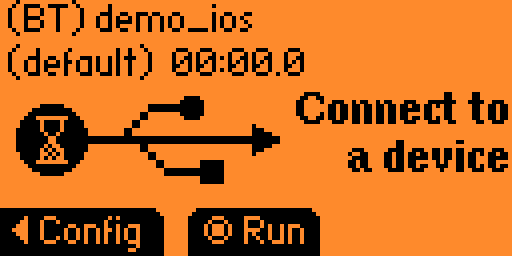
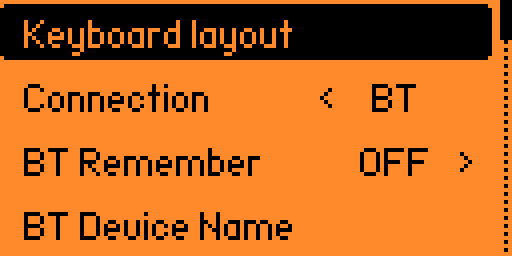

# IOS Application Hacking

## Get the App

- Apple App Store

**More coming soon**

## Wireshark

- Connect the device: `rvictl -s <UDID>`
- Start the capture: `sudo tcpdump -i rvi0 -w iphone.pcap`

## Test the security of the phone or tablet

Sometimes you will have to assess the security of the tablet. Say your customer wants to use tablets but have disabled a few things.  
Sometimes they might even activate [supervised mode](https://support.apple.com/en-ca/102291) to set it up for corporate use.  
You will need to check for a few things.

### Bypass bluetooth restrictions

You will see that the bluetooth is switched on but you can not pair any device. It means that the bluetooth usage has been restricted.  
But if you go to `Settings > Accessibility > Selection Control > Buttons > Bluetooth devices`

This way you can pair a device.

### Flash Xtreme firmware on your flipper zero

See Shuriken Hacks' video [here](https://youtu.be/Zj_PWkWxUEw?si=CKn3hhnJ5nQ6dj7M) to do this

### BT spam 

> You can do this attack with flipper zero with Xtreme firware.

- Browse to BLE Spam

- Launch the attack

If the bluetooth is activated on your target you should get notified to pair various new devices.

### Bad USB over bluetooth

> You can do this attack with flipper zero with Xtreme firware.

Click the down arrow and select badkb

  

- Select the ios demo (it will open a webpage on the target ios device)

- Select config

- Set Connection to BT

- Go back and click on run. Pair the device with your flipper when the pop up appears and it should open a webpage to the xtreme firmware's github page.

## Resources

- [Frida & Objection without Jailbreak! by 302 not found](https://medium.com/bugbountywriteup/frida-objection-without-jailbreak-27a66501bf38)
- [[0x07] Reversing Shorts :: iOS Device Supervision - Sniff Traffic & Defer Updates](https://youtu.be/-YdP1owHiAk?si=xLxEIa9nq74V641J)

### Tools

- Jailbroken Iphone
  - [Electra](https://coolstar.org/electra)
  - [Chimera](https://chimera.sh)
  - [checkm8](https://github.com/axi0mX/ipwndfu)
- Open source memory dumping tool.
- [Frida-ios-dump](https://github.com/AloneMonkey/frida-ios-dump)
- [MobSF](https://github.com/MobSF/Mobile-Security-Framework-MobSF) can help to speed up static analysis
- [IOS Passionfruit](https://github.com/chaitin/passionfruit)

### Attacks with flipper zero

- [Annoying Apple Fans: The Flipper Zero Bluetooth Prank Revealed - Techryptic](https://techryptic.github.io/2023/09/01/Annoying-Apple-Fans/)