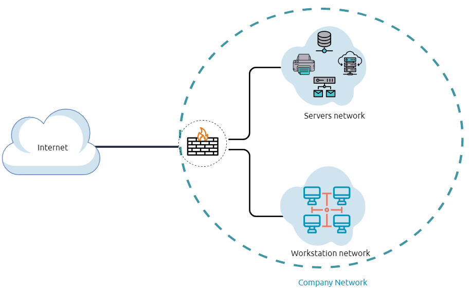
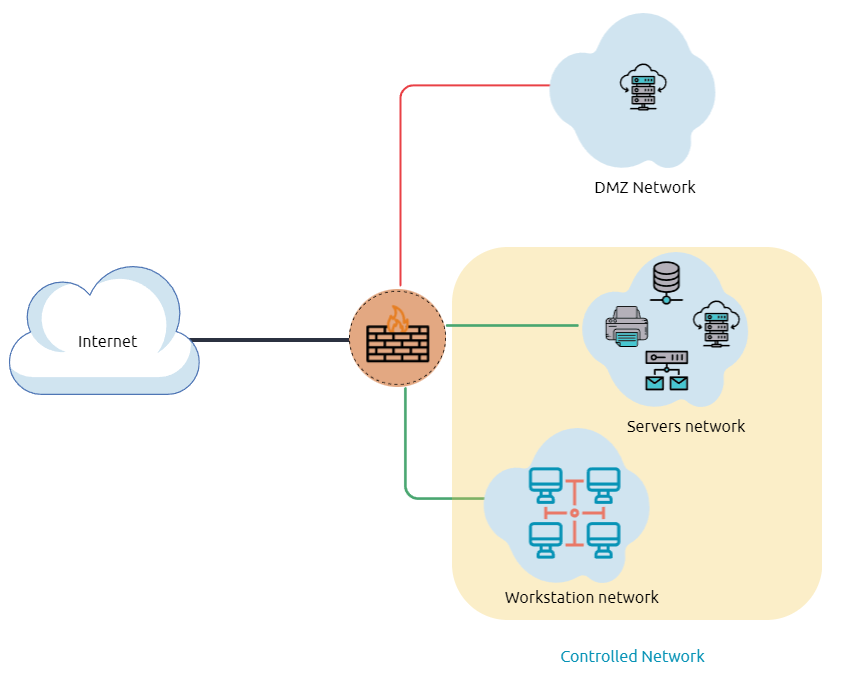
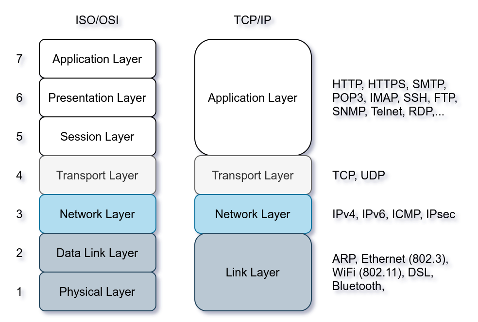
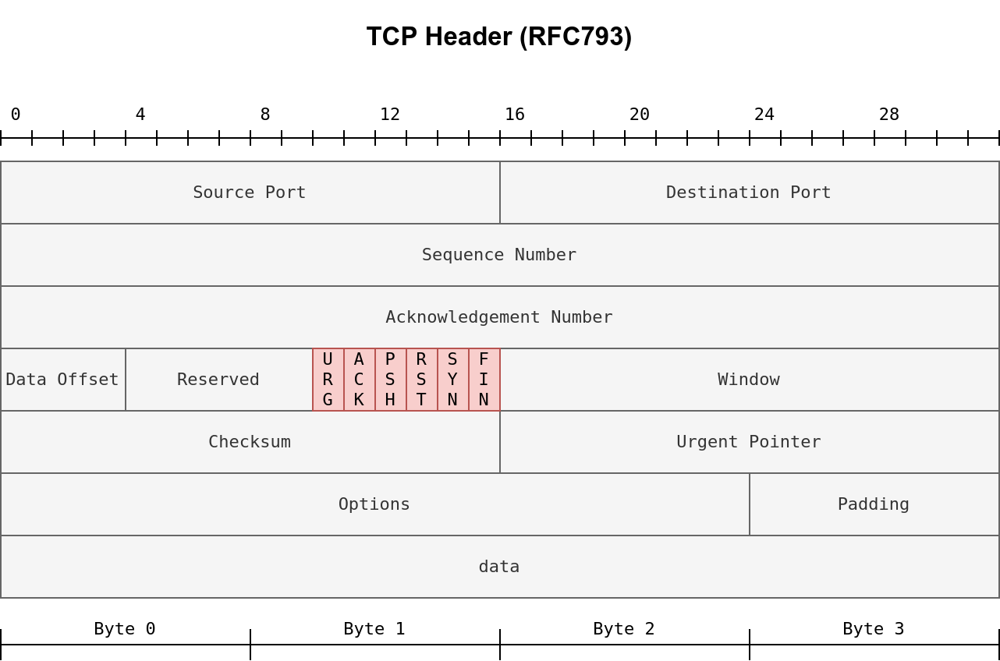
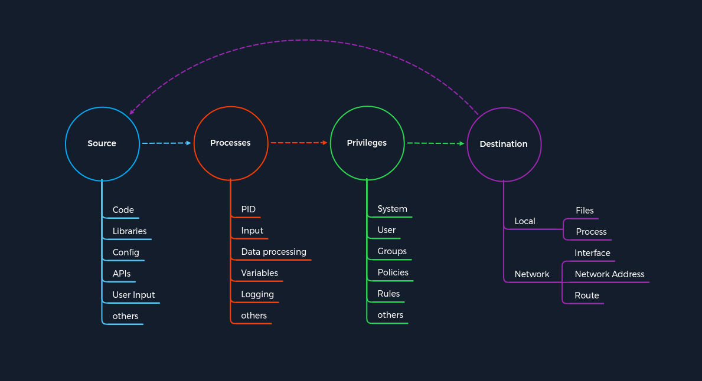

# Networking basics

> Notes from tryhackme, HTB Academy and my practice

## Internal Networks

"Internal Networks are subnetworks that are segmented and separated based on the importance of the internal device or the importance of the accessibility of its data. The main purpose of the internal network(s) is to share information, faster and easier communications, collaboration tools, operational systems, and network services within an organization. In a corporate network, the network administrators intend to use network segmentation for various reasons, including controlling network traffic, optimizing network performance, and improving security posture."  

> *Source: tryhackme*

## A Demilitarized Zone (DMZ)

"A DMZ Network is an edge network that protects and adds an extra security layer to a corporation's internal local-area network from untrusted traffic. A common design for DMZ is a subnetwork that sits between the public internet and internal networks.

Designing a network within the company depends on its requirements and need. For example, suppose a company provides public services such as a website, DNS, FTP, Proxy, VPN, etc. In that case, they may design a DMZ network to isolate and enable access control on the public network traffic, untrusted traffic."

  

> *Source: tryhackme*

## IP Addresses

- Address to communicate on a network (Layer 3 of OSI model) = routing

| Network class | Network numbers | Network mask | Nb. of networks | No. of hosts per network |
|---------------|-----------------|--------------|-----------------|--------------------------|
| Class A       | 10.0.0.0        | 255.0.0.0    | 126             | 12 646 144               |
| Class B       | 172.16.0.0 to 172.31.0.0 | 255.255.0.0| 16 383 | 65 024                     |
| Class C       | 192.168.0.0 to 192.168.255.255 | 255.255.255.0 | 2 097 151 | 254            |
| Loopback (localhost) | 127.0.0.0 to  127.0.0.7 | 255.255.255.0 | | |

## MAC Addresses

- Media Access Control, Physical address  (Layer 2 of OSI model). Useful to know which device is which.
- It looks like this `00:1a:3f:f1:4c:c6`
- We can lookup the the OUI (3 first octets) to get find out the manufacturer of the device

> *Source: [What is a MAC Address - Lakshan Mamalgaha](https://medium.com/@lakshanmamalgaha/what-is-a-mac-address-and-why-you-should-know-about-it-9f970b3ba3fd)*

- Detailed info [here](https://en.wikipedia.org/wiki/MAC_address)

## TCP, UDP and the Three way handshake

### TCP

- Transmission Control Protocol. It is a connection oriented protocol. http, ftp, etc all utilize this.

#### Three way handshake

- TCP uses 3 way handshake
- SYN > SYN ACK > ACK : Asking to connect to a port > Port is open > connection occurs

### UDP

- User Datagram protocol. It is a connectionless protocol. Streaming service, voip etc. all utilize this.

## Common ports and protocol

  

> *Source: TCM Security Academy - Course Practical Ethical Hacking*

- TCP
  - FTP = File Transfer protocol
  - SSH and Telnet: connect to a device remotely ssh is encrypted telnet is not
  - SMTP, POP3 and IMAP: related to mail protocol
  - DNS: resolves ip addresses to name
  - HTTP and HTTPS : websites. HTTPS is encrypted
  - SMB: file share (aka SAMBA)
- UDP
  - DHCP: will assign IP address
  - TFTP = trivial FTP
  - SNMP: Simple Network Management Protocol

## The OSI Model

| Number | Layer           | Examples or use |
|--------|-----------------|---------|
| 1      | Physical layer | Data cables |
| 2      | Data | Switches, MAC Addresses |
| 3      | Network | IP addresses, routing |
| 4      | Transport | TCP/UDP |
| 5      | Session | Session management |
| 6      | Presentation | WMV, JPEG, MOV |
| 7      | Application | HTTP, SMTP |

- (Mnemonic: Please Do Not Throw Sausage Pizza Away)

> *Source:TryHackMe*

## TCP header (RFC793)

> *Source:TryHackme*

## Subnetting

  

> *Source: TCM Security Academy  - Course Practical Ethical Hacking*

## End Device Addressing

- IP address - This identifies the host on the network.
- Subnet mask - This is used to identify the network on which the host is connected.
- Default gateway - This identifies the networking device that the host uses to access the internet or another remote network.

## Common ports and protocols

There are two categories of ports, Transmission Control Protocol (TCP), and User Datagram Protocol (UDP).  
TCP is connection-oriented, meaning that a connection between a client and a server must be established before data can be sent. The server must be in a listening state awaiting connection requests from clients.  
UDP utilizes a connectionless communication model. There is no "handshake" and therefore introduces a certain amount of unreliability since there is no guarantee of data delivery. UDP is useful when error correction/checking is either not needed or is handled by the application itself. UDP is suitable for applications that run time-sensitive tasks since dropping packets is faster than waiting for delayed packets due to retransmission, as is the case with TCP and can significantly affect a real-time system. There are 65,535 TCP ports and 65,535 different UDP ports, each denoted by a number.

| Protocol | TCP/UDP Port | Application(s) | Data Security |
|----------|----------|----------------|---------------|
| FTP | 20/21 (TCP) | File Transfer | Cleartext |
|SFTP|22 (TCP) | File Transfer| Encrypted|
|SSH| 22 (TCP)  |Remote Access and File Transfer|Encrypted|
|Telnet|23 (TCP) |Remote Access|Cleartext|
|SMTP|25 (TCP) |Email (MTA)|Cleartext|
| HTTP | 80 (TCP) | Worldwide Web | Cleartext |
|POP3| 110 (TCP) | Email (MDA) | Cleartext|
|IMAP | 143 | Email (MDA) | Cleartext|
|SNMP| 161 (TCP/UDP) ||||
| LDAP| 389 (TCP/UDP)||||
| HTTPS | 443 (TCP)| Worldwide Web| Encrypted|
|SMB| 445 (TCP) ||||
|SMTPS|465|Email (MTA)|Encrypted|
| FTPS | 990 | File Transfer | Encrypted |
|IMAPS| 993 | Email (MDA) | Encrypted|
|POP3S|995| Email (MDA)| Encrypted|
|RDP|3398 (TCP) |RDP||||

- [Common ports MIT](https://web.mit.edu/rhel-doc/4/RH-DOCS/rhel-sg-en-4/ch-ports.html)
- [Common ports cheat sheet by packetlife](https://packetlife.net/media/library/23/common-ports.pdf)
- [Top 1000 TCP and UDP Port by nullsec](https://nullsec.us/top-1-000-tcp-and-udp-ports-nmap-default/)

## Differenciate active tun connections

- Sometimes when playing with multiple ovpn (I often use htb and thm and do not always reboot my vm) you might end up with 2 tun interface in your `ip add`
- To know which one is the active one you just need to check the routes using `ip route` the one that has more routes is the one that is the current ovpn connection.

## VPN

At a high-level, VPN works by routing our connecting device's internet connection through the target VPN's private server instead of our internet service provider (ISP). When connected to a VPN, data originates from the VPN server rather than our computer and will appear to originate from a public IP address other than our own.  
There are two main types of remote access VPNs: client-based VPN and SSL VPN.  
SSL VPN uses the web browser as the VPN client. The connection is established between the browser and an SSL VPN gateway can be configured to only allow access to web-based applications such as email and intranet sites, or even the internal network but without the need for the end user to install or use any specialized software.  
Client-based VPN requires the use of client software to establish the VPN connection. Once connected, the user's host will work mostly as if it were connected directly to the company network and will be able to access any resources (applications, hosts, subnets, etc.) allowed by the server configuration.  
Some corporate VPNs will provide employees with full access to the internal corporate network, while others will place users on a specific segment reserved for remote workers.

- `ifconfig` or `ip add` we will see a tun adapter if we successfully connected to the VPN
- `netstat -rn` will show us the networks accessible via the VPN.
- `ip -4 a show tun0` check tun0 address
- `ping -c 4 IP.1` (one is the gateway location) 
- We can not be connected from more than 1 device at the same time

*Source Hackthebox Academy*

## The Concept of Attacks

> Source HTB Academy course [Attacking common services](https://academy.hackthebox.com/module/details/116)

The concept is based on four categories that occur for each vulnerability. First, we have a `Source` that performs the specific request to a `Process` where the vulnerability gets triggered. Each process has a specific set of `Privileges` with which it is executed. Each process has a task with a specific goal or `Destination` to either compute new data or forward it. However, the individual and unique specifications under these categories may differ from service to service.

Every task and piece of information follows a specific pattern, a cycle, which we have deliberately made linear. This is because the `Destination` does not always serve as a `Source` and is therefore not treated as a source of a new task.

For any task to come into existence at all, it needs an idea, information (`Source`), a planned process for it (`Processes`), and a specific goal (`Destination`) to be achieved. Therefore, the category of `Privileges` is necessary to control information processing appropriately.

### Source

We can generalize Source as a source of information used for the specific task of a process. There are many different ways to pass information to a process. 

|Information|Source|Description|
|-----------|------|-----------|
|Code|This means that the already executed program code results are used as a source of information. These can come from different functions of a program.|
|Libraries|A library is a collection of program resources, including configuration data, documentation, help data, message templates, prebuilt code and subroutines, classes, values, or type specifications.|
|Config|Configurations are usually static or prescribed values that determine how the process processes information.|
|APIs|The application programming interface (API) is mainly used as the interface of programs for retrieving or providing information.|
|User Input|If a program has a function that allows the user to enter specific values used to process the information accordingly, this is the manual entry of information by a person.|

The source is, therefore, the source that is exploited for vulnerabilities. It does not matter which protocol is used because HTTP header injections can be manipulated manually, as can buffer overflows. The source for this can therefore be categorized as Code. 

### Processes

The Process is about processing the information forwarded from the source. These are processed according to the intended task determined by the program code. For each task, the developer specifies how the information is processed. This can occur using classes with different functions, calculations, and loops. The variety of possibilities for this is as diverse as the number of developers in the world. Accordingly, most of the vulnerabilities lie in the program code executed by the process.

|Process|Components|Description|
|-------|----------|-----------|
|PID|The Process-ID (PID) identifies the process being started or is already running. Running processes have already assigned privileges, and new ones are started accordingly.|
|Input|This refers to the input of information that could be assigned by a user or as a result of a programmed function.|
|Data processing|The hard-coded functions of a program dictate how the information received is processed.|
|Variables|The variables are used as placeholders for information that different functions can further process during the task.|
|Logging|During logging, certain events are documented and, in most cases, stored in a register or a file. This means that certain information remains in the system.|

### Privileges

Privileges are present in any system that controls processes. These serve as a type of permission that determines what tasks and actions can be performed on the system. In simple terms, it can be compared to a bus ticket. If we use a ticket intended for a particular region, we will be able to use the bus, and otherwise, we will not. These privileges (or figuratively speaking, our tickets) can also be used for different means of transport, such as planes, trains, boats, and others. In computer systems, these privileges serve as control and segmentation of actions for which different permissions, controlled by the system, are needed. Therefore, the rights are checked based on this categorization when a process needs to fulfill its task. If the process satisfies these privileges and conditions, the system approves the action requested. We can divide these privileges into the following areas:

|Privileges|Description|
|----------|-----------|
|System|These privileges are the highest privileges that can be obtained, which allow any system modification. In Windows, this type of privilege is called SYSTEM, and in Linux, it is called root.|
|User|User privileges are permissions that have been assigned to a specific user. For security reasons, separate users are often set up for particular services during the installation of Linux distributions.|
|Groups|Groups are a categorization of at least one user who has certain permissions to perform specific actions.|
|Policies|Policies determine the execution of application-specific commands, which can also apply to individual or grouped users and their actions.|
|Rules|Rules are the permissions to perform actions handled from within the applications themselves.|

### Destination

Every task has at least one purpose and goal that must be fulfilled.  
Logically, if any data set changes were missing or not stored or forwarded anywhere, the task would be generally unnecessary.  
The result of such a task is either stored somewhere or forwarded to another processing point.  
Therefore we speak here of the Destination where the changes will be made. Such processing points can point either to a local or remote process.  
Therefore, at the local level, local files or records may be modified by the process or be forwarded to other local services for further use.  
However, this does not exclude the possibility that the same process could reuse the resulting data too.  
If the process is completed with the data storage or its forwarding, the cycle leading to the task's completion is closed.

|Destination|Description|
|Local|The local area is the system's environment in which the process occurred. Therefore, the results and outcomes of a task are either processed further by a process that includes changes to data sets or storage of the data.|
|Network|The network area is mainly a matter of forwarding the results of a process to a remote interface. This can be an IP address and its services or even entire networks. The results of such processes can also influence the route under certain circumstances.|

## Service Misconfigurations

> Source HTB Academy course [Attacking common services](https://academy.hackthebox.com/module/details/116)

Misconfigurations usually happen when a system administrator, technical support, or developer does not correctly configure the security framework of an application, website, desktop, or server leading to dangerous open pathways for unauthorized users.

### Authentication

- Default credentials
- Weak passwords
- No passwords
- Anonymous Authentication
- Misconfigured access rights

### Unecessary defaults

Unnecessary defaults are those settings we need to change to secure a system by reducing its attack surface.
It can happen on settings, features, files, credentials, etc.

## Sensitive Information

Sensitive information may include, but is not limited to:

- Usernames.
- Email Addresses.
- Passwords.
- DNS records.
- IP Addresses.
- Source code.
- Configuration files.
- PII.

There are two key elements to finding sensitive information:

1. We need to understand the service and how it works.
2. We need to know what we are looking for.

## Tools to interact with common services

|SMB|FTP|Email|Databases|
|---|----|-------|-----------|
|smbclient|ftp|Thunderbird|mssql-cli|
|CrackMapExec|lftp|Claws|mycli|
|SMBMap|ncftp|Geary|mssqlclient.py|
|Impacket|filezilla|MailSpring|dbeaver|
|psexec.py|crossftp|mutt|MySQL|Workbench|
|smbexec.py||mailutils|SQL Server Management Studio or SSMS|
|||sendEmail||
|||swaks	||
|||sendmail	||

## Resources

 Getting Started with Cisco Packet Tracer (this tool is very fun and useful to use when trying to understand networking) 
 Networking Essentials by Cisco 
 Professor Messer 7 second subnetting 
 TryHackMe - The Lay of the land   
 Pentest book Enumeration Ports - six2dez   