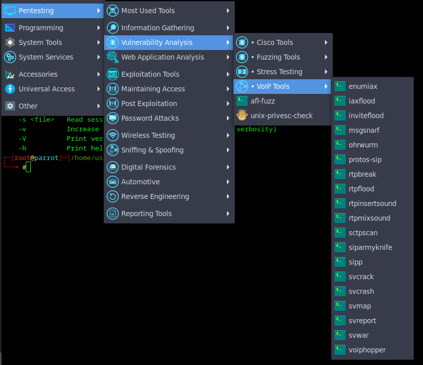

# VOIP and related protocols

> This documentation has been made with notes from my practice and my research on the subject matter.

## VOIP

**VoIP (Voice over Internet Protocol)** is a technology that allows voice communication and multimedia sessions over the Internet or other packet-switched networks. Instead of using traditional circuit-switched telephone networks, VoIP converts voice signals into digital data packets and transmits them over IP-based networks.

### Key Features of VoIP:
1. **Cost-Effective:** Calls made over the Internet can be significantly cheaper than traditional telephony, especially for long-distance and international calls.
2. **Flexibility:** Users can make calls from various devices, including computers, smartphones, IP phones, or even traditional phones with VoIP adapters.
3. **Scalability:** VoIP systems are easier to scale for businesses, accommodating growth without the need for additional physical infrastructure.
4. **Integration:** It integrates with other digital services like video conferencing, instant messaging, and data sharing.

### How VoIP Works:
1. **Signal Conversion:** 
   - Converts analog voice signals into digital data packets.
   - Compresses and encodes the data for efficient transmission.
2. **Transmission:**
   - Transmits these packets over an IP network using protocols like RTP (Real-Time Transport Protocol) and SIP (Session Initiation Protocol).
3. **Reception:**
   - The recipient's device decodes the packets back into audio signals.

### Examples of VoIP Services:
- Consumer-grade: Skype, WhatsApp, Google Meet, Zoom.
- Enterprise-grade: Cisco Webex, Microsoft Teams, RingCentral.

### Benefits of VoIP:
- **Reduced Costs:** Lower call costs compared to traditional landlines.
- **Portability:** Users can access VoIP services from anywhere with an Internet connection.
- **Advanced Features:** Includes functionalities like call forwarding, voicemail, video conferencing, and integration with CRM systems.

### Challenges:
- **Quality of Service (QoS):** Call quality depends on the network's bandwidth and latency.
- **Reliability:** Requires a stable Internet connection and can be affected by power outages.
- **Security:** VoIP is susceptible to hacking, eavesdropping, and denial-of-service attacks without proper encryption and safeguards.

### Protocols used by VoIP

VoIP typically relies on several protocols to ensure effective communication, with each playing a specific role in signaling, media transport, and session management. The most commonly used protocols in VoIP include:

#### **1. SIP (Session Initiation Protocol)**
- **Purpose:** Handles call setup, management, and termination for VoIP sessions.
- **Features:** 
  - Establishes and maintains communication sessions.
  - Supports additional features like call forwarding, video, and messaging.
- **Ports:** Typically uses port 5060 for unencrypted traffic and 5061 for encrypted traffic (SIP-TLS).

#### **2. RTP (Real-Time Transport Protocol)**
- **Purpose:** Transports the actual media (voice or video) during a session.
- **Features:**
  - Ensures low-latency delivery of media packets.
  - Often used with RTCP (RTP Control Protocol) for performance monitoring.
- **Ports:** Dynamically allocated UDP ports, usually in the range of 1024–65535.

#### **3. H.323**
- **Purpose:** An older protocol suite for multimedia communications.
- **Features:**
  - Provides signaling, control, and media transport.
  - Used in legacy VoIP systems, less common today compared to SIP.
- **Ports:** Uses various ports for different functions, including TCP 1720 for call signaling.

#### **4. MGCP (Media Gateway Control Protocol)**
- **Purpose:** Controls media gateways in VoIP systems.
- **Features:**
  - Simplifies call control by centralizing signaling logic.
- **Ports:** Typically uses UDP ports 2427 and 2727.

#### **5. WebRTC**
- **Purpose:** A modern framework for real-time communication directly in web browsers.
- **Features:**
  - Uses SIP or custom signaling protocols for session initiation.
  - Transports media using RTP or SRTP (Secure RTP).
- **Ports:** Uses ICE (Interactive Connectivity Establishment) and STUN/TURN for NAT traversal.

#### **6. Proprietary Protocols**
- Some VoIP systems use proprietary protocols such as Skype's custom signaling and media protocols or Microsoft Teams' optimized solutions based on SIP and other technologies.

## SIP

The **Session Initiation Protocol (SIP)** is a signaling protocol used for initiating, maintaining, and terminating real-time communication sessions that involve voice, video, and messaging applications. It is widely used in Voice over IP (VoIP) systems and multimedia communications.

### Key Features of SIP:
1. **Session Setup:** It establishes sessions between endpoints, including call setup, management, and teardown.
2. **Flexibility:** SIP can be used for two-party (unicast) or multi-party (multicast) sessions.
3. **Protocol Independence:** It works over various transport protocols such as TCP, UDP, or SCTP.
4. **Extensibility:** SIP can integrate with other protocols like RTP for media transport and SDP for describing multimedia sessions.

### SIP Ports:
SIP is typically exposed on the following ports:

1. **UDP/TCP Port 5060**  
   - Used for unencrypted SIP signaling.
2. **TCP Port 5061**  
   - Used for encrypted SIP signaling (SIP-TLS).

In real-world scenarios, firewalls and NATs are often configured to handle these ports, especially for SIP traffic. Advanced protocols like STUN, TURN, or ICE are also used in conjunction with SIP to traverse NATs and firewalls.

## Pentest workflow

- Enumerate with nmap with your usual command, mine is  
  `nmap -Pn -p- -sC -sV -iL ips.txt -oA output-all-ports-et-srv`  
  - With this you get all the details the file ips.txt needs to contain your list of ips.
- Grep on the gnmap results to get the list of IP with the port 5060 open.  
  `grep "5060/open" output-all-ports-et-srv.gnmap | cut -d' ' -f2`

## Preinstalled tools on Parrot OS for VoIP



### enumiax - username enumeration

- [enumiax - foreni-packages](https://github.com/foreni-packages/enumiax)
"enumIAX is an Inter Asterisk Exchange protocol username brute-force
enumerator."  

### iaxflood - VoIP flooder

- [iaxflood - foreni-packages](https://github.com/foreni-packages/iaxflood)

### inviteflood - INVITE message flooding

- [inviteflood - foreni-packages](https://github.com/foreni-packages/inviteflood/blob/master/inviteflood/Readme.txt)
"A tool to perform SIP/SDP INVITE message flooding over UDP/IP."

### msgsnarf

I did not find the official repo.  
It seems to be a network sniffer. So it could be useful for mitm.

### ohrwurm

- [ohrwurm](https://www.kali.org/tools/ohrwurm/)

"ohrwurm is a small and simple RTP fuzzer that has been successfully tested on a small number of SIP phones."

### protos-sip

- [protos-sip](https://www.kali.org/tools/protos-sip/)

"The purpose of this test-suite is to evaluate implementation level security and robustness of Session Initiation Protocol (SIP) implementations."

### rtpbreak

- [rtpbreak](https://www.kali.org/tools/rtpbreak/)  

"With rtpbreak you can detect, reconstruct and analyze any RTP session."

### rtpflood

- [rtpflood](https://www.kali.org/tools/rtpflood/)

"A command line tool used to flood any device that is processing RTP."

### rtpinsertsound

- [rtpinsertsound - foreni-package](https://github.com/foreni-packages/rtpinsertsound/blob/master/rtpinsertsound_v3.0/Readme.txt)

### rtpmixsound

- [rtpmixsound](https://www.kali.org/tools/rtpmixsound/)

"A tool to mix pre-recorded audio in real-time with the audio (i.e. RTP) in the specified target audio stream."

### sctpscan

- [sctpscan](https://www.kali.org/tools/sctpscan/)

"SCTP network scanner for discovery and security"

### siparmyknife

- [siparmyknife - foreni-packages](https://github.com/foreni-packages/siparmyknife/blob/master/siparmyknife.pl)

"SIP VoIP Protocol Fuzzer. Fuzzer that searches for cross site scripting, SQL injection, log injection, format strings, buffer overflows, and more. "

### SIPp

- [SIPp](https://github.com/SIPp/sipp)
- [SIPp - docs](https://sipp.readthedocs.io/en/v3.6.1/)

"The SIPp testing tool. SIPp allows to generate one or many SIP calls to one remote system."

### voiphopper

- [voiphopper - iknowjason (no longer maintained)](https://github.com/iknowjason/voiphopper)
- [voiphopper - the package for kali linux](https://gitlab.com/kalilinux/packages/voiphopper)

"A network infrastructure penetration testing security tool. A tool to test for the (in)security of VLANS. It can mimic the behavior of IP Phones to better understand business risks within an IP Telephony network infrastructure."

### SIPVicious

svcracj svcrash svmap svreport and svwar are all part of SIPVicious.  
See below for more details on this tool.

## SIPVicious

- [SIPVicious PRO](https://docs.sipvicious.pro/stable/)

> You will have to pay if you want the pro version

It is preinstalled on parrot. But otherwise you can install it as follow:

```bash
git clone https://github.com/EnableSecurity/sipvicious.git
cd sipvicious
python setup.py install
```

Once installed you can scan with:

```
python sipvicious/svmap.py 10.10.10.10
```

**OR if you use the one preinstalled in Parrot**

```bash
svmap 10.10.10.10
```

I did not find an option to use a hostfile (a file with my list of ips) with svmap so I made this bash script. You can launch it as follow: `script.sh hostfile.txt` if you want to save the results in a file you just need to `script.sh hostfile.txt > result.txt`

```bash
#!/bin/bash

FILE=$1

if [[ ! -f "$FILE" ]]; then
    echo "File $FILE can not be found."
    exit 1
fi

while IFS= read -r ip; do
    if [[ -n "$ip" ]]; then
        echo "Scanning $ip..."
        python sipvicious/svmap.py "$ip"
    fi
done < "$FILE"
```

## Other things to try out

- Identify a valid extension with svwar from SIPVicious (⚠️will actually call the phones⚠️)
- Try to bruteforce to guess the extension password
- Try to MITM especially if communications are unencrypted

## Resources

### Blogs and articles

 Practical VoIP Penetration Testing - Vartai Security   

 VoIP Penetration Testing Part -I - Varutra   
 VoIP Penetration Testing Part-II - Varutra  
 SeeYouCM-Thief: Exploiting Common Misconfigurations in Cisco Phone Systems - Justin Bollinger - Trustedsec   
Cisco IOS Penetration Testing with Metasploit - rapid7  
 Complete take-over of Cisco Unified Communications Manager due consecutively misconfigurations - hackthebox - infosecwriteup   
 Two Ways to Obtain a Phone's Configuration File from CUCM   
 Identifying and Mitigating Exploitation of the Cisco Unified Communications Manager Express and Cisco IOS Software H.323 and SIP DoS Vulnerabilities - Cisco   
 Skinny Client Control Protocol - Wikipedia   
 mod_skinny SCCP - signalwire   
 VOIP Cheatsheet - puckel  
 SIPVicious PRO documentation  

### Tools & Exploits

 sipvicious - EnableSecurity   
 CiscoRV320Dump CVE-2019-1653/CVE-2019-1652 Exploits For Dumping Cisco RV320 Configurations and getting RCE - 0x27   
 bluebox - jesusprubio  

### PDF

  Enumerating and Breaking VoIP by startrinity.com   
 Multiple vulnerabilities in Cisco Unified Communications Manager version 11.5.1 - Julien Egloff - Synacktiv  
 VOIP Hacking - Okan YILDIZ  
VOIP Hacking (slightly different from the one above) Okan YILDIZ  
 Hacking VoIP Exposed - David Endler, Mark Collier  
 A SIP Security Testing Framework - startrinity.com  
