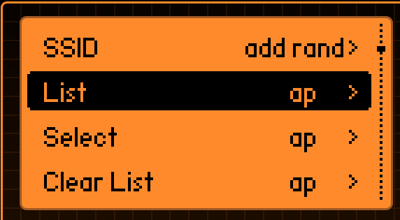
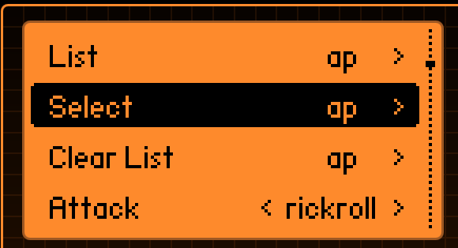
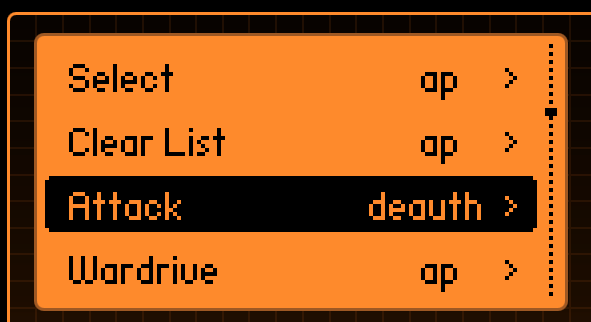
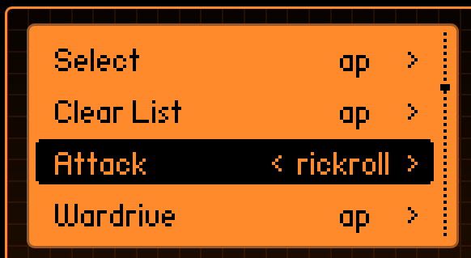

# Flipper Zero

## Out of the box

Once you've received your Flipper Zero, you will need to set it up.

### SD Card

You will need an SD card in order to play with your flipper zero, it is pretty much useless without it.  
You can not buy any SD card, you will need a specific one, see [here](https://docs.flipperzero.one/basics/sd-card) the requirements.  
You can also check the same link to format the SD Card through the flipper. It is pretty straightforward.  
They mention in the documentation that it is not necessary to buy one that is more than 32 GB even though it will still work with more.  
[Here](https://a.co/d/2WEUbgd) is the one I got from Amazon Canada.

### Update firmware

Once the SD card is inserted and formatted, you will be able to update the firmware. Here is how to do this:

1. Get the app on your computer from this [link](https://docs.flipperzero.one/qflipper)
2. Install it
3. Plug your flipper to your computer and update the firmware, really straightforward as well.

> For more information, you have the full chapter about the firmware update in the documentation [here](https://docs.flipperzero.one/basics/firmware-update).

## Infrared

### Clone a remote

Once again something really simple you can clone a remote. Here is how to do it:

1. In the menu go to Infrared
2. Click on learn new remote
3. Point the remote at the IR port and push the button you wish to clone (every button will be saved separately)

Now you can use your flipper as a remote. Pretty cool.

## Flash the Xtreme firmware

- Thanks to Shuriken Hacks you can see how to do this in his video :)

 Shuriken Hacks -  Installing Xtreme Firmware on Flipper Zero — Xtremely Easy!   

- Check out the ios attacks you can try with it [here](../mobile-app/ios.md)

## WiFi Dev board

If you have the WiFi dev board, you can use it like you would use a pineapple wifi.  

### Marauder

Steam Labs has an amazing video about this:  

 Flipper Zero - How to run Marauder on the WiFi Dev Board - ESP32 - Rick Roll   

Here are the steps (some from the video some you have to do prior):

1. (Prior watching the video) Flash your flipper with a firmware that has the marauder attack, Steam labs uses the Rogue Master firmware, I use the Xtreme firware (you can see above how to flash it)
2. Flash the firmware on the devboard. Steam labs uses [this one by UberGuidoZ](https://github.com/UberGuidoZ/Flipper/tree/main/Wifi_DevBoard/FZ_Marauder_Flasher)
3. Enumerate the wifi availables, find the wifi you are targeting (⚠️reminder to stay legal and ethical⚠️). (from the "List" item in the menu)  
      
    Write down the number of the wifi you are targeting  
4. Select the targeted wifi from the "Select" item in the menu  
      
5. Launch deauth attack from the "Attack" item in the menu  
    
6. Launch rickroll attack from the "Attack" item in the menu  
    

### Evil portal

  

## Music Player

- You have a music player in the flipper zero.  
- I changed the path but in mine it is here  
  
- You will have to put the music files in this folder. They can be txt file or fmf (flipper music file)  
  

### Make your own music

- You want to make your own music. It is possible. Use [this RTTTL Online tool](https://adamonsoon.github.io/rtttl-play/) to hear what it is going to look like.
- And then you can use [this documentation by neverfa11ing](https://github.com/neverfa11ing/FlipperMusicRTTTL) to create the file. I really like the image he shared. It is really comprehensive in one look  
  
- [This documentation by tonsil](https://github.com/Tonsil/flipper-music-files) is also really good

### Convert Solfege notation to Letter notation

- To convert notes to letter notation. If you are like me and never remember how to convert solfege notation to letter, here is a matrice

|Solfege notation|Letter notation|
|--|--|
|DO|C |
|RE|D |
|MI|E |
|FA|F|
|SOL|G|
|LA|A|
|SI|B|  

### Where is flat?

- If you want a flat (bemol) you will need to use you musician skills. I could not find a way to make a bemol except by using its sharp equivalent so for example if you want mib you will need to use re#.
- Here are a few possibilities for this scenario
  - reb is do# = C#
  - mib is re# = D#
  - solb is fa# = F#
  - lab is sol# = G#
  - sib is la# = A#
  - fab is mi = E
  - dob is si = B

### Tempo

- To calculate the tempo we use a metronome one click of a metronome is a beat.   

|Italian | English | BPM |
|--------|--------|------|
|Largo |	Large |	40 - 60 |
|Lento	|Slow	|52 - 68|
|Adagio|	Adagio|	60 - 80|
|Andante|	Andante|	76 - 100|
|Moderato	|Moderate|	88 - 112|
|Allegretto| Allegretto|	100 - 128|
|Allegro	|Allegro|	112 - 160|
|Vivace|	Lively|	120 - 140|
|Presto|	Fast|140 - 200|
|Prestissimo|	Very fast|140 - 200|

- Depending on the piece the tempo will be different. You will have to calculate according to this. These images from flowkey can help us. We can assume (even though it is not always true) that for example if it says on a music sheet allegro moderato 120 the quarter note will be 120 bpm and we will calculate the other according to this.

  
  

### My music files

- [Here](https://github.com/CSbyGB/pentips/tree/main/flipper-zero-music-file) is a link to the folder where I will put the music files I will make using this methodology.

### Resources for music with flipper Zero

- [flipper music files - Tonsil](https://github.com/Tonsil/flipper-music-files)
- [An RTTTL Parser Class by marco c on Arduino++](https://arduinoplusplus.wordpress.com/2019/12/23/an-rtttl-parser-class/)
- [Apprendre le solfege](https://www.apprendrelesolfege.com/)
- [Flowkey](https://www.flowkey.com/en/piano-guide/reading-notes)
- [FlipperMusicRTTTL - neverfa11ing](https://github.com/neverfa11ing/FlipperMusicRTTTL)

## Using a Flipper Zero to access API source code on IoT devices

- See Dana Epp's blog article [here](https://danaepp.com/using-a-flipper-zero-to-access-api-source-code-on-iot-devices) for a detailed explaination on how to do this

## Customization & 3D prints

### Dev Board Case

- [Flipper zero Dev board case - Urgirlinmyjetta316](https://www.thingiverse.com/thing:5798965)
- [Case for Flipper Zero Wi-Fi Module v1](https://www.printables.com/fr/model/179910-case-for-flipper-zero-wi-fi-module-v1)

### Desktop Stand

- [Flipper Zero Desktop Stand - Jake Anderson](https://www.printables.com/fr/model/363539-flipper-zero-desktop-stand)

### GPIO Cover

- [Flipper Zero GPIO Cover - joelspiers15](https://www.thingiverse.com/thing:5757435)
- [Flipper Zero SD cover - hk4fun](https://www.thingiverse.com/thing:5805754)

## Resources

### Official links

 Official Documentation   
 Official Website   
 Official Discord Server   
 Official Twitter   
 Self diagnose and repair guide   
  flipper-questions-and-answers   

### Tutorials, Cheatsheet & Resources

 Flipper Zero Tutorial 2024: Best Beginner’s Guide (Easy Steps) - StationX   
 Flipper Zero Topic on Github  
 The Ultimate Guide / CheatSheet to Flipper Zero - Ilias Mavropoulos  
 Joas' flipper zero resources  
 Awesome flipperzero - djsime1  
 David Bombal Flipper Zero next level  
 In french - Blogmotion - Flipper Zero   
 Tamagotchi Hacking Tool, Flipper Zero Unboxing and Review  - Modern Broadcast   
 Flipper Zero Teardown - Flipper Devices (and 7 other contributors)   
 3 Flipper Zero Hacks to Wow Your Friends (and How They Work) - James Bore  
 Flipper Zero Hacking my House | Huson DIY | TV's and Remote Sockets - Huson DIY   
 Playground (and dump) of stuff I made, modified, researched, or found for the Flipper Zero. - UberGuidoZ   
 Flipper Zero - Hacktricks   
  Flipper-Zero-Sub-GHz-Jamming-Files - SHUR1K-N   
 Flipper Zero's BadKB Files (from my YouTube video) - SHUR1K-N  
 Flipper Zero Topic on Github  

### Github projects

- [Flipper Zero QR Code](https://github.com/bmatcuk/flipperzero-qrcode)

### Attacks

  A Flipper Zero Introduction Tutorial: How to use Bad USB - Modern Broadcast   
 Educational BadUSB Scripts for Cybersecurity Learning - Christoffer Lundh  
A step-by-step guide on exploiting BLE on iOS 17 & Android via Flipper Zero - Jason Martin   
 Bad-usb works on IOS iphone flipper zero - Jando   
How To: Wireless BadUSB Attacks w/ the Flipper Zero - The Computer Noob   
 Flipper Zero: BLE Imitation of Apple Device Pairings - Sam's eXperiments logs   
 How charging your phone can compromise your data using Juice Jacking attack - Mobile Hacker   
Unlocking a Phone with a Flipper Zero - CorSecure  
  Flipper Zero - How to run Marauder on the WiFi Dev Board - ESP32 - Rick Roll - Steam Labs   
  Flipper Zero: How To Run Marauder on the WiFi Dev Board - Just call me koko   
 Bluetooth Impersonation attacks   

### People, companies or org to follow

- [Derek Jamison - Github](https://github.com/jamisonderek)
- [Derek Jamison - Youtube](https://www.youtube.com/@MrDerekJamison)
- [Sam's eXperiments logs - Youtube](https://www.youtube.com/@samxplogs)
- [Shuriken Hacks - Youtube](https://www.youtube.com/@shurikenhacks)
- [McSHUR1KEN (Shuriken Hacks) - Github](https://github.com/SHUR1K-N)
- [PenAce - Youtube](https://www.youtube.com/@PenAce/videos)
- [Lukas Stefano - Linkedin](https://www.linkedin.com/in/lukasstefanko/)
- [Talking Sasquach - Youtube](https://www.youtube.com/@TalkingSasquach)
- [Modern Broadcast - Youtube](https://www.youtube.com/@ModernBroadcast)
- [David Bombal - Youtube](https://www.youtube.com/@davidbombal)
- [Jando - Youtube](https://www.youtube.com/@Jandodev)
- [The Computer Noob - website](https://thecomputernoob.com/)
- [CorSecure - Youtube](https://www.youtube.com/@CorSecure)
- [Mr ExtraRandom - Youtube](https://www.youtube.com/@Mr.ExtraRandom/videos)
- [Kanjian FR - Youtube (in french only)](https://www.youtube.com/@kanjian_fr/videos)
- [I am Jakoby - Github](https://github.com/I-Am-Jakoby)

### Firmwares

- [Official firmware](https://github.com/flipperdevices/flipperzero-firmware)
- [Xtreme firmware](https://github.com/Flipper-XFW/Xtreme-Firmware)
- [RogueMaster Firmware](https://github.com/RogueMaster/flipperzero-firmware-wPlugins)
- [Momentum Firmware](https://github.com/Next-Flip/Momentum-Firmware)

### RFID

- [Flipper zweo tutorials - RFID - Jamisonderek](https://github.com/jamisonderek/flipper-zero-tutorials/tree/main/rfid)

### BadUSB

- [BadUSB payloads - I Am Jakoby](https://github.com/I-Am-Jakoby/Flipper-Zero-BadUSB/tree/main/Payloads)
- [badusb - FalsePhilosopher](https://github.com/FalsePhilosopher/badusb)

### SubGHz

- [flipper zero Gate Bruteforce - Hong5489](https://github.com/Hong5489/flipperzero-gate-bruteforce)
- [Flipper zero bruteforce - tobiabocchi](https://github.com/tobiabocchi/flipperzero-bruteforce)
- [Flipper zero SubGHz - Shur1k-N](https://github.com/SHUR1K-N/Flipper-Zero-Sub-GHz-Jamming-Files/tree/main)
- [Ubers SD Files - skizzophrenic](https://github.com/skizzophrenic/Ubers-SD-Files)
- [Flipper Sub-GHz - UberGuidoz](https://github.com/UberGuidoZ/Flipper/tree/main/Sub-GHz)

### Games

 You Can Now Play Doom in the Tamagotchi-Like Hacking Device  

### Blue Team Flipper tools

- [Wall of flippers - K3YOMI](https://github.com/K3YOMI/Wall-of-Flippers)

### Tools

 Flipper Maker - Generate flipper Files  
 Flipper Labs  
