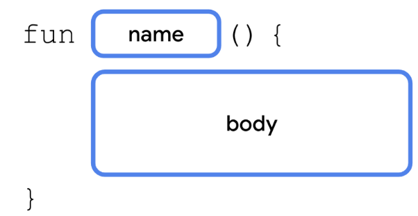

# Kotlin

> I made these notes using the [Developer Android Course](https://developer.android.com/courses)

- We can use the Kotlin playground [here](https://developer.android.com/training/kotlinplayground) to practice.

## Hello World in Kotlin

```kotlin
fun main() {
    println("Hello, World!")
}
```

## Style guide

- Function names should be in camel case and should be verbs or verb phrases.
- Each statement should be on its own line.
- The opening curly brace should appear at the end of the line where the function begins.
- There should be a space before the opening curly brace.
- The function body should be indented in by 4 spaces. Do not use a tab character to indent your code, type in 4 spaces.
- The closing curly brace is on its own line after the last line of code in the function body. The closing brace should line up with the fun keyword at the beginning of the function.
- See the full Kotlin style guide [here](https://developer.android.com/kotlin/style-guide)

## Variables

### Data Types


> Source Developer Android

- More about Double [here](https://kotlinlang.org/docs/numbers.html#floating-point-types)
- More about variables [here](https://play.kotlinlang.org/byExample/01_introduction/03_Variables)
- [Basic types](https://kotlinlang.org/docs/basic-types.html)
- [String templates](https://kotlinlang.org/docs/basic-syntax.html#string-templates)
- [Keywords and operators](https://kotlinlang.org/docs/keyword-reference.html)
- [Basic syntax](https://kotlinlang.org/docs/basic-syntax.html)

### Declaration


> Source Developer Android

- Variables that can be reassigned use the var keyword.

```kotlin
var x = 5 // `Int` type is inferred
```

- Constants have to be declared using `val`
- val keyword - Use when you expect the variable value will not change.
- var keyword - Use when you expect the variable value can change.
- Constants in Kotlin [here](https://developer.android.com/kotlin/style-guide#constant_names)

## Comments

```kotlin
// this is a comment
/* 
* This is a multiple
* lines
* comment
*/
```

## Functions

### Function declaration


> Source Developer Android

- Example

```kotlin
fun birthdayGreeting(): String {
    println("Happy Birthday, Rover!")
    println("You are now 5 years old!")
}
```

### Declaring a function with a return type


> Source Developer Android

- Example

```kotlin
fun birthdayGreeting(): String {
    val nameGreeting = "Happy Birthday, Rover!"
    val ageGreeting = "You are now 5 years old!"
    return "$nameGreeting\n$ageGreeting"
}
```

### The Unit type

By default, if you don't specify a return type, the default return type is Unit. Unit means the function doesn't return a value. Unit is equivalent to void return types in other languages

### Store a function in a var

```kotlin
fun main() {
    val greeting = birthdayGreeting()
}
```

### Function with a parameter

- Declaration


> Source Developer Android

- Example

```kotlin
fun birthdayGreeting(name: String): String {
    val nameGreeting = "Happy Birthday, $name!"
    val ageGreeting = "You are now 5 years old!"
    return "$nameGreeting\n$ageGreeting"
}
```

> :warning: Warning: Unlike in some languages, such as Java, where a function can change the value passed into a parameter, parameters in Kotlin are immutable. You cannot reassign the value of a parameter from within the function body.

## Resources

 Official Android Training courses   
 Kotlin Documentation   
 W3Schools Kotlin Tutorial   
