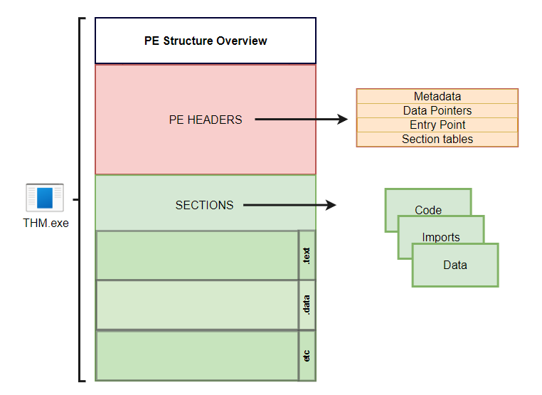

# AV Evastion: Shellcode

## Portable Executable

### What is it?

Windows Executable file format, aka PE (Portable Executable), is a data structure that holds information necessary for files.  
  

- `.text` stores the actual code of the program
- `.data` holds the initialized and defined variables
- `.bss` holds the uninitialized data (declared variables with no assigned values)
- `.rdata` contains the read-only data
- `.edata`: contains exportable objects and related table information
- `.idata` imported objects and related table information
- `.reloc` image relocation information
- `.rsrc` links external resources used by the program such as images, icons, embedded binaries, and manifest file, which has all information about program versions, authors, company, and copyright!

Example steps in which the Windows loader reads an executable binary and runs it as a process

1. Header sections: DOS, Windows, and optional headers are parsed to provide information about the EXE file. For example,

   - The magic number starts with "MZ," which tells the loader that this is an EXE file.
   - File Signatures
   - Whether the file is compiled for x86 or x64 CPU architecture.
   - Creation timestamp.

2. Parsing the section table details, such as

   - Number of Sections the file contains.

3. Mapping the file contents into memory based on

   - The EntryPoint address and the offset of the ImageBase.
   - RVA: Relative Virtual Address, Addresses related to Imagebase.

4. Imports, DLLs, and other objects are loaded into the memory.
5. The EntryPoint address is located and the main execution function runs.

### How to store shellcode in PE (Examples)

1. Defining the shellcode as a local variable within the main function will store it in the .TEXT PE section.
2. Defining the shellcode as a global variable will store it in the .Data section.
3. Another technique involves storing the shellcode as a raw binary in an icon image and linking it within the code, so in this case, it shows up in the .rsrc Data section.
4. We can add a custom data section to store the shellcode.

### PE-Bear

PE-Bear is a software which helps to check the PE structure: Headers, Sections, etc. PE-Bear provides a graphic user interface to show all relevant EXE details.

- We can get it [here](https://github.com/hasherezade/pe-bear-releases)

**REST COMING SOON**

## Resources

- This documentation has been made from my notes of this room on TryHackme:  
 Tryhackme - AV Evasion: Shellcode   

- Other convenient resources on the subject includes  
 [Backdoor 101] Backdooring PE File by Adding New Section Header - Capt. Meelo   
 Backdooring PE Files with Shellcode - ired.team   
