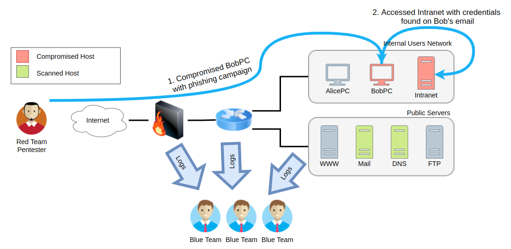
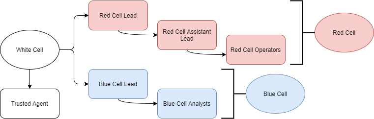
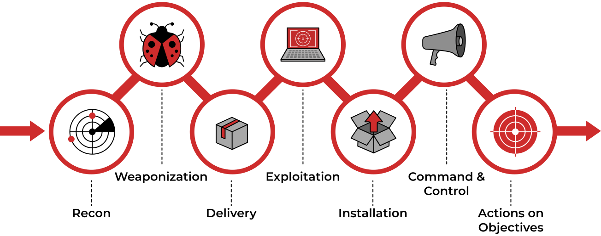

# Red Team

## What is it?

Red team engagements were designed to shift the focus from regular penetration tests into a process that allows us to clearly see our defensive team's capabilities at detecting and responding to a real threat actor. They don't replace traditional penetration tests, but complement them by focusing on detection and response rather than prevention.

## Related vocabulary

- **TTPs**: Red team engagements consist of emulating a real threat actor's **Tactics, Techniques and Procedures (TTPs)** so that we can measure how well our blue team responds to them and ultimately improve any security controls in place.
- **Crown jewels or flags**: goals of a red team engagement ranging from compromising a given critical host to stealing some sensitive information from the target.  
- **Technical Infrastructure**: Like in a regular penetration test, a red team will try to uncover technical vulnerabilities, with a much higher emphasis on stealth and evasion.
- **Social Engineering**: Targeting people through phishing campaigns, phone calls or social media to trick them into revealing information that should be private.
- **Physical Intrusion**: Using techniques like lockpicking, RFID cloning, exploiting weaknesses in electronic access control devices to access restricted areas of facilities.

## Red Team methodology

- **Full Engagement**: Simulate an attacker's full workflow, from initial compromise until final goals have been achieved.
- **Assumed Breach**: Start by assuming the attacker has already gained control over some assets, and try to achieve the goals from there. As an example, the red team could receive access to some user's credentials or even a workstation in the internal network.
- **Table-top Exercise**:  An over the table simulation where scenarios are discussed between the red and blue teams to evaluate how they would theoretically respond to certain threats. Ideal for situations where doing live simulations might be complicated.

  
Source: TryHackMe

## Teams and functions

| Team | Definition |
|------|------------|
|Red Cell | A red cell is the component that makes up the offensive portion of a red team engagement that simulates a given target's strategic and tactical responses.|
|Blue Cell | The blue cell is the opposite side of red. It includes all the components defending a target network. The blue cell is typically comprised of blue team members, defenders, internal staff, and an organisation's management.|
|White Cell | Serves as referee between red cell activities and blue cell responses during an engagement. Controls the engagement environment/network. Monitors adherence to the ROE. Coordinates activities required to achieve engagement goals. Correlates red cell activities with defensive actions. Ensures the engagement is conducted without bias to either side.|

  
Source: TryHackMe

|Role|Purpose|
|----|-------|
|Red Team Lead|Plans and organises engagements at a high level—delegates, assistant lead, and operators engagement assignments.|
|Red Team Assistant Lead | Assists the team lead in overseeing engagement operations and operators. Can also assist in writing engagement plans and documentation if needed.|
|Red Team Operator | Executes assignments delegated by team leads. Interpret and analyse engagement plans from team leads.|

## Engagement Structure

*Based on Lockheed Martin Cyber Kill Chain standard*  

  
Source: TryHackMe

## Resources

- This documentation has been made from my notes of this room on TryHackme:  

 Tryhackme - Red Team Fundamentals   

- Standards:

 Lockheed Martin Cyber Kill Chain   
 Unified Kill Chain   
 Varonis Cyber Kill Chain   
 Active Directory Attack Cycle   
 MITRE ATT&CK Framework   

- Other convenient resources:  

 Redteam guide by Joe Vest and James Tubberville   
 Red Team Engagements - TryHackMe   