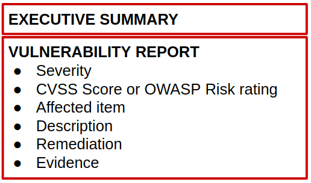

# How to report your findings

*This article will try to give some simple steps on how to write a pentest report and important elements that should be in it. It aims to give professionals new to the field some advices on how to write a report for exams or for customers. It can also be used by bug hunters (the vulnerability report part).*

## Why do we need a report?

A report is the document that will present all your findings and explain to every role of the company you’ve been hired by for the mandate. It will contain the scope previously defined with your customer, high level explainations of the findings and their impact as well as precise technical descriptions of every finding. There are different parts in a report.

## The Executive summary

This is the part where you need to explain for the executive of the company who will read the report. It needs to be high level explainations with no technical details.

It is relevant to add graphs of the findings such as: Vulnerabilities by impact, Attacks by type and Vulnerabilities by cause.

The definitions on [Mitre CWE](https://cwe.mitre.org/data/definitions/1000.html) can help you for defining the categories to use in those graphs.

It can comport a global posture on how the findings and attack combinaison could impact your customer’s business.
It can be also useful to include a remediation priority based on your expertise and the prior discussions you had with your customer.

## The vulnerability report

This is the part where you present each vulnerability you found. I recommend that you order those by severity.

Each vulnerability should have a score that you can calculate using CVSS scores. Here is a calculator. This score takes in account precise metrics to generate a score as close as possible to the impact the vulnerability could have. However, depending on the context of your customer the impact might not be the same, this will be your expertise and the prior conversation that you had with your customer about their business that will help you define the impact for your customer. You don’t need to tamper the CVSS metrics, this is the goal of the remediation priority i mentioned in the previous part.

Here is a way to present it:

- Severity
- [CVSS score](https://nvd.nist.gov/vuln-metrics/cvss) or [OWASP Risk Rating](https://owasp.org/www-community/OWASP_Risk_Rating_Methodology)
- Affected item
- Description: you have to explain the vulnerability and explain it in the context of your target. For example: « In the context of the support page, some checks were made on the client side, but those checks could be bypassed. »
  Feel free to add resources about the vulnerability
- Remediation: Here you have to explain how to mitigate the vulnerability. It is always good to add resources from recognized industry standards like [OWASP](https://owasp.org/) for web pentesting reports.
- Evidence: Here you need to add proof of the vulnerability.
  The goal is that the team that will implement the mitigation is able to reproduce the attack. That is why it is important that during the attacking phase you write plenty of notes and take plenty of screens and proofs.
*Note: I personaly prefer when each vulnerabilty is presented with the remediation but you can also write a remediation report part right after this.*

## Schema of a full report

  
*Structure of a report*

## Resources

 Great template done by Andrew Morrison - docx   
 Great template done by Andrew Morrison - odt   
  A website with multiple pentest reports   
- Pentext is a collection of XML templates, XML schemas and XSLT code, which combined provide an easy way to generate IT security documents including test reports
 Pentext 
- Pentest standards about reporting
 Pentest standards 
- Radically Open Security provides in their portfolio some reports of project they did. Thoses are good examples.
 Radically Open Security 
- MITRE ATT&CK is a globally-accessible knowledge base of adversary tactics and techniques based on real-world observations.
 MITRE ATT&CK 
- CWE is a community-developed list of software and hardware weakness types. It serves as a common language, a measuring stick for security tools, and as a baseline for weakness identification, mitigation, and prevention efforts.
 CWE 
- OWASP list of vulnerabilities (for web pentesting)
 OWASP 
- Exploit db is a great resource for exploitation
 Exploit db 
- National Vulnerability Database by the US CERT
 National Vulnerability Database 
 Mutliple Public pentest reports   
 Example of report - TCM-sec.com 

 Analysis-Report Chinese Police App “BXAQ” 03.2019   
 Analysis-Report Chinese Police App “IJOP” 12.2018   
 Analysis-Report “Study the Great Nation” 08.-09.2019   
