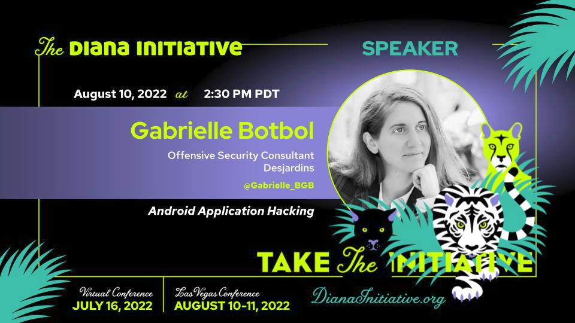

# Slides and Resources for my talk Android Application Hacking for The Diana Initiative 2022

## Recording of my talk

 Android Application Hacking - The Diana Initiative 2022 

## Slides

- [Android Application Hacking - TDI 2022 - Slides](https://github.com/CSbyGB/pentips/blob/main/.res/android-app.pdf)

## Videos from slides

 Create an emulator   
 Configure Burp   
 General Tips for static analysis   
 BG capture   

## Resources

- For all the resources and more check out my page dedicated to [Android App pentest here](../mobile-app/android.md)  
