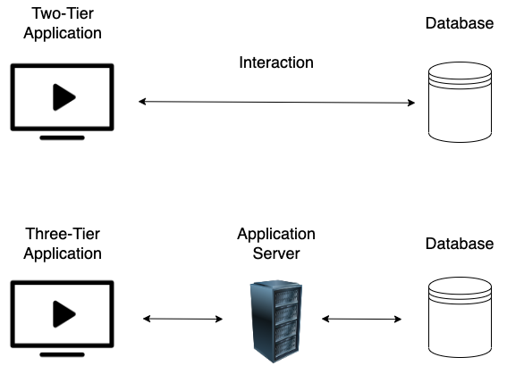
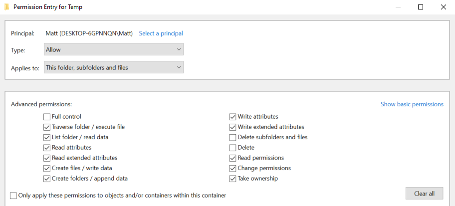
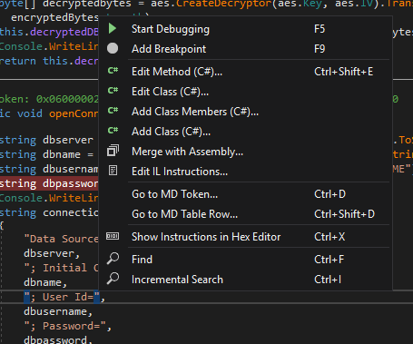
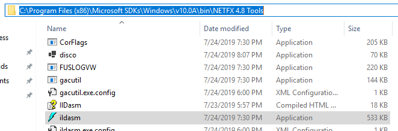

# Thick client

> This documentation is mostly made from notes of my practice.  
> I then completed it with the Chapter "Attacking Thick Client Applications" from the [HTB Academy](https://academy.hackthebox.com) Module called "Attacking Common Applications".  
> I also completed it with the Udemy course [Mastering thick client application penetration testing by Srinivas](https://www.udemy.com/course/mastering-thick-client-application-penetration-testing/)

## Definition

A thick client, or a fat or rich client, is a software application or system architecture that relies on a substantial amount of processing power and resources on the client side, typically a user's computer or device. The following features characterize thick clients:

- Local Processing: Thick clients perform significant data processing and application logic on the user's device. They can function independently of a continuous internet connection, as they don't rely heavily on server-side processing.

- Rich User Interface: Thick clients often provide a rich and interactive user interface with features like responsive graphics, real-time updates, and advanced user experiences.

- High Resource Requirements: Because thick clients rely on local resources, they consume more memory, processing power, and storage space on the user's device than thin clients or web applications.

- Installation Required: Thick clients typically require installation on the user's device. Users need to download and install the software package before using the application.

- Updates May Require User Action: When updates or patches are released for thick client applications, users may need to download and install them manually. On the other hand, web applications can be updated centrally on the server side.

Examples of thick clients include:

- Desktop applications like Microsoft Office Suite, Adobe Creative Suite, and video games installed on a computer or gaming console.
- Some financial trading platforms that offer real-time data analysis and trading capabilities.
- Media editing software such as Adobe Photoshop or Adobe Premiere that require substantial processing power for tasks like photo or video editing.
- CAD (Computer-Aided Design) software used by engineers and designers for creating 3D models.

Thick clients can offer advantages such as improved performance, offline functionality, and a more responsive user interface.  
Still, they also come with challenges like the need for frequent updates, potential security vulnerabilities, and higher resource demands on the user's device.  
The choice between thick clients, thin clients, or web applications depends on the specific requirements and constraints of a given project or application.

> The following is a complement from HTB Academy

Thick client applications can be categorized into two-tier and three-tier architecture. In two-tier architecture, the application is installed locally on the computer and communicates directly with the database. In the three-tier architecture, applications are also installed locally on the computer, but in order to interact with the databases, they first communicate with an application server, usually using the HTTP/HTTPS protocol. In this case, the application server and the database might be located on the same network or over the internet. This is something that makes three-tier architecture more secure since attackers won't be able to communicate directly with the database.  



> Image from HTB Academy

Web-specific vulnerabilities like XSS, CSRF, and Clickjacking, do not apply to thick client applications. However, thick client applications are considered less secure than web applications with many attacks being applicable, including:

- Improper Error Handling.
- Hardcoded sensitive data.
- DLL Hijacking.
- Buffer Overflow.
- SQL Injection.
- Insecure Storage.
- Session Management.

## Methodology to pentest thick client

> Section made with HTB Academy and Mastering thick client application penetration testing by Srinivas course on Udemy

### Information Gathering

In this step, penetration testers have to identify the application architecture, the programming languages and frameworks that have been used, and understand how the application and the infrastructure work. They should also need to identify technologies that are used on the client and server sides and find entry points and user inputs. Testers should also look for identifying common vulnerabilities

Tips from Srinivas:

- Explore the functionalities of the Application
- Understand the architecture of the Application
- Check out the client's communications in the network
- See what files can be accesses by the client
- Look for juicy files

#### Explore with CFF Explorer

We open CFF explorer, We open the application we want to analyze from the file menu.  
Then we get a window with info about our executable

#### Explore with Procmon

We open procmon, it will show all the processes.  
We can set up a filer by going to filter and set it to "Process Name is `<Name of the App you are analyzing (ex: myapp.exe)>`"  
We click Add, Apply and OK  
It will show an empty window (except if you have already launch your app) so now we just need to launch our app.  
We will then see the processes related to our app.  
Interesting things to check:

- Do any configuration now to see if any file is change
- Connect now to see if your app is going to use configuration files or anything
- Explore what happens in the Registry Editor and see if any odd things are hapenning there

> At anypoint if procmon has to many entries, we can clear them

#### Traffic Analysis

If our app is using http we can intercept this traffic with burp.  
If it is not using HTTP we can use:

- Wireshark
- Echo Mirage
- MITM-Relay and burpsuite (we will be able to modify the requests)

##### Explore with tcpview

We can open tcpview and check what happens when we launch the application we want to analyze.  
This way we can have info on the ip addresses that the app we are analyzing is interacting with.  

##### Explore with wireshark

We can launch wireshark and capture the traffic from our loopback address.  
We can use filters using info from previous installation.  
We can also capture for a short period of time: launch wireshark, start capture, launch our app connect to it and stop the capture, then analyzing the traffic by following udp or tcp stream and exploring a little.  
Wireshark is a great tool, I really recommend this blog from Hacking Article to learn more about wireshark: [Wireshark for Pentester: A Beginner's Guide by Raj Chandel](https://www.hackingarticles.in/wireshark-for-pentesters-a-beginners-guide/).

##### Explore with EchoMirage

We open EchoMirage, we launch our app, we can then inject EchoMirage into our app we can then see each request that is sent. Everytime we click ok it will go to the next request.  
We can also change the request if we want to test some things out.

##### Explore with MITM-relay and burpsuite

Here I recommand using this article: [Thick Client Penetration Testing: Traffic Analysis by Raj Chandel on Hacking Articles](https://www.hackingarticles.in/thick-client-penetration-testing-traffic-analysis/) specifically the part called "Traffic Analysis via Burp Suite + MITM Relay"  

#### Information Gathering - Tools

- [CFF Explorer](https://ntcore.com/?page_id=388)
- [Detect It Easy](https://github.com/horsicq/Detect-It-Easy)
- [Process Monitor (Procmon)](https://learn.microsoft.com/en-us/sysinternals/downloads/procmon)
- [Strings](https://learn.microsoft.com/en-us/sysinternals/downloads/strings)

### Attack phase

#### Theory

##### Client Side Attacks

Although thick clients perform significant processing and data storage on the client side, they still communicate with servers for various tasks, such as data synchronization or accessing shared resources. This interaction with servers and other external systems can expose thick clients to vulnerabilities similar to those found in web applications, including command injection, weak access control, and SQL injection.

Sensitive information like usernames and passwords, tokens, or strings for communication with other services, might be stored in the application's local files. Hardcoded credentials and other sensitive information can also be found in the application's source code, thus Static Analysis is a necessary step while testing the application. Using the proper tools, we can reverse-engineer and examine .NET and Java applications including EXE, DLL, JAR, CLASS, WAR, and other file formats. Dynamic analysis should also be performed in this step, as thick client applications store sensitive information in the memory as well.

##### Client Side Attacks - Tools

- [Ghidra](https://www.ghidra-sre.org/)
- [IDA](https://hex-rays.com/ida-pro/)
- [OllyDbg](http://www.ollydbg.de/)
- [Radare2](https://www.radare.org/r/index.html)
- [dnSpy](https://github.com/dnSpy/dnSpy)
- [x64dbg](https://x64dbg.com/)
- [JADX](https://github.com/skylot/jadx)
- [Frida](https://frida.re/)

##### Network Side Attacks

If the application is communicating with a local or remote server, network traffic analysis will help us capture sensitive information that might be transferred through HTTP/HTTPS or TCP/UDP connection, and give us a better understanding of how that application is working.

##### Network Side Attacks - Tools

- [Wireshark](https://www.wireshark.org/)
- [tcpdump](https://www.tcpdump.org/)
- [TCPView](https://learn.microsoft.com/en-us/sysinternals/downloads/tcpview)
- [Burp Suite](https://portswigger.net/burp)

##### Server Side Attacks

Server-side attacks in thick client applications are similar to web application attacks, and penetration testers should pay attention to the most common ones including most of the OWASP Top Ten.

#### Methodology for specific attacks

##### Check for hardcoded credentials

To check for hardcoded credentials, we can just use the strings command and dump the outpu in a file as follow:

- `strings.exe C:\mythickclient-to-test.exe > C:\myfile-with-strings-output`

Than we can open the file with notepad and search specific strings such as: password, key etc.

##### Check for secrets in registery

> Tip from Udemy course Mastering thick client application penetration testing by Srinivas

- We can use regshot for this
- First we launch a shot without the application open
- Then we open the application play around a little
- We take a 2nd shot
- Finally we can compare in the output html file, we can search for the app name to see if anything shows up.
- If creds are stored in the registry we could try to change the username there and see if we can log in as another user.

##### Find connection string in memory

> Tip from Udemy course Mastering thick client application penetration testing by Srinivas

- We can use Process Hacker
- We open the app we need to analyze and let it connect to its db server
- We can then open ProcessHacker and look for our app in the process
- Then we right clik on our app we click properties > Memory > Strings we select if we want image and mapped or not and we change the length if necessary
- It will show us the strings from the memory
- This way we can find passwords to databases

> If we want to restrict our search we can lookup for a specific string that is often found in a database connection "Data Source"  
> Other interesting strings to look up are "Decrypt" or "Decrypted"

- Once we found creds we can try to connect to the database server

###### Without Process hacker

If we can not use process hacker, we can use the methodology from the article on [NetSpi by Austin Altmann](https://www.netspi.com/blog/technical/thick-application-penetration-testing/introduction-to-hacking-thick-clients-part-6-the-memory/)  
We go in task manager, we select our app we right click on it and select "Create a dump file" we can then run strings on the dump file using this command:  
`.strings.exe .BetaBank.DMP | Out-File -FilePath .BetaBank.DMP.txt` (replace Betabank by the name of the app you are analyzing)  

> Note: the strings command might take a while depending on the application you use so you might to interrupt once you feel like your ouput file is big enough.

##### SQL Injection

Just like in a web application we can try to find SQL injection.  
The payload will mostly be the same.

##### Side Channel Data leaks

> Tip from Udemy course Mastering thick client application penetration testing by Srinivas

We can go in the folder of the app we are analyzing and open the command prompt from there.  
We can then run our app and put the output of the execution of our app in a log file using the following command:  
`ourapp.exe > ourapp-logs.txt`  

We can then use the app and navigate use the functionalities.  
If we want to seperate functionalities we can stop the app and relaunch it with the following command to avoid overwriting in our logs: `ourapp.exe >> ourapp-logs.txt`

Once we are done we can analyzing the code and see if we find: creds, connection Strings or anything else interesting.

##### DLL Hijacking

DLL hijacking, in essence, involves a method of elevating privileges where a harmful DLL is placed within the trusted application's directory. Subsequently, this deceptive DLL loads alongside genuine DLLs when the application is executed, potentially serving as a means to establish a reverse shell, attain persistence, or accomplish command execution.

DLL Load order:

- Directory from the app
- Current directory
- System Directory `C:\Windows\System32`
- The 16-bit System directory
- The windows Directory
- The directories that are listed in the PATH environment variable

To see how our app loads the dll and if it is vulnerable to dll hijacking, we can launch procmon and apply the following filters:

- Process Name is ourapp.exe
- Path ends with dll
- Result is NAME NOT FOUND

Once the filters are applied we can launch our application and see what shows up.

If we find potential dlls we can create a malicious dll that will give us a reverse shell, create an admin user or launch powershell as admin. We can use msfvenom for this.  
[Here](https://csbygb.gitbook.io/pentips/tools/metasploit#generate-a-payload-with-msfvenom) are some infos on how to do this.  
Our dll must have the same name of the potentially vulnerable dll.
When our malicious dll are created and placed in the directory we can relaunch our app and see if our exploit worked.

###### Tools for DLL Hijacking

- [Procmon (sysinternals)](https://learn.microsoft.com/en-us/sysinternals/downloads/procmon)
- [DLLSpy](https://github.com/cyberark/DLLSpy)

## Tips

### General tips

> Thanks to my colleague Cristian for these pointers :)

- Try to find an app binary and decompile it
- Play with tools like procmon, wireshark, burp mitm and echo mirage
- Check what controls are implemented on the client side
- Check the traffic.
- Can you bypass authentication

### How to avoid suppression of Temp files in Win

> Tip found on HTB Academy

To do this, we right-click the folder where the temp files are created (it is usually named Temp) and under `Properties -> Security -> Advanced -> username -> Disable inheritance -> Convert inherited permissions into explicit permissions on this object -> Edit -> Show advanced permissions`, we deselect the Delete subfolders and files, and Delete checkboxes.  

  

Finally, we click `OK -> Apply -> OK -> OK` on the open windows.  
This way when we relaunch the app that creates temporary files we can keep them and explore them.  

### If you can not be admin on the serv where the app is

> Thanks to my colleague Samuel for the following points on this part

- Copy the app in a VM you can control
- Make a tunnel between your machine and the server where the app is installed
- Test only in static and try to reproduce what you find on the server

#### Other things worth trying

- Install your tools in win vm and transfer them with the install folder to your target.

#### How to transfer files

Most of the time trasnfert via SMB should work see [here for how to do it](https://csbygb.gitbook.io/pentips/post-exploitation/file-transfers#smb), but you can also try other ways if it does not work. See [here for more ways](https://csbygb.gitbook.io/pentips/post-exploitation/file-transfers).

### Find the binaries and access them or bypass access if protected

> Can happen in Citrix desktop for example

- Go to task manager and add details columns (right-click on "pid" and add columns), add command line columns or go to property to find the binary path.
- If you can't access the disk you want by typing "C:\" in the file browser, you can try accessing it by typing `\\127.0.0.1\c$` or `\\.\c$`.
- If these options don't work, you can try accessing it from the command line. In Powershell you can just `cd \\127.0.0.1\c$`.

> More info about this [here](https://community.spiceworks.com/topic/1970180-how-to-prevent-access-to-127-0-0-1-c-or-localhost-c)

### Read binaries and other Strings operations

- In the same way, when testing binaries on a Citrix, you can also open the files with notepad to see if there are any hardcoded credentials. It can be useful when you can ot install third party app.

- On powershell, you can use Strings.exe from sysinternal available [here](http://live.sysinternals.com/strings.exe). Then you can launch `strings.exe yourbinary.exe` and look for sensitive info, you can also grep on specific strings with a command like this `strings.exe yourbinary.exe | findstr key` this will grep on "key"

### Network

If you can not use wireshark or echo mirage you can compare your network state when the app is launched and when it is not.  

- Procmon, filter on process name and enable only network view
- We can then complete this with wireshark

#### Does the app open ports

- `netstat -ano | findstr LISTENING`
- For more command refer to network enumeration [here](https://csbygb.gitbook.io/pentips/windows/powershell-cmd#network-enumeration) and play around

### Check if an app is signed

> Tip from Udemy course Mastering thick client application penetration testing by Srinivas

We download [sigcheck from sysinternal](https://learn.microsoft.com/en-us/sysinternals/downloads/sigcheck).  
We can then use this command `sigcheck.exe our-app.exe` it will show wether it is signed or unsigned.  

### Compiler protections

To check if the app is properly compiled, we can use the tool called [binscope](https://www.microsoft.com/en-ca/download/details.aspx?id=44995).  
We can then launch it with the following command: `binscope.exe /verbose /html /logfile output.html our-app.exe`

The output will show a detailed report.

### Automatic analysis of the code

> Tip from Udemy course Mastering thick client application penetration testing by Srinivas

#### Visual Code Grepper

Get Visual Code Grepper [here](https://github.com/nccgroup/VCG).  
Install it.  
We open dotPeek.  
We open our app, we export the decompiled code from dotpeek in a convenient folder.  
We can then open visual code grepper we specify the folder with our decompiled app as our target directory. (we need to select the code in which the app is compiled)  
We can then scan it and analyze the findings.
We can also scan the original source code with it if it was provided by our customer.  

> Note: the instructor in the Udemy course, reminds that we should not rely on automatic tool. It is really important to remember.

## Reverse .NET Applications

> Tip from Udemy course Mastering thick client application penetration testing by Srinivas

### Using DotPeek and Visual Studio

In the example of the course, the instructor uses dotPeek to decompile the app and take the decrypt function.  
The objective is to decrypt a password found in a config file.  
He then writes another app with visual studio that uses the decrypt function found in the decompiled app.  
This gives us an idea of what we can use the decompiled app for.  

### runtime tracing with dnSpy

We can dnSpy and from file open we load our app in ndSpy.  
We can then browse in our app and click on fuctions or classes that looks interesting for our tests.  
If we find a function that we want to analyze further, we need to find in the code where the function is called and put a break point there by right clicking on the line and select add breakpoint in the context menu.  

  

We can then click on Start, choose our app and debug our function.  

> In the Udemy course, the instructor debugs a login function, to get the password and connection string to the database.

### Patch .NET applications

#### with ILSpy and Reflexil

- We need to download ILSpy
- We then download Reflexil and copy the dll in the ILSpy directory

  

- Then we open up ILSpy and we open our app with file > Open
- To make things more easy we can change the name of our app, because if we patch it we need to be able to differientiate them and not overwrite our executable.
- ILSpy has an option IL with C# that will allow us to see the c# code in comment. This way it will be more readable for us.
- Once we are in the place we want to make changes, we go to view > Reflexil and we can change the code the Reflexil window.

> In the Udemy course, the instructor changes the code to elevate privilege in the app.

#### With ilasm & Idasm

- IL Disassembler is located here: `C:\Program Files (x86)\Microsoft SDKs\Windows\v10.0A\bin\NETFX 4.8 Tools\ildasm.exe`

  

- IL Assembler is located here: `C:\Windows\Microsoft.NET\Framework\v4.0.30319\ilasm.exe`

```cmd
ildasm.exe our-app.exe
```

This will open a window with our app we can save our decompiled code somewhere convenient.  
We open the file our-app.il in notepad for example and then we can modify the code here and save our modified file.  

Once the code is modified we can recompile it with the following command

```cmd
ilasm.exe our-app.il
```

### Tools to Reverse .NET Applications

- dnSpy
- dotPeek
- ILSpy & Reflexil
- IL Assembler (comes with .NET framework)
- IL Disassembler (Comes with visual studio)

## Resources

### Blog and courses

#### Thick Client Pentest

- [Desktop Applications / Thick Clients - by Lisandre](https://lisandre.com/pentest/desktop-applications)
- [Thick Client Pentest: Modern Approaches and Techniques: PART 1](https://infosecwriteups.com/thick-client-pentest-modern-approaches-and-techniques-part-1-7bb0f5f28e8e)
- [Introduction to Hacking Thick Clients: Part 1 – the GUI by Austin Altmann](https://www.netspi.com/blog/technical/thick-application-penetration-testing/introduction-to-hacking-thick-clients-part-1-the-gui/)
- [Introduction to Hacking Thick Clients: Part 2 – The Network by Austin Altmann](https://www.netspi.com/blog/technical/thick-application-penetration-testing/introduction-to-hacking-thick-clients-part-2-the-network/)
- [Introduction to Hacking Thick Clients: Part 3 – The File System and Registry by Austin Altmann](https://www.netspi.com/blog/technical/thick-application-penetration-testing/introduction-to-hacking-thick-clients-part-3/)
- [Introduction to Hacking Thick Clients: Part 4 – The Assemblies by Austin Altmann](https://www.netspi.com/blog/technical/thick-application-penetration-testing/introduction-to-hacking-thick-clients-part-4-the-assemblies/)
- [Introduction to Hacking Thick Clients: Part 5 – The API by Austin Altmann](https://www.netspi.com/blog/technical/thick-application-penetration-testing/introduction-to-hacking-thick-clients-part-5-the-api/)
- [Introduction to Hacking Thick Clients: Part 6 – The Memory by Austin Altmann](https://www.netspi.com/blog/technical/thick-application-penetration-testing/introduction-to-hacking-thick-clients-part-6-the-memory/)
- [Attacking Thick Client Application by @j33n1k4](https://youtu.be/GeTkV1cWwRM?si=yhUv0D0rzY9iSf_F)
- [Thick Client Pentest - Cobalt Core Academy](https://www.cobalt.io/blog/cobalt-core-academy-thick-client-pentesting)
- [Thick Client Pentesting: Architecture, Tools and Testing Approaches - Payatu](https://payatu.com/blog/thick-client-penetration-testing/)
- [Thick Client Penetration Testing Methodology - Darkrelay](https://www.darkrelay.com/post/thick-client-penetration-testing)
- [Thick Client Application Security Testing - Optiv](https://www.optiv.com/insights/source-zero/blog/thick-client-application-security-testing)
- [Thick Client Pentesting Methodology - CyberArk](https://www.cyberark.com/resources/threat-research-blog/thick-client-penetration-testing-methodology)
- [OWASP KOLKATA MEETUP #2 - Thick Client Penetration Testing by Souvik Roy](https://youtu.be/V4RdppcosOs?si=4YHWqEiUFdU5XGoK)
- [Thick Client Security Assessment — I by SAKSHAM CHAWLA](https://medium.com/@chawla.saksham08/thick-client-security-assessment-i-bb02ac37e63)
- [Thick Client Security Assessment — II by SAKSHAM CHAWLA](https://medium.com/@chawla.saksham08/thick-client-security-assessment-ii-863526bfa88b)
- [Security Testing of Thick Client Application - David Valles](https://medium.com/@david.valles/security-testing-of-thick-client-application-15612f326cac)
- [Thick Client Pentesting by hexachordanu](https://github.com/hexachordanu/Thick-Client-Pentesting/tree/master)
- [Articles about thick client pentest on Hacking Articles by Raj Chandel](https://www.hackingarticles.in/?s=thick+client)

#### Resources - DLL Hijacking

- [Windows privesc, DLL Hijacking - CSbyGB Pentips](https://csbygb.gitbook.io/pentips/windows/privesc#dll-hijacking)
- [Have you ever hijacked a DLL?! - Michelle Eggers](https://www.linkedin.com/posts/m-eggers_cybersecurity-pentesting-penetrationtesting-activity-7102691799814610945-D0rl?utm_source=share&utm_medium=member_desktop)
- [All About DLL Hijacking - My Favorite Persistence Method - IppSec](https://youtu.be/3eROsG_WNpE?si=q2VoaY_1Sr-tNdA6)
- [Testing Applications for DLL Preloading Vulnerabilities by Karl Fosaaen](https://www.netspi.com/blog/technical/network-penetration-testing/testing-applications-for-dll-preloading-vulnerabilities/)
- [Dll Hijacking - Hacktricks](https://book.hacktricks.xyz/windows-hardening/windows-local-privilege-escalation/dll-hijacking)

#### Resources - Linux Shared Library Hijacking

- [Linux Shared Library Hijacking by Xavi](https://xavibel.com/2022/09/06/linux-shared-library-hijacking/)

#### Other related topics

- [Echo Mirage - Walkthrough on Infosec Institute by Chiragh Dewan](https://resources.infosecinstitute.com/topics/network-security-101/echo-mirage-walkthrough/)

### Checklists and Minmaps

- [Thick Client Pentest - Checklist by Hari Prasaanth](https://github.com/Hari-prasaanth/Thick-Client-Pentest-Checklist)
- [Thick Client Pentesting mindmap by Security Boat](https://workbook.securityboat.in/mindmaps/thick-client-pentest-mindmap)

### Labs to practice

- [Fatty box on HTB](https://app.hackthebox.com/machines/227)
- [BetaFast by NetSPI- vulnerable thick client to practice on](https://github.com/NetSPI/BetaFast)
- [DVTA 2.0](https://github.com/srini0x00/dvta)
  - [Setting up DVTA - Part 1 by Source Meets Sink](https://youtu.be/rx8mtI1HU5c?si=GW_lo3J2RsUvSjVw)
  - [Setting up DVTA - Part 2 by Source Meets Sink](https://youtu.be/IBdk2uOessc?si=SHCYnI4CYzRwIuvT)
- [Terrible-Thick-CLient by Kartikdurg](https://github.com/kartikdurg/Terrible-Thick-Client)
- [Another Vulnerable Thickclient by diljith369](https://github.com/diljith369/AVT)
- [It is a Broken App (IBA)](https://github.com/diljith369/IBA)

### Writeups

- [Thick Client Application Pen-Testing Lab | DVTA (Damn Vulnerable Thick Client Application) | Part-1 by Chaitanya Eshwar Prasad](https://youtu.be/6zFhuoPj8JE?si=LawN29MakqGg4Nv2)
- [Thick Client Application Pen-Testing Lab | DVTA (Damn Vulnerable Thick Client Application) | Part-2 by Chaitanya Eshwar Prasad](https://youtu.be/Cb-K8gB8pLo?si=TpOmE5rgYPScBQ_t)
- [Thick Client Application Pen-Testing Lab | DVTA (Damn Vulnerable Thick Client Application) | Part-3 by Chaitanya Eshwar Prasad](https://youtu.be/SbqJU1PcsE8?si=KDODm86bO0RZ8vre)
- [🎯 Thick Client Penetration Testing: Hands-on Practice with AVT (Another Vulnerable Thick Client) 🚀💻 by aalphaas](https://youtu.be/LCrPmtY83IA?si=eudMtRQiCxOnVRF5)
- [🎯 Thick Client Penetration Testing: Hands-on Practice Part 2 with IBA (It is a Broken App) by aalphaas](https://youtu.be/cCChPFkq4cY?si=XGUH5EccjOoUJtYg)

### Tools

- [Dependency walker](https://www.dependencywalker.com/)
- [Procmon (sysinternals)](https://learn.microsoft.com/en-us/sysinternals/downloads/procmon)
- [DLLSpy](https://github.com/cyberark/DLLSpy)
- [Wireshark](https://www.wireshark.org/)
- [tcpdump](https://www.tcpdump.org/)
- [TCPView](https://learn.microsoft.com/en-us/sysinternals/downloads/tcpview)
- [Burp Suite](https://portswigger.net/burp)
- [Ghidra](https://www.ghidra-sre.org/)
- [IDA](https://hex-rays.com/ida-pro/)
- [OllyDbg](http://www.ollydbg.de/)
- [Radare2](https://www.radare.org/r/index.html)
- [dnSpy](https://github.com/dnSpy/dnSpy)
- [x64dbg](https://x64dbg.com/)
- [JADX](https://github.com/skylot/jadx)
- [Frida](https://frida.re/)
- [The sysinternals suite](https://learn.microsoft.com/en-us/sysinternals/downloads/sysinternals-suite)
- [NetCore ExplorerSuite](https://ntcore.com/?page_id=388)
