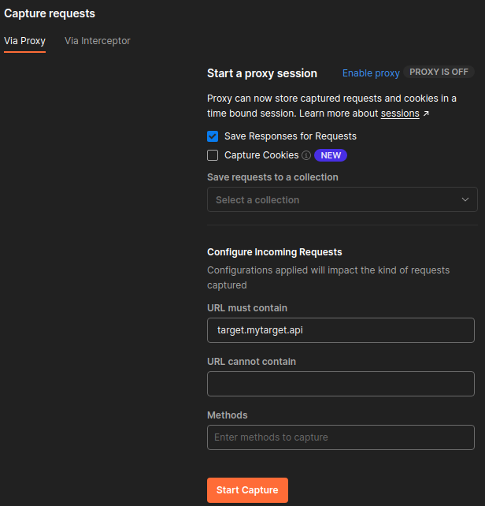

# API Tests

> I made this using my notes and research during pentests and self training.  
> I also used the **FREE** [course on API Sec by Corey Ball](https://university.apisec.ai/)  
> I really recommend that you check it out if not already.

## Make a lab for API pentest

-  Install a kali VM
  - Update it

```
sudo apt update -y
sudo apt upgrade -y
sudo apt dist-upgrade -y
```

- Install Burp Suite (its best if you can have a pro version)
  - Get the latest jython jar and install and specify the path in burp
  - Install Autorize from the store

- Install foxy proxy in firefox
- Set up burp certificate
- Set up MITMweb certificate
  - quit burpsuite if open
  - set foxyproxy on port 8080
  - get the certificate from mitm.it and install it

- Install postman `sudo wget https://dl.pstmn.io/download/latest/linux64 -O postman-linux-x64.tar.gz && sudo tar -xvzf postman-linux-x64.tar.gz -C /opt && sudo ln -s /opt/Postman/Postman /usr/bin/postman`
(check for the dl link of the latest version and adapt the previous command)

- Install mitmproxy2swagger `sudo pip3 install mitmproxy2swagger`

- Install git if necessary

- Install Docker `sudo apt-get install docker.io docker-compose`

- Install Go `sudo apt install golang-go`

- Set up the JSON Web Token Toolkit

```
git clone https://github.com/ticarpi/jwt_tool
cd jwt_tool
python3 -m pip install termcolor cprint pycryptodomex requests
(Optional) Make an alias for jwt_tool.py
sudo chmod +x jwt_tool.py
sudo ln -s /opt/jwt_tool/jwt_tool.py /usr/bin/jwt_tool
```

- Install Kiterunner (see more info below)

- Install Arjun `sudo git clone https://github.com/s0md3v/Arjun.git`

- Install Owasp Zap if necessary `sudo apt install zaproxy` update the Add-Ons

- Once you have done all this you can deploy a vulnerable api on another vm and connect it with your attacking machine. You will be all ready to practice.

### Install crAPI and vAPI

#### crAPI

- [Source](https://github.com/OWASP/crAPI)

```bash
mkdir ~/lab 
cd ~/lab
sudo curl -o docker-compose.yml https://raw.githubusercontent.com/OWASP/crAPI/main/deploy/docker/docker-compose.yml
sudo docker-compose pull
sudo docker-compose -f docker-compose.yml --compatibility up -d
```
- It may take a little while
- Access it locally `http://127.0.0.1:8025/` or `http://127.0.0.1:8888/`
- To stop crAPI `sudo docker-compose stop`

#### vAPI

- [Source](https://github.com/roottusk/vapi)

```bash
cd ~/lab
sudo git clone https://github.com/roottusk/vapi.git
cd vapi
sudo docker-compose up -d
```
> Note: make sure that your port 80 is free

## API Reconnaissance

- **Partner APIs** are intended to be used exclusively by partners of the provider. These might be harder to find if you are not a partner. Partner APIs may be documented, but documentation is often limited to the partner.

- **Private APIs** are intended for use, privately, within an organization. These APIs are often documented less than partner APIS, if at all, and if any documentation exists it is even harder to find.

### Things to look for

#### Obvious URL naming schemes

```bash
https://target-name.com/api/v1 
https://api.target-name.com/v1 
https://target-name.com/docs
https://dev.target-name.com/rest
```

#### dir names

```html
/api, /api/v1, /v1, /v2, /v3, /rest, /swagger, /swagger.json, /doc, /docs, /graphql, /graphiql, /altair, /playground
```

#### Subdomains

```html
api.target-name.com
uat.target-name.com
dev.target-name.com
developer.target-name.com
test.target-name.com
```

#### Request and Response headers

- Use of JSON and XML

```
HTTP Request and Response Headers containing "Content-Type: application/json, application/xml"

Also, watch for HTTP Responses that include statements like:
{"message": "Missing Authorization token"}
```

#### Information gathered using third-party resources

- [Gitub](https://github.com/) 
- [Postman Explore](https://www.postman.com/explore/apis)
- [ProgrammableWeb API Directory](https://www.programmableweb.com/apis/directory)
- [APIs Guru](https://apis.guru/)
- [Public APIs Github Project](https://github.com/public-apis/public-apis)
- [RapidAPI Hub](https://rapidapi.com/search/)

### Passive reconnaissance

> See OSINT chapter for more detailed explaination useful for passive recon in general

#### Google Dorking

| Google Dorking Query |  Expected results |
|----------------------|-------------------|
| `inurl:"/wp-json/wp/v2/users"` | Finds all publicly available WordPress API user directories.|
| `intitle:"index.of" intext:"api.txt"` | Finds publicly available API key files.|
| `inurl:"/api/v1" intext:"index of /"` | Finds potentially interesting API directories.|
| `ext:php inurl:"api.php?action="` | Finds all sites with a XenAPI SQL injection vulnerability. (This query was posted in 2016; four years later, there are currently 141,000 results.)|
| `intitle:"index of" api_key OR "api key" OR apiKey -pool` | This is one of my favorite queries. It lists potentially exposed API keys.|

#### Git Dorking

- Specify parameters: "filename:swagger.json" and "extension: .json"
- Search GitHub for your target organization’s name paired with potentially sensitive types of information, such as “api key,” "api keys", "apikey", "authorization: Bearer", "access_token", "secret", or “token.”

#### TruffleHog

- `sudo docker run -it -v "$PWD:/pwd" trufflesecurity/trufflehog:latest github --org=target-name`

#### API Directory

- [API Directory](https://www.programmableweb.com/apis/directory)

#### Shodan

| Shodan Queries |Purpose |
|----------------|--------|
|`hostname:"targetname.com"` | Using hostname will perform a basic Shodan search for your target’s domain name. This should be combined with the following queries to get results specific to your target.|
|`"content-type: application/json"`| APIs should have their content-type set to JSON or XML. This query will filter results that respond with JSON.|
|`"content-type: application/xml"`|This query will filter results that respond with XML.|
|`"200 OK"`|You can add "200 OK" to your search queries to get results that have had successful requests. However, if an API does not accept the format of Shodan’s request, it will likely issue a 300 or 400 response.|
|`"wp-json"`|This will search for web applications using the WordPress API.|

#### The Wayback Machine

- Allows you to check out historical changes to your target.
- Look for retired endpoints that still exist = Zombie APIs
- Finding and comparing historical snapshots of API documentation can simplify testing for Improper Assets Management.  

### Active Reconnaissance

#### Nmap

- We can run the following scan for any http port found
  - `nmap -sV --script=http-enum <target> -p 80,443,8000,8080`

#### OWASP Amass

- `amass enum -list` see which data sources are available for Amass (paid and free) 
- `sudo curl https://raw.githubusercontent.com/OWASP/Amass/master/examples/config.ini >~/.config/amass/config.ini` create a config file to add our API keys
- Register for a free Censys account [here](https://censys.io/register) 
- Once it is done and that the account is verified login on search [here](https://search.censys.io/)
- Go in my account and get your API ID and Secret
- Paste them in the config file with `sudo nano ~/.config/amass/config.ini`
- `amass enum -active -d target-name.com |grep api`
- `amass intel -addr [target IP addresses]`  collect SSL certificates, search reverse Whois records, and find ASN IDs associated to the target
- `amass intel -d [target domain] –whois` reverse whois on domain name
- `amass enum -passive -d [target domain]` passively enumerate subdomains
- `amass enum -active -d [target domain]` actively enumerate subdomains
- `amass enum -active -brute -w /usr/share/wordlists/API_superlist -d [target domain] -dir [directory name]` brute force subdomains with a wordlist

#### Gobuster

- `gobuster dir -u target-name.com:8000 -w /home/hapihacker/api/wordlists/common_apis_160` 

#### Kiterunner

- See the documentation below.

#### DevTools

- The devtools in firefox has a filter this way we can search for terms like API or v1 etc.
- We can use the copy as cURL function to import it in Postman we just need to select Import and click on Raw Text and then paste the cURL request.

## Misc tips

- With an API we need to check as many endpoints as possible sometimes an endpoint will be protected but another will not have the same protection.
- A great methodology to use is the one made by [David Sopas - MindAPI](https://dsopas.github.io/MindAPI/play/)
- To not forget also to try to enumerate id if for instance you have http://api/user/ try to put 1 in the end you might get user enumeration this way
- When interactig with json in burpsuite repeater if we find an endpoint we have to add the content type like this in the headers `Content-Type: application/json`

## Kiterunner

- We can fetch the latest release [here](https://github.com/assetnote/kiterunner) or follow the guide if we want to build the binary.
  - Large routes list in kite fetchable [here](https://wordlists-cdn.assetnote.io/data/kiterunner/routes-large.kite.tar.gz)
  - Small routes list in kite fetchable[here](https://wordlists-cdn.assetnote.io/data/kiterunner/routes-small.kite.tar.gz)

```
sudo git clone  https://github.com/assetnote/kiterunner.git
cd kiterunner
sudo make build
sudo ln -s /opt/kiterunner/dist/kr /usr/bin/kr
```

- Useful commands:
  - Basic scan: `kr scan https://<ip>/ -w routes-large.kite`
  - Pass the Bearer token (to avoid getting too many 403): `sudo ./kr scan https://<IP>/ -w routes-small.kite -H 'Authorization: Bearer TOKEN-HERE'`
  - We can specify in the url /api/vX if we have it but kiterunner can also find it for us with the basic scan.
    Alissa Knight's whitepaper explains this very well: *"By default, when depth isn’t specified, Kiterunner will scan a target at 1 level deep, meaning if you specified a target of server.com, Kiterunner would scan server.com/api. At level 2, it would scan server.com/api/R4 and at level 3, it would scan server.com/api/R4/patient."*
  - To send to Burp Suite append the command with: `--proxy=http://127.0.0.1:8080` (this is done with replay not with scan)

- Other interesting commands:
  - `kr brute <target> -w ~/api/wordlists/data/automated/nameofwordlist.txt` brute option will allow us to use txt files as wordlist
  - Replay requests:
  
  ```
  kr kb replay "GET     414 [    183,    7,   8]
  ://192.168.50.35:8888/api/privatisations/count 0cf6841b1e7ac8badc6e237ab300a90ca873d571" -w
  ~/api/wordlists/data/kiterunner/routes-large.kite
  ```

## Endpoint Analysis

### Reverse Engineering an API

If an API is not documented or the documentation is unavailable to you, then you will need to build out your own collection of requests.  

#### Manually with Postman

- It's better to sign up for a free account.
- We can create a new personal workspace
- Then we can create a new collection
- Now we will use the capture request feature so we will need to have added the postman proxy in foxy proxy previously
- Let's click on the button for this  

- We need to enable the proxy
- We can specify something like this and we need to specify an url  

- Start capture
- You can then move to the web browser and browse in your target interact with it and do as many things as you can think of. This will populate the requests in postman.
- Once you have browsed enough you can stop the capture
- Go back to your request and select the ones that seem to interact with an API.
- Add then to a collection  

- You can organize you collection say you have a path looking like api/folder1/something and one like api/folder2/something you can make a folder named folder1 and one named folder2 and organize your endpoints this way.

## RESTler

*"RESTler, developed at Microsoft, is the world’s first stateful API fuzzer that automatically generates tests and automatic execution by first reading the OpenAPI specification in order to automatically find vulnerabilities in the API."*

- Fetch it [here](https://github.com/microsoft/restler-fuzzer)
- *"If you receive a nuget error NU1403 when building, a quick workaround is to clear your cache with this command: $ dotnet nuget locals all--clear"*
- Quite a pain to install on kali.

## wfuzz

This tool will allow to enumerate methods for API which is really convenient. It is preinstalled on kali.
- `wfuzz -X METHOD -w /path/to/wordlist -u http://URL/FUZZ` where you see `FUZZ` it will replace with words from the wordlist and as for `METHOD` you can use GET POST and any other http verb
- if you add the option `--hc ` you can hide specific codes like 404 for instance `--hc 404,405`
- To pass a header in wfuzz (Say Authorization for instance) you can use `-H "myheader: headervalue"` you can use multiple header this way
- Check out this [doc](https://wfuzz.readthedocs.io/en/latest/user/basicusage.html) for more infor on this tool

## Convert Postman to OpenApi

- You can convert them using [Postman to OpenApi](https://github.com/joolfe/postman-to-openapi)
- `sudo apt install npm ` Install nmp if you do not have it
- `sudo npm i postman-to-openapi -g ` install postman to openapi cli mode
- `p2o myfile.postman_collection.json -f myfile.yml` convert your first file

## About response codes

- Do not neglect 400 codes, they can help you identify actual endpoint. For example 404 is not found but 401 is unauthorized.
- However be also aware that: 
  - Sometimes you will get unauthorized on every endpoint meaning that this theory won't work ;)
  - Sometimes waf will drop your requests or will give you a 200 with an error page

## Postman

### Setting up baseurl

To give the base url variable a valid value, select the root of the collection  
And on the middle panel select variables. Add your host in the current value (for instance https://myhost.com), select the url and select Set as variable.  
It should look like this:  
  
Set the proper authorization, configure postman with burp (if you do not know how check out Hakluke and Farah Hawa article in the resources below), and you should be able to send requests

### Bearer Token

If you use a bearer token and do not want to set up authentication, you can just add a current token in the Authozization tab or the collection's root.
**Important: Do not forget to Save your changes because it wont work if you don't**  
After this you just have to set the other to inherit auth from parent and you should be good to go.

## Resources

### Tools

 Postman 
 Kiterunner 
7 Essential Burp Extensions for Hacking APIs - Dana Epp  

### Courses, papers or articles

 APISEC University by Corey Ball   
 MINDApi by David Sopas   
 Go fuzz yourself - How to find more vulnerabilities through fuzzing - Alissa Knight   
 How to hack APIs in 2021 - Hakluke and Farah Hawa   
 Better API testing with postman - Mic Whitehorn-Gillam - Part 1   
 Better API testing with postman - Mic Whitehorn-Gillam - Part 2   
 Better API testing with postman - Mic Whitehorn-Gillam - Part 3   
 Better API testing with postman - Mic Whitehorn-Gillam - Part 4   
 API Security 101 - Vickie Lee   

### Wordlists

 Hacking-APIs Wordlist   

### Practice and labs

 The Completely Ridiculous API (crAPI)   
 vAPI   
 Portswigger - Web Security Academy   
 Bookstore - on TryHackMe  
 Pixi   
 Rest API Goat   
 dvws node   
 websheep   
