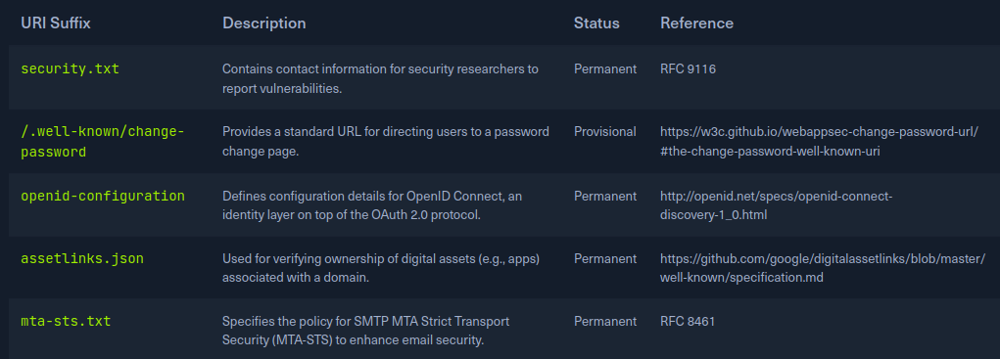

# Web - Enumeration

> Source: notes from my pentests, courses from HTB Academy and CTF

## Methodology

- When you get an url in your scope
  - Try directory busting
    - It can also be useful to do directory busting inside another directory previsouly found this way.  
    Obvious example: `http://mysit.com/blog/` you might want to check what other pages you could find inside this blog directory.
  - Try to enumerate subdomain
    - When working on CTF when we find a subdomain we need to add it to our /etc/hosts file
  - Check out if you find login pages
  - Check out if it uses vulnerable technology or else 
- We need to find as much information as possible from the following items:

|Area|Description|
|----|-----------|
|**Domains and Subdomains**|Often, we are given a single domain or perhaps a list of domains and subdomains that belong to an organization. Many organizations do not have an accurate asset inventory and may have forgotten both domains and subdomains exposed externally. This is an essential part of the reconnaissance phase. We may come across various subdomains that map back to in-scope IP addresses, increasing the overall attack surface of our engagement (or bug bounty program). Hidden and forgotten subdomains may have old/vulnerable versions of applications or dev versions with additional functionality (a Python debugging console, for example). Bug bounty programs will often set the scope as something such as *.inlanefreight.com, meaning that all subdomains of inlanefreight.com, in this example, are in-scope (i.e., acme.inlanefreight.com, admin.inlanefreight.com, and so forth and so on). We may also discover subdomains of subdomains. For example, let's assume we discover something along the lines of admin.inlanefreight.com. We could then run further subdomain enumeration against this subdomain and perhaps find dev.admin.inlanefreight.com as a very enticing target. There are many ways to find subdomains (both passively and actively).|
|**IP ranges**|Unless we are constrained to a very specific scope, we want to find out as much about our target as possible. Finding additional IP ranges owned by our target may lead to discovering other domains and subdomains and open up our possible attack surface even wider.|
|**Infrastructure**|We want to learn as much about our target as possible. We need to know what technology stacks our target is using. Are their applications all ASP.NET? Do they use Django, PHP, Flask, etc.? What type(s) of APIs/web services are in use? Are they using Content Management Systems (CMS) such as WordPress, Joomla, Drupal, or DotNetNuke, which have their own types of vulnerabilities and misconfigurations that we may encounter? We also care about the web servers in use, such as IIS, Nginx, Apache, and the version numbers. If our target is running outdated frameworks or web servers, we want to dig deeper into the associated web applications. We are also interested in the types of back-end databases in use (MSSQL, MySQL, PostgreSQL, SQLite, Oracle, etc.) as this will give us an indication of the types of attacks we may be able to perform.|
|**Virtual Hosts**|Lastly, we want to enumerate virtual hosts (vhosts), which are similar to subdomains but indicate that an organization is hosting multiple applications on the same web server.|

> Table from: Hackthebox Academy

## Passive Reconnaissance

### Names

When looking at a website check out names, usernames or emails mentioned there, they are worth writing down for later.
For instance if the website is part of a network pentest (internal or external network with a webmail interface accessible we can try them for password spraying attacks)

#### Namemash

Will output a list of usernames from list with firstname and lastname.  

Usage:  

```bash
python3 namemash.py names.txt
```

### WHOIS

- [WHOIS on Wikipedia](https://en.wikipedia.org/wiki/WHOIS)
- [RFC3912](https://datatracker.ietf.org/doc/html/rfc3912)
- [ICANN](https://www.icann.org/get-started)
- [Sysinternal whois - Windows](https://learn.microsoft.com/en-gb/sysinternals/downloads/whois)
- [Linux whois command man page](https://linux.die.net/man/1/whois)
- [Online whois lookup with domain tools](https://whois.domaintools.com/)

- `whois example.com` launch whois command on linus

### DNS

- [RFC 8482](https://www.rfc-editor.org/rfc/rfc8482)

#### nslookup

- `nslookup example.com` query A records
- `nslookup -query=A www.example.com` query A Records for a Subdomain
- `nslookup -query=PTR 31.13.92.36` query PTR Records for an IP Address
- `nslookup -query=ANY example.com` query ANY Existing Records
- `nslookup -query=TXT example.com` query TXT Records
- `nslookup -query=MX example.com` query MX Records

#### Dig

- `dig example.com @1.1.1.1` query A records
- `dig a www.example.com @1.1.1.1` query A records for a subdomain
- `dig -x 31.13.92.36 @1.1.1.1` query PTR Records for an IP Address
- `dig any example.com @8.8.8.8` query ANY Existing Records
- `dig txt example.com @1.1.1.1` query TXT Records
- `mx example.com @1.1.1.1` query MX Records

### Passive subdomain enumeration

#### VirusTotal

- [Virustotal](https://www.virustotal.com/gui/home/upload)  
To receive information about a domain, type the domain name into the search bar and click on the "Relations" tab.

#### Certificates

We can find lot of info from a certificate.  

- [Censys](https://search.censys.io/certificates)
- [Crt.sh](https://crt.sh/)
- Get our results in a JSON file

```bash
export TARGET="example.com"
curl -s "https://crt.sh/?q=${TARGET}&output=json" | jq -r '.[] | "\(.name_value)\n\(.common_name)"' | sort -u > "${TARGET}_crt.sh.txt"
```

> `curl -s`  Issue the request with minimal output.  
> `https://crt.sh/?q=<DOMAIN>&output=json` Ask for the json output.
> `jq -r '.[]' "\(.name_value)\n\(.common_name)"'` Process the json output and print certificate's name value and common name one per line.
> `sort -u` Sort alphabetically the output provided and removes duplicates.

- See the first 20 results `head -n20 example.com_crt.sh.txt`

- For a target using openSSL

```bash
export TARGET="example.com"
export PORT="443"
openssl s_client -ign_eof 2>/dev/null <<<$'HEAD / HTTP/1.0\r\n\r' -connect "${TARGET}:${PORT}" | openssl x509 -noout -text -in - | grep 'DNS' | sed -e 's|DNS:|\n|g' -e 's|^\*.*||g' | tr -d ',' | sort -u
```

## Automate passive enumeration

### TheHarverster

[TheHarvester](https://github.com/laramies/theHarvester) is a simple-to-use yet powerful and effective tool for early-stage penetration testing and red team engagements. We can use it to gather information to help identify a company's attack surface. The tool collects emails, names, subdomains, IP addresses, and URLs from various public data sources for passive information gathering.

- Modules

|Module name|Description|
|-----------|-----------|
|Baidu|Baidu search engine.|
|Bufferoverun|Uses data from Rapid7's Project Sonar - www.rapid7.com/research/project-sonar/|
|Crtsh|Comodo Certificate search.|
|Hackertarget|Online vulnerability scanners and network intelligence to help organizations.|
|Otx|AlienVault Open Threat Exchange - https://otx.alienvault.com|
|Rapiddns|DNS query tool, which makes querying subdomains or sites using the same IP easy.|
|Sublist3r|Fast subdomains enumeration tool for penetration testers|
|Threatcrowd|Open source threat intelligence.|
|Threatminer|Data mining for threat intelligence.|
|Trello|Search Trello boards (Uses Google search)|
|Urlscan|A sandbox for the web that is a URL and website scanner.|
|Vhost|Bing virtual hosts search.|
|Virustotal|Domain search.|
|Zoomeye|A Chinese version of Shodan.|

- We can create a file with our sources

```txt
baidu
bufferoverun
crtsh
hackertarget
otx
projecdiscovery
rapiddns
sublist3r
threatcrowd
trello
urlscan
vhost
virustotal
zoomeye
```

```bash
export TARGET="example.com"
cat sources.txt | while read source; do theHarvester -d "${TARGET}" -b $source -f "${source}_${TARGET}";done
```

- `cat *.json | jq -r '.hosts[]' 2>/dev/null | cut -d':' -f 1 | sort -u > "${TARGET}_theHarvester.txt"` extract all the subdomains found and sort them
- `cat example.com_*.txt | sort -u > example.com_subdomains_passive.txt` merge and sort all our result files

### Netcraft

This tool will offer us information about the servers without even interacting with them, and this is something valuable from a passive information gathering point of view.  

- [website](https://sitereport.netcraft.com)

### Wayback machine

This tool can be used to find older versions of a website at a point in time. Let's take a website running WordPress, for example. We may not find anything interesting while assessing it using manual methods and automated tools, so we search for it using Wayback Machine and find a version that utilizes a specific (now vulnerable) plugin. Heading back to the current version of the site, we find that the plugin was not removed properly and can still be accessed via the wp-content directory. We can then utilize it to gain remote code execution on the host and a nice bounty.  
Wayback Machine can be a handy tool and should not be overlooked. It can very likely lead to us discovering forgotten assets, pages, etc., which can lead to discovering a flaw.

- [website](http://web.archive.org/)

#### Waybackurls

We can use the tool waybackurls to inspect URLs saved by Wayback Machine and look for specific keywords.

- [tool](https://github.com/tomnomnom/waybackurls)
- `go install github.com/tomnomnom/waybackurls@latest` install it
- `waybackurls -dates https://example.com > waybackurls.txt` get a list of crawled URLs from a domain with the date it was obtained

### Robots file

Technically, robots.txt is a simple text file placed in the root directory of a website (e.g., www.example.com/robots.txt).  
It adheres to the Robots Exclusion Standard, guidelines for how web crawlers should behave when visiting a website.  
This file contains instructions in the form of "directives" that tell bots which parts of the website they can and cannot crawl.  
It can have valuable information in terms of reconnaissance.  
While robots.txt is not strictly enforceable (a rogue bot could still ignore it), most legitimate web crawlers and search engine bots will respect its directives. 

## Well-Known URIs

> Source: HTB Academy

The .well-known standard, defined in RFC 8615, serves as a standardized directory within a website's root domain. This designated location, typically accessible via the /.well-known/ path on a web server, centralizes a website's critical metadata, including configuration files and information related to its services, protocols, and security mechanisms.

By establishing a consistent location for such data, .well-known simplifies the discovery and access process for various stakeholders, including web browsers, applications, and security tools. This streamlined approach enables clients to automatically locate and retrieve specific configuration files by constructing the appropriate URL. For instance, to access a website's security policy, a client would request `https://example.com/.well-known/security.txt`.  

The Internet Assigned Numbers Authority (IANA) maintains a [registry](https://www.iana.org/assignments/well-known-uris/well-known-uris.xhtml) of .well-known URIs, each serving a specific purpose defined by various specifications and standards. Below is a table highlighting a few notable examples:  



### The openid-configuration

The openid-configuration URI is part of the OpenID Connect Discovery protocol, an identity layer built on top of the OAuth 2.0 protocol. When a client application wants to use OpenID Connect for authentication, it can retrieve the OpenID Connect Provider's configuration by accessing the https://example.com/.well-known/openid-configuration endpoint.  
This endpoint returns a JSON document containing metadata about the provider's endpoints, supported authentication methods, token issuance, and more

### Source code

It is always useful to check the source code, it can have comment or other interesting info.

## Active Reconnaissance

### curl

- `curl -I "http://${TARGET}"` get HTTP headers

#### Interesting headers

- **X-Powered-By header**: This header can tell us what the web app is using. We can see values like PHP, ASP.NET, JSP, etc.

- **Cookies**: Cookies are another attractive value to look at as each technology by default has its cookies. Some of the default cookie values are:
  - `.NET: ASPSESSIONID<RANDOM>=<COOKIE_VALUE>`
  - `PHP: PHPSESSID=<COOKIE_VALUE>`
  - `JAVA: JSESSION=<COOKIE_VALUE>`

### Whatweb

We can extract the version of web servers, supporting frameworks, and applications using the command-line tool whatweb. This information can help us pinpoint the technologies in use and begin to search for potential vulnerabilities.

- `whatweb 10.10.10.121` extract information from one webserver
- `whatweb --no-errors 10.10.10.0/24` extract information accross a network
- `whatweb -a3 https://www.example.com -v`

### Wappalyzer

Browser add on to get info on the technologies used by a website

- [wappalyzer](https://www.wappalyzer.com/)

### WafW00f

Fingerprints WAF

- Get it [here](https://github.com/EnableSecurity/wafw00f)
- `sudo apt install wafw00f -y` install it
- `wafw00f -v https://www.example.com`

### Eyewitness

EyeWitness is designed to take screenshots of websites provide some server header info, and identify default credentials if known.  

- [Github repo](https://github.com/FortyNorthSecurity/EyeWitness)

### Aquatone

Tool for automatic and visual inspection of websites across many hosts.  
It is convenient for quickly gaining an overview of HTTP-based attack surfaces by scanning a list of configurable ports, visiting the website with a headless Chrome browser, and taking and screenshot.  
This is helpful, especially when dealing with huge subdomain lists.

- Install (parrot should be preinstalled on kali)

```bash
sudo apt install golang chromium-driver
go install github.com/michenriksen/aquatone@latest
export PATH="$PATH":"$HOME/go/bin"
```

- `cat subdomains.txt | aquatone -out ./aquatone -screenshot-timeout 1000` will produce an html file with screenshots of technologies identified, server response header

## nslookup (Active)

- `nslookup -type=NS zonetransfer.me` identify nameservers
- `nslookup -type=any -query=AXFR zonetransfer.me nsztm1.digi.ninja` Perform the Zone transfer

### Gobuster

One of my favorite tool is gobuster because it goes really fast compared to other fuzzers.

- Enumerate directories: `gobuster dir -u http://domainname.com/ -w /usr/share/wordlists/SecLists/Discovery/Web-Content/big.txt`

#### DNS enumeration

- We can add a DNS Server in /etc/resolv.conf `nameserver 1.1.1.1`
- Enumerate subdomains: `gobuster dns -d domainname.com -w /usr/share/wordlists/SecLists/Discovery/Web-Content/big.txt`
- We can use `-s` to select specific status code and remove the others from the output
- If during the reconnaissance we found a subdomain with a pattern, we can use a list of patterns and add it in our command `gobuster dns -q -r d.ns.example.com -d example.com -w wordlist.txt -p patterns.txt -o "gobuster_${TARGET}.txt"`

> **NOTE** Gobuster has a tendency to make my vpn crash while enumerating subdomain on HTB boxes.  
When this happens I use wfuzz that does a great job as well for subdomain enum. You can check my doc on wfuzz [here](../Tools/wfuzz.md).**  
>**NOTE 2** If you get this error with gobuster `invalid certificate: x509: certificate relies on legacy Common Name field, use SANs instead` use `-k` to disable certificate check

#### If the server was setup to only send 200 response code

- [Dealing with Gobuster wildcard and Status code error - Infinite logins](https://infinitelogins.com/2020/09/05/dealing-gobuster-wildcard-and-status-code-errors/)

### Ffuf

- `ffuf -w /path/to/wordlist -u https://target/FUZZ` enum directory
- `ffuf -w ./vhosts -u http://192.168.10.10 -H "HOST: FUZZ.randomtarget.com" -fs 612` enumerate virtual hosts and filter response with a size of 612 (check out the size of the default response and set the size accordingly)
- `ffuf -recursion -recursion-depth 1 -u http://192.168.10.10/FUZZ -w /opt/useful/SecLists/Discovery/Web-Content/raft-small-directories-lowercase.txt` enum directories recursively with a maximum depth of recursion of 1.
- `ffuf -w ./folders.txt:FOLDERS,./wordlist.txt:WORDLIST,./extensions.txt:EXTENSIONS -u http://192.168.10.10/FOLDERS/WORDLISTEXTENSIONS` to find backup files with sensitive infos. Here we use `-w` to separate the wordlists by coma and add an alias to them to inject them as fuzzing points later. The we use `-u` to specify our target URL with the fuzzing points.

> If the website responds slower than usual, we can lower the rate of requests using the -rate parameter.

#### Ffuf cheat sheet

- https://cheatsheet.haax.fr/web-pentest/tools/ffuf/

### Response codes

- 200 successful
- 403 forbidden
- 301 redirected
- [List of HTTP Status code](https://en.wikipedia.org/wiki/List_of_HTTP_status_codes)

## Virtual hosts

A virtual host (vHost) is a feature that allows several websites to be hosted on a single server. This is an excellent solution if you have many websites and don't want to go through the time-consuming (and expensive) process of setting up a new web server for each one. Imagine having to set up a different webserver for a mobile and desktop version of the same page. There are two ways to configure virtual hosts:

- IP-based virtual hosting
- Name-based virtual hosting

### IP-based Virtual Hosting

For this type, a host can have multiple network interfaces. Multiple IP addresses, or interface aliases, can be configured on each network interface of a host. The servers or virtual servers running on the host can bind to one or more IP addresses. This means that different servers can be addressed under different IP addresses on this host. From the client's point of view, the servers are independent of each other.

### Name-based Virtual Hosting

The distinction for which domain the service was requested is made at the application level. For example, several domain names, such as admin.inlanefreight.htb and backup.inlanefreight.htb, can refer to the same IP. Internally on the server, these are separated and distinguished using different folders. Using this example, on a Linux server, the vHost admin.inlanefreight.htb could point to the folder /var/www/admin. For backup.inlanefreight.htb the folder name would then be adapted and could look something like /var/www/backup.

Subdomains that have the same IP address can either be virtual hosts or, in some cases, different servers sitting behind a proxy.

### vHost fuzzing

- `curl -s http://192.168.10.10`
- `curl -s http://192.168.10.10 -H "Host: randomtarget.com"`
- `cat ./vhosts | while read vhost;do echo "\n********\nFUZZING: ${vhost}\n********";curl -s -I http://192.168.10.10 -H "HOST: ${vhost}.randomtarget.com" | grep "Content-Length: ";done` we cat a vhosts file we made during enumeration and piping it to a curl to enumerate virtual hosts

### Crawling

Crawling a website is the systematic or automatic process of exploring a website to list all of the resources encountered along the way. It shows us the structure of the website we are auditing and an overview of the attack surface we will be testing in the future. We use the crawling process to find as many pages and subdirectories belonging to a website as possible.

#### ZAP Proxy

- You can do it unauthenticated at first and then do it with authentication.
- To crawl a target right click on it and select `Attack>Spider`

> Warning: It can be noisy and annoying for the owners of websites in production env. Check with them before doing anything.

#### Sensitive information disclosure

It is common to find backup or unreferenced files that can have important information or credentials. Backup or unreferenced files can be generated by creating snapshots, different versions of a file, or from a text editor without the web developer's knowledge.  
There are some lists of common extensions we can find in the raft-[ small | medium | large ]-extensions.txt files from [SecLists](https://github.com/danielmiessler/SecLists/tree/master/Discovery/Web-Content).

#### CeWL

- We can make a wordlist from our target with this tool. Check out my pentips about this tool [here](https://csbygb.gitbook.io/pentips/tools/passwords-tools#cewl)
- We can then use this list to enumerate directories with Ffuf for example (see possible commands for ffuf above)

## More about enumeration - Automation

- For more tips on Web enumeration, check out [this article](/OSINT/website.md) on Website OSINT and [this article](/OSINT/tools.md) on Tools for OSINT
- It can be really helful to automate all of this. In the article on OSINT website shared above, there is a script that can help for this, so it is definitely worth to check it out.
- Here is another script that goes further than the one mentioned here as it automates the full website enumeration process.  
  It is share in the PEH course of TCM Security Academy by Heath Adams (You can check the full course [here](https://academy.tcm-sec.com/p/practical-ethical-hacking-the-complete-course) ). It was inspired by this script [here](https://github.com/Gr1mmie/sumrecon).  
  Just like mentioned in the course we could also make all these script our own depending on which tool we prefer, how we want to organize the results and so on.

```bash
#!/bin/bash	
url=$1
if [ ! -d "$url" ];then
	mkdir $url
fi
if [ ! -d "$url/recon" ];then
	mkdir $url/recon
fi
#    if [ ! -d '$url/recon/eyewitness' ];then
#        mkdir $url/recon/eyewitness
#    fi
if [ ! -d "$url/recon/scans" ];then
	mkdir $url/recon/scans
fi
if [ ! -d "$url/recon/httprobe" ];then
	mkdir $url/recon/httprobe
fi
if [ ! -d "$url/recon/potential_takeovers" ];then
	mkdir $url/recon/potential_takeovers
fi
if [ ! -d "$url/recon/wayback" ];then
	mkdir $url/recon/wayback
fi
if [ ! -d "$url/recon/wayback/params" ];then
	mkdir $url/recon/wayback/params
fi
if [ ! -d "$url/recon/wayback/extensions" ];then
	mkdir $url/recon/wayback/extensions
fi
if [ ! -f "$url/recon/httprobe/alive.txt" ];then
	touch $url/recon/httprobe/alive.txt
fi
if [ ! -f "$url/recon/final.txt" ];then
	touch $url/recon/final.txt
fi

echo "[+] Harvesting subdomains with assetfinder..."
assetfinder $url >> $url/recon/assets.txt
cat $url/recon/assets.txt | grep $1 >> $url/recon/final.txt
rm $url/recon/assets.txt

#echo "[+] Double checking for subdomains with amass..."
#amass enum -d $url >> $url/recon/f.txt
#sort -u $url/recon/f.txt >> $url/recon/final.txt
#rm $url/recon/f.txt

echo "[+] Probing for alive domains..."
cat $url/recon/final.txt | sort -u | httprobe -s -p https:443 | sed 's/https\?:\/\///' | tr -d ':443' >> $url/recon/httprobe/a.txt
sort -u $url/recon/httprobe/a.txt > $url/recon/httprobe/alive.txt
rm $url/recon/httprobe/a.txt

echo "[+] Checking for possible subdomain takeover..."

if [ ! -f "$url/recon/potential_takeovers/potential_takeovers.txt" ];then
	touch $url/recon/potential_takeovers/potential_takeovers.txt
fi

subjack -w $url/recon/final.txt -t 100 -timeout 30 -ssl -c ~/go/src/github.com/haccer/subjack/fingerprints.json -v 3 -o $url/recon/potential_takeovers/potential_takeovers.txt

echo "[+] Scanning for open ports..."
nmap -iL $url/recon/httprobe/alive.txt -T4 -oA $url/recon/scans/scanned.txt

echo "[+] Scraping wayback data..."
cat $url/recon/final.txt | waybackurls >> $url/recon/wayback/wayback_output.txt
sort -u $url/recon/wayback/wayback_output.txt

echo "[+] Pulling and compiling all possible params found in wayback data..."
cat $url/recon/wayback/wayback_output.txt | grep '?*=' | cut -d '=' -f 1 | sort -u >> $url/recon/wayback/params/wayback_params.txt
for line in $(cat $url/recon/wayback/params/wayback_params.txt);do echo $line'=';done

echo "[+] Pulling and compiling js/php/aspx/jsp/json files from wayback output..."
for line in $(cat $url/recon/wayback/wayback_output.txt);do
	ext="${line##*.}"
	if [[ "$ext" == "js" ]]; then
		echo $line >> $url/recon/wayback/extensions/js1.txt
		sort -u $url/recon/wayback/extensions/js1.txt >> $url/recon/wayback/extensions/js.txt
	fi
	if [[ "$ext" == "html" ]];then
		echo $line >> $url/recon/wayback/extensions/jsp1.txt
		sort -u $url/recon/wayback/extensions/jsp1.txt >> $url/recon/wayback/extensions/jsp.txt
	fi
	if [[ "$ext" == "json" ]];then
		echo $line >> $url/recon/wayback/extensions/json1.txt
		sort -u $url/recon/wayback/extensions/json1.txt >> $url/recon/wayback/extensions/json.txt
	fi
	if [[ "$ext" == "php" ]];then
		echo $line >> $url/recon/wayback/extensions/php1.txt
		sort -u $url/recon/wayback/extensions/php1.txt >> $url/recon/wayback/extensions/php.txt
	fi
	if [[ "$ext" == "aspx" ]];then
		echo $line >> $url/recon/wayback/extensions/aspx1.txt
		sort -u $url/recon/wayback/extensions/aspx1.txt >> $url/recon/wayback/extensions/aspx.txt
	fi
done

rm $url/recon/wayback/extensions/js1.txt
rm $url/recon/wayback/extensions/jsp1.txt
rm $url/recon/wayback/extensions/json1.txt
rm $url/recon/wayback/extensions/php1.txt
rm $url/recon/wayback/extensions/aspx1.txt
#echo "[+] Running eyewitness against all compiled domains..."
#python3 EyeWitness/EyeWitness.py --web -f $url/recon/httprobe/alive.txt -d $url/recon/eyewitness --resolve
```

## Wordlists

### Seclist

- `git clone https://github.com/danielmiessler/SecLists`
- `sudo apt install seclists -y`

## Tools

 Namemash 
 Gobuster 

## Resources

 
 Movement Pivoting and Persistence - TCM Security Academy   
 Practical Ethical Hacking - TCM Security Academy   
 The Bug Hunter's Methodology    
 Nahamsec Recon Playlist    
