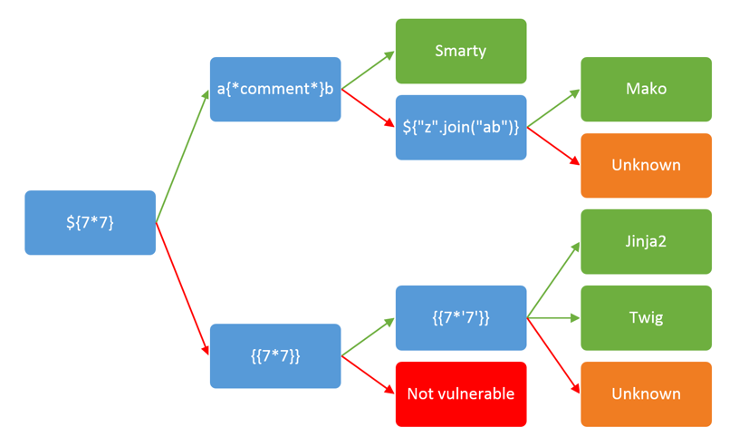

# Template Injection (client and server)

> Made from my notes when I studied the subject. I mostly used [THM](https://tryhackme.com/room/learnssti). There are also notes and resources found during practice at work.
> These notes mostly cover server side template injection but the resources have some link about client-side template injection

## What is it?

Template injection refers to a vulnerability where an attacker can manipulate templates or template engines to execute malicious code. It can occur on both the client side and the server side.

- **Client-side template injection**: In client-side template injection, the template rendering process occurs on the client's browser using JavaScript or similar technologies. The client's browser downloads the template code from the server and then interprets and renders it. If the template data is not properly validated or sanitized, an attacker can inject malicious code into the template, leading to its execution on the client's browser. This can result in unauthorized access, data theft, or other security risks for the user.

- **Server-side template injection**: Server-side template injection involves rendering templates on the server side before sending the resulting HTML to the client's browser. The server uses a template engine (e.g., Jinja, Freemarker) to process templates and combine them with dynamic data. If the server fails to properly validate or sanitize the template or the input data, an attacker can inject malicious code into the template variables. When the server processes the template, it executes the injected code, potentially leading to server-side security breaches, data leaks, or other vulnerabilities.

The main difference between the two lies in where the template rendering occurs. Client-side template injection happens on the client's browser, while server-side template injection occurs on the server before sending the content to the client.

## Detect Injection

- This chars can be used one by one to check if it is vulnerable until we either get an error, or some characters start disappearing from the output. `${{<%[%'"}}%`

## Identify Template Engine

  

> [Source James Kettle](https://gosecure.github.io/template-injection-workshop/#2)

To follow the decision tree, start at the very left and include the variable in your request. Follow the arrow depending on the output:

- Green arrow - The expression evaluated (i.e 42)
- Red arrow - The expression is shown in the output (i.e ${7*7})

You can copy paste the expressions from here

```txt
${7*7}
{{7*7}}
a{*comment*}b
{{7*'7'}}
${"z".join("ab")}
```

When we detected the template engine we need to know how to:

- Start a print statement
- End a print statement
- Start a block statement
- End a block statement

We can look this up in the official documentation of the template we detected.

It is also essential to know which language is the template engine based on to choose which language we can use to exploit the injection.  
Once we know this we can lookup for ways to execute shell command in this language.

## Remediation

- Use secure method
- Sanitize inputs
- [OWASP Injection Prevention Cheat Sheet](https://cheatsheetseries.owasp.org/cheatsheets/Injection_Prevention_Cheat_Sheet.html)

## How to report

### COMING SOON

## Resources

### Syntaxes

- [Smarty](https://www.smarty.net/documentation)
- [Mako](https://docs.makotemplates.org/en/latest/)
- [Jinja - Documentation](https://jinja.palletsprojects.com/en/3.0.x/templates/)
- [Jinja2](https://jinja.palletsprojects.com/en/2.11.x/)
- [Twig](https://twig.symfony.com/doc/)

### Courses

 Server-Side Template Injection - James Kettle   
 Template injection in Action - Course with labs - Philippe Arteau - GoSecure   
 Understanding Server Side Template Injection | TryHackMe - Motasem Hamdan   
 Server Side Template Injection Vulnerability | TryHackMe SSTI - Motasem Hamdan   
 Issue Definitions: Client Side Template Injection - Portswigger   
 Issue Definitions: Server Side Template Injection - Portswigger   
 XSS Context - Client-side Template Injection - Portswigger   
 How to Execute Shell Commands with Python by Nikolai Janakiev  
{% embed url="https://github.com/swisskyrepo/PayloadsAllTheThings/tree/master/Server%20Side%20Template%20Injection" %} Server Side Template Injection on Payload all the things   
 Testing for Server Side Template Injection - OWASP   

### Labs

 ZTH: Obscure Web Vulns - Tryhackme   
 Learn Server Side Template Injection - TryHackme   
 Templates - SSTI room - Medium difficulty   
 Exploiting server-side template injection vulnerabilities Multiple labs on Portswigger   
 SSTI on vulnmachines   

### Real life examples

 SSTI in uber.com - Hackerone report   
