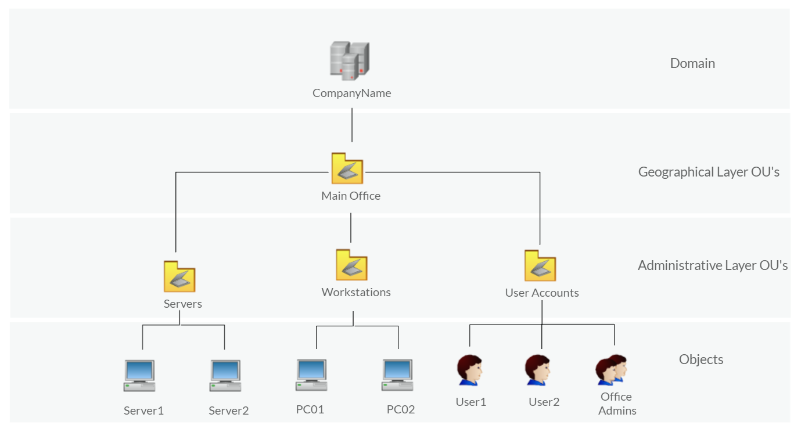
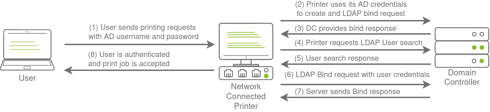
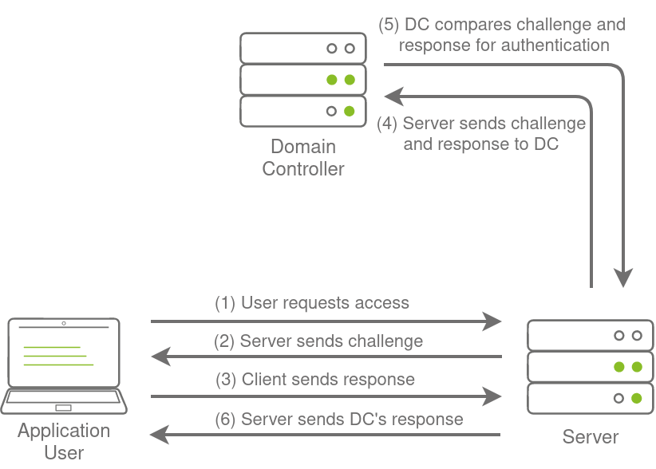
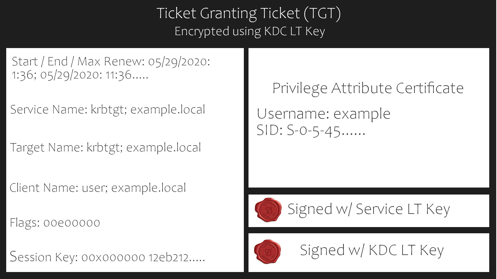
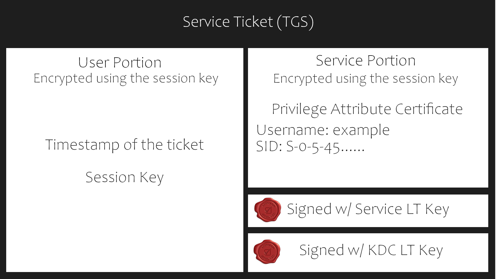
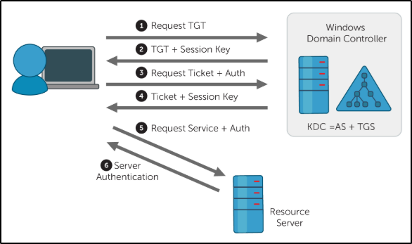

# Active Directory

*Note: This documentation is mostly made from my notes on [TCM Security Academy](https://academy.tcm-sec.com/), [HTB Academy](https://academy.hackthebox.com/) and [TryHackMe](https://tryhackme.com/).  
It will be complemented with notes from my practice.*

## Local Authentication

Local authentication is done using the Local Security Authority (LSA). LSA is a protected subsystem that keeps track of the security policies and the accounts that are on a computer system. It also maintains information about all aspects of local security on a computer.

## Physical Components

### Domain Controllers

"A Domain Controller is a Windows server that provides Active Directory services and controls the entire domain. It is a form of centralized user management that provides encryption of user data as well as controlling access to a network, including users, groups, policies, and computers. It also enables resource access and sharing. These are all reasons why attackers target a domain controller in a domain because it contains a lot of high-value information."  

> *Source: tryhackme*

### AD DS Data Store

When compromising AD we want to grab this file, it contains everything users objects groups password hashes for all the users etc…  

## Logical Components

Domain => Tree => Forest

### AD DS Schema

### Domains

### Trees

### Forests

### Organizational Units (Ous)

"Organizational Units (OU's) are containers within the AD domain with a hierarchical structure."  

> *Source:tryhackme*

### Trusts

### Objects

Active Directory Objects can be a single user or a group, or a hardware component, such as a computer or printer. Each domain holds a database that contains object identity information that creates an AD environment, including:

- Users - A security principal that is allowed to authenticate to machines in the domain
- Computers - A special type of user accounts
- GPOs - Collections of policies that are applied to other AD objects

  

- Domain are used to manage objects in an org
- If multiple domain, we have a tree
- If multiple set of trees we have a forest
- Across forest or across domain we have trust
  
- Here is a very comprehensive Schema from HTB Academy  
  

- Here is another one frome tryhackme

### Rights and privileges in AD

| Group | Description|
|-------|------------|
|Default Administrators|Domain Admins and Enterprise Admins "super" groups.|
|Server Operators|Members can modify services, access SMB shares, and backup files.|
|Backup Operators|Members are allowed to log onto DCs locally and should be considered Domain Admins. They can make shadow copies of the SAM/NTDS database, read the registry remotely, and access the file system on the DC via SMB. This group is sometimes added to the local Backup Operators group on non-DCs.|
|Print Operators|Members are allowed to logon to DCs locally and "trick" Windows into loading a malicious driver.|
|Hyper-V Administrators|If there are virtual DCs, any virtualization admins, such as members of Hyper-V Administrators, should be considered Domain Admins.|
|Account Operators|Members can modify non-protected accounts and groups in the domain.|
|Remote Desktop Users|Members are not given any useful permissions by default but are often granted additional rights such as Allow Login Through Remote Desktop Services and can move laterally using the RDP protocol.|
|Remote Management Users|Members are allowed to logon to DCs with PSRemoting (This group is sometimes added to the local remote management group on non-DCs).|
|Group Policy Creator Owners|Members can create new GPOs but would need to be delegated additional permissions to link GPOs to a container such as a domain or OU.|
|Schema Admins|Members can modify the Active Directory schema structure and can backdoor any to-be-created Group/GPO by adding a compromised account to the default object ACL.|
|DNS Admins|Members have the ability to load a DLL on a DC but do not have the necessary permissions to restart the DNS server. They can load a malicious DLL and wait for a reboot as a persistence mechanism. Loading a DLL will often result in the service crashing. A more reliable way to exploit this group is to create a WPAD record.|

## Types of Active Directory

There are two types of Active Directory:  

- On-Premise Active Directory (AD)
- Azure Active Directory (AAD)

### Authentication on On-Premise Active Directory

On-premise Active Directory has a record of all users, PCs and Servers and authenticates the users signing in (the network logon). Once signed in, Active Directory also governs what the users are, and are not, allowed to do or access (authorization).

In an on-premise Active Directory environment the authentication can be made by using the following protocols:

- NTLM
- LDAP / LDAPS
- KERBEROS

### Authentication on Azure Active Directory

Azure Active Directory is a secure online authentication store, which can contain users and groups. Users have a username and a password which are used when you sign in to an application that uses Azure Active Directory for authentication. So, for example, all of the Microsoft Cloud services use Azure Active Directory for authentication: Office 365, Dynamics 365 and Azure.

Azure Active Directory supports the following authentication methods:

- SAML (Security Assertion Markup Language)
- OAUTH 2.0
- OpenID Connect

## SAML (Security Assertion Markup Language)

Security Assertion Markup Language (SAML) is a type of Single Sign-On (SSO) standard. It defines a set of rules/protocols that allow users to access web applications with a single login. This is possible because those applications (referred to as “Service Providers”) all trust the systems that verify users’ identities (referred to as “Identity Providers”).

Service Providers - These are the systems and applications that users access throughout the day.

Identity Providers - This would be the system that performs user authentication.

## OAUTH 2.0

OAuth 2.0 is a standard that apps use to provide client applications with access.

OAuth 2.0 spec has four important roles:

- The authorization server, which is the server that issues the access token.
- The resource owner, normally your application's end-user, that grants permission to access the resource server with an access token.
- The client, which is the application that requests the access token, and then passes it to the resource server.
- The resource server, which accepts the access token and must verify that it is valid. In this case, this is your application.

## OpenID Connect

OpenID Connect is an authentication standard built on top of OAuth 2.0. It adds an additional token called an ID token.

For that, it uses simple JSON Web Tokens (JWT). While OAuth 2.0 is about resource access and sharing, OIDC is all about user authentication

## LDAP Overview

  

The relationship between AD and LDAP can be compared to Apache and HTTP. The same way Apache is a web server that uses the HTTP protocol, Active Directory is a directory server that uses the LDAP protocol.  
While uncommon, you may come across organizations while performing an assessment that does not have AD but does have LDAP, meaning that they most likely use another type of LDAP server such as [OpenLDAP](https://en.wikipedia.org/wiki/OpenLDAP).  

### LDAP authentication

  

> *Source: [Tryhackme](https://tryhackme.com/room/breachingad)*

### LDAP Pass-back Attacks

This is a common attack against network devices, such as printers, when you have gained initial access to the internal network, such as plugging in a rogue device in a boardroom.

LDAP Pass-back attacks can be performed when we gain access to a device's configuration where the LDAP parameters are specified. This can be, for example, the web interface of a network printer. Usually, the credentials for these interfaces are kept to the default ones, such as admin:admin or admin:password. Here, we won't be able to directly extract the LDAP credentials since the password is usually hidden. However, we can alter the LDAP configuration, such as the IP or hostname of the LDAP server. In an LDAP Pass-back attack, we can modify this IP to our IP and then test the LDAP configuration, which will force the device to attempt LDAP authentication to our rogue device. We can intercept this authentication attempt to recover the LDAP credentials.

> *Source: [Tryhackme](https://tryhackme.com/room/breachingad)*

## NTLM and NetNTLM

NetNTLM, also often referred to as Windows Authentication or just NTLM Authentication, allows the application to play the role of a middle man between the client and AD. All authentication material is forwarded to a Domain Controller in the form of a challenge, and if completed successfully, the application will authenticate the user.

This means that the application is authenticating on behalf of the user and not authenticating the user directly on the application itself. This prevents the application from storing AD credentials, which should only be stored on a Domain Controller. This process is shown in the diagram below:  

> *Source: [Tryhackme](https://tryhackme.com/room/breachingad)*

## Kerberos

Kerberos is the default authentication service for Microsoft Windows domains. It is intended to be more "secure" than NTLM by using third party ticket authorization as well as stronger encryption. Even though NTLM has a lot more attack vectors to choose from Kerberos still has a handful of underlying vulnerabilities just like NTLM that we can use to our advantage.

### Common Terminology

- Ticket Granting Ticket (TGT) - A ticket-granting ticket is an authentication ticket used to request service tickets from the TGS for specific resources from the domain.
- Key Distribution Center (KDC) - The Key Distribution Center is a service for issuing TGTs and service tickets that consist of the Authentication Service and the Ticket Granting Service.
- Authentication Service (AS) - The Authentication Service issues TGTs to be used by the TGS in the domain to request access to other machines and service tickets.
- Ticket Granting Service (TGS) - The Ticket Granting Service takes the TGT and returns a ticket to a machine on the domain.
- Service Principal Name (SPN) - A Service Principal Name is an identifier given to a service instance to associate a service instance with a domain service account. Windows requires that services have a domain service account which is why a service needs an SPN set.
- KDC Long Term Secret Key (KDC LT Key) - The KDC key is based on the KRBTGT service account. It is used to encrypt the TGT and sign the PAC.
- Client Long Term Secret Key (Client LT Key) - The client key is based on the computer or service account. It is used to check the encrypted timestamp and encrypt the session key.
- Service Long Term Secret Key (Service LT Key) - The service key is based on the service account. It is used to encrypt the service portion of the service ticket and sign the PAC.
- Session Key - Issued by the KDC when a TGT is issued. The user will provide the session key to the KDC along with the TGT when requesting a service ticket.
- Privilege Attribute Certificate (PAC) - The PAC holds all of the user's relevant information, it is sent along with the TGT to the KDC to be signed by the Target LT Key and the KDC LT Key in order to validate the user.

### AS-REQ w/ Pre-Authentication

The AS-REQ step in Kerberos authentication starts when a user requests a TGT from the KDC. In order to validate the user and create a TGT for the user, the KDC must follow these exact steps. The first step is for the user to encrypt a timestamp NT hash and send it to the AS. The KDC attempts to decrypt the timestamp using the NT hash from the user, if successful the KDC will issue a TGT as well as a session key for the user.

#### Ticket Granting Ticket Contents

In order to understand how the service tickets get created and validated, we need to start with where the tickets come from; the TGT is provided by the user to the KDC, in return, the KDC validates the TGT and returns a service ticket.

> *Source: [TryHackMe](https://tryhackme.com/)*

#### Service Ticket Contents

To understand how Kerberos authentication works you first need to understand what these tickets contain and how they're validated. A service ticket contains two portions: the service provided portion and the user-provided portion. I'll break it down into what each portion contains.

- Service Portion: User Details, Session Key, Encrypts the ticket with the service account NTLM hash.
- User Portion: Validity Timestamp, Session Key, Encrypts with the TGT session key.

> *Source: [TryHackMe](https://tryhackme.com/)*

### Kerberos Authentication Overview

> *Source: [TryHackMe](https://tryhackme.com/)*

AS-REQ - 1.) The client requests an Authentication Ticket or Ticket Granting Ticket (TGT).

AS-REP - 2.) The Key Distribution Center verifies the client and sends back an encrypted TGT.

TGS-REQ - 3.) The client sends the encrypted TGT to the Ticket Granting Server (TGS) with the Service Principal Name (SPN) of the service the client wants to access.

TGS-REP - 4.) The Key Distribution Center (KDC) verifies the TGT of the user and that the user has access to the service, then sends a valid session key for the service to the client.

AP-REQ - 5.) The client requests the service and sends the valid session key to prove the user has access.

AP-REP - 6.) The service grants access

### Kerberos Tickets Overview

The main ticket that you will see is a ticket-granting ticket these can come in various forms such as a .kirbi for Rubeus .ccache for Impacket. The main ticket that you will see is a .kirbi ticket. A ticket is typically base64 encoded and can be used for various attacks. The ticket-granting ticket is only used with the KDC in order to get service tickets. Once you give the TGT the server then gets the User details, session key, and then encrypts the ticket with the service account NTLM hash. Your TGT then gives the encrypted timestamp, session key, and the encrypted TGT. The KDC will then authenticate the TGT and give back a service ticket for the requested service. A normal TGT will only work with that given service account that is connected to it however a KRBTGT allows you to get any service ticket that you want allowing you to access anything on the domain that you want.

### Attack Privilege Requirements

- Kerbrute Enumeration - No domain access required
- Pass the Ticket - Access as a user to the domain required
- Kerberoasting - Access as any user required
- AS-REP Roasting - Access as any user required
- Golden Ticket - Full domain compromise (domain admin) required
- Silver Ticket - Service hash required
- Skeleton Key - Full domain compromise (domain admin) required

## Resources

### Learn about AD

 TCM-Security Academy   
 HTB Academy - Active Directory LDAP 

### Make your own Practice lab

 Microsoft Evaluation Center   
 Windows 10   
 Windows Server 2019   
*Note: To unlock Win Server 2019 and access the login screen from virtual box, the combinaison is ctrl+suppr*
 Kali Linux   
TryHackMe - Breaching AD   
