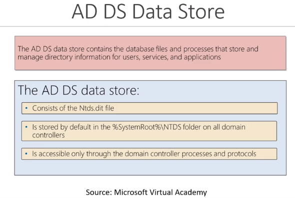
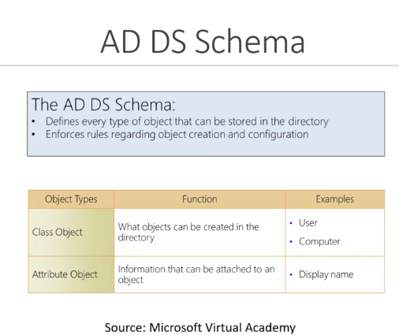
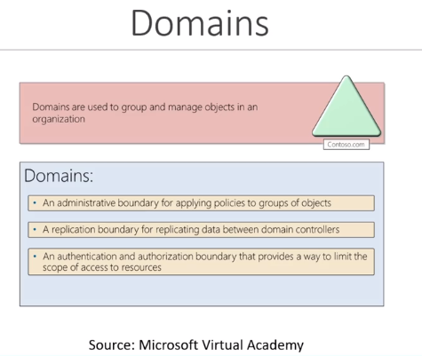
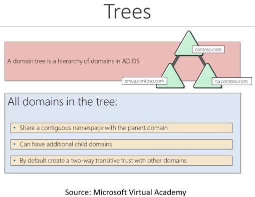
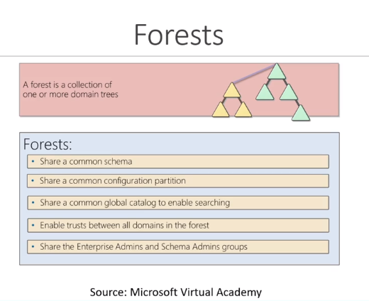
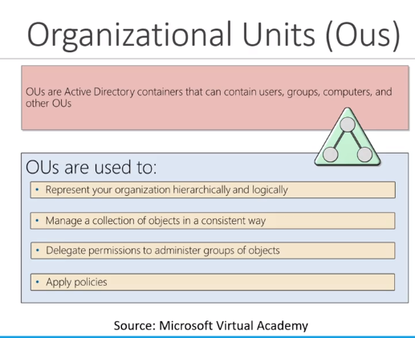
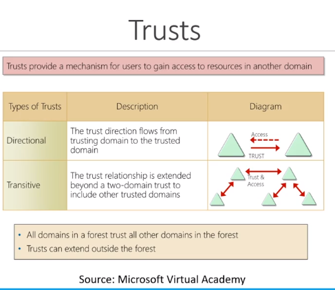
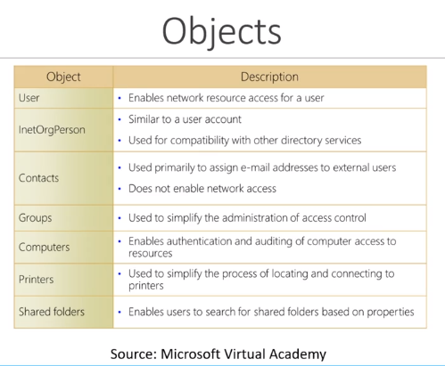

# Active Directory

*Note: This documentation is mostly made from my notes on [TCM Security Academy](https://academy.tcm-sec.com/)  
It will be complemented with notes from my practice and from other classes like the one from [HTB Academy](https://academy.hackthebox.com/)*

## Physical Components

### Domain Controllers

### AD DS Data Store
When compromising AD we want to grab this file, it contains everything users objects groups password hashes for all the users etc…  

## Logical Components

Domain => Tree => Forest

### AD DS Schema

### Domains

### Trees

### Forests

### Organizational Units (Ous)

### Trusts

### Objects

- Domain are used to manage objects in an org
- If multiple domain, we have a tree
- If multiple set of trees we have a forest
- Across forest or across domain we have trust

## Resources to make your own practice lab

*Note: If you want a nice crash course about Active Directory (with the lab setup) I really recommend this one by [TCM-Security Academy](https://academy.tcm-sec.com/p/practical-ethical-hacking-the-complete-course)*

- [Microsoft Evaluation Center](https://www.microsoft.com/en-us/evalcenter/)
- [Windows 10](https://www.microsoft.com/en-us/evalcenter/evaluate-windows-10-enterprise)
- [Windows Server 2019](https://www.microsoft.com/en-us/evalcenter/evaluate-windows-server-2019)  
  *Note: To unlock Win Server 2019 and access the login screen from virtual box, the combinaison is ctrl+suppr*
- [Kali Linux](https://www.kali.org/)
