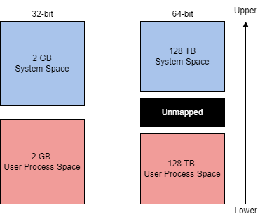
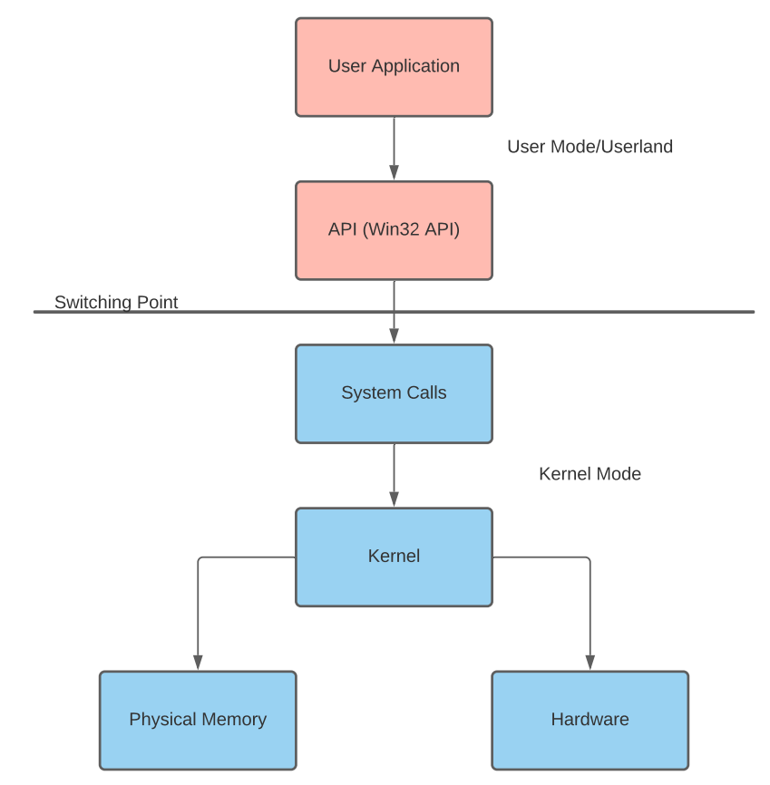

# Windows Internals

> This documentation has been made using the boxes [Windows Internals](https://tryhackme.com/room/windowsinternals) and [Introduction to Windows API](https://tryhackme.com/room/windowsapi) on tryhackme.  
> I recommend you do the boxes as it has questions and will allow you to grasp all the concepts.

## Processes

A process maintains and represents the execution of a program; an application can contain one or more processes. A process has many components that it gets broken down into to be stored and interacted with.  
The [Microsoft docs](https://docs.microsoft.com/en-us/windows/win32/procthread/about-processes-and-threads) break down these other components, "Each process provides the resources needed to execute a program. A process has a virtual address space, executable code, open handles to system objects, a security context, a unique process identifier, environment variables, a priority class, minimum and maximum working set sizes, and at least one thread of execution."  
Processes are created from the execution of an application. Processes are core to how Windows functions, most functionality of Windows can be encompassed as an application and has a corresponding process.  
Examples of processes: MsMpEng (Microsoft Defender), wininit (keyboard and mouse), lsass (credential storage)  
Attackers can target processes to evade detections and hide malware as legitimate processes.  
Examples of potential attack vectors attackers could use agains processes: Process Injection ([T1055](https://attack.mitre.org/techniques/T1055/)), Process Hollowing ([T1055.012](https://attack.mitre.org/techniques/T1055/012/)), Process Masquerading ([T1055.013](https://attack.mitre.org/techniques/T1055/013/))  
Processes have many components; they can be split into key characteristics that we can use to describe processes at a high level.  

| Process Component | Purpose |
|-------------------|---------|
|Private Virtual Address Space|Virtual memory addresses that the process is allocated.|
|Executable Program |Defines code and data stored in the virtual address space.|
|Open Handles| Defines handles to system resources accessible to the process.|
|Security Context|The access token defines the user, security groups, privileges, and other security information.|
|Process ID | Unique numerical identifier of the process.|
|Threads | Section of a process scheduled for execution.|

The task manager can report on many components and information about a process. Below is a table with a brief list of essential process details.  

|Value/Component | Purpose| Example |
|----------------|--------|---------|
|Name| Define the name of the process, typically inherited from the application |conhost.exe|
|PID|Unique numerical value to identify the process| 7408|
|Status | Determines how the process is running (running, suspended, etc.)| Running|
|User name| User that initiated the process. Can denote privilege of the process | SYSTEM|

## Threads

A thread is an executable unit employed by a process and scheduled based on device factors.  
Device factors can vary based on CPU and memory specifications, priority and logical factors, and others.  
We can simplify the definition of a thread: "controlling the execution of a process."  
Since threads control execution, this is a commonly targeted component. Thread abuse can be used on its own to aid in code execution, or it is more widely used to chain with other API calls as part of other techniques.  
Threads share the same details and resources as their parent process, such as code, global variables, etc. Threads also have their unique values and data.  

|Component|Purpose|
|---------|-------|
|Stack|All data relevant and specific to the thread (exceptions, procedure calls, etc.)|
|Thread Local Storage | Pointers for allocating storage to a unique data environment|
|Stack Argument | Unique value assigned to each thread|
|Context Structure|Holds machine register values maintained by the kernel|

## Virtual Memory

Virtual memory is a critical component of how Windows internals work and interact with each other. Virtual memory allows other internal components to interact with memory as if it was physical memory without the risk of collisions between applications.  
Virtual memory provides each process with a [private virtual address space](https://docs.microsoft.com/en-us/windows/win32/memory/virtual-address-space). A memory manager is used to translate virtual addresses to physical addresses. By having a private virtual address space and not directly writing to physical memory, processes have less risk of causing damage.  
The memory manager will also use pages or transfers to handle memory. Applications may use more virtual memory than physical memory allocated; the memory manager will transfer or page virtual memory to the disk to solve this problem.  

  

The theoretical maximum virtual address space is 4 GB on a 32-bit x86 system.  

  

## Dynamic Link Libraries

The [Microsoft docs](https://docs.microsoft.com/en-us/troubleshoot/windows-client/deployment/dynamic-link-library#:~:text=A%20DLL%20is%20a%20library,common%20dialog%20box%20related%20functions.) describe a DLL as "a library that contains code and data that can be used by more than one program at the same time."

DLLs are used as one of the core functionalities behind application execution in Windows. From the [Windows documentation](https://docs.microsoft.com/en-us/troubleshoot/windows-client/deployment/dynamic-link-library#:~:text=A%20DLL%20is%20a%20library,common%20dialog%20box%20related%20functions.), "The use of DLLs helps promote modularization of code, code reuse, efficient memory usage, and reduced disk space. So, the operating system and the programs load faster, run faster, and take less disk space on the computer."

When a DLL is loaded as a function in a program, the DLL is assigned as a dependency. Since a program is dependent on a DLL, attackers can target the DLLs rather than the applications to control some aspect of execution or functionality.

- DLL Hijacking ([T1574.001](https://attack.mitre.org/techniques/T1574/001/))
- DLL Side-Loading ([T1574.002](https://attack.mitre.org/techniques/T1574/002/))
- DLL Injection ([T1055.001](https://attack.mitre.org/techniques/T1055/001/))

## Portable Executable Format

Executables and applications are a large portion of how Windows internals operate at a higher level. The PE (Portable Executable) format defines the information about the executable and stored data. The PE format also defines the structure of how data components are stored.  
The PE (Portable Executable) format is an overarching structure for executable and object files. The PE (Portable Executable) and COFF (Common Object File Format) files make up the PE format.  
PE data is most commonly seen in the hex dump of an executable file. Below we will break down a hex dump of calc.exe into the sections of PE data.  
The structure of PE data is broken up into seven components.  
The DOS Header defines the type of file.  
The MZ DOS header defines the file format as .exe.  

  

The DOS Stub is a program run by default at the beginning of a file that prints a compatibility message. This does not affect any functionality of the file for most users.  
The DOS stub prints the message This program cannot be run in DOS mode.  
The PE File Header provides PE header information of the binary. Defines the format of the file, contains the signature and image file header, and other information headers.  
The PE file header is the section with the least human-readable output.  
The Image Optional Header has a deceiving name and is an important part of the PE File Header.  
The Data Dictionaries are part of the image optional header. They point to the image data directory structure.  
The Section Table will define the available sections and information in the image. Sections store the contents of the file, such as code, imports, and data.  
Now that the headers have defined the format and function of the file, the sections can define the contents and data of the file.  

|Section|Purpose|
|-------|-------|
|.text|Contains executable code and entry point|
|.data|Contains initialized data (strings, variables, etc.)|
|.rdata or .idata|Contains imports (Windows API) and DLLs.|
|.reloc|Contains relocation information|
|.rsrc|Contains application resources (images, etc.)|
|.debug|Contains debug information|

## Interacting with Windows internals

The most accessible and researched option to interact with Windows Internals is to interface through Windows API calls. The Windows API provides native functionality to interact with the Windows operating system. The API contains the Win32 API and, less commonly, the Win64 API.  
Most Windows internals components require interacting with physical hardware and memory.  

The Windows kernel will control all programs and processes and bridge all software and hardware interactions. This is especially important since many Windows internals require interaction with memory in some form.  

An application by default normally cannot interact with the kernel or modify physical hardware and requires an interface. This problem is solved through the use of processor modes and access levels.  

A Windows processor has a user and kernel mode. The processor will switch between these modes depending on access and requested mode.  

The switch between user mode and kernel mode is often facilitated by system and API calls. In documentation, this point is sometimes referred to as the "Switching Point."  

|User mode|Kernel Mode|
|---------|-----------|
|No direct hardware access |Direct hardware access|
|Creates a process in a private virtual address space |Ran in a single shared virtual address space|
|Access to "owned memory locations"|Access to entire physical memory|

Applications started in user mode or "userland" will stay in that mode until a system call is made or interfaced through an API. When a system call is made, the application will switch modes.  

  

When looking at how languages interact with the Win32 API, this process can become further warped; the application will go through the language runtime before going through the API. The most common example is C# executing through the CLR before interacting with the Win32 API and making system calls.  

## Windows API

|User mode|Kernel mode|
|---------|-----------|
|No direct hardware access|Direct hardware access|
|Access to "owned" memory locations|Access to entire physical memory|

### Components of the Windows API

The Win32 API, more commonly known as the Windows API, has several dependent components that are used to define the structure and organization of the API.  
Let’s break the Win32 API up via a top-down approach. We’ll assume the API is the top layer and the parameters that make up a specific call are the bottom layer.  

|Layer|Explanation|
|-----|-----------|
|API|A top-level/general term or theory used to describe any call found in the win32 API structure.|
|Header files or imports|Defines libraries to be imported at run-time, defined by header files or library imports. Uses pointers to obtain the function address.|
|Core DLLs|A group of four DLLs that define call structures. (KERNEL32, USER32, and ADVAPI32). These DLLs define kernel and user services that are not contained in a single subsystem.|
|Supplemental DLLs|Other DLLs defined as part of the Windows API. Controls separate subsystems of the Windows OS. ~36 other defined DLLs. (NTDLL, COM, FVEAPI, etc.)|
|Call Structures|Defines the API call itself and parameters of the call.
API Calls|The API call used within a program, with function addresses obtained from pointers.|
|In/Out Parameters|The parameter values that are defined by the call structures.|

### OS Libraries

Each API call of the Win32 library resides in memory and requires a pointer to a memory address. The process of obtaining pointers to these functions is obscured because of ASLR (Address Space Layout Randomization) implementations; each language or package has a unique procedure to overcome ASLR.  

#### Windows Header File

Microsoft has released the Windows header file, also known as the Windows loader, as a direct solution to the problems associated with ASLR’s implementation. Keeping the concept at a high level, at runtime, the loader will determine what calls are being made and create a thunk table to obtain function addresses or pointers.  
Once the windows.h file is included at the top of an unmanaged program; any Win32 function can be called.  

#### P/Invoke

Microsoft describes P/Invoke or platform invoke as “a technology that allows you to access structs, callbacks, and functions in unmanaged libraries from your managed code.”

P/invoke provides tools to handle the entire process of invoking an unmanaged function from managed code or, in other words, calling the Win32 API. P/invoke will kick off by importing the desired DLL that contains the unmanaged function or Win32 API call.

### API Call Structure

API calls are the second main component of the Win32 library. These calls offer extensibility and flexibility that can be used to meet a plethora of use cases. Most Win32 API calls are well documented under the [Windows API documentation](https://docs.microsoft.com/en-us/windows/win32/apiindex/windows-api-list)and [pinvoke.net](http://pinvoke.net/).

API call functionality can be extended by modifying the naming scheme and appending a representational character. Below is a table of the characters Microsoft supports for its naming scheme.

|Character|Explanation|
|---------|-----------|
|A|Represents an 8-bit character set with ANSI encoding|
|W|Represents a Unicode encoding|
|Ex|Provides extended functionality or in/out parameters to the API call|

Each API call also has a pre-defined structure to define its in/out parameters. You can find most of these structures on the corresponding API call document page of the [Windows documentation](https://docs.microsoft.com/en-us/windows/win32/apiindex/windows-api-list), along with explanations of each I/O parameter.

### C API Implementations

Microsoft provides low-level programming languages such as C and C++ with a pre-configured set of libraries that we can use to access needed API calls.

The windows.h header file is used to define call structures and obtain function pointers. To include the windows header, prepend the line below to any C or C++ program.

`#include <windows.h>`

#### Commonly Abused API Calls

Several API calls within the Win32 library lend themselves to be easily leveraged for malicious activity.

Several entities have attempted to document and organize all available API calls with malicious vectors, including [SANs](https://www.sans.org/white-papers/33649/) and [MalAPI.io](http://malapi.io/).

While many calls are abused, some are seen in the wild more than others. Below is a table of the most commonly abused API organized by frequency in a collection of samples.

|API Call|Explanation|
|--------|-----------|
|LoadLibraryA|Maps a specified DLL  into the address space of the calling process|
|GetUserNameA|Retrieves the name of the user associated with the current thread
GetComputerNameA|Retrieves a NetBIOS or DNS  name of the local computer|
|GetVersionExA|Obtains information about the version of the operating system currently running|
|GetModuleFileNameA|Retrieves the fully qualified path for the file of the specified module and process|
|GetStartupInfoA|Retrieves contents of STARTUPINFO structure (window station, desktop, standard handles, and appearance of a process)|
|GetModuleHandle|Returns a module handle for the specified module if mapped into the calling process's address space|
|GetProcAddress|Returns the address of a specified exported DLL function|
|VirtualProtect|Changes the protection on a region of memory in the virtual address space of the calling process|
SetWindowsHookEx|Installs a memory hook into a hook chain to monitor for certain events|
|UnhookWindowsHookEx|Removes an installed hook from the hook chain|
|GetCurrentProcess|Retrieves a pseudo handle for the current process.|
|VirtualAlloc|Reserves, commits, or changes the state of a region of pages in the virtual address space of the calling process.|
|WaitForSingleObject|Waits until the specified object is in the signaled state or the time-out interval elapses|
|CreateThread|Creates a thread to execute within the virtual address space of the calling process|

## Abusing Windows internals

### Abusing Processes

Process injection is commonly used as an overarching term to describe injecting malicious code into a process through legitimate functionality or components.  

|Injection Type|Function|
|--------------|--------|
|[Process Hollowing](https://attack.mitre.org/techniques/T1055/012/)|Inject code into a suspended and “hollowed” target process|
|[Thread Execution Hijacking](https://attack.mitre.org/techniques/T1055/003/)|Inject code into a suspended target thread|
|[Dynamic-link Library Injection](https://attack.mitre.org/techniques/T1055/001/)|Inject a DLL into process memory|
|[Portable Executable Injection](https://attack.mitre.org/techniques/T1055/002/)|Self-inject a PE image pointing to a malicious function into a target process|

There are many other forms of process injection outlined by [MITRE T1055](https://attack.mitre.org/techniques/T1055/).

At its most basic level, process injection takes the form of shellcode injection.

At a high level, shellcode injection can be broken up into four steps:

1. Open a target process with all access rights.
2. Allocate target process memory for the shellcode.
3. Write shellcode to allocated memory in the target process.
4. Execute the shellcode using a remote thread.

The steps can also be broken down graphically to depict how Windows API calls interact with process memory.  

  

### Expanding Process Abuse

Similar to shellcode injection, this technique offers the ability to inject an entire malicious file into a process. This is accomplished by “hollowing” or un-mapping the process and injecting specific PE (Portable Executable) data and sections into the process.

At a high-level process hollowing can be broken up into six steps:

1. Create a target process in a suspended state.
2. Open a malicious image.
3. Un-map legitimate code from process memory.
4. Allocate memory locations for malicious code and write each section into the address space.
5. Set an entry point for the malicious code.
6. Take the target process out of a suspended state.

The steps can also be broken down graphically to depict how Windows API calls interact with process memory.

  

### Abusing Process Components

At a high-level thread (execution) hijacking can be broken up into eleven steps:

1. Locate and open a target process to control.
2. Allocate memory region for malicious code.
3. Write malicious code to allocated memory.
4. Identify the thread ID of the target thread to hijack.
5. Open the target thread.
6. Suspend the target thread.
7. Obtain the thread context.
8. Update the instruction pointer to the malicious code.
9. Rewrite the target thread context.
10. Resume the hijacked thread.

### Abusing DLLs

At a high-level DLL injection can be broken up into six steps:

1. Locate a target process to inject.
2. Open the target process.
3. Allocate memory region for malicious DLL.
4. Write the malicious DLL to allocated memory.
5. Load and execute the malicious DLL.

### Memory Execution Alternatives

Depending on the environment you are placed in, you may need to alter the way that you execute your shellcode. This could occur when there are hooks on an API call and you cannot evade or unhook them, an EDR is monitoring threads, etc.

#### Invoking Function Pointers

The void function pointer is an oddly novel method of memory block execution that relies solely on typecasting.

This technique can only be executed with locally allocated memory but does not rely on any API calls or other system functionality.

This one-liner is the most common form of the void function pointer: `((void(*)())addressPointer)();`

1. Create a function pointer (void(*)(), outlined in red
2. Cast the allocated memory pointer or shellcode array into the function pointer (<function pointer>)addressPointer), outlined in yellow
3. Invoke the function pointer to execute the shellcode ();, outlined in green

This technique has a very specific use case but can be very evasive and helpful when needed.

#### Asynchronous Procedure Calls

From the [Microsoft documentation](https://docs.microsoft.com/en-us/windows/win32/sync/asynchronous-procedure-calls) on Asynchronous Procedure Calls, “An asynchronous procedure call (APC) is a function that executes asynchronously in the context of a particular thread.”

An APC function is queued to a thread through QueueUserAPC. Once queued the APC function results in a software interrupt and executes the function the next time the thread is scheduled.

In order for a userland/user-mode application to queue an APC function the thread must be in an “alertable state”. An alertable state requires the thread to be waiting for a callback such as WaitForSingleObject or Sleep.

## Resources

### Reads

- [windows.h - Wikipedia](https://en.wikipedia.org/wiki/Windows.h)
- [Working with Strings - Microsoft Documentation](https://docs.microsoft.com/en-us/windows/win32/learnwin32/working-with-strings)
- [How TrickBot Malware Hooking Engine Targets Windows 10 Browsers](https://www.sentinelone.com/labs/how-trickbot-malware-hooking-engine-targets-windows-10-browsers/)

### Tools

- [Process Hacker 2](https://github.com/processhacker/processhacker)
- [Process Explorer](https://docs.microsoft.com/en-us/sysinternals/downloads/process-explorer)
- [Procmon](https://docs.microsoft.com/en-us/sysinternals/downloads/procmon)
